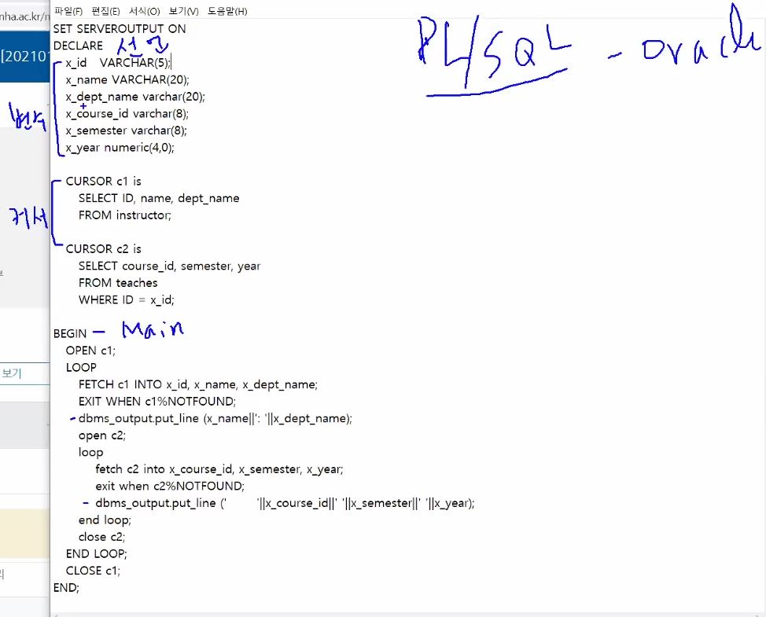

# Accessing SQL From a Programming Language
SQL + Programming Language    
SQL만 단독으로 사용하기 어렵다.      
- SQL만으로 모든 표현을 할 수 없다.
- 출력이나 사용자 입력 등 action들을 수행할 수 없다.

따라서, 프로그래밍 언어와 합쳐서 SQL를 사용한다.     

<br>

프로그래밍 언어와 SQL을 합치는데 두 가지 방식이 있다.
- A general-purpose program
    - API 함수를 사용하여 데이터베이스 서버와 통신을 한다.
    - Example
        - JDBC
            - 자바에서 데이터베이스에 접속할 수 있도록 하는 자바 API이다.
        - ODBC
            - C에서 사용하는 API
- Embedded SQL
    - SQL이 내장됨


# JDBC
- JDBC는 JAVA API 이다.
- metadata도 가져올 수 있다.
- Database 연동 model
    1. connection open
    2. statement 객체 생성
    3. 쿼리 실행하고 결과를 fetch한다.
    4. 에러 처리
## JDBC code
```java
public static void JDBCexample(String dbid, String userid, String passwd) { 
    try (Connection conn = DriverManager.getConnection( 
        "jdbc:oracle:thin:@db.yale.edu:2000:univdb", userid, passwd); 
        Statement stmt = conn.createStatement();
        ){ 
        stmt.executeUpdate("insert into instructor values('77987', 'Kim',  'Physics', 98000)");
        ResultSet rset = stmt.executeQuery("select dept_name, avg (salary) from instructor group by dept_name");
    }
    catch (SQLException sqle) { 
        System.out.println("SQLException : " + sqle);
    }
}
```
- try(~)
    - ~: connection open처리이다.
- catch(~)
    - ~: 에러처리
- stmt.executeUpdate
    - 질의 처리
- stmt.executeQuery
    - 질의 결과 fetch
- ResultSet rset
    - 질의 결과가 가져왔을 때 cursor의 역할을 한다.
    - rset으로 getString은 속성의 순서를 써도 가능하고 속성의 이름을 써도 가능하다.

## Prepared Statement
- java String 연결 '+'을 이용해서 쿼리 문장을 만드는 것은 바람직하지 않다.
    - SQL Injection 때문
- 따라서, PreparedStatement 객체를 생성해서 이 객체를 통해 쿼리문을 완성시킨다.
    - `PreparedStatement pStmt = conn.prepareStatement("insert into instructor values(?,?,?,?)");`
    - 이것이 기본적인 문장인데 ?에 값을 넣는다.
    - 이 때 첫번째부터 마지막까지 1~4의 숫자가 할당된다.
        - 즉 첫번째 value는 1번으로 지정해서 데이터를 삽입
        - `pStmt.setString(1, "88877");`
    - 그 후 excuteUpdate를 통해 쿼리를 처리한다.
        - `pStmt.executeUpdate();`

## Metadata Features
테이블에 대한 질의를 처리할 때 테이블의 정보를 모를 수 있다.     
이때 Metadata를 받아오는 함수를 이용하여 정보를 받아온다.
- getMetaData()
    - `ResultSetMetaData rsmd = rs.getMetaData();`
- Table의 속성을 모를 때
    - `rsmd.getColumnName(i)`
    - `rsmd.getColumnTypeName(i)`
- Table의 PrimarKey를 모를 때
    ```java
    DatabaseMetaData dmd = connection.getMetaData();
    ResultSet rs = dmd.getPrimaryKeys(“”, “”, tableName);
    (rs.getString(“KEY_SEQ”)
    ```
- Table의 이름을 모를 때
    - `ResultSet rs = dmd.getTables (“”, "", “%", new String[] {“TABLES”});`
    - `rs.getString(“TABLE_NAME“)`

## Transaction Control in JDBC
기본적으로 SQL 문은 자동적으로 commit이 된다.    
- tuple들을 insert문을 execute를 하면 자동적으로 실행이 된다.
- update 중에 잘못된 값이 있다면 이는 수정이 불가하다.

이를 수동으로 바꿀 수 있다.
- `conn.setAutoCommit(false);`
- 이를 통해 전체를 다 입력받은 후 commit하여 질의를 처리할 수 있다.
- `conn.commit();`
    - 처리를 완료하는 것
- `conn.rollback();`
    - 질의 처리 중 잘못된 값이 들어갔을 경우 이전에 데이터로 되돌아 갈 수 있다.

## SQL function call
function call도 가능
```java
CallableStatement cStmt1 = conn.prepareCall("{? = call some 
function(?)}");
CallableStatement cStmt2 = conn.prepareCall("{call some 
procedure(?,?)}");
```

## Large object in JDBC
Photo, video 등과 같은 큰 객체들에 대한 함수이다.
- getBlob()/getClob()
    - 데이터들을 받아온다.
- setBlob()/setClob()
    - blob.setBlob(int parameterIndex, InputStream inputStream)
    - clob.setClob(int parameterIndex, InputStream inputStream)

## SQLJ
java 내장 SQL이며, PL/SQL과 유사하다.    
`#sql iterator deptInfoIter(String dept_name, int avgSal);`    
- 이는 PL/SQL에서 Cursor의 역할을 한다.
- 나머지 PL/SQL참고

# Embedded SQL
- 호스트 프로그램이 SQL문을 직접 포함하고 있는 프로그램
- C, C++, Java Fortran, PL/1과 같은 프로그래밍 언어로 작성 가능
    - 책에서는 PL/1으로 소개가 되었다.
        - PL/1은 IBM에서 많이 사용함
    - PL/SQL를 학습 예정
        - ORACLE에서 만든 언어

## Running the Embedded SQL
- 호스트 언어에서 SQL문을 사용하기 위해 SQL문을 사용하겠음을 알려야 한다.
    - `EXEC SQL <embedded SQL statement >;`
    - 언어마다 다름
-  **데이터베이스 서버에 연동**
    - `EXEC-SQL connect to server user user-name using password;`
    - Oracle에서는 이미 로그인이 되어 있으므로 연동할 필요가 없다.
- 호스트 언어에서 선언된 변수를 사용하고 싶을 때
    - `:`을 사용해서 호스트 언어의 변수임을 밝힌다.
    - PL/SQL에서는 필요 없음
    - Example
        ```sql
        EXEC-SQL BEGIN DECLARE SECTION}
            int credit-amount ;
        EXEC-SQL END DECLARE SECTION

        EXEC SQL
            declare c cursor for 
            select ID, name
            from student
            where tot_cred = :credit_amount
        END EXEC
        ```
- Cursor
    - 각 튜플들을 저장하는 Buffer
    - 해당 튜플로 오면 그 튜플의 데이터들을 Buffer에 저장한다.
        - Iterator와 유사하나, 해당 데이터들을 Buffer에 저장하는 것이 다름
    - Form
        - `declare c cursor for <SQL query>`
    - Example
        ```sql
        EXEC SQL
            declare c cursor for 
            select ID, name
            from student
            where tot_cred = :credit_amount
        END EXEC
        ```
    - Cursor는 open 되어야 실행한다.
        - Form
            - `EXEC SQL open c;`
    - Cursor로 데이터 가져오기
        - Form
            - `EXEC SQL fetch c into :si, :sn END_EXEC`
            - si, sn에 데이터를 하나씩 저장한다.
        - for나 while로 연속해서 데이터를 가져온다.
            - 그리고 Cursor는 자동으로 다음 값을 지정한다.
            - 데이터가 존재하는지 꼭 체크하고 없다면 loop를 종료한다.
    - Cursor를 다 사용했다면 close한다.
        - Form
            - `EXEC SQL close c;`
### Updates Through Embedded SQL
Embedded SQL를 통해 (수정, 삽입, 삭제)의 기능을 수행할 수 있다.     
Cursor를 이용하여 수정, 삽입, 삭제의 기능도 가능하다.
- Cursor를 이용하여 update를 하기 위해 Cursor를 생성할 때 `for update`를 꼭 붙여준다.
    ```sql
    EXEC SQL 
        declare c cursor for
            select *
            from instructor
            where dept_name = 'Music'
            for update
    ```
- 수정할 때 `where current of c`의 조건을 주어 수정함
    ```sql
    update instructor
    set salary = salary + 1000
    where current of c
    ```

### Example of PL/SQL


---

<br>

# 기말고사 범위


<br>

# Functions and Procedures
Functions and Procedures를 구분을 잘 하지 않음
- Functions
    - 일반적으로 return값이 있음
- Procedures
    - 일반적으로 Argument에 값을 반환함
- Functions와 Procedures는 "business logic"을 따른다.
    - business logic
        - 휴가날짜를 계산, 평점에 F학점을 넣을 것인가 뺄것인가 등과 같은 규정을 말함
    - 이를 따로 저장해서 사용하면 편리함
- SQL, C, Java, 등에서 포함할 수 있음

## Functions 선언
- Example Code: Declare Function
    ```sql
    create function dept_count (dept_name varchar(20))
        returns integer
        begin
        declare d_count  integer;
            select count (* ) into d_count
            from instructor
            where instructor.dept_name = dept_name
        return d_count;
    end
    ```
    - `create function dept_count (dept_name varchar(20))`
        - 함수 생성코드
        - 함수 명: dept_count
        - 함수 매개변수: (dept_name varchar(20))
            - 매개변수 명과 타입을 씀
    - `returns integer`
        - Return type
        - Return's'를 조심
- Example Code: Use Function
    ```sql
    select dept_name, budget
    from department
    where dept_count (dept_name ) > 12
    ```

### Table Functions
- Table을 return하는 함수
- Example Code
    ```sql
    create function instructor_of (dept_name char(20))
        returns table  (  
                ID varchar(5),
                name varchar(20),
                dept_name varchar(20),
                salary numeric(8,2))
            return table
                (select ID, name, dept_name, salary
                from instructor
                where instructor.dept_name = instructor_of.dept_name)

    ```

## SQL Procedures
- Example Code: Declare Procedures
    ```sql
    create procedure dept_count_proc (in dept_name varchar(20),
                                        out d_count integer)
        begin
            select count(*) into d_count
            from instructor
            where instructor.dept_name = dept_count_proc.dept_name
        end
    ```
    - ` create procedure dept_count_proc (in dept_name varchar(20),out d_count integer)`
        - in: 입력 argument
        - out: 출력 argument
- Example Code: Use Procedures
    ```sql
    declare d_count integer;
    call dept_count_proc( 'Physics', d_count);
    ```
    - 'Physics'를 입력으로 받고 d_count를 통해서 결과값을 읽어 온다.
- SQL Procedures은 dynamic SQL으로 프로그램 실행 중(runtime)에 생성된다.
- 오버로딩이 가능하다.
    - 같은 이름의 Procedures를 선언하더라도, 매개변수 수가 다르면 다르게 동작하는 Procedures를 만들 수 있다.

## Language Constructs for Procedures & Functions
- 기본적으로 **begin과 end를** 통해서 내용을 실행한다.
- 반복문
    - while
        ```sql
        while boolean expression  do
            sequence of statements ;
        end while
        ```
        - 일반 whilte문과 비슷함 while
        - 다음에 비교문이 들어감
    - repeat
        ```sql
        repeat
                sequence of statements ;
            until boolean expression 
            end repeat
        ```
        - `until boolean expression`
            - 여기서 비교문을 수행함
            - do~while문 실행방식
    - for
        ```sql
        declare n  integer default 0;
        for r  as
            select budget from department
            where dept_name = 'Music'
        do
            set n = n + r.budget
        end for
        ```
        - 이는 테이블의 모든 튜플을 돌고 종료한다.
- 조건절
    - if-then-else
        ```sql
        if boolean  expression
            then statement or compound statement
        elseif boolean  expression
            then statement or compound statement
        else statement or compound statement
        end if
        ```
- 예외
    ```sql
    declare out_of_classroom_seats  condition
    declare exit handler for out_of_classroom_seats
    begin
    …
    end
    ```
    - out_of_classroom_seats에서 에러가 발생했을 때
        - begin ~ end절을 실행한다.