# Database Design Using the E-R Model
ER Model(Entity Relationship Model)를 이용한 DB 설계     
 

ER Model은 Modeling의 방법이다.    
따라서, Schema diagram으로 변환이 필요하다.    
DB 설계 과정은     
ER Model -> Schema diagram -> DB 구현을 따른다.

## Design Phases
1. Initial Phase
    - 사용자들의 요구사항 분석
2. Second Phase
    - Data Model 선택
    - 우리는 관계형 모델을 선택했다.
        - 따라서, Conceptual Schema는 'Table 구조'이다.
    - 필요한 Operation(또는 Transactions)에 따라 data model을 선택한다.
3. Final Phase
    - DB 구현단계
    - Logical Design - Database Schema를 결정한다.
        - relation schemas(테이블 구조)를 모으면 DB Schema가 된다.
        - Business 결정
            - 속성에 어떤 것을 넣을 지 결정
        - Computer Science 결정
            - 속성들을 테이블에 어떻게 표현할 것인지 / 어떻게 포함할 것인지를 결정
    - Physical Design
        - 인덱스, 파일 구성, 등 Disk와 관련된 디자인

## Design Alternatives(선택사항)
DB 구조를 디자인할 때 피해야 할 사항
- Redundancy(중복)
    - 데이터의 중복을 피해야 한다.
    - Example
        - A 테이블에 주소가 저장되어 있는데, B 테이블에도 똑같이 주소가 저장되면 안된다.
        - 저장이 가능은 하지만 이는
            - Disk의 낭비를 초래
            - 정보 불일치 초래
- Incompleteness(불완전)
    - 설계가 잘못되어서 입력이 안된다거나 표현이 안되면 안된다.

## Design Approaches
- Entity Relationship Model
    - Entity: 사물 또는 객체를 의미
        - 이런 Entity들은 Attributes(속성)을 가지고 있다.
    - Relationship: Entity들 간의 관계
    - entity-relationship diagram를 가지고 표현한다.
- Normalization Theory
    - 정규화(Chapter 7)

# ER Model
- enterprise schema(전체, 즉 DB의 구조)
    - Table들이 모여 만들어지는 DB의 Schema
- ER data model의 요소
    - entity sets
    - relationship sets
    - attributes
- ER diagram

## Entity Sets
- Entity는 실존하는 객체이고 다른 객체와는 구분 가능한 것이다.
    - Ex) Company, plant etc..
    - Ex2) Table에서 각각의 Tuple들로도 볼 수 있다.
- Entity Set
    - Ex) Companies, trees etc..
    - Ex2) Table이 될 수 있다.
    - Entity Set과 관계가 합쳐지면 Table이 된다.
        - 즉 Table과는 다른 것임
- Primary Key
    - Entity를 식별할 수 있는 key

## Relationship Sets
- Relationship은 각 Entity 사이의 관계이다.
    - Ex)	 44553 (Peltier) 	    advisor             22222 (Einstein) 
    -        student entity      relationship set	     instructor entity
- Relationship Setsdms 2개 이상의 n까지의 Entity들 간의 관계
    - 일반적으로 2개 정도의 관계가 많이 나옴
    - Ex) {(e1, e2, … en) | e1  ∈ E1, e2 ∈  E2, …, en ∈  En}

- ER Diagram으로 Relationship 표현
    - Diamond로 표현한다.
    - 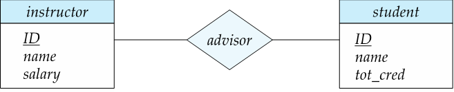

### Attribute at Relationship
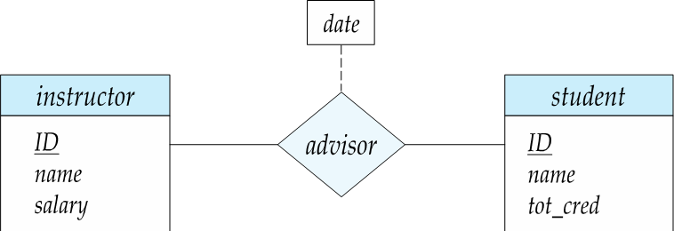

- Relationship으로 속성을 가질 수 있다.
- 아래 그림과 같이 지도교수가 된 날짜라는 속성을 통해 관계를 지을 수 있다.
    - 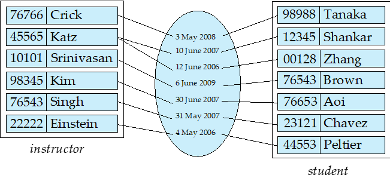
    - 또 예를 들어 지도교수 history등과 같은 속성으로 관계를 지을 수 있다.
- 속성은 점선과 사각형을 통해 표현한다.

## Roles
- Role: entity가 relationship에서 수행하는 기능
- Role은 아래 이미지와 같이 선으로 연결 후 그 위에 어떤 역할인지 명시해준다.
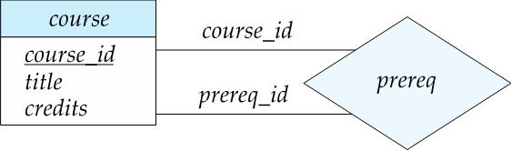

## Degree of a Relationship Set
- Binary Relationship
    - 두 개의 Entity가 연관지어져 있는 것
        - degree two
    - 대부분의 Relationship은 binary이다.
- Ternary Relationship
    - 세 개의 Entity가 연관지어져 있는 것
    - 3개 이상은 잘 안씀

## Complex Attribute
Attribute type
- Simple and Composite Attribute
- Single-valued and multivalued attributes
    - Ex) Phone_numbers
- Derived attributes
    - Ex) age and given date_of_birth

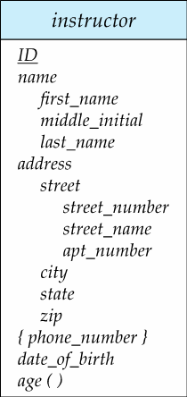

### Composite Attributes
- 하나의 값을 여러 개로 분리할 수 있을 때 Composite Attributes라 한다.

## Mapping Cardinality Constraints
- Cardinality: Entity의 갯수
- Cardinality Constraints
    - Entity들이 몇 개가 관계지어질 수 있는지의 제약조건
- type
    - One to one
    - One to many / Many to one
        - 두 개의 위치만 바뀔 뿐 동일함
    - Many to many 

### Cardinality Constraints in ERD
- (—): many
- (→): one

## Total and Partial Participation
- Total Participation
    - (=): Total
    - "모든"을 의미함
- Partial Participation
    - 일부 Entity가 관계에 참여하지 않음을 의미
    - 아래 이미지의 경우 지도교수가 없을 경우를 의미
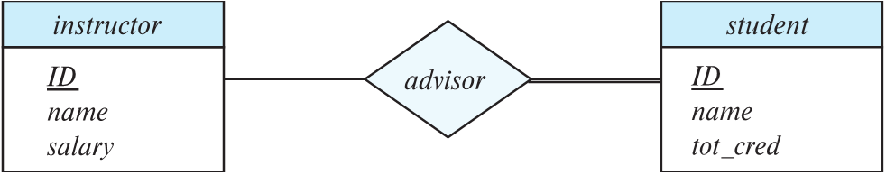

## 복잡한 제약조건을 표현하는 표기법
- Notation
    - `minimum..maximum`
- maximum = *
    - No limit을 의미
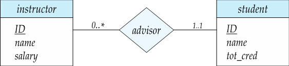
- instructor
    - 최소 0명
        - 즉 한명도 매칭이 안되도 됨
    - 최대 제한 없음
- student
    - 최소 1명
        - 적어도 1명은 매칭이 되어야 함
    - 최대 1명
        - 즉, 다수 매칭 불가
    - 따라서, 무조건 한 명을 매칭해야 함

## Cardinality Constraints on Ternary Relationship
3개의 Relationship에서는 1개의 화살표만 사용한다.
- 화살표가 2개 이상 된다면 의미가 혼동될 수 있음

 

# Primary key
- Entity sets
- Relationship sets
- Weak entity sets
## Primary key for Entity Sets
- Entity를 식별할 수 있는 Attribute의 set을 key로 한다.
## Primary Key for Relationship Sets
mapping cardinality of the relationship set에 따라 달라진다.
- One-to-one relationships.
    - 둘 중 아무 Key를 사용하면 됨
    - 둘 다 Unique하기 때문
    - either one of the participating entity sets
- One-to-Many relationships / Many-to-one relationships
    - “Many”에 해당하는 부분은 고유할 것이므로 “Many”의 Entity에 대해서 Primary Key를 결정한다.
    - “Many” side
- Many-to-Many relationships.
    - 두 Entity를 pair로 Key를 결정한다.
    - union of the primary keys

## Weak Entity Sets
- Weak Entity
    - entity type은 반드시 key 속성을 가져야 하지만 key 속성이 정의되지 않는 개체들
- Primary Key를 형성하기에는 Attribute가 충분하지 않아서 주키를 만들지 못한다.
    - 이 Weak Entity Sets은 관계를 통해 다른 Entity sets에 의존하여 주 키를 형성할 수 있다.
    - 따라서, 혼자로는 자립이 불가하다.
- identifying entity에 종속되어 있다.
    - identifying entity는 Weak Entity을 소유함

- 단어
    - identifying entity
        - Weak Entity Sets을 식별해주는 Entity
    - discriminator(변별자)
        - Key가 되기 전의 속성들
        - 잠시 키 대신 사용
    - strong entity set
        - Weak Entity가 아닌 Entity set

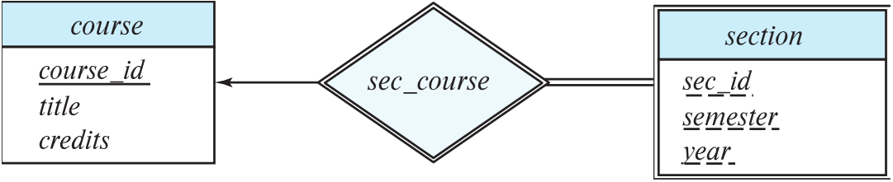

- Notation
    - 두 개의 직사각형을 중첩한 형태
    - discriminator는 점선으로 표시하여 구분한다.
    - Identifying Relationship
        - 위 이미지에서 sec_course이다.
        - 두 개의 마름모를 중첩한 형태
- course
    - Indentifying entity
- sec_course
    - Identifying relationship
- section
    - Weak Entity

 

# Redundant Attributes
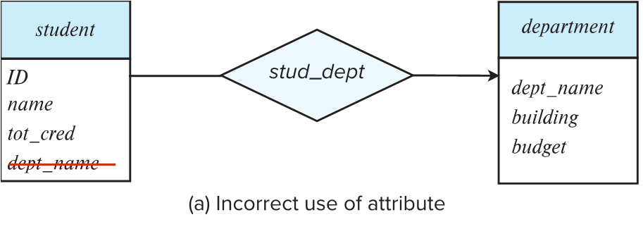

- 위 student의 dept_name은 stud_dept의 관계에 의해 속성이 중복된다.
- 이는 바람직하지 않으므로 제거를 한다.
- 어차피 stud_dept 관계에 의해 속성이 생기기 때문이다.

# Reduction to Relation Schemas
ER Diagram만 완벽하다면, Relation Schema는 기계적으로 완벽히 구현이 가능함

## Representing Entity Sets
Entity는 그대로 Table이 된다.
- Strong Entity
    - 속성 그대로 Table을 생성한다.
- Weak Entity
    - Strong Entity Set을 참조하여 Table을 생성한다.

## Representing Relationship Sets

### one-to-many relationship 
- “many”쪽에서 “one”을 포함한다.
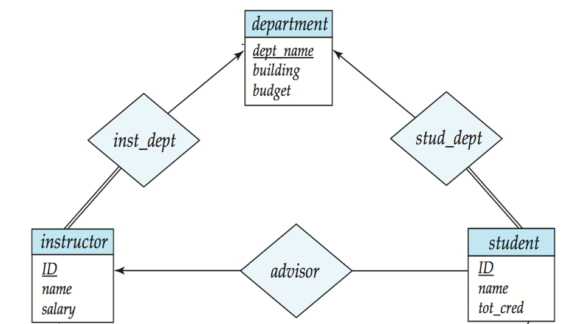

- instructor = (ID, name, salary, dept_name)
- student = (ID, name, tot_cred, advisor_ID, dept)

### many-to-many relationship
many-to-many relationship에서는 별도의 Table을 생성한다.    
이 Table에 두 관계 Pair을 저장한다.

- member = (student_id, club_title)
    - 두 Entity의 Primary key를 가져와서 만듦

### one-to-one relationship
두 Entity set 중 아무거나 기준으로 해서 주 키를 포함함

- Husband = (ID, address, phone, wife) or Wife = (ID, address, phone, husband)
    - 둘 다 이렇게 하면 안됨
    - 둘 중 하나만!

### Entity Sets with Composite Attributes
복합 속성을 가질 경우 다음과 같이 펼쳐서 생성한다.

- 이렇게 표현하는 것은 선택이다.
    - 무조건 다 펼칠 필요는 없음
    - 필요한것만 펼치기
- phone_number과 같이 다중값 속성은 별도 테이블로

### Entity Sets with Multivalued Attributes
다중값 속성은 따로 분리해서 다른 테이블로 관리한다.
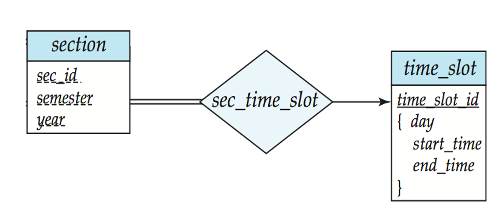
- 하나의 속성에 대해 여러 값을 매칭하는 경우
    - 별도의 테이블을 생성해서 그 테이블로 관리를 한다.
- 위 이미지 time_slot_id처럼 day, start_time, end_time이 여러개가 존재할 수 있을 경우 별도 테이블인 time_slot을 따로 만든다.
- section Entity set은 time_slot을 foreign key로 받는 것이 아니다!
    - 무결성 제약조건으로 그저 참조한다

# Extended E-R Features

## Specialization
- 사람이라는 그룹을 남자와 여자로 나눌 수 있고, 그 중 남자를 군필과 미필로 나눌 수 있고 이와 같이 점점 세분화 하여 구분짓는 것을 특수화(Specialization)라고 한다.
    - 반대의 과정을 일반화라고 한다.
- sub-groupings
    - 사람을 남자와 여자로 그룹핑하는 것
    - sub-class
- ISA
    - "is a"관계를 의미함
    - ISA관계를 sub-class라 함
- sub-class를 만들면 속성을 상속받는다.
    - Attribute inheritance

- Example
    - 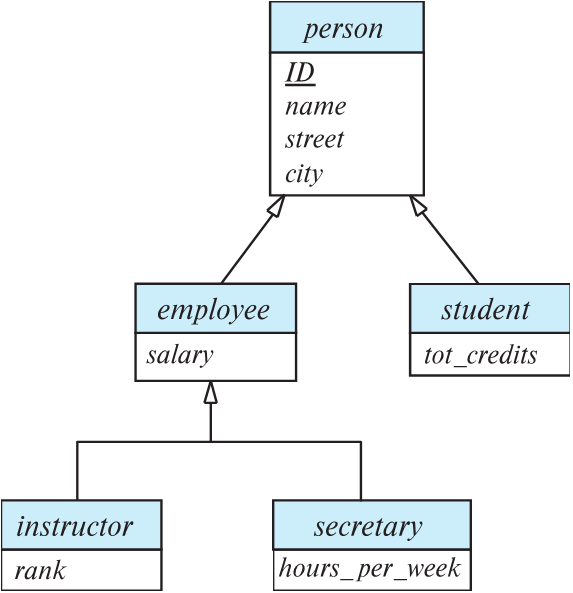
    - Overlapping
        - 두 Entity set 사이에 겹칠 수 있음을 의미한다.
        - 위의 employee와 student는 겹치는 부분이 존재할 수 있다.
        - 표현은 위와 같다.
    - Disjoint
        - 두 Entity set 사이에 겹치는 것이 없음을 의미한다.
        - 위의 instructor와 secretary는 겹치는 것이 없다.
        - 표현은 위와 같다.

## Sub-Class를 만들기 위한 2가지 방법
### 1. 상속할 대상의 Key와 추가할 속성을 저장
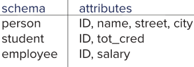

- 상속 받을 내용에서 추가할 내용을 저장한다.    
- 그리고 Key를 통해 속성을 받아 쓴다(join).    
- 최소한의 속성만 저장함

### 2. 상속 받은 것을 모두 저장
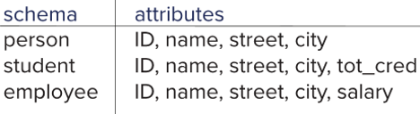

- 상속받은 위의 속성들을 모두 다 저장한다.
- 하지만 중복을 야기할 수 있음
    - 정보 불일치(Inconsistancy)

# Design Issues

## ER Diagram을 그릴 때 주의사항
1. 속성의 잘못된 사용
    - 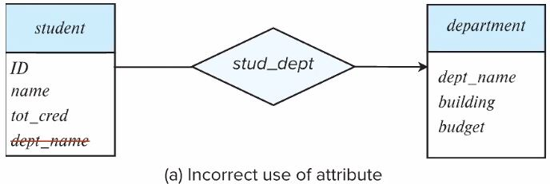
    - 위와 같이 student는 stud_dept의 관계를 통해 dept_name을 가져올 것이다.
    - 하지만 먼저 dept_name을 작성하게 되면 이후 관계가 맺어지면 dept_name이 두 개 가 된다.
    - 이는 잘못된 사용이다.
2. relationship attributes 잘못된 사용
    - 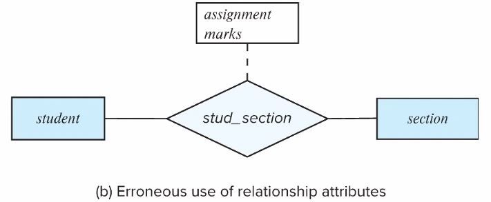
    - 위와 같이 속성 assignment와 marks의 속성으로 관계가 묶여있을 때
    - 학생과 section이 assignment와 marks가 각각 1개일 경우는 그 값으로 잘 mapping이 된다.
    - 하지만 그 이상일 경우는 mapping이 불가능하다.
### relationship attributes 잘못된 사용을 수정
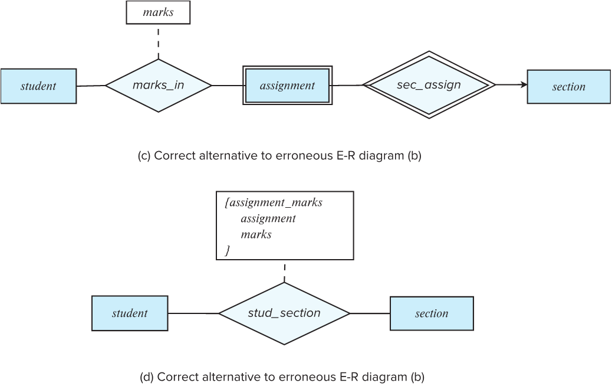
- c와 같이 assignment를 Weak Entity로 빼내서 관계를 맺어줌
- d와 같이 MultiValued로 처리함
    - 하지만 이 경우 assignment의 처리가 곤란하다.
    - assignment의 문제 정보를 따로 처리할 수 있는 것이 아니라, 각 학생에 대해서 그 과제를 정리해야 한다.

## Modeling시 선택
### Entities vs. Attributes
모델링을 할 때 Entities를 할 수도 있고, Attributes를 선택할 수 있다.

- Entities
    - 오른쪽 이미지처럼 따로 Entities를 만들어서 관리해 줄 수 있다.
    - 이는 추가적인 속성을 만들 수 있다.
    - 관계를 통해 다양한 관계를 맺어줄 수 있다.
- Attributes
    - 왼쪽 이미지처럼 하나의 속성으로 들어가서 관리할 수 있음

### Entities vs. Relationship sets

- Relationship set을 따로 Entity로 만들어서 모델링을 하는 방식도 존재함

### Binary Vs. Non-Binary Relationships
Example: ternary relationship parents
- 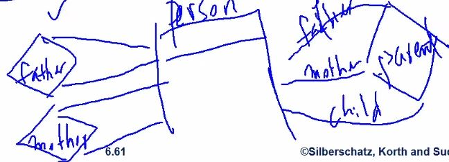
    - 왼쪽처럼 Binary로 연결할 수 있다.
    - 오른쪽처럼 Ternary로 연결할 수 있다.
    - 하지만 관리는 Binary가 더 용이할 수 있다.
        - 상황에 따라 선택해서 Modeling

# Alternative ER Notations
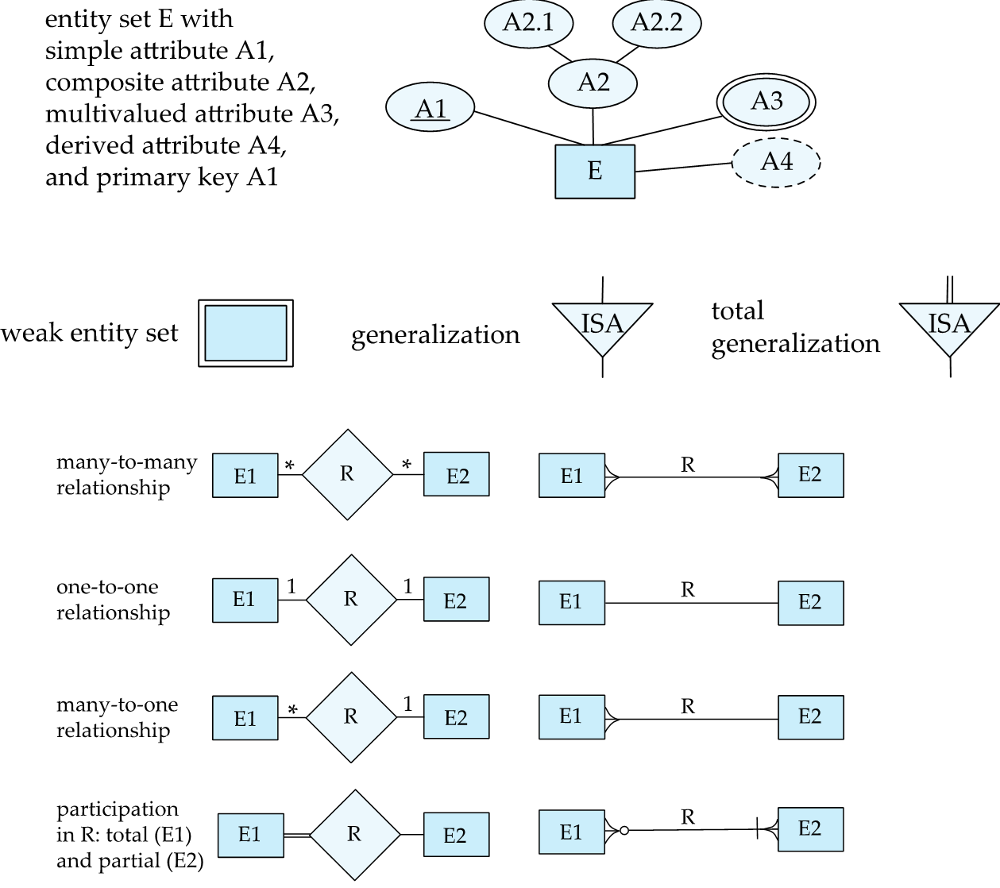
- 타원은 속성을 의미함
- ER을 표현하는데 다양한 방법들이 존재

## UML
UML(Unified Modeling Language) 
- 프로그램 개발할 때 사용
- ER Diagram과 유사함
- 생략!

# Other Aspects of Database Design
- Functional Requirements
- Data Flow, Workflow
- Schema Evolution

#