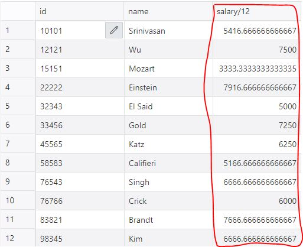
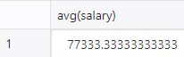

## History
처음 IBM에서 만들었고, 후에 Structurec Query Language(SQL)라고 명칭을 바꿨다.

# SQL Parts
- DML
    - DB를 질의하고, 삽입, 삭제, 수정하는 역할을 함
- Integrity(무결성)
    - 제약조건을 정의하는 여러가지 기능들
- View
- Transaction
- Embedded SQL
- Authorization

## Data Definition Language(DDL)
DDL은 테이블에 대한 다음의 내용을 포함한 구체적인 내용을 따른다.
- 각 테이블의 **Schema**
- 각 attribute와 연관된 value의 type 
    - **Domain**
- 무결성 제약조건
    - **Integrity constraints**
- 각 테이블에 대한 유지 관리할 인덱스 집합
    - **Index**
- 각 테이블에 대한 
    - **Security** and **Authorization** 정보
- disk에 각 테이블에 대한 물질적 공간 구조
    - **Physical storage structure**


## Domain Types in SQL
- char(n)
    - **고정된 길이**의 문자열
- varchar(n)
    - **가변 길이**의 문자열
- int
    - Integer
- smallint
    - Small Integer
- numeric(p,d)
    - 고정 소수 자리수
    - p: 전체 숫자의 개수
    - d: 소수점 이후 숫자의 개수
    - ex) numeric(3, 1)
        - 전체 숫자의 수는 최대 3개, 소수점 이후의 숫자의 개수는 최대 1개
        - 가능한 경우: 44.5, 4.5 4
            - 숫자가 더 적은 경우도 가능하다.
        - 불가능한 경우: 444.5, 0.32
- real, double precision
    - 정해지지 않은 실수형
    - 과학적인 수치해석 등 숫자가 클 때 사용
- float(n)
    - 최소 n자리의 실수형
    - 위와 동일하게 쓰임

## Create Table Construct
- Form
    ```sql
    create table r 
    (A1 D1,
    A2 D2,
    ...,
    An Dn,
    (integrity-constraint1),
    ...,
    (integrity-constraintk));
    ```
    - r: 테이블 명
    - Ai: 속성 명(Attribute)
    - Di: 데이터 타입(Domain)
- Example
    ```sql
    create table instructor (
    ID char(5),
    name varchar(20),
    dept_name varchar(20),
    salary numeric(8,2));
    ```
### Integrity Constraints in Create Table
- Types of integrity constraints
    - primary key (A1, ..., An )
    - foreign key (Am, ..., An ) references r
    - not null
- Example
    ```sql
    create table instructor (
    ID char(5),
    name varchar(20) not null,
    dept_name varchar(20),
    salary numeric(8,2),
    primary key (ID),
    foreign key (dept_name) references department);
    ```
- Primary Key는 not null이어야 하며, unique해야 한다.
- Foreign Key는 참조 무결성을 지켜야 한다.

## Updates to tables
- 삽입
    - `insert into instructor values ('10211', 'Smith', 'Biology', 66000);`
- 모든 튜플 제거
    - `delete from student`
- 테이블 제거
    - `drop table r`
- 스키마 수정 (Alter)
    - 속성 추가: `alter table r add A D`
        - A의 이름과 D의 타입을 가진 속성을 추가한다.
        - 기존에 존재하던 모든 튜플들은 이 속성에 대한 데이터를 ***null***값을 가진다.
    - 속성 제거: `alter table r drop A`
        - 속성을 제거함
        - 하지만 데이터베이스에 따라 지원하지 않을 수 있다.

## Query Language
지금부터 나오는 내용이 DB에 질의를 하는 것이다.

### Basic Query Structure
기본 구조
```sql
select A1, A2, ..., An
from r1, r2, ..., rm
where P
```

### Select 절
- SQL 이름들은 대소문자를 구분하지 않는다.
    - select = SELECT etc...
- 질의 결과 테이블에서 중복을 허용한다.
    - 중복 허용 키워드는 **`all`**이며, 생략 가능하다.
    - 중복을 제거하기 위해서 **`distinct`**를 사용한다.
- from절 없이 attribute는 문자가 될 수 있다.
    - ex) `select '437'`
        - 
    - Oracle에서는 불가능하다.
- as를 통해 별명을 지을 수 있다.
    - ex) `select '437' as FOO`
        - 
- from절을 가지면서 attribute를 문자로 넣는다면,
    - 그 테이블의 튜플 수 만큼 해당 문자가 생긴다.
    - ex) `select '437' as FOO`
        - 
- +,-,*,/와 같은 수학 연산 표현으로 질의가 가능하다.
    - `select ID, name, salary/12 from instructor`
        - 
    - as로 별칭도 가능


### Where 절
- Where 절은 결과들이 만족시키는 조건을 구체화한다.(조건 넣기)
    ```sql
    select name
    from instructor
    where dept_name = 'Comp. Sci.'
    ```
- `and, or, not`의 논리적 연결이 가능함
- `<, <=, >, =>, =, <>`의 비교 연산이 가능함
    > <>: 같지 않다를 의미함


### From 절
- from 절은 질의와 연관된 테이블을 만든다.
- **Cartesian product** instructor X teaches
    - `select * from instructor, teaches`
    - 여기에 where절을 붙이면 join이 된다.
    - 공통 속성의 경우 결과 테이블의 속성 이름이 관계 이름을 사용하여 변경됩니다.
        - instruction.id, teaches.id
        - Oracle에서는 불가능함
- Example
    ```sql
    select name, course_id
    from instructor , teaches
    where instructor.ID = teaches.ID 
    and instructor. dept_name = 'Art'
    ```
- as로 별칭을 지을 수 있다.
    ```sql
    select distinct T.name
    from instructor as T, instructor as S
    where T.salary > S.salary and S.dept_name = 'Comp. Sci.'
    ```
    - Oracle에서는 as를 생략해야함

### Self Join Example


## String Operations

### like keyword
`like`를 이용해서 특정 문자 또는 문자열이 들어가있는 조건을 특수화할 수 있다.
- `%`: 문자열
    - 'Intro%': 처음에 “Intro”로 시작하는 문자열들.
    - '%Comp%': 처음, 중간, 끝 모두에 “Comp” 가 들어간 문자열들.
- `_`: 문자
    - '_ _ _': 정확히 문자가 3개인 문자열들.
    - '_ _ _ %': 최소 문자열이 3개인 문자열들.
- `||`: 문자를 결합
    - ex) `WHERE GAME_ID LIKE '%' || #{gameId} || '%'`
- 대소문자 변환, 문자열 길이 찾기, 문자열 추출 등 지원

## Ordering the Display of Tuples
- 이름 순으로 정렬
    ```sql
    select distinct name
    from instructor
    order by name
    ```
- desc: 내림차순
    - `order by name desc`
- asc: 오름차순
    - `order by name desc`
    - 기본은 오름차순이다.

## Set Operations


- 합집합: `union`
    - 2017년 가을 또는 2018년 봄에 열린 과목 조회
        ```sql
        (select course_id from section where sem = 'Fall' and year = 2017)
        union
        (select course_id from section where sem = 'Spring' and year = 2018)
        ```
- 교집합: `intersect`
    - 2017년 가을과 2018년 봄 모두 열린 과목 조회
        ```sql
        (select course_id from section where sem = 'Fall' and year = 2017)
        intersect
        (select course_id from section where sem = 'Spring' and year = 2018)
        ```
- 차집합: `except`
    - 2017년 가을에는 열렸지만, 2018년 봄에는 열리지 않은 과목 조회
        ```sql
        (select course_id from section where sem = 'Fall' and year = 2017)
        except
        (select course_id from section where sem = 'Spring' and year = 2018)
        ```
- 집합연산은 자동적으로 중복을 제거한다.
    - 중복을 제거하지 않기 위해 `all`키워드를 사용한다.
        ````sql
        union all,
        intersect all
        except all.
        ````


## Null Values
- null은 존재하지 않거나, 모르는 값을 의미한다.
- null로 수학적 계산을 해보아도 null을 반환한다.
- null인지 아닌지 비교하기 위해 `is null`을 사용한다.
    - `select name from instructor where salary is null`
    - salary = null로는 불가함
- null과 비교가 불가함
    - 사용시 unknown
- null logic 연산
    - and
        - (true and unknown) = unknown, 
        - (false and unknown) = false,
        - (unknown and unknown) = unknown
    - or
        - (unknown or true) = true,
        - (unknown or false) = unknown
        - (unknown or unknown) = unknown


## Aggregate Functions
- avg: average value
- min: minimum value
- max: maximum value
- sum: sum of values
- count: number of values
- Example) `select avg (salary) from instructor where dept_name= 'Comp. Sci.';`
    - 

### Group By
위 함수들을 그룹화해서 함수를 실행
```sql
select dept_name, avg (salary) as avg_salary
from instructor
group by dept_name;
```


그룹핑 후 만들어질 테이블에 Attribute가 있어야 한다.    
위의 경우 ID가 select 안에 있다면 오류를 발생시킨다.

### Group By - Having 절
그룹의 조건을 부여한다.
```sql
select dept_name, avg (salary) as avg_salary
from instructor
group by dept_name
having avg (salary) >= 80000;
```


## Nested Subqueries
SQL 안에 또 다른 SQL(subquery)이 들어올 수 있다.   
```sql
select A1, A2, ..., An
from r1, r2, ..., rm
where P
```
- ri가 각 subquery로 대체될 수 있다.
- Ai가 단일 value를 발생시키는 subquery로 대체될 수 있다.
- P는 `B <operation> (subquery)`로 대체될 수 있다.

# Set Membership
- Set Membership에 대해서 in과 not in 연산을 수행할 수 있다.
- in
    ```sql
    select distinct course_id
    from section
    where semester = 'Fall' and year= 2017 and 
    course_id in (select course_id
    from section
    where semester = 'Spring' and year= 2018);
    ```
    - 2018년 봄에 열린 교과목과 2017년 가을에 열린 교고목의 id를 출력
- not in
    ```sql
    select distinct course_id
    from section
    where semester = 'Fall' and year= 2017 and 
    course_id not in (select course_id
    from section
    where semester = 'Spring' and year= 2018);
    ```
    - 2017년 가을에 열린 교과목 중 2018년 봄에 열리지 않은 교과목의 id를 출력
- 여러 요소와 비교하고 싶을 때 `()`로 묶어서 확인 가능
    - `attribute in (,)`
        ```SQL
        select distinct name
        from instructor
        where name not in ('Mozart', 'Einstein') 
        ```
        - 이름이 'Mozart'도 아니고, 'Einstein'도 아닌 이름
    - `(attribute1, attribute2) in r`
        ```sql
        select count (distinct ID)
        from takes
        where (course_id, sec_id, semester, year) in 
        (select course_id, sec_id, semester, year
        from teaches
        where teaches.ID= 10101);
        ```

# Set Comparison
## "some" 절
- "some": 어떤 한 조건이라도 만족하면 true
    - 5 < some(0, 5, 6) => true
    - 5 = some(0, 5, 6) => true
    - 5 > some(0, 5, 6) => true
    - 5 < some(0, 5) => false
- 왜 쓰는가? => 알아보기 쉽다.
    - some을 쓰지 않을 때
        ```sql
        select distinct T.name
        from instructor as T, instructor as S
        where T.salary > S.salary and S.dept name = 'Biology';
        ```
    - some을 사용할 때
        ```sql
        select name
        from instructor
        where salary > some (select salary
                            from instructor
                            where dept name = 'Biology');
        ```

## "all" 절
- "all": 어떤 한 조건이라도 만족하면 true
    - 5 < all(0, 5, 6) => false
    - 5 = all(0, 5, 6) => false
    - 5 > all(0, 5, 6) => false
    - 5 < all(6, 7, 8) => true
- Example
    ```sql
    select name
    from instructor
    where salary > all (select salary
                        from instructor
                        where dept_name = 'Biology');
    ```
    - 위 some과 결과가 같음

# Table이 비어있는가?
## "exists" 절
Tuple이 하나라도 존재한다면, true를 반환
```sql
select course_id
from section as S
where semester = 'Fall' and year = 2017 and 
        exists (select *
            from section as T
            where semester = 'Spring' and year= 2018 
                and S.course_id = T.course_id);
```
이는 다음과 같다.
```sql
(select course_id from section where semester = 'Fall' and year = 2017)
intersect
(select course_id from section where semester = 'Spring' and year = 2018);
```

## "not exists" 절
Tuple이 하나라도 존재한다면, false를 반환, 존재하지 않아야 true 반환
```sql
select distinct S.ID, S.name
from student as S
where not exists ( (select course_id
                    from course
                    where dept_name = 'Biology')
                    except
                    (select T.course_id
                    from takes as T
                    where S.ID = T.ID));
```
이는 학생이 'Biology' 학과 과목 중 수강한 과목을 제외했을 때, 더 이상 들을게 없는 학생의 학번과 이름을 출력    
다시말해, 'Biology' 학과 과목을 모두 수강한 학생의 학번과 이름을 출력

## Test for Absence of Duplicate Tuples
`unique` 키워드를 사용해서 중복이 되는 Tuple이 존재하는지 확인할 수 있다.
- `unique`: 공집합, 또는 1개 인 tuple만 true를 만든다.
    ```sql
    select T.course_id
    from course as T
    where unique ( select R.course_id
                from section as R
                where T.course_id= R.course_id
                    and R.year = 2017);
    ```

# Subqueries
## Subqueries in the From Clause
SQL은 FROM절에서 서브 질의를 할 수 있다.
```sql
select dept_name, avg_salary
from ( select dept_name, avg (salary) as avg_salary
    from instructor
    group by dept_name)
where avg_salary > 42000;
```
위 처럼 having절 없이 표현 가능하다.     

- having 절
    ```sql
    Select dept_name, avg (salary) as avg_salary
    from instructor
    group by dept_name
    having avg (salary) > 42000;
    ```

## With 절
With 절은 임시 Table을 생성한다.     
아래와 같이 임시 테이블을 생성해서 이용하기 위함이다.
```sql
with max_budget (value) as 
    (select max(budget)
    from department)
select department.name
from department, max_budget
where department.budget = max_budget.value;
```
이 질의는 다음과 같다.
```sql
select department.name
from department, max_budget
where department.budget = (select max(budget)
from department);
```

### With 절을 이용한 복잡한 query
```sql
with dept _total (dept_name, value) as
    (select dept_name, sum(salary)
    from instructor
    group by dept_name),
dept_total_avg(value) as
    (select avg(value)
    from dept_total)
select dept_name
from dept_total, dept_total_avg
where dept_total.value > dept_total_avg.value
```
- 이를 해석하면 다음과 같다.
    - 각 부서별 교수들의 임금 전체 합의 테이블과 그 평균에 대한 테이블에 대해서
    - 각 부서별 교수들의 임금 전체 합이 평균보다 높은 부서명을 출력한다.

## Scalar Subquery
상수 Subquery는 Select절에 있으며, 단 하나의 값만을 가진다.     
Subquery가 두 개 이상의 값을 가지면 사용이 불가함
- 각 부서의 이름과 교수 수를 출력하라
```sql
select dept_name, 
    ( select count(*) 
        from instructor 
        where department.dept_name = instructor.dept_name)
    as num_instructors
from department;
```

## Modification of the Database
- Deletetion
    - `delete from R`
        - R에 있는 모든 튜플을 삭제
    - `delete from R where P`
        - 조건 P를 만족하는 R에 있는 모든 튜플을 삭제
    - `delete from R where P oper Subquery`
        - ex) 임금이 평균 미만인 교수 출력
        ```sql
        delete from instructor
        where salary < (select avg (salary) 
            from instructor);
        ```
        - 예상되는 문제점
            - 삭제하면서 평균 임금이 변동될 수 있다.
        - SQL에서는 Subquery를 먼저 실행하고 삭제를 수행하기 때문에
            - Subquery의 결과는 변하지 않는다.
- Insertion
    - `insert R(a1, a2, ..., an) values(v1, v2 ..., vn)`: basic form
        - value들을 모든 속성에 대입한다면 Attribute는 생략해도 무관
            - null값도 포함한다.
    - Subquery를 통해서도 삽입이 가능하다.
        ```sql
        insert into instructor
        select ID, name, dept_name, 18000
        from student 
        where dept_name = 'Music' and total_cred > 144;
        ```
        - 여기서도 속성에 유의해서 넣어준다.
- Updating
    - `update R set (update content)`
        - R에 있는 내용 중 Update Content를 수행함
        - ex) `update instructor set salary = salary * 1.05`
            - 모든 salary를 5%를 더 추가
    - `update R set (update content) where P`
        - R에 있는 내용 중 P를 만족하는 튜플만 update content를 수행함
        - P 안에 Subquery도 들어갈 수 있다.
    - update 조건에 대해 다음과 같이 쓸 수 있다.
        ```sql
        update instructor
            set salary = salary * 1.03
            where salary > 100000;
        update instructor
            set salary = salary * 1.05
            where salary <= 100000;
        ```
        - 하지만 여기서 순서를 주의해야 한다.
        - 만일 위에서 순서가 바뀐다면, 의도치 않은 연산이 수행된다.
            - ex) 99000일 경우 5% 추가 후 그 다음 3% 더 추가로 얻게 된다.
        - 위와 같은 경우 case 문을 쓸 수 있다.
    - `update R set (A = case when P1 then C1 else C2 end)`
        - R 테이블에서 A의 값들을 수정하는데, P1을 만족할 경우 C1을 수행하고, 그렇지 않다면 C2를 수행한다.
    - Update with Scalar Subqueries
        - 단 하나의 속성의 값을 수정하기 때문에 여기서도 Scalar Subquery를 사용 가능하다.