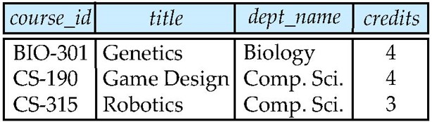
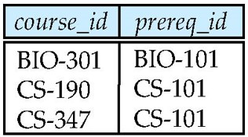
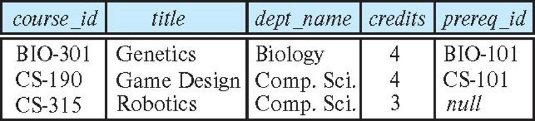
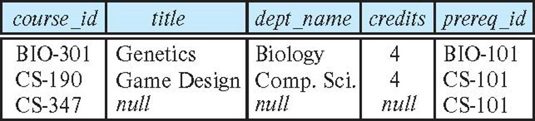
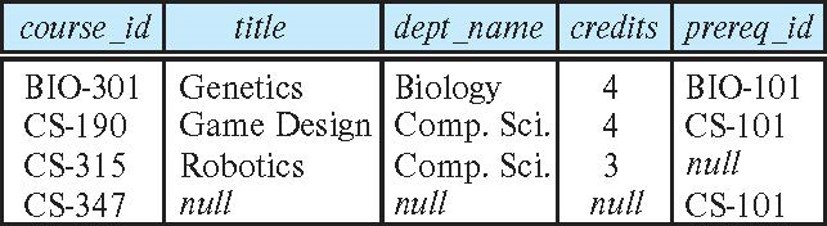
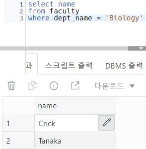

# Joined Relations
Three types of joins
- Natural join
- Inner join
- Outer join

# Natural Join
- 튜플을 모든 공통 속성에 매치시키고, 각 공통열의 복사본 하나만 유지한다.
    - EQUI JOIN같은 경우 같은 속성을 두 번 출력하지만
    - Natural Join은 중복된 속성을 제거하고 출력해 준다.
- 기본적으로 Inner join이다.
    - `inner join`으로 명시해도 되고, join만 써도 무관
- ex) 교수들이 교육했던 과목의 과목 ID와 함께 교수들의 이름들을 리스트화.
    - natural join
        ```sql
        select name, course_id
        from student natural join takes;
        ```
    - 이를 풀어쓰면,
        ```sql
        select name, course_id
        from students, takes
        where student.ID = takes.ID;
        ```
- Form
    ```sql
    select A1, A2, … An
    from r1 natural join r2 natural join .. natural join rn
    where P ;
    ```

### Dangerous in Natural Join
학생들이 수강하는 과목명과 함께 학생 이름을 리스트화.
- Natural join을 남발할 경우(incrrect version)
    ```sql
    select name, title
    from student natural join takes natural join course;
    ```
    - student의 dept_name과 course의 dept_name의 Attribute명이 같다.
        - 따라서, student.dept_name = course_dept_name 인 리스트만 출력할 것이다.
        - 타과의 수업을 들은 학생들은 출력하지 않게 된다.
- 위의 내용을 정상 출력(Correct version)
    ```sql
    select name, title
    from (student natural join takes), course
    where takes.course_id = course.course_id;
    ```

### Natural Join with Using Clause
using(Attribute)를 이용해서 정확하게 명시를 할 수 있다.    
```sql
select name, title
from (student natural join takes) join course using (course_id)
```

### Join Condition
- `on`을 이용해서 조건을 부여할 수 있다.
- `where`절과 비슷함
- Example
    ```sql
    Query example
    select *
    from student join takes on student_ID = takes_ID
    ```
## Outer Join
외부 조인
- 임의의 테이블을 기준으로 다른 테이블과 join할 때
    - 다른 테이블에서는 선택한 테이블의 데이터가 없을 경우
    - 선택한 테이블의 데이터를 강제로 리스트화 시킨다.
- 즉, 조건에 맞지 않는 데이터를 선택한 데이터들을 기준으로 해당하는 행을 모두 출력하고 싶을 때 사용
- Three Forms
    - left outer join
    - right outer join
    - full outer join
- Table Example
    - Relation course
        - 
    - Relation prereq
        - 

### Left Outer Join
```sql
FROM R1 LEFT OUTER JOIN R2 ON P;
```
- P에 따라 R1을 기준으로 R2에 데이터와 일치하지 않더라도 R1의 행은 모두 가져온다.
- 이때, R2의 데이터가 없는 경우 NULL값을 준다.
- In relational algebra
    - course ⟕ prereq
- Example
    - 

### Right Outer Join
```sql
FROM R1 RIGHT OUTER JOIN R2 ON P;
```
- P에 따라 R2을 기준으로 R1에 데이터와 일치하지 않더라도 R2의 행은 모두 가져온다.
- 이때, R1의 데이터가 없는 경우 NULL값을 준다.
- In relational algebra
    - course ⟖ prereq
- Example
    - 
### Full Outer Join
```sql
FROM R1 FULL OUTER JOIN R2 ON P;
```
- P에 따라 모든 테이블의 행을 가져온다.
- 이때, 데이터가 없는 경우 NULL값을 준다.
- In relational algebra
    - course ⟗ prereq
- Example
    - 

# View
- 기존 테이블의 필요한 데이터만 추출하여 가상의 테이블을 만드는 것
- view로 만들어진 테이블은 실제 테이블이 아닌 가상의 테이블이므로 실질적인 데이터는 존재하지 않는다.
- 약간 변수와 비슷함
    - view를 통해 해당 쿼리식을 저장함
    - 이 view를 사용할 때마다 쿼리식으로 기존 테이블에서 데이터를 추출함
- With 절과 유사하다
    - With절은 그 순간에만 사용하고 사라짐
    - 하지만 View는 삭제할 때 까지 남아 있다.
- Form
    - `create view v as < query expression >`
- Example
    - View 생성
        ```sql
        create view faculty as
        select ID, name, dept_name
        from instructor
        ```
    - View 사용
        ```sql
        select name
        from faculty
        where dept_name = 'Biology'
        ```
        - 

## Views Defined Using Other Views
- 다른 View를 이용해서 새로운 View를 생성할 수 있다.
- `Table -> V1 -> V2 -> V3 -> ... -> Vn`
    - V1은 V2에 대해 직접 종속이다.
    - V1은 V3에 대해 종속되어있다.
    - `Vn -> V1`로 갈 경우 Recursive하다고 한다.
        - 하지만 테이블이 생성이 안되고 무한루프를 돈다.
        - **따라서, 사용불가!**
- Example
    - V1 만들기
        ```sql
        create view physics_fall_2017 as
            select course.course_id, sec_id, building, room_number
            from course, section
            where course.course_id = section.course_id
                and course.dept_name = 'Physics'
                and section.semester = 'Fall'
                and section.year = '2017’;
        ```
    - V2 만들기
        ```sql
        create view physics_fall_2017_watson as
            select course_id, room_number
            from physics_fall_2017
            wh-ere building= 'Watson';
        ```

### View Expansion
표현식의 View 확장은 다음 대체 단계를 반복해서 수행한다.
```py
repeat
    Find any view relaton vi in e
    Replace the view relation vi by expression definig vi
until no more view relations are present in e
```
- view 정의는 재귀를 수행해서는 안된다.
- 이 루프는 끝내야 한다!

## Materialized Views
Virtual Table인 View를 실체화된 Table로 만든다.    
물리적인 공간을 차지하는 테이블을 가진다.

- view가 정의될 때 물리적인 복사본이 생성되는 것
- 대용량의 Table에서 반복되는  Query를 더 빠른 수행을 위해 해당 테이블을 복사하여 만든다.
- 장점
    - Query 조회 수행 능력 향상
- 단점
    - 기존 Table을 수정하더라도 복사본인 Mview는 수정되지 않음
    - 따라서, 기존 Table을 update할 때, Mview도 같이 수정해줘야 함
    - update 수행 능력 저하


## Update of a View
- View를 통해 update를 수행할 수 있다.
- DB에 따라 지원이 안될 수 있다.
- Example
    ```sql
    insert into faculty 
        values ('30765', 'Green', 'Music');
    ```
    - faculty는 instructor의 ID, name, dept_name를 가져와 만든 것이다.
    - 따라서, faculty에 삽입을 수행할 경우 instructor table에 위 값을 삽입한다.
    - 또한 instructor의 남은 속성 Salay의 값은 null로 들어가게 된다.

### Update of a View의 조건
대부분의 SQL은 간단한 View일 때만 update를 허용한다.
- from절이 오직 table 하나일 경우
    - join이나 Cartisan은 불가
- select절에 꼭 속성들만 선택을 한다.
    - 수식이나 함수, `distinct`를 사용할 경우 update 불가
- origin Table의 속성들 중에 view의 속성이 없는 것들이 null을 허용해야 한다.
    - not null일 경우 삽입 불가
- Group by 또는 having 절이 없어야 한다.
- view를 생성할 때 조건을 달 경우
    - 해당 조건을 반하는 tuple은 삽입 불가

# Transaction
데이터베이스의 상태를 변화시키기 해서 수행하는 작업의 "unit"(단위)     
Transaction에는 두 가지 수행 Operation이 있다.
- Commit work
    - 하나의 Transaction이 정상적으로 끝났고, 끝났음을 알려줌
- Rollback work
    - Transaction 처리가 비정상적으로 끝나서 이전 상태 즉 가장 최근 정상적으로 Commit 한 상태로 돌아감

## Transaction 특징
- Transaction 원자성
- Transaction의 동시성 제어
    - Transaction 중 간섭으로부터 독립되어야 한다.
    - DB에서 수정의 작업 진행 중에 이를 조회한다거나 다른 수정 작업을 수행하고자 할 때, 이를 막아야 한다.
        - Locking: 수정, 삽입, 삭제 동안 다른 일을 못하게 막는다.
        - 이 상태에서는 조회 또한 불가능하다.

# Integrity Constraints
어떤 속성에 데이터를 삽입할 때 특정 조건을 주어 원치 않는 데이터의 삽입을 막을 수 있다.

## Constraints on a Single Relation
- not null
- primary key
    - not null
    - unique
- unique
- check(P), where P is predicate

### Not Null Constraints
해당 속성의 값들은 null을 받을 수 없다.
- Example
    ```sql
    name varchar(20) not null
    budget numeric(12,2) not null
    ```

### Unique Constraints
Unique로 받은 속성들은 중복되어서는 안된다.
- unique(A1, A2, ... , An)
- 이를 받은 속성 A1, A2, ... , An은 candidate key(후보키)로 사용될 수 있다.
- candidate key는 null이 허용된다.
- Example
    ```sql
    unique(name, dept_name)
    ```
    - name, dept_name 합쳐서 유일하면 된다.
    - 즉, name이 같고 dept_name이 다르면 유일하다고 볼 수 있다.

### The check clause
check(P) P의 조건을 만족하는 경우에만 삽입이 가능하다.
- Example
    ```sql
    create table section 
    (course_id varchar (8),
    sec_id varchar (8),
    semester varchar (6),
    year numeric (4,0),
    building varchar (15),
    room_number varchar (7),
    time slot id varchar (4), 
    primary key (course_id, sec_id, semester, year),
    check (semester in ('Fall', 'Winter', 'Spring', 'Summer')))
    ```
    - semester 속성은 'Fall', 'Winter', 'Spring', 'Summer' 이 4가지 중 하나만 받을 수 있다.


## Referential Integrity
참조 무결성 - foreign key와 관련이 있다.    
두 테이블에서 같은 속성 A가 하나의 테이블에서 존재하고 주 키일때,    

또한 만일 하나의 테이블에서 임의의 튜플 속성 A의 값이 다른 테이블에서 보여진다면 그 다른 테이블에서 foreign key로 작용된다.    
이는 필요충분조건이기에 foreign key라면 해당값은 주키로 가지는 테이블에서 꼭 그 값을 가지고 있어야 한다.

- Foreign Key는 table을 만들 때 명시할 수 있다.
    - `foreign key (dept_name) references department(dept_name)`
    - 이렇게 속성을 명시할 수 도 있다.
- 기본적으로 주 키를 외래키로 참조하기 때문에 다음과 같이 생략도 가능하다.
    - `foreign key (dept_name) references department`
### Cacading Actions in Referential Integrity
- 참조된 테이블에서 해당 값이 삭제가 되거나 수정되면 참조한 테이블은 기본적으로 그 값이 그대로 남아있다.
- 하지만 다음의 actions을 추가해줌으로써 원본 테이블의 수정사항에 대해 참조 테이블의 값을 동시에 수정이 가능하다.
- Example
    ```sql
    create table course (
    (...
    dept_name varchar(20),
    foreign key (dept_name) references department
    on delete cascade
    on update cascade,
    ...) 
    ```
    - on delete cascade에서 cacade 대신에
        - set null
            - 삭제 될 때 해당 튜플이 삭제되는 것이 아니라 해당 속성의 값이 null로 바뀜
        - set default
            - 설정해두었던 default값으로 값이 바뀜

### 무결성 제약조건을 위반 시 대처
```sql
create table person (
    ID char(10),
    name char(40),
    mother char(10),
    father char(10),
    primary key ID,
    foreign key father references person,
    foreign key mother references person)
```
위 테이블의 경우 mother와 father가 자신의 테이블을 참조하고 있다.    
제약조건 충돌 없이 tuple을 삽입하기 위해서는 다음의 과정 중 하나를 통해서 삽입을 수행한다.
- Person 테이블에 부모 튜플을 먼저 삽입하고 그것을 참조하여 삽입한다.
- father와 mother를 처음에 null로 하고, 후에 모든 값을 수정한다.
    - 이때 father와 mother는 not null이어야 한다.
- 제약조건 checking을 연기한다.

## Check 조건
Check를 통해 삽입을 제한할 수 있다.     
- `check A in subquery`
- Example
    - `check (time_slot_id in (select time_slot_id from time_slot))`


### Assertion
하나의 속성에 대한 조건이 아니라 데이터베이스 전체에 거는 조건이다.    
즉, 데이터베이스가 항상 만족해야하는 조건     
`create assertion <assertion-name> check (<predicate>);`

## Built-in Data Types in SQL
- date: 년, 월, 일을 포함하는 날짜 데이터 타입
    - 일, 월, 년 처럼 순서는 자유이다.
    - Example: `date '2005-7-27'`
- time: 초, 분, 시를 표현하는 시간 데이터 타입
    - Example 
        - `time '09:00:30'`
        - `time '09:00:30.75'`
- timestamp: 날짜와 시간을 합친 데이터 타입
    - Example: `timestamp '2005-7-27 09:00:30.75'`
- interval: 시간을 저장하는 데이터 타입
    - 타이머처럼 일정량의 시간을 저장
    - date, time, timestamp와 더하고 빼기가 될 수 있다.
    - Example: interval '1' day

## Large-Object Types
큰 object를 저장하는 데이터 타입    
e.g. photos, videos, CAD files, etc

- 큰 object들은 Disk에 따로 저장되고 테이블에서는 Pointer를 저장한다.
- type
    - blob
        - binary large object
        - 8bit
    - clob
        - character large object
        - text, ASCII코드 등 7bit 국제언어

## User-Defined Types
사용자가 임의로 Type을 정의할 수 있다.
- Example
    - `create type Dollars as numeric (12,2) final`
    ```sql
    create table department
    (dept_name varchar (20),
    building varchar (15),
    budget Dollars);
    ```
    - final: 더이상 이를 이용한 재정의는 허가하지 않음
        - 재정의를 subtype이라 한다.


## Domains
Type 정의하는 것과 유사하다.    
하지만 Domain은 제약조건을 가질 수 있다.
- Example
    ```sql
    create domain degree_level varchar(10)
        constraint degree_level_test
            check (value in ('Bachelors', 'Masters', 'Doctorate'));
    ```

## Index Creation
- 테이블의 컬럼을 인덱스화 한다.
- 이를 이용하여 검색의 성능을 향상시킨다.
- 이는 Tree구조를 가지며 log(n)의 시간복잡도를 가진다.
- 하지만 삽입과 삭제 수정이 많은 테이블에서는 오히려 성능이 떨어진다.
    - 한번 인덱스를 설정한 컬럼에 대해 다시 저체의 인덱스를 다시 설정해야하기 때문
- Form
    - `create index <name> on <relation-name> (attribute);`
- Tuning: Index를 만들어 두는 것

## Authorization
권한
<br>

- Tuple에 대한 privilege
    - Read
    - Insert
    - Update
    - Delete    
    - 이는 테이블 또는 뷰같은 DB의 일부 기능에 대한 권한을 부여한다.
        - Table의 Data영역에 접근
- DB구조에 대한 권한
    - Index
    - Resources
    - Alteration
    - Drop
    - DB의 구조에 대한 권한을 준다.
        - Table의 MetaData영역에 접근

### grant Authorization
권한 부여 하기
- Form
    - `grant <privilege list> on <relation or view > to <user list>`
    - `<user list>`에 들어갈 수 있는 요소
        - user id
        - public
            - 모든 user들에게 권한을 부여한다.
        - [role](##Roles)
    - `<privilege list>`에 들어갈 수 있는 요소
        - select - Read
        - inesrt - Insert
        - update - Update
        - delete - Delete 
        - all privileges - above all
- Example
    - `grant select on department to Amit, Satoshi`
    - Amit, Satoshi한테 department 테이블에 대해서 select 권한을 부여함
- option
    - `with grant option`
        - 부여받은 권한을 다른 User에게 부여할 수 있음
        - Example
            - `grant select on department to Amit with grant option;`
- 외래키 생성을 위한 참조 권한도 부여할 수 있다.
    - `grant reference (dept_name) on department to Mariano;`
    - 왜 필요한가?
        - 다른 테이블에서 작업을 할 때 참조한 테이블에 영향을 끼치는 것을 방지하기 위해서

### Revoking Authorization
권한 삭제하기
- Form
    - `revoke <privilege list> on <relation or view> from <user list>`
    - `<privilege list>`에 all이 들어가면 모든 권한을 뺏는 것을 의미함
    - `<user list>`에 public이 ㄷ르어가면 모든 사용자에게서 해당 권한을 뺏는 것을 의미함
- 기본적으로 권한을 부여받은 user는 부여해준 user가 권한이 박탈되면 같이 박탈된다.
- option
    - `cascade`
        - 권한 제거할 User가 부여했던 다른 User들까지 같이 권한을 제거한다.
        - Example
            - `revoke select on department from Amit, Satoshi cascade;`
    - `restrict`
        - 이 User의 권한이 제거가 되더라도 다른 User는 영향을 끼치지 않는다.
        - Example
            - `revoke select on department from Amit, Satoshi restrict;`

## Roles
Role은 집단의 개념으로 하나의 사용자가 그 집단에 소속되어 있다면 그 집단이 부여받은 권한을 가질 수 있게 된다.     
그리고 그 사용자가 다른 집단으로 넘어가게 된다면 이전 집단의 권한은 block이 되고, 새 집단의 권한을 사용한다.
- Form
    - create
        - `create a role <name>`
    - grant
        - `grant <role> to <users>`
- users에 role이 들어갈 수 있다.