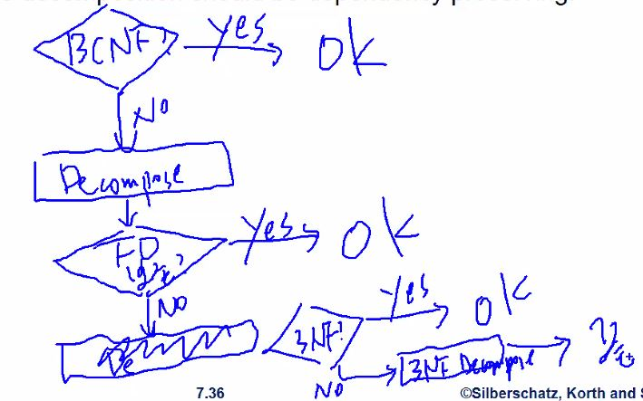
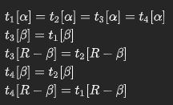

- Table이 정상인지 비정상인지 확인하는 방법
- 비정상일 때 고치는 방법
# Normalization
- 잘못된 Table
    - 
    - 위 테이블은 instructor와 department table을 natural join한 것이다.
        - 만일 위 테이블이 하나의 테이블이라고 가정해보자.
    - 위에서 department table의 데이터들이 중복해서 출력되는 것을 확인할 수 있다.
        - Ex) Comp. Sci. Taylor 100000 이 중복해서 보임
    - 단점
        - disk, memory 낭비
        - 정보 Inconsistent
        - null value가 들어갈 수 있음
            - department에 새로운 부서가 추가되면 교수가 없으므로 null값 들어감
    - 따라서, instructor와 department로 나눌 필요성이 있다.
- 괜찮은 Table
    - student(ID, name, dept_name, tot_cred)
    - advisor(s_ID, i_ID) 
    - 위 두 개의 Table을 하나로 합쳐도 중복없이 정상적인 Table을 만들 수 있다.
        - student(ID, name, dept_name, tot_cred, advisor)

## Decomposition
- Table에 중복되는 Data가 존재하게 될 경우 분리를 시킨다. 
- 나누는 기준은 여러가지 존재
- 나눌 때는 공통되는 속성이 있어야 한다.
- Lossy Decomposition
    - 기존 테이블에서 나누고 그 테이블들을 하나로 다시 묶었을 때
    - 원본을 유지하지 않을 때를 Lossy Decomposition라 한다.
    - 
        - 위 테이블에서 Kim이라는 이름으로 2개의 정보가 나와야 하지만 4개가 나오게 됨
    - Form
        - `r ⊂ ∏_R1 (r) ⨝ ∏_R2 (r)`
    - Natural join결과가 원래 테이블보다 더 작을 순 없다.
        - `r ⊅ ∏_R1 (r) ⨝ ∏_R2 (r)`

- Lossless Decomposition
    - 기존 테이블을 나누고 다시 묶었을 때 원형 그대로일 때 Lossless Decomposition라 한다.
    - R을 R1과 R2로 나눈다고 하자.
        - `R = R1 U R2`
    - Form
        - `∏_R1 (r) ⨝ ∏_R2 (r) = r`

## Normalization Theory
- R이 좋은 형태인지 판별한다.
- 만일 좋은 형태가 아니라면 Decompose를 수행한다.
    - n개의 Table로 나누는데 각 Table은 좋은 형태를 유지해야 한다.
    - Lossless Decomposition로 만들어야 한다.
- 다음 두 가지의 개념을 기반하여 정규화한다.
    - [Functional dependencies](#functional-dependencies)
    - Multivalued dependencies


# Functional dependencies
- 실제로 data에 규칙 도는 제약조건이 존재한다.
    - 예를 들어 각 학생과 교수는 오직 하나의 이름만을 가진다.
    - etc..
- legal instance
    - 그러한 실제의 데이터 제약조건들을 만족하는 Table을 **legal instance**라 한다.
    - DB에 있는 모든 Table이 legal instance이면 그 DB는 legal instance이다.
- 어떤 속성이 다른 속성값을 결정할 수 있다.
    - Ex) 어떤 학생의 ID가 주어지면, 그 학생의 학과와 이름 등을 알 수 있다.
        - ID → Department, name, etc..
- functional dependency는 key와 비슷한 개념을 지닌다.
    - key는 어떤 table에서 특정 tuple을 찾는 역할을 한다.
        - 바로 위 내용과 유사한 개념
    - key값은 유일하다.

## Functional Dependencies Definition 
- 다음을 만족하는 α, β가 존재할 때
    - α ⊆ R and β ⊆ R
- `α → β`: determine
    - α가 β를 결정한다.
- `t1[α] = t2[α] ⇒ t1[β] = t2[β]`: determine
    - 분리된 tale에서 각각의 tuple t1과 t2에 대해
        - 같은 속성 α의 값이 같다면 같은 속성 β의 값도 같다.
    - 위를 만족하면 Functional Dependencies를 만족한다고 볼 수 있다.

## Closure of a Set of Functional Dependencies
- closure
    - 모든 functional depedency가 있을 때 이를 통해서 도출될 수 있는 모든  functional depedency들을 closure라고 한다.
    - F^+
        - functional depedency F로 부터 도출된 것

## Keys and Functional Dependencies
- K: superkey
    - K → R 일 때, K는 superkey라 한다.
- K: candidate key
    - K → R를 만족하고,
    - α ⊂ K, α → R을 만족하는 α가 존재하지 않을 때 K를 candidate key가 된다.
        - α: subset
- functional dependency는 superkey를 사용해서 표현할 수 없는 제약조건을 표현할 수 있다.
    - in_dept (<u>ID</u>, name, salary, dept_name, building, budget).
    - 여기서, ID는 모든 값들을 결정할 수 있다.
        - ID → building
    - 또한 dept_name을 통해서 , building을 결정할 수 있다.
        - dept_name → building
    - 하지만 dept_name → salary는 불가능함

## Use of Functional Dependencies
- 어떤 Table을 test해서 funtional dependency를 만족하면 `r satisfies F`라 할 수 있다.
- 반대로 legal relation을 통해서 제약조건을 정의할 수 있다.
    - `F holds on R`
- 우연히 성립하는 경우 Functional Dependencies를 만족한다고 볼 수 없다!
    - 모든 경우에서 만족해야 함

## Trivial Functional Dependencies
- trivial
    - β ⊆ α이면 α → β 이는 당연한 것이다.
    - 위 명제와 같이 당연한 내용을 일컫음
    - Example
        - ID, name → ID
        - name → name

## Lossless Decomposition
- Form
    - `∏_R1 (r) ⨝ ∏_R2 (r) = r`
- 다음 두 조건 중 하나라도 만족하한다면 Lossless Decomposition이다.
    - `R1 ∩ R2 → R1`
    - `R1 ∩ R2 → R2`
    - 결국 적어도 둘 중 하나에서 key가 되면 된다.


## Dependency Preservation
- DB가 수정되었을 때 제약조건이 잘 맞는지 Testing 해야 한다. 
- 그 Testing은 효율적으로 해야 한다.
    - 하나의 테이블 안에서 할 때 효율적이라고 함
    - 이 때, Dependency Preservation를 만족한다.
- 비효율적
    - 여러 테이블을 하게 될 대는 Cartesian Product를 수행하고 Testing한다.
    - 이는 Dependency Preservation를 만족하지 못한다.
    - functional dependency가 분리된다면 결합해야 하기 때문에 비효율적


# Normal Forms
## First Normal Form (1NF)
- Domain이 atomic하다.
    - 각 element들이 더 이상 나누어지지 않음
    - 이름이 중복되거나 속성이 분리될 수 있다면  atomic하지 않다.
- First Normal Form (1NF)
    - 어떤 테이블이 모든 속성의 Domain이 atomic하다면 1NF라 한다.
- 1NF에 atomic하지 않은 데이터를 저장할 경우
    - 저장장치가 복잡해지고, 질의도 모두 바뀌게 된다.
- 따라서, 우리는 모든 테이블이 1NF를 따른다고 가정을 한다.

## Beyce-Codd Normal Form (BCNF)
- 3NF와 4NF 사이에 존재하는 계층
- 어떤 테이블 R이 Functional Dependency를 많이 가질 때를 말함
- BCNF는 다음 두 가지 중 적어도 하나를 만족해야 한다.
    - α → β가 trivial할 때
        - 즉, β⊆α를 만족할 때
    - α가 R의 superkey일 때
- Example
    - 위 in_dept Talbe을 보면
        - in_dep (<u>ID</u>, name, salary, dept_name, building, budget).
    - BCNF가 아니다.
        - dept_name이 building과 budget를 결정하긴 한다.
        - 하지만 superkey가 아니다.

### BCNF로 나누기
- BCNF를 만족하지 않는 테이블 R과
    - BCNF를 위반하는 Functional Dependency를 α → β라 하자.
- α와 β를 모두 합친다
    - α ∪ β
- 또 전체 R에서 (β - α)를 뺀다
    - R - (β - α)
    - α와 β가 겹치는게 없다면 R - β로 해도 무방
- Example
    - α = dept_name
    - β = building, budget
    - α ∪ β = (dept_name, building, budget)
    - R - (β - α) - (ID, name, dept_name, salary)

### BCNF and Dependency Preservation
- BCNF에서 Dependency가 보존이 안될 경우
    - dept_advisor(s_ID, i_ID, dept_name)
       - 이는 데이터 중복으로 인해서 나눌 필요가 있다.
    - Function dependency
        - i_ID → dept_name
        - s_id, dept_name → i_ID
    - 하지만 모든 속성이 다 연관이 있다보니 어떻게든 나누어도 손실이 발생함
        - Dependency가 보존되지 못함

## Third Normal From
- BCNF이면 3NF이다.
- 모든 α → β in F^+에 대해서 다음 조건 중 하나라도 만족해야 한다.
    - α → β가 trivial할 때
    - α가 R의 superkey일 때
        - 위 두개는 BCNF의 조건이다.
    - β - α 가 R에 대해 후보키일 경우
- Dependency 보존을 위해 BCNF를 약간 완화한 것

### Redundancy in 3NF

- 위 표에서 잘못된 점
    - null값이 입력됨
    - 데이터 중복이 존재
- 따라서, 다음을 나누어야 한다.
    - R = (J, K, L )
    - F = {JK → L, L → K }

### 3NF Decomposition Algorithm
- 3NF가 아닐 경우 3NF로 만드는 알고리즘
```py
i := 0;
for each  functional dependency  α → β in F do
	if none of the schemas Rj, 1 ≤ j ≤ i contains   α β
    		then begin
            	i := i  + 1;
                Ri  := α β
            end
if none of the schemas Rj, 1 ≤ j  ≤ i contains a candidate key for R
	then begin
    	i := i  + 1;
		Ri := any candidate key for R;
	end
/* Optionally, remove redundant relations */
repeat
if any schema Rj is contained in another schema Rk
    then /* delete Rj  */
       Rj = R;;
       i=i-1;
return (R1, R2, ..., Ri)
```

- Exmpale: cust_banker_branch = (<u>customer_id</u>, <u>employee_id</u>, branch_name, type )
    - Functional dependency를 확인
        1. customer_id, employee_id → type
        2. employee_id → branch_name
        3. customer_id, branch_name → employee_id
    - Candidate key
    - BCNF인가?
        - BCNF가 아니다.
        - 1번과 2번을 잡으면 3번이 Dependency를 만족하지 못한다.
        - 따라서, 3NF로 가야함
    - 3NF 알고리즘 적용
        - 

### Comparison of BCNF and 3NF
- 3nf
    - NULL value와 중복은 존재 가능
    - dpendency를 보존해준다.
- BCNF
    - 중복을 막아준다.

## Goals of Normalization
- R과 F가 주어질 때 이 R이 좋은 R인지 판단
    - BCNF, 3NF 를 판단
    - 


##  Multivalued Dependency
- 하나의 값에 대해 여러 값을 매칭할 때
- Form
    - α →→ β


- Example
    - 다음과 같이 존재할 때
        - (99999, David,   981-992-3443)
        - (99999, William, 981-992-3443)
    - ID →→ child_name
    - ID →→ phone_number

# Overall Database Design Process
- 모든 속성을 가지는 Relation R을 만들고 Functional Dependency에 따라 분리시킨다.
- 또는 적당히 임의의 R을 만들고 정규화를 수행한다.
- 
## ER Model and Normalization
- ER을 잘 설계하고 table 전환이 잘 된다면 추가적인 정규화는 필요없다.
- 하지만 실제로는 설계가 완벽하지 않기 때문에 정규화가 필요함

## Denormalization for Performance
- 필요에 의해(성능) 정규화를 하지 않을 수 있다.
- 2가지 대안이 존재하는데 prereqs를 예로 보자.
    - 정규화되기 전 테이블 사용
        - Data 중복이 들어갈 수 있음
        - 더 빠른 조회 가능
        - 추가적인 공간과 수정 시간이 더 듦
        - 추가적인 coding이 존재하며 error의 가능성이 늘어남
    - materialized view를 만들기: course ⨝ prereq
        - 더 빠른 조회 가능
        - 추가적인 공간과 수정 시간이 더 듦
        - 추가적인 coding이 없고 error를 방지할 수 있음
            - 수정에 대해 DB가 관리해줌