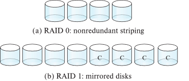
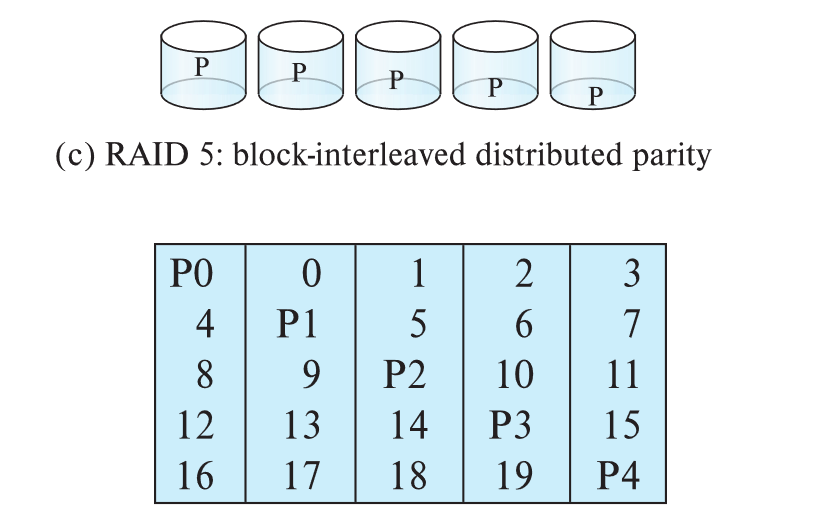

# Classification of Physical Storage Media
기억 장치의 결정 요소
- 속도
- 비용
- 신뢰성
## Storage Hierarchy

구분
- primary storage
    - 휘발성 메모리
    - 매우 빠름
    - cache, main memory가 속함
- secondary storage
    - 비화발성 메모리
    - primary storage보다 느리지만 빠름
    - **on-line storage**라고도 한다.
    - flash memory(SSD), magnetic disk가 속함
- tertiary storage
    - 비휘발성 메모리
    - 가장 느림
    - 보관 공간, Backup용도로 사용
    - **off-line storage**라고도 한다.
    - magenetic tape, optical storage(CD)가 속함
        - magenetic tape
            - Sequential access(순차적 접근을 함)
                - 임의 접근 불가
            - 1부터 12 TB 공간을 가짐
            - 큰 용랑(petabytes) Juke box를 만들 수 있다.

## Storage Interface
- Disk Interface
    - Sata: 일반 disk interface
    - SAS: Server interface
    - NVMe(Non-Volatile Memory Express): SSD
- SAN
- NAS

## Tape Storage
- backup과 data 보관 용도로 사용
- 순차적 접근
- 큰 용량을 가짐
- tape 가격이 매우 쌈

## Optical Storage
- 광학 저장 공간
- 비휘발성 메모리
- Disk가 돌면서 laser를 통해 읽는다.
- 종류
    - CD-ROM (640 MB) and DVD (4.7 to 17 GB)
        - 초기에 만들어짐
    - Blu-ray disks: 27 GB to 54 GB
    - CD-R, DVD-R, DVD+R
        - Write-one, read-many (WORM)
        - 보관용으로 사용
    - CD-RW, DVD-RW, DVD+RW, and DVD-RAM
        - 여러번 쓰고 읽을 수 있음
- 일반 disk보다 느림
    - magnetic disk보다 느림
- Juke-box 시스템에서 자동으로 CD를 넣고 빼는 작업을 통해 큰 Data를 관리할 수 있다.

## Magnetic Hard Disk

- platter
    - platter가 여러 개로 쌓여있는 형태로 구성
        - 일반적으로 1 ~ 5개로 존재
    - 하나의 platter는 양면으로 사용된다.
    - platter의 표면은 track으로 구성된다.
        - 각 platter는 5K~100K track으로 구성된다.
    - 각 platter 당 arm이 하나씩 존재함
        - 이는 같이 움직임
- read-write head 
    - read-write head에서 읽고 쓰기를 한다.
    - arm을 통해서 고정되며
    - 이 arm은 직선운동을 통해 W/R을 수행한다.
- track
    - sector의 집합이자 platter 표면에 위치
    - 각 track마다
        - Inner track: 500~1000 sector
        - Outer track: 1000~2000 sector
- sector
    - track의 최소 단위
    - 일반적으로 512 byte
    - To read/write a sector
        - disk arm이 track에 오도록 하고
        - platter는 계속 회전하며 sector가 head밑으로 오도록 한다. 
- cylinder
    - platter에 있는 track들이 read-write head를 통해 한 번에 읽고 연결한 단위
    - track이 모여서 cylinder가 됨
- Disk controller
    - CPU와 Disk 사이에 존재
    - CPU가 명령을 내리면 Controller가 arm을 움직이고 회전하며 W/R의 작업을 수행함
    - checksum
        - 어떤 data를 쓸 때, 그 Data를 검증하는 요소
        - Data + checksum = 0000의 값이 나오면 올바른 값임
    - writing 수행 후 제대로 써졌는지 확인 작업도 수행
    - remapping of bad sectors을 수행
        - 에러가 난 경우 다른 곳으로 remapping해주는 작업을 수행함

### Performance Measures of Disks
- Access time(접근 시간)
    - Seek time(트랙 탐색 시간)
        - 트랙을 찾는 시간이다.
        - 평균 탐색 시간은 최악 시간의 1/2이다.
            - sector의 수가 같을 때 arm의 평균 이동 거리는 전체 이동거리의 1/3이다.
        - 일반적으로 4 to 10 milliseconds
    - Rotational latency(회전 지연 시간)
        - 찾고자 하는 sector를 찾아 head가 sector로 움직이는 시간
        - 평균 지연시간은 한 바퀴 도는 시간의 1/2이다.
    - Access time =  Seek time + Rotational latency
        - 일반적으로 5 to 20 msec 이다.
- Data-transfer rate(전송 시간)
    - 데이터 양에 비례
    - Access time보다 훨씬 빠르다.
- Disk block
    - 제일 작은 단위는 sector이지만, 값이 너무 작은 관계로 Disk block이라는 logical unit을 사용
    - 일반적으로 4~16 kb
    - block이 작을수록
        - 더 많은 전송이 가능
    - block이 클수록
        - space가 낭비됨
- Access pattern
    - Sequential access pattern
        - data가 순차적으로 저장됨
        - access time이 일정함
    - Random access pattern
        - data가 불규칙적으로 저장됨
        - access time이 더 많이 소비됨
- I/O operations per second (IOPS)
    - Disk 성능을 나타내기 위한 성능 측정 단위
    - 일반적으로 50 ~ 200 IOPS 이다.
- Mean time to failure (MTTF)
    - 고장 평균 시간
    - 평균 기간이 3 ~ 5년
    - E.G. 
        - 하나의 디스크가 1,200,000 시간의 MTTF라고 할때
        - 1000개의 디스크가 있다면 고장날 확률을 계산해볼 때 1,200 시간 후 고장이 난다.
        - 디스크를 직렬로 처리하게 되면 1000개의 disk가 1개로 묶이며 1000개가 1,200,000 시간을 나누어 가지기 때문

## Flash Storage
- USB Memory, SSD
- NOR flash와 NAND flash가 존재
    - 일반적으로 NAND flash를 많이 사용
        - 더 가격이 쌈
- page 라는 단위를 사용
    - 512 byte ~ 4 KB
    - 하나의 page를 읽을 때 20 ~ 100 msec 걸린다.
- Access time이 없다.
    - sequential and random read 차이가 없다.
- 덮어 쓰기 기능이 없다.
    - 지운 후 rewrite를 수행
- Solid state disk(SSD)
    - Block 단위 interface를 제공
        - 내부 flash 저장장치와 OS의 File 시스템 사이의 interface
    - SATA interface일 경우 500MB/sec
    - NVMe PCIe interface일 경우 3GB/sec
- 지우는데 시간이 꽤 걸린다.
    - 2 ~ 5 msec
    - 지우는 단위는 256KB ~ 1MB로 크게 사용한다.
- Remapping
    - 지우는 것이 시간이 걸리다 보니 Remapping을 한다.
        - 다른 곳에 먼저 data를 쓰고 지우는 것을 나중에 수행함
    - Flash translation table
        - Mapping을 빠르게 수행하기 위한 table
- 약 100만번 정도 지우기를 수행하면 더 이상 Flash memory를 사용할 수 없다.
    - 따라서, wear leveling을 이용한다.
        - 즉 균등하게 사용해야 함
### SSD Performance Metrics
- Random reads/writes per second
    - 4KB 기준으로
        - Read: 초당 10,000번을 읽는다. (10,000 IOPS)
        - Write: 초당 40,000번을 쓴다. (40,000 IOPS)
- SSD는 병렬 Read를 지원한다.
    - 4KB 기준으로
        - Read
            - 최대 32번의 명령어를 입력받아 한번에 실행이 가능함
            - SATA의 경우 100,000 IOPS
            - NVMe의 경우 350,000 IOPS
        - Write
            - 100,000 IOPS 그 이상
- Data transfer
    - SATA의 경우 400MB/sec
    - NVMe의 경우 2~3GB/sec
- Hybrid disks
    - magnetic disk와 flash cache를 혼합해서 사용

## Storage Class Memory
- Memory를 비휘발성 Memory로 만든 것
- Intel에서 만든 3D-XPoint memory technology
- 속도 매우 빠름

## RAID
- RAID: Redundant Arrays of Independent Disks 
    - 독립적인 disk를 모아서 같이 사용함
    - 더 넓은 용량과 더 빠른 속도를 제공
    - 더 높은 신뢰성 제공
        - 병렬 처리라 하나가 고장나면 그 부분만 고치면 됨

## Improvement of Reliability via Redundancy
- 중복을 통해서 신뢰성 향상시키기
- Mirroring (= shadowing)
    - 어느 한 Disk의 Data를 다른 Disk에 복사를 해두는 것
        - 즉 두 Disk를 사용
    - Data 손실
        - 하나를 사용하다 고장이 났을 경우 또, mirror disk를 통해서 복구되기 전에 실패가 된다면 data 손실 발생
        - 확률이 매우 적음
            - 화재나 붕괴, 정전 등과같은 재해로 확률이 존재
- Mean time to data loss
    - 데이터 손실의 평균 시간 계산
        - 만일 MTTF가 100,000h라 하자
            - 그렇다면 50,000h에 고장이 발생
        - 또한 MTTR이 10h라 하자
            - MTTR: 평균 수리 시간
        - MTDL = 50,000 * (100,000/10) = 500 * 10^6h

## Improvement in Performance via Parallelism
- 병렬처리를 통해 성능 향상시키기
- 데이터의 양이 적을 경우 분산시켜서 정리한다.
- 데이터의 양이 클 경우 데이터를 나누어서 분산시킨다.
- Bit-level striping
    - 하나의 데이터를, 차례대로 비트 단위로 나누어서 Disk에 저장한다.
        - 읽을 때 여러 disk를 한 번에 읽는다.
    - 하지만 seek/access에 매우 비효율적이다.
- Block-level striping
    - block 단위로 나누어서 차례대로 Disk에 하나씩 저장한다.

# RAID

## RAID Levels

### RAID Level 0 & 1

- RAID Level 0
    - Block striping
    - Copy는 하지 않는다.
        - 중복이 없다.
    - 속도는 빠르나 신뢰성이 저하
    - Data 손실이 되어도 괜찮은 곳에 사용됨
        - e.g. data analysis
- RAID Level 1
    - Mirror disk 사용
    - 쓰기 성능이 좋다.
        - 주의: level 0보다 좋은 것이 아님, 그 이후 단계보다 좋다는 의미
        - 읽기 성능은 비슷...
    - log file과 같이 기록 용도에 많이 사용됨

### RAID Level 5
- Parity blocks
    - Even parity 생성
    - Data의 block 단위로 XOR 연산을 통해서 parity block을 생성한다.
    - disk에 저장된 Data가 날라가면 parity를 통해서 해당 손실된 Data를 복구할 수 있다.
        - 1개의 disk 복구 용도
    - Data를 수정할 때 parity도 같이 수정
        - 2개의 block을 읽고 2개의 blcok을 쓰는 작업 소요
        - 쓰는 성능이 저하
- RAID Level 5
    - 
    - disk 하나를 추가해서 parity를 분산해서 저장한다.
    - 분산을 통해 병목현상을 막아준다.
    - Disk 효율 상승
    - 쓰기와 수정 성능 저하
    - data를 수정할 때 다른 disk도 동시에 사용 가능
### RAID Level 6
- RAID Level 6
    - prarity에 Q를 추가한다.
        - error를 복구하기 위한 block P, Q가 된다.
        - 2 Disk error에 대처 가능
    - Disk HW를 더 많이 사용하지만 신뢰성을 확보함
### Other RAID Level
- 기타 level(현재 사용 안함)
    - RAID Level 2
        - bit striping.
    - RAID Level 3
        - Bit-Interleaved Parity
    - RAID Level 4
        - Parity를 하나로 묶어서 하나의 disk에 저장하는데 성능이 매우 떨어짐
## Choice of RAID Level
- 다음의 요소로 판별
    - Monetary cost
    - Performance
    - Performance during failure
    - Performance during rebuild
- Level 0
    - Data가 분실되어도 괜찮을 때 사용
    - Data 보호가 안됨
- Level 1
    - 쓰기 작업이 많이 필요할 때
        - 수정 작업이 많을 때
    - 더 많은 공간 소비가 필요함
- Level 5
    - 큰 데이터를 연속적으로 저장할 때 사용
    - 저장용량이 많이 필요할 때 사용
- Level 6
    - Data의 보존이 필요할 때
    - Data 신뢰성이 좋음
    - 잠복된 error를 방지하기 위해 사용

# Hardware Issues
- Software RAID
    - SW적으로 RAID를 구현
- Hardware RAID
    - 회로를 추가하는 것 뿐만 아니라
    - HW를 추가함으로써 성능을 향상시킬 수 있음
- Latent failures
    - 잠복된 에러
    - 쓰기는 잘 되었지만 에러가 발생할 수 있음
    - disk 하나가 고장이 나면 data 손실을 야기한다.
        - Level 6로 막음
- Data scrubbing
    - 평소에 Data를 스캔해서 잠복된 에러를 찾는다.
- Hot swapping
    - Disk가 여러 개 존재할 때 하나가 에러가 나면 교체를 해야한다.
        - 전원을 끄지 않고 RAID를 운영하며 Disk를 교체하는 것
- 많은 시스템에서는 여분의 disk를 가지고 있다가 고장이 날 경우 즉시 교체한다.
- 배터리에 따라서 backup

## Optimization of Disk-Block Access
- Buffering
    - 메모리에서 버퍼를 사용
- Read-ahead
    - 다음 사용할 블럭을 버퍼에 미리 두고 사용할 준비
- Disk-arm-scheduling 
    - arm이 불규칙적이게 움직이는 것을 방지
    - elevator algorithm
        - 순차적으로 arm이 움직일 수 있도록 하는 것
- File organization
    - block들을 최대한 연속적으로 할당한다.
    - extents
        - 연속된 block
    - fragment