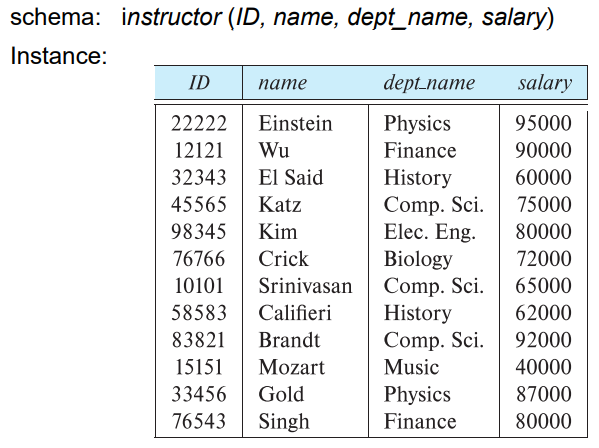
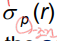
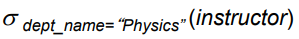
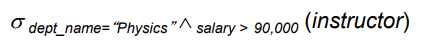
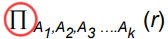
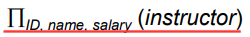
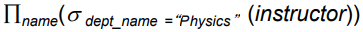
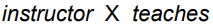
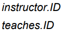

[정리 링크](https://eastroot1590.tistory.com/entry/%EB%8D%B0%EC%9D%B4%ED%84%B0%EB%B2%A0%EC%9D%B4%EC%8A%A4-%EC%9A%A9%EC%96%B4-%ED%8A%9C%ED%94%8CTuple%EA%B3%BC-%EC%96%B4%ED%8A%B8%EB%A6%AC%EB%B7%B0%ED%8A%B8Attribute)
# Relatiopnal Model
현재 가장 많이 쓰이는 모델    
다양한 Table에 데이터가 저장됨.    
Table 모델이라고 해도 과언이 아니다.    

## Relacion Schema and Instance
- Attributes
    - A1, A2, ..., An
- Schema
    - R = (A1, A2, ..., An)
        - Ex) instructor = (ID, name, dept_name, salary)
- Insatance
    - r(R): 스키마 R에 대해 정의된 관계 인스턴스 r
- Tuple
    - 관계 r의 요소 t를 tuple이라 한다.
    - 테이블에서 하나의 행으로 이루어진 데이터 셋을 의미
    - 레코드라고도 한다.
    - Tuple의 순서는 불규칙적이다.

### Attributes
- 인스턴스로 관리하고자 하는 의미상 더 이상 분리되지 않는 최소의 데이터 단위
- domain
    - 각 속성에 대해 들어갈 수 있는 값의 집합
- null
    - 모든 domain의 멤버이다.
    - "unknown"을 가리킨다.

### Database Shcema & Instance
- Schema 
    - 데이터베이스의 논리적 구조
- Instance
    - 어떤 때에 데이터베이스에서 데이터의 snapshot
- example
    - 

## Keys
- super key
    - 각 행을 유일하게 식별할 수 있는 하나 또는 그 이상의 속성들의 집합
        - 유일성만 만족하면 됨
    - 주키를 포함하고 있으면 super key이다.
- candidate key
    - super key K가 최소라면 후보키이다.
    - 모든 릴레이션은 반드시 하나 이상의 후보키를 가져야 한다.
    - 튜플을 유일하게 식별할 수 있는 속성들의 부분집합
- primary key
    - 주키
    - 특정 튜플을 **유일하게 구별할** 수 있는 속성
    - 후보키 중에서 하나를 선택한다.
- foreign key
    - 다른 테이블에 가서 key가 되는 경우
    - 제약 조건
        - 하나의 릴레이션에서 값은 무조건 또다른 (참조하고 있는 / 참조 되어진) 릴레이션에서 나타나야 한다.
        - ex) instructor에서 dept_name은 instructor가 참조하고있는 department에서 외래키이다.

# Relational Query Languages
절차적과 비절차적으로 나뉜다.    
"순수" 언어
- Relational algebra
- Tuple relational calculus
- Domain relational calculus

## Relational Algebra
관계 대수    
하나 또는 두개의 테이블를 입력하여 그 결과를 새로운 테이블을 생성하는 일련의 연산으로 구성된 절차적 언어

#### 6가지의 기본 연산자
- Select: σ
- project: ∏
- union: ∪
- set deifference: −
- Cartesian product: ⅹ
- rename: ρ

### Select Operation
- 해당 조건에 맞는 행을 선택
- Notation: σ_p(r)
    - 
    - p는 선택할 때의 조건절
- Example
    - 
- 조건절 비교연산
    - =, ≠, >, ≥, <, ≤
- 조건절 결합
    - ⋀(and), ⋁(or), ⇁(not)
- Example2
    - 
### Project Operation
- 릴레이션에서 원하는 **열(또는 속성)**을 선택하는데 사용
-  관계 대수에서 Project Operation은 SQL에서 Select Statement와 유사하다.
- Notation: ∏_A1,A2,...Ak(r)
    - 
- Example
    - 

### Composition of Relational Operations
Relational Operations의 결합     
다음과 같이 결합하여 사용이 가능하다.

### Cartesian-Product Operation
- 두 관계로 부터 모든 정보를 결합함
- 두 양쪽 집합의 모든 조합
    - 만일 두 테이블이 각 n, m개의 정보를 가질 때
    - cartesian-product를 수행한 결과 n*m의 정보가 출력
- Notation: ⅹ
- Example
    - 
- 두 관계가 같은 속성을 가질 때 구분하기 위해 관계 이름을 명시한다.
    - 

### Join Operation
- 두 릴레이션에서의 모든 Cartesian-Product 수행결과 나온 tuple들 중 조건을 만족하는 tuple만 출력
- Notation: 𝜎_𝜃(𝑟 × 𝑠) | r ⨝_𝜃 s
    - 
    - 
        - join은 상당히 자주 쓰여서 따로 기호를 만들었다.
    - 
    - 𝜃는 조건절
- Example
    - 
    - 

### Union Operation
- 합집합
    - 두 릴레이션을 집합의 합집합 기능을 수행
- 조건
    1. 두 릴레이션 r, s가 속성의 개수가 같아야 한다.
    2. 두 릴레이션 r, s가 domain이 같아야 한다.
- Notation: ∪
    - 
- Example
    - 
### Set-Intersection Operation
- 교집합
    - 두 릴레이션을 집합의 교집합 기능을 수행
- 조건
    1. 두 릴레이션 r, s가 속성의 개수가 같아야 한다.
    2. 두 릴레이션 r, s가 domain이 같아야 한다.
- Notation: ⋂ 
    - 
- Example
    - 
### Set Difference Operation
- 차집합
    - 두 릴레이션을 집합의 차집합 기능을 수행
- 조건
    1. 두 릴레이션 r, s가 속성의 개수가 같아야 한다.
    2. 두 릴레이션 r, s가 domain이 같아야 한다.
- Notation: −
    - 
- Example
    - 
### The Assignment Operation
- 할당 연산을 통해 임시적인 릴레이션 변수에 관계 대수를 쓸 수 있다.
    - 변수에 할당
- Notation: ←
- Example
    - 
### The Rename Operation
- 이름 변경
- Notation: ρ
    - 
    - 테이블 이름을 x라 하고 속성 이름을 A1,A2,...,An라 한다.
## Equivalent Queries
똑같은 질의     
관계 대수에서 하나 이상의 방법으로 질의를 할 수 있다.
- Example1
    - 
    - 
- Example2
    - 
    - 

위 두 예제는 다른 질의이나 같은 결과를 도출한다.