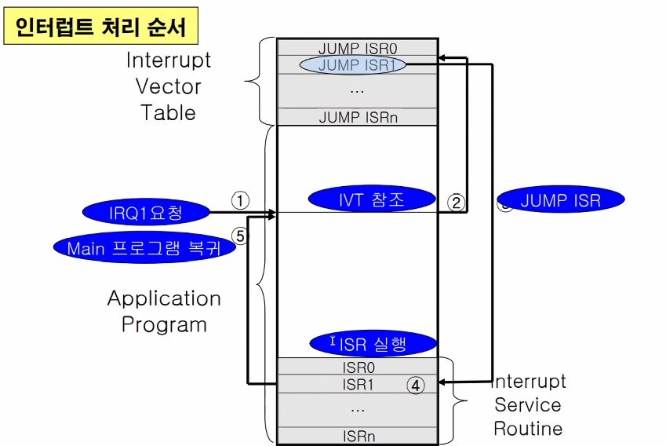
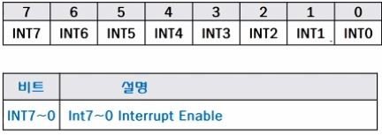
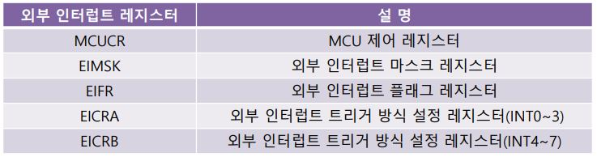
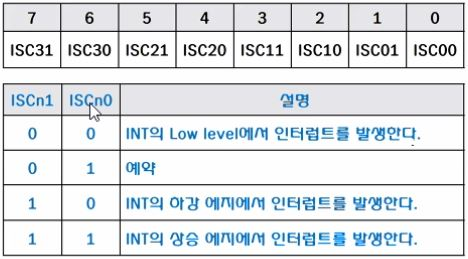
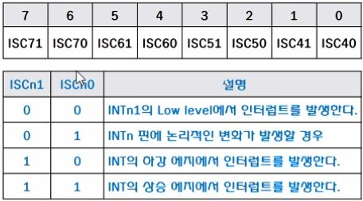

# 중간고사 끝 기말고사 범위

<br>

---
# Polling
- 사용자가 명령어를 사용하여 입력 핀의 값을 계속 읽어서 변화를 알아내는 방식

# Interrupt
- "방해하다", "훼방하다"의 의미
- 어떤 작업을 진행하고 있다가 갑자기 다른 일이 발생하여 먼저 처리해야 하는 상황을 인터럽트 발생이라 한다.
- Interrupt service routine
    - 인터럽트 발생 시 발생한 Interrupt를 확인하고 그 일을 처리 후 원래 하던 일을 진행함
- 발생 시기를 예측할 수 없는 경우에 더 효율적
- ATmega128은 Interrupt의 종류가 35개 존재
- 하던 일을 멈추고 Interrupt를 처리 할 때
    - 다음 수행할 일의 주소는 **Stack에 저장되어 있다.**
- [참고](../OS/Chapter1.md/#interrupt)
- MCU 자체가 하드웨어적으로 그 변화를 체크하여 변화시에만 일정한 동작을 하는 방식

## Interrupt 구성 요소
- 발생원
    - 어디서 발생했는가?
- Priority
    - 2개 이상의 요청에서 어떤 Interrupt를 먼저 처리하는가
- Interrupt Vector
    - Service Routine의 시작 주소

## Interupt 종류
- 발생 원인에 따른 인터럽트 분류
    - 하드웨어 인터럽트
        - 내부 인터럽트: 마이크로 컨트롤러 내부의 기능에 의해 발생
        - 외부 인터럽트: 마이크로 컨트롤러 외부에 부가된 소자에 의해 발생
    - 소프트웨어 인터럽트
- 차단 가능성에 의한 인터럽트 분류
    - 차단(마스크) 불가능(Non maskable, NMI) 인터럽트
        - Reset과 같이 무조건 처리해야 하는 Interrupt
    - 차단(마스크) 가능(Maskable) 인터럽트
        - SREG의 I가 활성되어 있는 상태에서
        - 세부적인 Interrupt들을 처리해도 되고 안해도 됨을 결정할 수 있는 Interrupt
    - Maskable하다는 것은
        - Enable을 시키는 것을 조절가능한 상태
        - 즉 Interrupt의 처리를 해도되고 안해도 되는 상태이다.
- 인터럽트 조사 방식에 따른 분류
    - 조사형 인터럽트(Poleled Interrupt)
    - 벡터형 인터럽트(Vectored Interrupt)
## Interrupt 처리 순서

<br>

# Atmega128 Interrupt
- 모든 Interrupt는 전역 Interrupt Enable bit인 SREG의 I비트와
    - 각각의 개별적인 Interrupt Flag bit가 할당되어 있다.
- Interrupt들과 개개의 Reset vector는 각각 개별적인 프로그램 Vector를 프로그램 메모리 공간 내에 가짐
- 모든 Interrupt들은 개별적인 Interrupt 허용 비트를 할당 받는다.

## 종류
- 차단 가능한 외부 Interrupt
- 리셋 포함 총 35개의 Interrupt vector를 가짐
    - Reset 1개
    - 외부 핀을 통한 외부 Interrupt 8개
    - 타이머 관련 14개
        - 타이머 0(2개), 타이머 1(5개), 타이머 2(2개), 타이머 3(5개)
    - UART 관련 6개
        - USART0(3개), USART1(3RO)
    - 기타 6개
## SREG
상태 레지스터(Status REGister): ALU의 연산 후 상태와 결과를 표시하는 레지스터 [SREG 참고](#avr-cpu)

## EIMSK
인터럽트 마스크 레지스터(External Interrupt MaSK register)
- 외부 인터럽트의 개별적인 허용 제어 레지스터
- INTn이 1로 set되면 외부 Interrupt Enable이 된다.
- bit
    - 

## ATMega 128 Interrupt Priority
- 프로그램 메모리 공간에서 최하위 주소는 Reset과 Interrupt vector로 정의되어 있음
- 리스트는 서로 다른 Interrupt들의 우선순위를 결정한다.
- 최하위 주소에 있는 벡터는 최상위 주소에 있는 벡터에 비해 우선순위가 높다.
    - RESET: 최우선 순위
    - INT0: 2순위

## 외부 Interrupt Trigger

- Interrupt 발생의 유무를 판단하는 근거
- 방법
    - Edge Trigger
        - 입력 신호가 변경되는 순간을 Interrupt Trigger로 사용함
        - 2가지의 Trigger가 존재
            - 하강 에지 트리거(Falling Edge)
                - 1 -> 0
            - 상승 에지 트리거(Rising Edge)
                - 0 -> 1
    - Level Trigger
        - 입력 신호가 일정 시간동안 원하는 Level을 유지하면 Trigger로 작용됨
        - 0에서 Trigger로 작용함

### Trigger 설정
- [EIMSK](#eimsk)(External Interrupt MaSK register)
    - 두꺼비집 같은 존재
    - SREG Global Interrupt bit가 1로 set되어야만 사용 가능
- EICRA(External Interrupt Control Regitser A)
    - 외부 Interrupt 0~3의 Trigger 설정에 사용
    - 
- EICRB(External Interrupt Control Regitser B)
    - 외부 Interrupt 4~7의 Trigger 설정에 사용
    - 
- EIFR(Interrupt Flag Register)
    - 외부 Interrupt 발생 여부를 알려주는 Register
    - 외부 Interrupt가 Edge Trigger에 의해 요청된 경우 허용여부에 상관 없이 1로 set

## ISR의 작성
- 인터럽트의 서비스는 벡터 주소라는 교유 번지에서 시작
- 인터럽트 벡터에는 인터럽트 기능을 서비스 하기 위한 프로그램이 위치해 있어야 함
- 인터럽트 서비스 루틴이 호출되기 위해서는 C 언어에서 인터럽트 서비스 루틴이 올바르게 선언되어 있어야 한다.
- Interrupt service routine 선언
    - SIGNAL(인터럽트 명)
    - Example
        - External Interrupt
            - `SIGNAL(INT0_vect)` / `SIGNAL(INT2_vect)`
        - Timer Interrupt
            - `SIGNAL(TIMER2_OVF_vect)`
- Interrupt를 사용하기 위해서는 SREG의 Ibit 즉, 7번 bit를 1로 set해야 한다.
    - OR 연산을 통해서
        - SREG |= 0x80
    - 어셈블리 명령어를 통해서
        - `#asm("sei");`: 전체 인터럽트 허가
        - `#asm("cli");`: 전체 인터럽트 금지

### ISR 초기화 과정
1. EIMSK 레지스터의 비트 설정을 통한 사용하고자 하는 인터럽트의 허가
2. EICRA 레지스터의 비트 설정을 통한 인터럽트 트리거 방식 설정
3. SREG의 I 비트의 설정을 통한 전체 인터럽트를 허가
- Example
    ```c
    void Interrupt_init(void)
    {
        EIMSK = 0x01; // INT0 비트 설정(외부 인터럽트0 허가) 
        EICRA = 0x02; // ISC01 =1, ISC00=1(외부인터럽트 0 하강에지 비동기 트리거)
        sei(); // 전체 인터럽트 허가
    } 
    ```

---

# LCD
## LCD 모듈 구조
- 종류
    - 문자 표시용
        - 영문이나 숫자 + 특수 문자
    - 그래픽 표시용
        - 한글 등의 구현
- LCD는 자체 컨트롤러가 있다.
- 주요 pin 3개
    - RS pin
        - IR로 보낼지 DR로 보낼지 결정하는 pin
    - RW pin
        - Read를 할지 Write를 할지 결정하는 pin
    - Enable pin
        - 이 장치를 사용할지 안할지를 결정하는 pin
- Data pin 8bit
- 따라서 11개의 pin이 연결된다.


### LCD 컨트롤러 기능 (HD44780)
- Register 2개
    - Instruction Register
        - Display 명령어를 모두 처리함
        - 표시데이터 RAM(DDRAM)의 위치 주소와 문자 발생기 RAM(CGRAM)의 위치를 지정하기 위한 주소 정보를 저장. 
    - Data Register
        - 실제 데이터를 가지고 있는 레지스터
        - DR 레지스터에 데이터를 쓰면 LCD의 내부적인 동작에 의해서 IR에 의해 지정된 DDRAM 또는 CGRAM의 주소로 전
        - DR 레지스터의 데이터를 읽으면, IR에 의해 지정된 DDRAM 또는 CGRAM의 주소 데이터가 마이크로컨트롤러로 전달. 
- Memory 3개
    - DDRAM
    - CGRAM
    - CGROM
- Register select
    - 
- Busy Flag(BF)
    - 연속적으로 LCD 모듈에 제어명령이 입력될 때 LCD모듈이 이 명령을 처리할 수 있는가를 나타내는 상태 표시 플래그
    - BF = 0
        - 이때, 다음 명령어를 실행할 수 있음
- 주소 카운터
    - 지정된 Character들이 각각의 주소를 가지고 있고 이를 지정함
- 표시데이터 RAM
    - DDRAM의 주소와 LCD 표시장치와의 관계
        - 
- 문자 발생기
    - ROM(CGROM)
        - 8bit 문바 패턴을 저장하고 있는 메모리
    - RAM
        - 사용자가 프로그램에 의해서 원하는 문자 패턴을 만들고자 할 때 사용하는 RAM영역

## LCD 컨트롤러의 명령


---

# 타이머와 카운터
- 정확한 시간의 측정이 필요
- 임베디드 시스템에서 시간측정의 일을 담당
- 정확한 시간 측정이 가능
    - 일정 개수만큼의 클럭을 세어 시간을 측정
- MCU 효율 극대화
    - 타이머를 설정하여 미리 레지스터 설정
    - 다른 작업 병행하면서 설정 조건에 인터럽트 발생하게 함
## 기능
- Pulse를 Count 함으로써 Timer의 역할을 한다.
- Pulse Width Modulation(PWM: 진폭 변조) 출력 기능을 한다.
    - 같은 주기 동안 High의 길이에 따라 출력의 power가 달라진다.
    - 같은 주기를 가졌다고 하더라도 High/Low가 유지되는 시간은 다를 수 있다.

 ## 클럭과 카운터
 - 클럭
    - 시계
    - 1개의 주기를 1 클럭으로 읽음
    - 주어진 일을 순서대로 정확한 시간에 처리하기 위해 사용
- 카운터
    - 클럭을 세는 장치

## ATMega128 타이머/카운터
- 개념
    - 타이머 
        - MCU 내부 클럭을 세는 장치
        - 동기모드
        - 타이머는 MCU의 내부클럭을 세어 일정시간 간격의 펄스를 만들어 내거나 일정시간 경과 후에 인터럽트를 발생
    - 카운터 
        - MCU의 외부에서 입력되는 클럭을 세는 장치
        - 비동기모드
        - 카운터는 외부 핀(TOSC1, TOSC2, T1, T2, T3)을 통해서 들어오는 펄스를 계수(Edge Detector)하여 Event Counter로서 동작

- Atmega128에는 4개의 Timer counter가 있다.
    - Timer 0
        - 8bit
    - Timer 1
        - 16bit
    - Timer 2
        - 8bit
    - Timer 3
        - 16bit
- 기능
    - 인터럽트 기능
        - 오버플로우 인터럽트 : 카운터의 값이 오버플로우되는 경우 발생
            - [다음을 참고](#레지스터)
        - 출력비교 인터럽트 : 카운터 값이 출력비교 레지스터의 값과 같게 되는 순간에 발생
        - 입력 캡쳐 인터럽트 : 외부로부터의 트리거 신호에 의해서 카운터의 초기값을 입력캡쳐
    - PWM 출력 기능

## 8비트 타이머/카운터

### 특징
- 4개의 타이머/카운터 중 0번과 2번 타이머/카운터
- PWM 및 비동기 동작 모드를 갖는 8비트 업/다운(Up/Down) 카운터
- 8비트 카운터 : 28 = 256, 즉 0~255까지 셀 수 있음
- 10비트의 프리스케일러(prescaler) 보유
- 각종 인터럽트 기능
    - 오버플로우 인터럽트(overflow interrupt)
    - 출력비교 인터럽트(output compare match interrupt)
- PWM 기능 제공
- 공식
    - 
### 레지스터
- 카운터의 기본값은 0~255까지이다.
    - 하지만 다음을 통해서 언제부터 언제까지 카운트할지 결정할 수 있다.
- 타이머/카운터 제어 레지스터(TCCRn)
    - Normal mode로 할지 출력비교로 할지를 결정하는 레지스터
- 타이머/카운터 레지스터(TCNTn)
    - Normal mode count에 사용
    - 범위
        - [n, 255]
- 출력 비교 레지스터(OCRn)
    - 범위
        - [0, n]

### 프리스케일러(Prescaler)
-  클럭을 분주하여 더 느린 타이머 클럭을 만듦.
    - MHz 클럭을 사용하는 경우 그 클럭의 주기는 250ns
    - 이 클럭으로 256까지 센다고 해도 64us 이하를 세는 카운터 밖에는 만들 수가 없음.
- 10비트, 프리스케일러 보유(최대 2^10 = 1024배 가능)

## counter mode
- Normal mode
    - TCNT 카운터를 사용
        - 최대 255까지 up count를 한다.
        - n ~ 255
        - max 위치에서 overflow interrupt 발생시킨다.
    - TCCRn 레지스터의 WGMn1:n0 를 00으로 설정해야 Normal mode로 사용이 가능함
- CTC mode
    - OCRn 카운터 사용
        - 0 ~ n
    - compare 기능 수행
        - OCRn와 TCNT의 값을 비교한다.
        - 만일 같다면 interrupt 발생시킨다.
    - OCn 단자를 이용하여 출력파형 발생 가능함
        - TCCRn 레지스터의 COMn1 ~ n0를 01로 설정해야 함
- Fast PWM mode
    - 0에서 255까지 세는 동안 두 번의 인터럽트 발생 가능
    - 카운터는 업 카운터로서만 동작
        - TCNT 값이 증가하여, OCR 값과 일치하면 출력 비교 인터럽트 발생
        - MAX 에서 overflow interrupt 발생
        - OCRN 값을 바꾸면 그 다음 카운터 주기를 원하는 대로 변경 가능
    - 
- PCPWM mode(Phase Correct Pulse Width Modulation)
    - Fast PWM mode와 유사함
    - Up count와 Down count가 번갈아 일어난다.
    - PWM 주기를 변경하기위해 OCRn 레지스터에 새로운 값을 기록하더라도 TCNT가 255를 찍고 난 후에 변경된다.

---

# 타이머와 PWM
## PWM(펄스폭변조)
- 펄스 폭을 전송하고자 하는 신호에 따라 변화시키는 변조 방식
- 모터 제어나 전압제어 등 많이 사용함
