# Internal Organization of computers
- CPU
    - Register
- Memory
- I/O

## Von Neumann vs. Harvard architecture
Von Neumann 
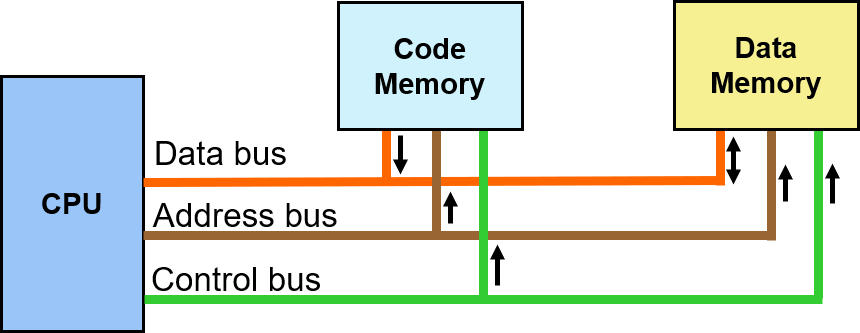
- 데이터와 코드 부분이 공유하는 bus를 사용

Harvard architecture
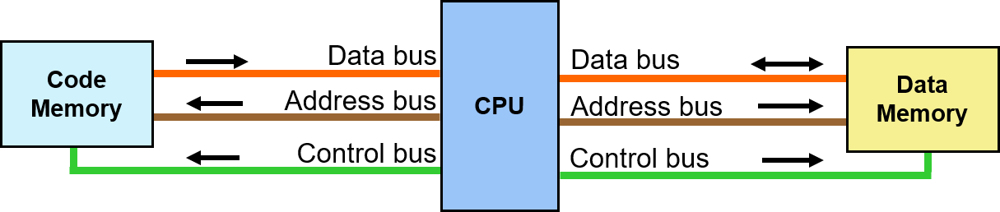
- 데이터와 코드 부분이 분리되어 bus가 나누어져 있음
- AVR이 사용하고 있는 Architecture

# CPU
Task
- 명령어 수행
    - 명령어는 메모리에 존재
    - 메모리에서 명령어를 읽고 디코더에서 디코드 수행 후 명령어 수행
## Memory pin out
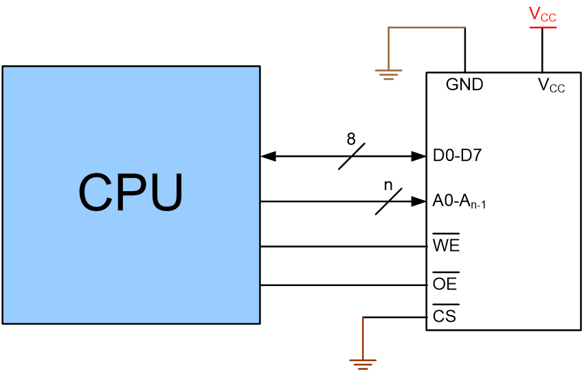

메모리 중 가장 간단한 것     
구성 요소
- D0~D7: Data bus
    - / : bus임을 표시함
- A0~An-1: Address bus
- Vcc
    - 전원
- GND
- WE
    - 쓰는 것에 대한 것
- OE
    - 읽은 것에 대한 것
- CS: chip select
    - 메모리를 선택

## Connecting I/Os to CPU
만일 CPU가 모든 장치에 대해 직접 연결을 한다고 하면 상당히 많은 핀이 필요할 것이다.    
따라서, 전체 장치들이 bus를 공유하는 방식으로 사용한다.

### 첫 번째 방법: Peripheral I/O
모든 주소 공간을 공유하되 IO/MEM, CS를 통해 메모리주소와 IO주소를 구분해서 받는다.


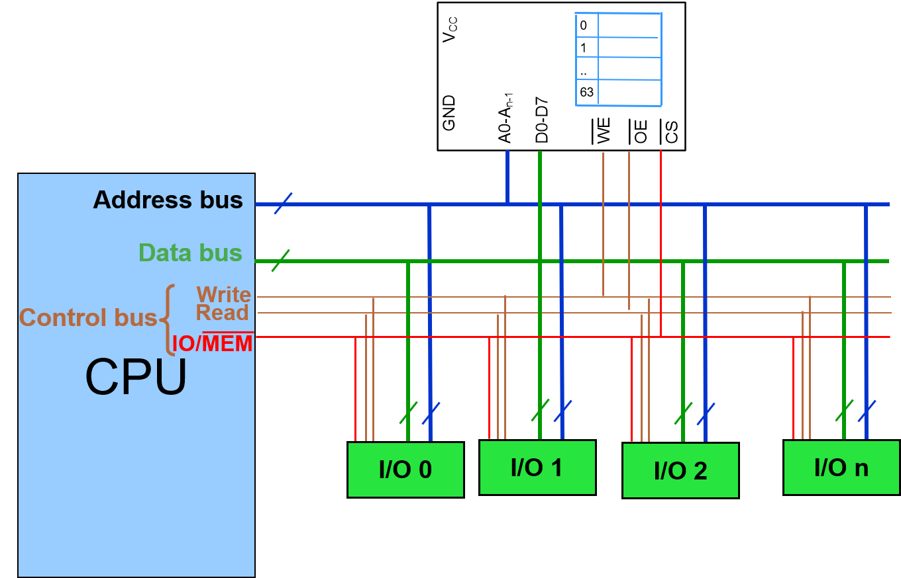

구성 요소
- Address bus
- Data bus
- Control bus
    - Write
    - Read
    - IO/-(MEM)
        - 이 회선이 high 일 때 IO장치 데이터를 받아온다.
        - 이 회선이 low 일 때 Memory의 CS가 Active가 되어 Memory의 데이터를 받는다.

### 두 번째 방법: Memory Mapped I/O
메모리와 분리된 주소 체계를 사용한다.    
예를 들어 메모리를 0~15번의 주소를 사용하게 하고 나머지 16번부터 IO장치에게 할당을 한다.

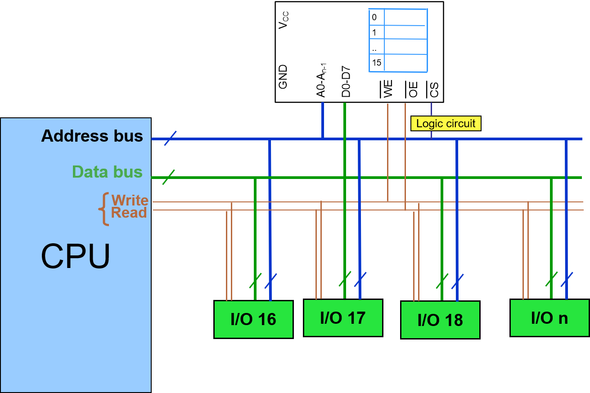

구성 요소
- Address bus
- Data bus
- Control bus
    - Write
    - Read

이 방식을 사용하기 위해서는 0 ~ 15번지의 주소를 사용하면서 메모리를 사용함을 알리기 위해 CS에 Active Low를 흘려보내 주어야 한다.    
이를 위해 Logic Circuit을 처리해 줄 필요가 있다.    
<br>

solution
1. 사용할 주소의 범위 binary를 쓴다.
2. 사용할 주소의 범위에서 항상 같은 값 위치만 찾는다.
    - 위의 경우 00 ~ 0F까지 이므로 항상 같은 값 위치는 앞에서 4자리 이다.
3. 항상 같은 값 위치들만 NAND Gate로 연결한다.
    - 위의 경우 0만 존재하므로 a7~a4를 nand로 Bubble을 끼워 Active Low로 연결한다.

## Inside the CPU
구성 요소
- PC: Program Counter
    - 읽어와야 할 메모리 주소를 가지고 있음
- [Instruction decoder](#instruction-decoder)
- ALU: Arithmetic Logic Unit
- Register

과정
- 명령어를 수행하기 위해 명령어를 가지고 있는 주소를 저장하고 있는 PC가 준비됨
0. PC의 메모리 주소가 Address bus를 통해 메모리 주소로 접근
    - 그 후 일반적인 경우 PC가 다음의 주소를 가리키기 위해 1 증가
    - branch가 존재할 경우 그 이상 증가도 가능함
1. CPU는 Read신호를 보냄
2. 메모리의 CS가 Active가 되어 Data인 명령어를 보냄
3. 명령어가 Instruction decoder에 안착됨
    - 그 명령어를 해석함
4. 명령어를 수행함

## Instruction Decoder
명령어를 해석해준다.

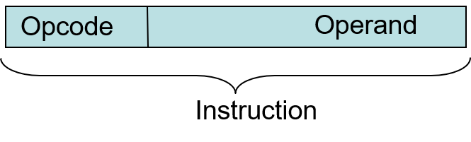

Instruction
- Opcode
    - 명령어를 의미함
- Operand
    - 데이터들을 담고 있음
- Example: ADD
    - 16bit Opcode
        - 0000 11rd dddd rrrr
    - D의 값과 R의 값을 더해서 D에다 저장


---

# General Purpose Microprocessors vs. Microcontrollers
- General Purpose Microprocessors
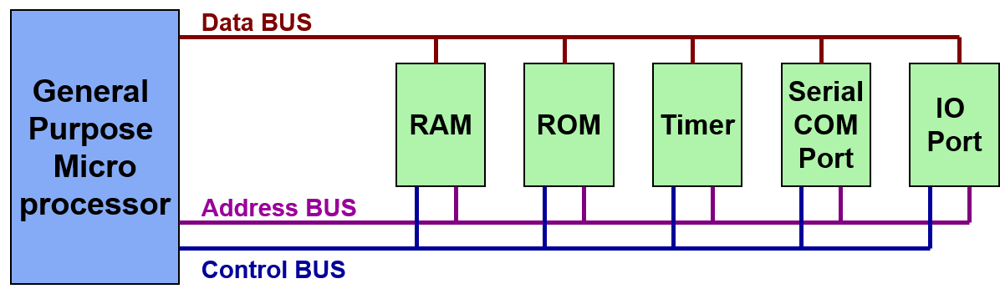
- 이는 bus를 통해 ram rom 등이 연결되어있다.
- 따로 Component들을 연결할 필요가 있다.
- 장점
    - 확장성/이식성이 좋다.


- Microcontrollers
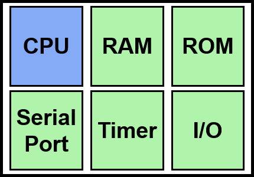
- 이는 하나의 칩에 CPU RAM ROM 등 필요한 내용이 집적되어 있다.
- 따로 연결할 필요없이 바로 사용이 가능하다.
- Microcontrollers를 선정하는 방법은 자신이 하고자 하는 Application이 무엇인가에 달려있다.

- 장점
    - 하나에 집적되어 있으므로 작게 만들 수 있다.
- 단점
    - 이식성이 좋지 않다.

## Microcontrollers 종류
- 8-bit microcontrollers
    - AVR
    - PIC
    - HCS12
    - 8051
- 32-bit microcontrollers
    - ARM
    - PIC32

## AVR 이름에 따른 의미
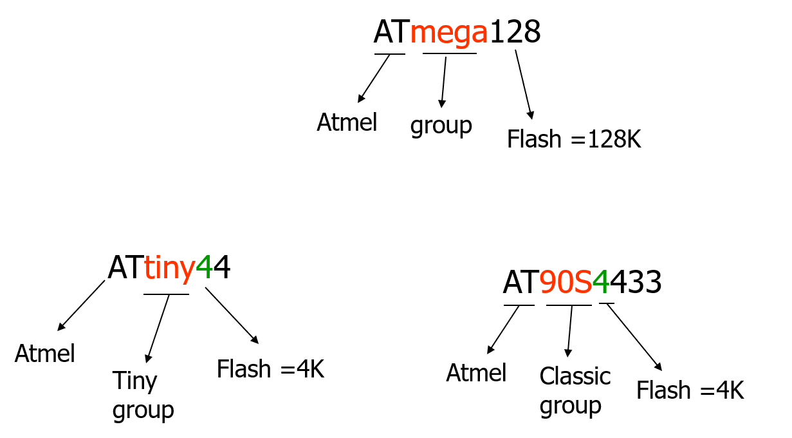

---

# AVR CPU
구성 요소
- ALU
- 32 General Purpose registers (R0 to R31)
- PC register
- Instruction decoder
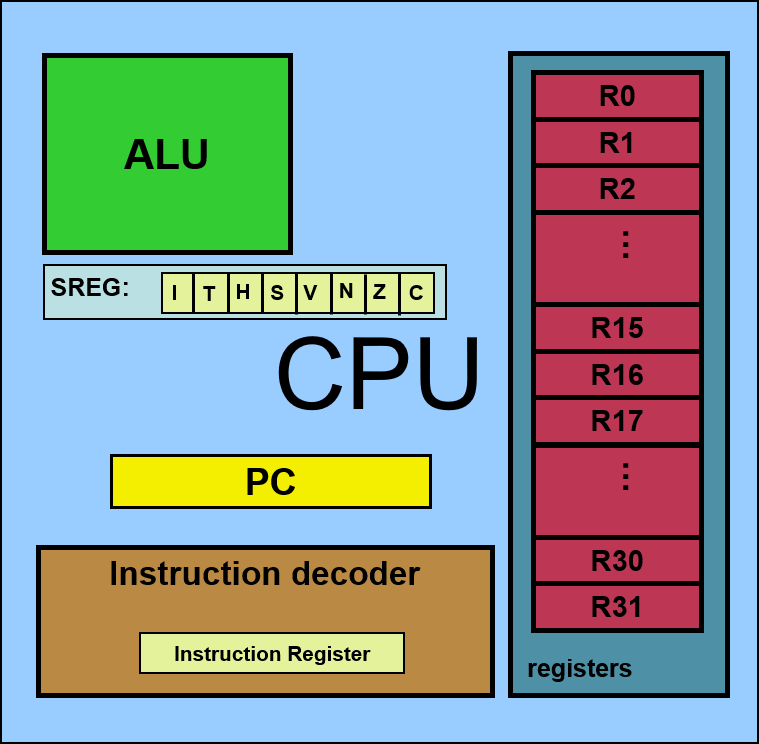

- SREG: Status Register
    - CPU상태를 가지는 레지스터
    - ITHSVNZC
        - I: Interrupt
        - T: Temporary
        - H: Half Carry
        - S: Sign
        - V: oVerflow
        - N: Negative
        - Z: Zero
        - C: Carry

# Assembler Project
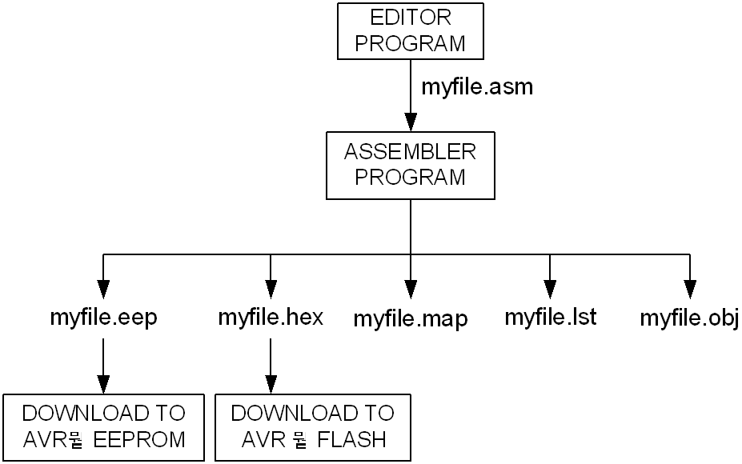
1. Editor Program
    - myfile.asm
    - 여기선 atmel
2. Assembler Program
    1. myfile.eep
    2. myfile.hex
        - Flash 메모리 영역에 다운할 수 있는 프로그램
    3. myfile.map
        - 메모리 주소를 저장함
    4. myfile.lst
    5. myfile.ojb

# How to speed up the CPU
- Clock 빈도수 향상
    - Clock이 빠르다?
        - 같은 시간에 처리하는 속도를 증가시킬 수 있음
    - 하지만 전류와 열이 많이 소모됨
- Architecture 바꾸기
    - Pipelining
        - fetch와 execute를 동시에 실행한다.
            - fetch에 들어온 일을 execute로 올리면서 밀린 일들을 fetch에 동시에 올림
    - RISC(Reduced Instruction Set Computer)
        - 제한된 명령어들을 가지고 있는 구조로 만드는 것
        - 장점
            - 명령어가 작고 구조가 단순하기에 일을 처리하는데 시간이 매우 짧다.

## RISC VS. CISC
HW를 제작할 때 RISC, CISC 둘 중 하나로 사용함   
하지만 Embedded system 에서는 RISC를 사용함

## RISC Architecture
- fixed instruction size
    - 명령어 크기가 고정되어 있다.
    - 따라서, 디코딩이 쉽고 HW설계도 쉬움
- 명령어 수가 적다.
    - 제한된 명령어로 원하는 명령어를 제작해서 사용해야 하는 단점이 존재
    - 어쩔 수 없이 메모리를 많이 사용하게 된다.
- 주소 지정에 제한이 있음
    - HW가 단순해지다 보니 주소도 제한적임
- Load/Store기능
- Harvard architecture
    - Opcode와 Operand의 bus를 분리시킨 구조이다.
    - 이를 통해 속도를 향상시킴
- 명령어 처리 될 때 대부분 1 machine cycle을 기준으로 처리된다.
- 32개의 Register 존재
    - Stack과 Memory사용을 줄일 수 있음

---

# Jump
## jump 주소 지정 방식
PC에 다음 위치로 움직이기 위한 방식
- PC = operand
    - non conditional jmp
        - JMP
- PC = PC + operand
    - Relative jump
        - RJMP
    - 현재 PC내용과 Operand값을 더해서 다음 주소지로 이동
- PC = Z register
    - Indirect jump
        - IJMP

# Stack & Call

## Stack
stack 예제
```asm
.INCLUDE "M128DEF.INC"
	.ORG	0
	;initialize the SP to point to the last location of RAM (RAMEND)
	LDI	R16, HIGH(RAMEND)	;load SPH
	OUT	SPH, R16
	LDI	R16, LOW(RAMEND)	;load SPL
	OUT	SPL, R16

	LDI	R31, 0
	LDI	R20, 0x21
	LDI	R22, 0x66
	PUSH	R20
	PUSH	R22

	LDI	R20, 0
	LDI	R22, 0

	POP	R22
	POP	R31
```

- 스택을 사용하기 위해서, 스택 포인터는 SRAM에 주소로 초기화 되어야 한다.
- 스택 포인터가 I/O 메모리에 있기 때문에 값들은 OUT 지시로 통해 로드될 수 있다.
- RAMEND는 SRAM의 마지막 주소를 가리키는 상수이다. 하지만 RAMEND는 16비트 주소이므로 8비트, HIGH and LOW 함수로 쪼개서 레지스터에 저장할 수 있다.

## Call
1. Call을 하게 되면 다음 실행할 주소를 Stack에 저장하고 함수로 이동하게 된다.
2. 다음 실행할 주소는 하위 8bit 먼저 Stack에 저장되고, 그 후 상위 8bit가 Stack에 저장된다.
3. 함수에서의 작업이 끝나고 (RET) Stack에서 다음 실행할 주소를 PC에 다시 올리면서 다음 작업을 수행한다.

Call 예제
```asm
    LDI R16,HIGH(RAMEND)
    OUT SPH,R16
    LDI R16,LOW(RAMEND)
    OUT SPL,R16        
    LDI R20,15
    LDI R21,5
    CALL FUNC_NAME
    INC  R20
L1:     
    RJMP  L1

FUNC_NAME:
    ADD  R20,R21
    SUBI  R20,3
    RET

```

# Time delay
명령어를 수행할 때 걸리는 delay 시간이다.     
- 단위는 1 machine cycle로 계산한다.
- 각 기계마다 시간이 주어지고 그 시간과 machine cycle의 곱을 통해 시간을 구할 수 있다.

---

# ATmega
- DDRx
    - 입력 또는 출력을 결정함
    - 0xff, 즉 1일 경우 출력 기능을 수행
    - 0x00, 즉 0일 경우 입력 기능을 수행
- PORTx
    - 출력을 수행함
- PINx
    - 입력을 수행함


--- 

<br>

# 중간고사 끝 기말고사 범위

<br>

---
# Polling
- 사용자가 명령어를 사용하여 입력 핀의 값을 계속 읽어서 변화를 알아내는 방식

# Interrupt
- "방해하다", "훼방하다"의 의미
- 어떤 작업을 진행하고 있다가 갑자기 다른 일이 발생하여 먼저 처리해야 하는 상황을 인터럽트 발생이라 한다.
- Interrupt service routine
    - 인터럽트 발생 시 발생한 Interrupt를 확인하고 그 일을 처리 후 원래 하던 일을 진행함
- 발생 시기를 예측할 수 없는 경우에 더 효율적
- ATmega128은 Interrupt의 종류가 35개 존재
- 하던 일을 멈추고 Interrupt를 처리 할 때
    - 다음 수행할 일의 주소는 **Stack에 저장되어 있다.**
- [참고](../OS/Chapter1.md/#interrupt)
- MCU 자체가 하드웨어적으로 그 변화를 체크하여 변화시에만 일정한 동작을 하는 방식

## Interrupt 구성 요소
- 발생원
    - 어디서 발생했는가?
- Priority
    - 2개 이상의 요청에서 어떤 Interrupt를 먼저 처리하는가
- Interrupt Vector
    - Service Routine의 시작 주소

## Interupt 종류
- 발생 원인에 따른 인터럽트 분류
    - 하드웨어 인터럽트
        - 내부 인터럽트: 마이크로 컨트롤러 내부의 기능에 의해 발생
        - 외부 인터럽트: 마이크로 컨트롤러 외부에 부가된 소자에 의해 발생
    - 소프트웨어 인터럽트
- 차단 가능성에 의한 인터럽트 분류
    - 차단(마스크) 불가능(Non maskable, NMI) 인터럽트
        - Reset과 같이 무조건 처리해야 하는 Interrupt
    - 차단(마스크) 가능(Maskable) 인터럽트
        - SREG의 I가 활성되어 있는 상태에서
        - 세부적인 Interrupt들을 처리해도 되고 안해도 됨을 결정할 수 있는 Interrupt
    - Maskable하다는 것은
        - Enable을 시키는 것을 조절가능한 상태
        - 즉 Interrupt의 처리를 해도되고 안해도 되는 상태이다.
- 인터럽트 조사 방식에 따른 분류
    - 조사형 인터럽트(Poleled Interrupt)
    - 벡터형 인터럽트(Vectored Interrupt)
## Interrupt 처리 순서
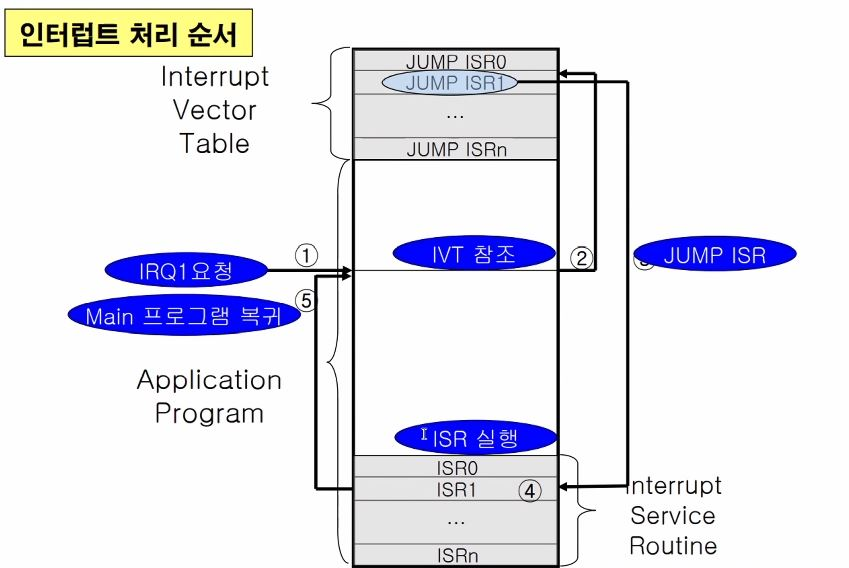
<br>

# Atmega128 Interrupt
- 모든 Interrupt는 전역 Interrupt Enable bit인 SREG의 I비트와
    - 각각의 개별적인 Interrupt Flag bit가 할당되어 있다.
- Interrupt들과 개개의 Reset vector는 각각 개별적인 프로그램 Vector를 프로그램 메모리 공간 내에 가짐
- 모든 Interrupt들은 개별적인 Interrupt 허용 비트를 할당 받는다.

## 종류
- 차단 가능한 외부 Interrupt
- 리셋 포함 총 35개의 Interrupt vector를 가짐
    - Reset 1개
    - 외부 핀을 통한 외부 Interrupt 8개
    - 타이머 관련 14개
        - 타이머 0(2개), 타이머 1(5개), 타이머 2(2개), 타이머 3(5개)
    - UART 관련 6개
        - USART0(3개), USART1(3RO)
    - 기타 6개
## SREG
상태 레지스터(Status REGister): ALU의 연산 후 상태와 결과를 표시하는 레지스터 [SREG 참고](#avr-cpu)

## EIMSK
인터럽트 마스크 레지스터(External Interrupt MaSK register)
- 외부 인터럽트의 개별적인 허용 제어 레지스터
- INTn이 1로 set되면 외부 Interrupt Enable이 된다.
- bit
    - 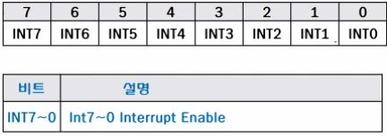

## ATMega 128 Interrupt Priority
- 프로그램 메모리 공간에서 최하위 주소는 Reset과 Interrupt vector로 정의되어 있음
- 리스트는 서로 다른 Interrupt들의 우선순위를 결정한다.
- 최하위 주소에 있는 벡터는 최상위 주소에 있는 벡터에 비해 우선순위가 높다.
    - RESET: 최우선 순위
    - INT0: 2순위

## 외부 Interrupt Trigger
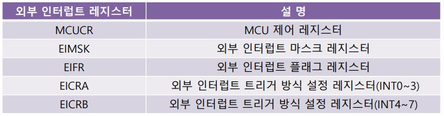
- Interrupt 발생의 유무를 판단하는 근거
- 방법
    - Edge Trigger
        - 입력 신호가 변경되는 순간을 Interrupt Trigger로 사용함
        - 2가지의 Trigger가 존재
            - 하강 에지 트리거(Falling Edge)
                - 1 -> 0
            - 상승 에지 트리거(Rising Edge)
                - 0 -> 1
    - Level Trigger
        - 입력 신호가 일정 시간동안 원하는 Level을 유지하면 Trigger로 작용됨
        - 0에서 Trigger로 작용함

### Trigger 설정
- [EIMSK](#eimsk)(External Interrupt MaSK register)
    - 두꺼비집 같은 존재
    - SREG Global Interrupt bit가 1로 set되어야만 사용 가능
- EICRA(External Interrupt Control Regitser A)
    - 외부 Interrupt 0~3의 Trigger 설정에 사용
    - 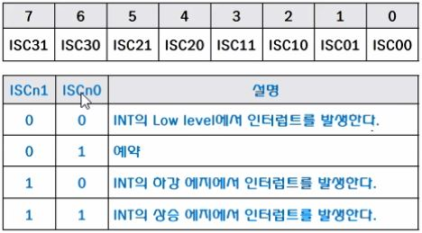
- EICRB(External Interrupt Control Regitser B)
    - 외부 Interrupt 4~7의 Trigger 설정에 사용
    - 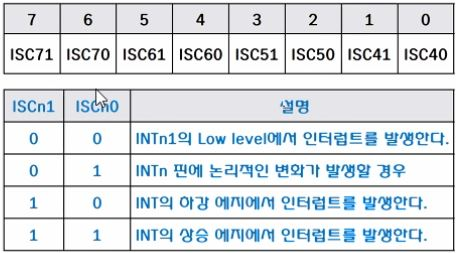
- EIFR(Interrupt Flag Register)
    - 외부 Interrupt 발생 여부를 알려주는 Register
    - 외부 Interrupt가 Edge Trigger에 의해 요청된 경우 허용여부에 상관 없이 1로 set

## ISR의 작성
- 인터럽트의 서비스는 벡터 주소라는 교유 번지에서 시작
- 인터럽트 벡터에는 인터럽트 기능을 서비스 하기 위한 프로그램이 위치해 있어야 함
- 인터럽트 서비스 루틴이 호출되기 위해서는 C 언어에서 인터럽트 서비스 루틴이 올바르게 선언되어 있어야 한다.
- Interrupt service routine 선언
    - SIGNAL(인터럽트 명)
    - Example
        - External Interrupt
            - `SIGNAL(INT0_vect)` / `SIGNAL(INT2_vect)`
        - Timer Interrupt
            - `SIGNAL(TIMER2_OVF_vect)`
- Interrupt를 사용하기 위해서는 SREG의 Ibit 즉, 7번 bit를 1로 set해야 한다.
    - OR 연산을 통해서
        - SREG |= 0x80
    - 어셈블리 명령어를 통해서
        - `#asm("sei");`: 전체 인터럽트 허가
        - `#asm("cli");`: 전체 인터럽트 금지

### ISR 초기화 과정
1. EIMSK 레지스터의 비트 설정을 통한 사용하고자 하는 인터럽트의 허가
2. EICRA 레지스터의 비트 설정을 통한 인터럽트 트리거 방식 설정
3. SREG의 I 비트의 설정을 통한 전체 인터럽트를 허가
- Example
    ```c
    void Interrupt_init(void)
    {
        EIMSK = 0x01; // INT0 비트 설정(외부 인터럽트0 허가) 
        EICRA = 0x02; // ISC01 =1, ISC00=1(외부인터럽트 0 하강에지 비동기 트리거)
        sei(); // 전체 인터럽트 허가
    } 
    ```