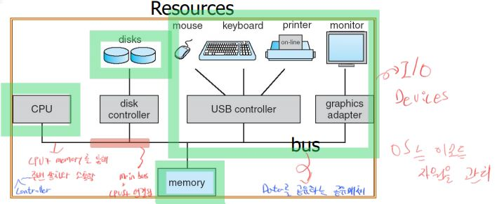
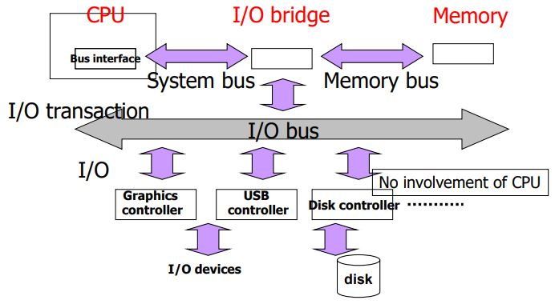
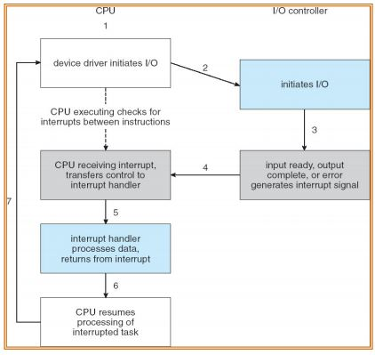
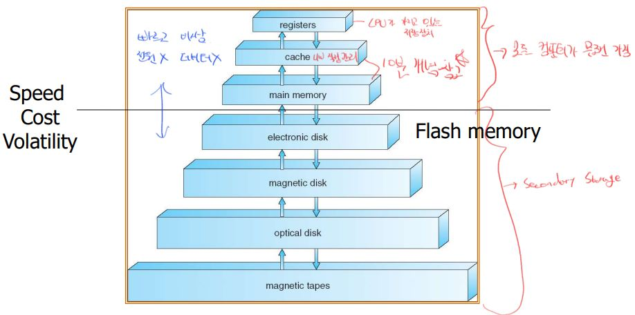
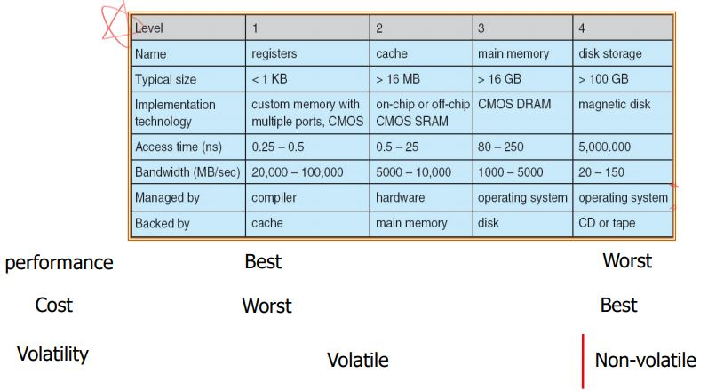

# Operating System definitions
Operating System은 Software이다.    
1. Computer Hardware를 관리해주는 프로그램이다.
2. 다른 여러 프로그램들을 실행할 수 있도록 조정해주는 프로그램이다.

## The General Roles of the OS
- Hardware management 
    - Access to I/O devices
    - Access to files
    - Accounting
    - Error detection
- Program execution
    - Scheduling
    - Error reporting

## Computer System Structure
- Hardware – provides basic computing resources
    - CPU, memory, I/O devices
- Users
    - People, machines, other computers
- Operating system
    - Hardware 리소스들을 잘 정리해서 Application Program이 잘 수행될 수 있도록 도와주는 것
- Application programs
    - HW와 OS이 제공해주는 여러 서비스들을 이용해서 실제 User가 필요한 목적을 제공해 줌
    - Word processors, compilers, web browsers, database systems, video games

### OS는 어디에 위치하는가?
Application Programs와 Computer HW사이에 위치한다.

## Objectives of the Operating Systems
1. User가 Application Program을 더 쉽게 만들수 있게 한다.
2. Computer System을 사용하기 쉽게 만들어야 한다.
3. Computer HW를 효율적인 방식으로 사용하게 해야 한다.

이 목표는 상황에 따라 중요도가 달라진다.

## Computer Systems organization
OS는 Resource Manager이다.    
Computer System을 관리하는 것이므로 이를 간단히 보면,
- Personal computers
- Large-scale Systems
- Hand-hedl Systems
- etc..

# Computer Structure

많은 컴퓨터들은 기본적인 구조를 가진다.    
- Memory
    - 들어가는 종류는 Data, SW가 올라간다.
- CPU
    - Memory에 올라가 있는 데이터들을 실행시킨다.
    - 사실상 cpu와 memory만 있어도 컴퓨터라고 할 수 있다.
- Disk
- I/O Device

 

OS는 위 자원들을 관리한다.
- 모든 리소스들은 Memory를 통해 소통을 한다.
- CPU와 디바이스들은 Memory Cycle를 기반으로 동작하게 된다.
    - CPU의 동작속도는 메모리보다 훨씬 빠른 속도로 동작한다.
        - 따라서, CPU의 memory cycle을 2^n배로 증폭하여 사용한다.
    - 다른 리소스들은 메모리보다 속도가 느리다. 
        - 이를 위해 Resouces는 Buffer를 통해 메모리 속도를 맞춘다.
- CPU가 메모리와 일을 하고 있더라도 다른 Resource들은 기다릴 필요가 없다.
    - 자신의 Controller와 소통하면 되기 때문이다. 
- BUS
    - Data를 공유하는 공유 매체이다.
    - 이 회로를 통해 memory와 데이터를 교환한다.
    - CPU와 Memory로 연결된 BUS는 Main BUS이다.

# Four Basic Principles
OS의 핵심 역할
1. Computer System I/O operation
2. I/O structure
3. Interrupt
    - 상당히 빠른 CPU와 상대적으로 느린 기기들과 어떤 시점에 데이터를 교환해야 하는지 알려주는 중요한 메커니즘
4. Storage Structure
    - 메모리와 Disk가 어떻게 구성되어 있어서 잘 활용하는가

## Computer-system I/O operation
I/O Devices와 CPU가 동시에 실행될 수 있다.
- DMA(Direct Memory Access)
    - 특정 주변 장치에 대해서 CPU가 신경쓰지 않고 Memory로부터 직접 데이터를 받아갈 수 있도록 허용해 줌
- 각각의 Device들이 자신만의 Controller를 가지고 있다.
    - 각 Device Controller는 로컬 버퍼를 가지고 있다.
    - CPU는 데이터를 main memory로 부터 로컬 버퍼로 옮기거나 가져온다.
- Device Controller가 CPU한테 자신의 일을 하겠음 또는 끝냈음을 Interrupt 메커니즘을 통해 알릴 수 있다.

## I/O Structure
모든 I/O transactions들은 BUS를 통해 수행된다.
- BUS는 parallel wires의 집합체이다.(address, data, siganl 이 정보를 전달)
    - address bus, data bus, signal bus로 구성되어 있다.
        - address bus와 data bus를 공유하기도 한다. 
    - BUS 계층
        - System bus
            - CPU와 I/O Bridge
        - Memory bus
            - I/O bridege와 memory
        - I/O bus
            - 주변 장치들과 연결
- DMA가 전형적으로 사용됨
    - Memory에 있는 데이터를 주변 장치에 보내기 위해 CPU가 계속 일을 해야함
        - CPU가 느려질 수 밖에 없음
        - 이를 위해 DMA가 사용됨
    - bus transaction을 필요로 할때, CPU가 관여하지 않고 bus transaction으로만 메모리에서 주변장치로 데이터를 전송할 수 있는 것
    - CPU가 처음 전송을 해주고 transfer operation이 끝나면 CPU에게 끝났음을 알린다.

### DMA Operation

Disk에 Data를 Memory에 올릴 때
1. CPU가 **Disk Controller**에게 DMA operation을 날린다.
    - 이 명령은 Disk Controller를 조종한다.
    - Memory 어떤 주소에 Disk가 가지고 있는 정보를 보내라고 명령
2. 이후 CPU는 다른 일을 수행한다.
3. Disk Controller가 로컬 버퍼에 데이터를 채우고 그 데이터들을 I/O bridge를 통해 memory로 보낸다.
4. 일이 끝났다면, Disk Controller가 CPU에게 Interrupt를 보내어 끝났음을 알린다.

## Interrupt
Interrupt는 *interrupt service routine*(OS가 가진 프로그램 코드)를 통해서 Control을 한다.
- CPU보다 느린 주변장치들이 혹은 CPU clock 시퀀스에 동기화가 되지 않은 어떤 일들이 발생 했을 때
    - CPU에게 해당 일이 발생했음을 알려주는 메커니즘
- CPU는 Interrupt를 '인식'만 한다.
    - 그 후 CPU에 붙어있는 Interrupt Controller로 어디서 발생했는지 확인
    - 적잘한 동작을 수행한다.
        - 이 적절한 동작을 OS가 한다.
        - interrupt service routine
- Interrupt vector
    - interrupt service routine를 효과적으로 관리하기 위해
        - interrupt 번호에 따라 적합한 코드를 실행
    - Service Routine의 시작주소를 포함하고 해당 번호에 따라 적합한 코드를 인덱싱으로 바로 접근하여 실행할 수 있도록 관리
-  Interrupt architecture
    - Interrupt읠 정해진 구조
- 물리적인 통로를 통해 주변장치들이 Interrupt를 걸기도 하지만 Software에서 Interrupt를 발생할 수 있다.
    - 이를 software-generated interrupt라고 한다.
    - Trap
        - software-generated interrupt의 정식 명칭
        - User가 필요에 따라 Interrupt를 발생시킬 때 
    - 일반적으로 Error가 발생했을 때 프로그램 중단
- Interrupt는 모든 OS의 서비스가 작동하는 기본 메카니즘이다.
    - 매우 중요!
- Interrupt-driven I/O
    - 

### CPU의 Interrupt 과정
A프로그램에서 CPU가 입력을 지시하고 CPU는 다른 프로그램을 실행하고 있는다.
1. 다른 프로그램 B가 실행되던 중 A프로그램에서 입력이 종료되었다고 Interrupt가 발생
2. CPU는 실행하고 있던 B프로그램을 저장한다.
3. Interrupt Handler에서 알맞는 Interrupt Vector의 코드를 실행한다.
4. 다시 저장한 프로그램 B를 불러와 이어서 실행한다.

### How to save the pre-Program
1. CPU가 실행 중 Interrupt가 들어왔을 때
2. 기존에 있던 Program Counter Register의 값을 어딘가에 저장을 한다.
    - Program Counter Register
        - 다음번 실행할 명령어를 가리키고 있다.
        - 프로그램은 메인 메모리에 올라가 있고, 그 다음 실행할 명령어를 PC에 저장한다.
3. Program Counter Register에 Interrupt vector 0번 index 시작주소를 저장한다.
4. Interrupt 수행 후 다시 다른 곳에 저장했던 기존 PC 값을 불러온다.

### Difference between interrupt and trap
- Interrupt
    - Proccesor 외부 이벤트에 의해 발생
    - interrupt pin을 통해 발생된다.
    - e.g. ctrl + c
    - Asynchronous: 비동기화에 쓰임
- Trap
    - instruction을 실행 중에 발생하는 일들
    - Software interrupt라고도 한다.
        - System call
        - Segmentation fault
    - Synchronous: 동기화에 쓰임

## Storage structure
- CPU가 직접 접근할 수 있는 것은 Mainmemory뿐
    - 다른 I/O장치 또는 디스크 등 CPU로 처리되기 위해서는
    - Mainmemory에 올려져야 한다.
    - 따라서, 이 올리는 과정을 OS가 해주어야 한다.
- 어떤 프로그램을 실행하기 위해서는 꼭 Mainmemory에 올려져야한다.
    - Mainmemory가 크면 좋다.
    - 하지만 그럴 경우 가격이 너무 세다.
    - 또 전력소모도 상당하다.
    - Mainmemory가 클수록 memory에 접근하는 시간이 더 길어진다.
    - 또한 전원이 나가면 데이터가 전부 사라진다. (DRAM)
- Stable한 저장장치: nonvolatile storage
    - Magnetic disks
        - Disk Controller가 반드시 필요
    - Flash Memory

### Storage 분류
- Mainmemory
    - CPU가 직접적으로 접근할 수 있는 메모리
    - 일반적으로 DRAM 사용
- Secondary storage
    - Mainmemory보다 큰 사이즈
    - Nonvolatile storage를 제공하는 것을 목적으로 함

- 컴퓨터가 필수적으로 가져야 하는 저장장치
    - Register
        - CPU가 가지고 있는 저장장치
        - CPU가 직접 접근하는 저장장치  
    - Cache
        - main memory의 일부 데이터를 CPU에 조금 더 가까이 저장
            - 빠른 속도로 접근할 수 있도록 도와주는 장치
        - main memory의 일부 데이터로 최근 사용한 데이터를 자동으로 가져옴
        - Cache의 데이터들 불러오고 삭제를 하는 것은 HW가 결정한다.
    - Main memory
        - Secondary Storage의 데이터들을 Main Memory로 올리는 과정을 OS가 해준다.
    - 특징
        - 속도가 빠름
        - 비쌈
        - 전원 공급이 끝나면 데이터가 날라감
- Secondary Storage
    - Electronic disk
    - Magnetic disk
    - Optical disk
    - Magnetic tapes
    - 특징
        - 속도가 느림
        - 가격이 쌈
        - 전원이 없어도 데이터가 남아 있음
    
### Price and Performance tradeoffs
참고삼아 알아둬    

수행 능력이 좋으면 가격이 비쌈     
가격이 싸면 수행능력 떨어짐     
이를 잘 조절하는 것이 필요
 

시간에 지남에 따라 가격이 달라진다.
- DRAM 과 Disk Access Time이 과거에 비해 매우매우 빨라짐
    - 하지만 CPU의 속도 만큼은 따라가지 못함
- 위 문제를 해결하기 위한 대책이 Caching
    - Cache에 적용된 기술 자체
        - 다음 단계의 데이터 일부만 더 빠르고 사이즈가 작은 영역에 저장을 해둠
        - 그 데이터를 이용해서 느린 속도의 데이터가 빠른 속도처럼 보이게끔 함
        - Secondary Storage에서 Main Memory로
    - HW의 Cache와는 다름
    - Storage에서 일부 데이터를 Caching하여 Main Memory에 적재하는 역할을 OS가 한다.
    - 매우 중요한 Principle이다.

# Computer Systems Architecture
- 대부분의 시스템은 Single General-Purpose Proccessor를 사용한다.