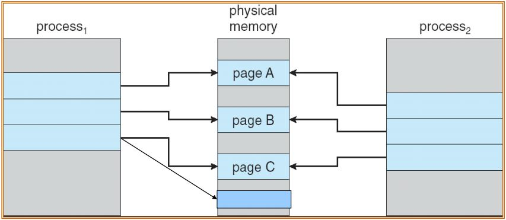
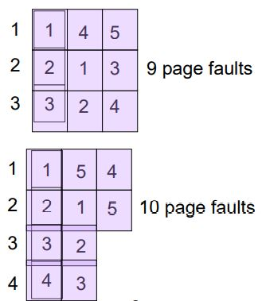
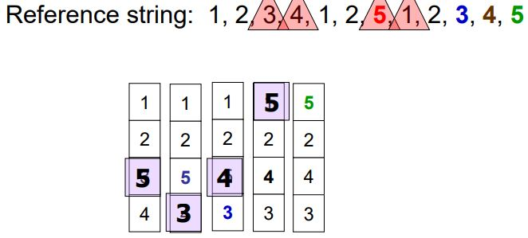
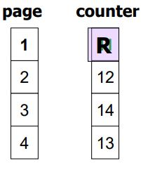
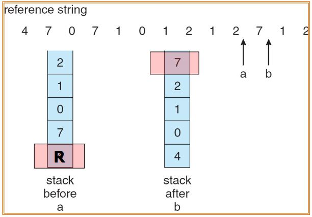

# Virtual Memory
- Virtual memory
    - user logical memory와 physical memory를 분리한다.
    - Physical memory + Backing Storage 전체 공간
    - page가 swapping하는 모든 공간
    - 프로그램 실행은 Physical memory 영역 뿐만 아니라 Backing layer까지 포함해서 실행해도 된다.
        - 그 전체 영역을 Virtual memory라 한다.
- Virtual memory는 다음 두 가지 중 하나를 통해서 구현되어야 한다.
    - Demand paging 
    - Demand segmentation
- Shared library는 Virtual Memory를 통해서 메모리 절약이 가능함

## Demand paging
- 메인 메모리를 할당할 때 실제로 필요한 순간에 메모리를 할당함
- 만일 shared library가 있다면
    - 사용자 프로그램에서 link가 되었더라도 해당 프로그램의 run time에서 실제로 호출되지 않는다면 main memory에 올라오지 않는다.
- swapping 결정 순간
    - 어떤 page가 logical address를 생성해서 page table을 찾아 갔는데 Physical memory가 할당되지 않았을 때
    - 따라서 lazy swapper(pager)라 한다.
        - lazy swapper는 일반 swapper와 다르다!
- Swapper vs pager
    - swapper
        - main memory에서 교환 결정하는 기능을 수행
    - pager
        - 하나의 page entry 단위로 관리하는 기능 수행
- swap
    - swap in
        - disk에서 필요한 부분을 memory에 적재하는 것
    - swap out
        - main memory에서 빼내는 것
    - swapper
        - 위를 결정하는 것
- Valid & invalid bits
    - 
- Page-fault trap
    - 기본 Paging에서는 main memory에 모두 할당을 하기에 page-fault가 일어날 일이 없다.
        - 하지만 Demand paging에서는 발생가능 함
    - Page-fault trap이 발생하면 다음을 수행함
        1. OS는 PCB를 확인함.
            - 만일 에러가 발생한다면 다음을 수행함
        2. empty frame을 찾는다.
        3. empty frame이 존재한다면 해당되는 page를 empty frame으로 만든 다음에 copy를 한다.
            - copy: disk access
        4. page table update
        5. validation bit를 v로 set
        6. page fault가 야기된 곳부터 Restart
    - Page fault handling
        - 
- 일반적으로 pure paging보다 수행 능력이 떨어지지 않는다.
    - locality of reference 때문
        - 수행했던 page 주위에 다음 실행할 page가 집약되어 있음
        - 이를 locality라 함
        
### Performance of demand paging
- p: Page Fault가 발생할 확률
- Effective Access Time(EAT)
    - EAT = (1 - p) * memory access time + p *(page fault overhead + swap page out + in + resatrt overhead)
- 즉, p가 0에 가까워야 효율적인 성능을 낼 수 있다.

# Page Fault를 줄이기
## Copy-on-Write (COW)
- fork함수를 사용해서 프로세스를 생성한다면 부모 프로세스를 그대로 복사하여 자식 프로세스가 가진다.
    - 이 때, 처음에는 공유를 하고 있다가 자식 프로세스가 실제로 변형을 할 때 page를 복사한다.
    - 즉 page를 복사하여 공유하고 있다가 자식 프로세스가 작업을 수행할 때 독립적인 page를 가지게 된다.
- COW는 프로새스를 생성할 때 매우 효율적임

## Page Replacement
- Free frame이 존재하지 않을 때를 고려함
- 어떤 page를 뺄지를 고르는 과정이 매우 중요한 issue
    - page fault를 최소화 해야함
- victim frame을 찾는다.
    - victim frame: 앞으로 교체될 frame

### How to find the victim page
- 목표: page fault를 최대한 낮추는 것
- Page Number가 1, 2, 3, 4, 1, 2, 5, 1, 2, 3, 4, 5 순서로 접근한다고 하자
- FIFO 알고리즘으로 Page replace를 한다면 다음과 같이 page fault가 발생한다.
    - 
    - 3 frame 보다 4 frame일 때 더 많은 page fault가 발생
        - 원래 더 많은 frame에 대해서 더 좋은 성능을 기대한다.
        - 하지만 위 이미지 같은 경우 더 많은 page fault를 발생한다.
        - 이를 Belady’s Anomaly라 한다.
- FIFO는 적합한 알고리즘이 아니다.
- 최적의 알고리즘
    - 앞으로 가장 안쓰일 Page를 victim page로 선택한다.
    - 즉, 재사용의 텀이 가장 긴 page를 선택
    - 하지만 미래를 알 수 없다.
        - 이전의 값들로 유사값을 도출한다.
- 위의 문제를 대체하여 Least Recently Used algorithm (LRU)를 사용한다.
    - 가장 최근에 사용된 적이 없는 page가 victim
    - 매우 중요한 알고리즘이다.
    - 
- 구현
    1. Counter implementation
        - page가 reference 될 때 counter정보를 저장한다.
            - counter: clock 정보, 마지막으로 access된 시간
        - 해당 정보를 가지고 어떤 것이 가장 오래전에 access 되었는가를 판단할 수 있음
        - 
        - Counter Entry를 따로 저장함
    2. Stack implementation
        - 이름은 Stack이나 List에 가까움
        - 최근에 reference 된 page link를 stack 가장 위에 저장한다.
        - 그리고 가장 오래된 정보를 찾을 때 stack의 가장 아래서부터 찾는다.
        - 

### LRU-approximation algorithm
- Pure한 LRU를 사용하는 것이 아니라 근삿값을 사용한다.
    - 모든 데이터에 대해서 모든 시간을 찾아 비교하는 것이 매우 비효율적
- 종류
    - Reference bit
        - 각 page마다 Reference bit를 가지며 초기 0으로 두고 reference가 된다면 1로 set한다.
        - 순서가 없으며, 일정 시간동안 reference가 되지 않은 그 어떤 것을 무작위로 victim으로 선정
    - Additional-reference-bits algorithm
        - Reference bit를 여러개 두어 사용
        - 한 time에 reference된 page의 MSB에 1로 set
            - 그 후 오른쪽으로 shift
        - 해당 정보를 가지고 판단
    - Second chance algorithm
        - Reference bit를 사용한다.
        - Reference bit가 1이라면 그 다음에 reference 될 가능성이 존재함
            - 이를 다시 0으로 바꾸고 해당 page는 넘어간다.
            - 이 작업을 반복함
        - 즉, 0인 값을 찾아서 victim으로 선정한다.
        - FIFO 알고리즘
    - Enhanced Second chance algorithm
        - Reference bit와 추가적인 하나의 BIT(modify bit)
        - 총 4개의 class를 나누어서 우선순위를 둔다.
            - (Reference bit, modify bit)
                - 1 class: (0,0) 
                - 2 class: (0,1)
                - 3 class: (1,0)
                - 4 class: (1,1)
        - class가 낮은 page를 victim으로 선정
    - Counter-Based Algorithms
        - reference가 하나 될 때마다 해당 page의 access counter를 증가시킨다.
        - LFU Algorithm
            - 더 적게 사용했던 것들이 앞으로도 안쓸 것이다 라고 예상
        - MFU Algorithm
            - 가장 많이 사용했던 것들이 앞으로도 더 많이 쓸것이다 라고 예상

# Thrashing
- 프로세스가 page를 충분히 할당받지 않는다면 page fault가 자주 발생하고 다음을 야기한다.
    - CPU utilization 저하
        - Page fault로 인해 waiting 상태의 프로세스가 증가하게 된다.
    - OS는 이때문에 CPU가 놀고 있다고 생각하여 더 많은 프로세스를 생성하게 된다.
        - system에 더 많은 프로세스가 추가된다.
- Thrashing
    - CPU는 놀고 있으며 프로세스는 pages in and out으로 바쁜 상태

## prevent thrashing
- thrashing 발생 이유
    - ∑ size of locality > total memory size
- 프로세스에게 자신이 필요로 하는 적절한 frame의 수를 제공해야 한다.
- 그 적절한 수를 찾는 방법
    - Locality model
        - 프로세스가 실행할 때 항상 locality를 가지고 있다.
        - 그 locality를 가지고 추정을 함
            - locality
                - 어떤 프로세스가 실행될 때 같이 작동되는 page의 set

## Working Set Model
- locality를 세는 방식
- working-set window ≡ ∆
    - 주어져있는 시간, 또는 정해진 작업 동안의 실제로 접근했던 page의 숫자
- WSSi(working set of Process Pi) =
    - 가장 최근의 ∆ 동안 access 되었던 전체 page의 수
    - ∆가 너무 작으면 전체 locality를 확보하지 못할 수 있다.
    - ∆가 너무 크면 필요하지 않은 locality까지 확보함
- D = ∑ WSSi ≡ Total demand for frames
    - D > m 이라면 thrashing 발생 (m은 실제 메모리 사이즈)

# Allocating Kernel Memory
- 커널에서 메모리를 할당하는 것은 free-memory pool을 만들어두고 사용한다.
    - 커널은 일반적으로 다양한 사이즈의 메모리 공간이 필요로 할 수도 있으며 연속된 공간을 필요로 한다.
- 다음 두 가지 방법으로 메모리 할당함
    - Buddy System
    - Slab Allocator
## Buddy System
- Paging 기법과 같음
    - Pagin은 User, Buddy System은 Kernel
- 연속된 page들로 구성된 고정된 사이즈의 segemnt로 메모리를 할당함
- 2의 지수승의 단위로 메모리를 할당한다.
    - request 한 size를 허용하는 2의 지수승 단위로 할당
    - 영상 참고

## Slab Allocator
- 비슷한 요구조건들이 있는 data structure들은 비슷한 위치에 두고 할당함
- Slab
    - 한개 이상의 물리적으로 연속된 공간
- Cache
    - 한 개 이상의 slab으로 구성
- 처음에는 Cache를 먼저 만든다.
    - free한 영역임을 표시한다.
- 그 후 structure가 저장이 되면 (slab에 저장됨) used라고 표시함
- slab을 다 사용하게 되면 slab을 새로 할당하고 cache에 연결한다.
- 장점
    - fragmentation가 없다
    - memory request satisfaction이 빠르다
- 구분
    - Full slab
    - Empty slab
    - Partial slab
    