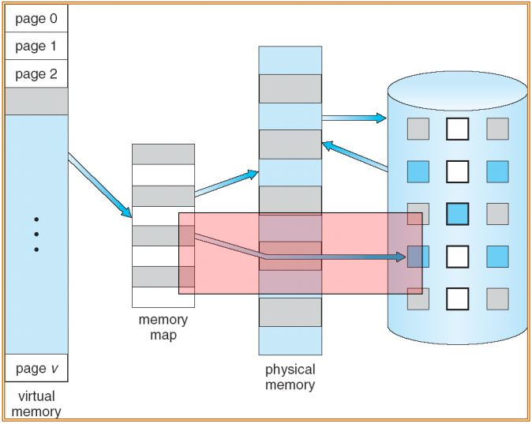
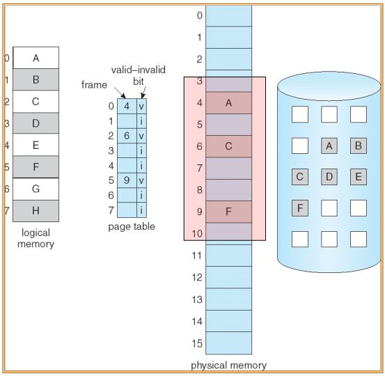
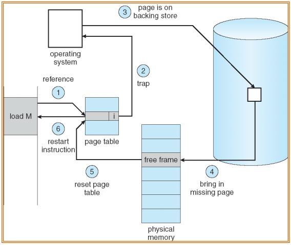

# Virtual Memory
- Virtual memory
    - user logical memory와 physical memory를 분리한다.
    - Physical memory + Backing Storage 전체 공간
    - page가 swapping하는 모든 공간
    - 프로그램 실행은 Physical memory 영역 뿐만 아니라 Backing layer까지 포함해서 실행해도 된다.
        - 그 전체 영역을 Virtual memory라 한다.
- Virtual memory는 다음 두 가지 중 하나를 통해서 구현되어야 한다.
    - Demand paging 
    - Demand segmentation
- Shared library는 Virtual Memory를 통해서 메모리 절약이 가능함

## Demand paging
- 메인 메모리를 할당할 때 실제로 필요한 순간에 메모리를 할당함
- 만일 shared library가 있다면
    - 사용자 프로그램에서 link가 되었더라도 해당 프로그램의 run time에서 실제로 호출되지 않는다면 main memory에 올라오지 않는다.
- swapping 결정 순간
    - 어떤 page가 logical address를 생성해서 page table을 찾아 갔는데 Physical memory가 할당되지 않았을 때
    - 따라서 lazy swapper(pager)라 한다.
        - lazy swapper는 일반 swapper와 다르다!
- Swapper vs pager
    - swapper
        - main memory에서 교환 결정하는 기능을 수행
    - pager
        - 하나의 page entry 단위로 관리하는 기능 수행
- swap
    - swap in
        - disk에서 필요한 부분을 memory에 적재하는 것
    - swap out
        - main memory에서 빼내는 것
    - swapper
        - 위를 결정하는 것
- Valid & invalid bits
    - 
- Page-fault trap
    - 기본 Paging에서는 main memory에 모두 할당을 하기에 page-fault가 일어날 일이 없다.
        - 하지만 Demand paging에서는 발생가능 함
    - Page-fault trap이 발생하면 다음을 수행함
        1. OS는 PCB를 확인함.
            - 만일 에러가 발생한다면 다음을 수행함
        2. empty frame을 찾는다.
            - 
        3. empty frame이 존재한다면 해당되는 page를 empty frame으로 만든 다음에 copy를 한다.
            - copy: disk access
        4. page table update
        5. validation bit를 v로 set
        6. page fault가 야기된 곳부터 Restart
    - Page fault handling
        - 
- 일반적으로 pure paging보다 수행 능력이 떨어지지 않는다.
    - locality of reference 때문
        - 수행했던 page 주위에 다음 실행할 page가 집약되어 있음
        - 이를 locality라 함
        
### Performance of demand paging