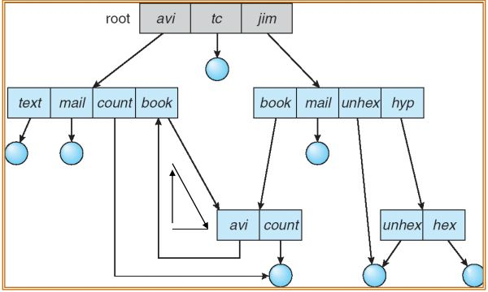

# File
- 정리정돈이 쉽다.
- 찾기가 쉽다.
- File abstraction
    - User 입장에서
        - 정보가 들어가 있는 byte로 이름이 붙어져 있는 것
    - FS 입장에서
        - disk block들의 집합
- File system’s job
    - 이름이 있다면 그것으로 disk의 위치를 찾아야 함
        - 위치가 있다면 이름을 알아야 함
        - File system은 그 사이를 mapping 작업을 해주어야 한다.
    - File operation management
    - Directory management

## File attribute
파일이 가져야할 정보들
- Name
    - 유일하게 User가 읽을 수 있는 정보
- Identifier
    - File system이 file을 식별할 수 있도록 unique number를 할당한다.
    - 이를 inode라 한다.
- Type
    - 파일 유형
- Location
    - 파일의 저장된 위치 Pointer
- Size
- Protection
    - 누가 해당하는 파일에 접근할 수 있는지에 대한 정보
- Time, date, and user identification

## File operation
OS가 기본적으로 제공해주는 기능
- Create
    - 공간을 만들고 관리하기 위한 정보를 생성
- Write
    - 현재 파일을 Update
- Read
    - 파일의 정보를 가져오는 것
- Reposition within file
    - position pointer를 바꾸는 작업
- Delete
- Truncate
    - 파일의 내용은 지우지만 파일 정보는 유지함

## Open Files
- 파일에 접근하기 위해서는 파일을 열고 접근을 해야한다.
    - open: 파일을 열기 위한 system call
        - 해당되는 entry를 가지고 와서 메모리에 올려준다.
- open file을 관리하기 위해 필요한 정보
    - File pointer
        - 현재 file을 accee하고 있는 pointer
        - 프로세스마다 하나씩 별도로 가지게 됨
    - File-open count
        - 해당하는 프로세스가 현재 접근하고 있는 파일의 수
    - Disk location of the file
        - file의 실제 disk 저장 위치
    - Access rights
        - 각 프로세스마다 access 가능한지의 정보
- Open file locking
    - 파일에 lock을 걸어야 할 경우가 종종 있다.
    - 두 가지 방법이 존재함
        - Shared lock (Several processes can acquire lock concurrently)
            - A reader lock
            - 현재 읽고 있으므로 write를 하지 않도록 함
        - Exclusive lock (Only one process can acquire lock)
            - A writer lock
            - 현재 wirte 하고 있으므로 읽는 것을 막음
    - access의 방식에 따라 방법을 나눌 수 있음
        - Mandatory
            - lock을 걸었을 때만 접근을 허용함
        - Advisory
            - lock이 걸렸는지 상태만 확인

# Directory
Directory
- 일종의 File
- 어떤 file 시스템 내에 file에 대한 정보만을 모아 놓은 file
- 구성
    - file들에 대한 meta 정보
    - file 이름을 entry로 변환 시킬 수 있는 table

- Typical file system structure
    - 
    - Directory 정보는 항상 최상단에 위치한다.
    - File system의 단위는 partition이다.

## Operations on directory
- Search for a file
- Create a file
- Delete a file
- List a directory
- Rename a file
- Traverse the file system
##  Directory structures
- Single-level directory
- Two-level directory
- Tree-structured directory
- Acyclic-graph directory
- General-graph directory

### Single-level directory
- 그저 하나의 directory에 파일을 연결함
- 장점이 없음 (있다면 구현 쉬운거?)
- User에 따른 접근권한 제한을 못함

### Two-level directory
- User에 따라 directory를 따로 만든다.

- window에서는 extended two-level directory structure를 가진다.
    - 기존과 유사하지만 User단위가 아닌 Disk partition 단위로 나눈다.
    - C:~~, D:~~

### Tree-structured directory

- 하지만 여전히 Sharing 문제를 해결하지 못함
### Acyclic-graph directory
- 파일 또는 directory를 공유할 수 있음
- 두 가지 문제점이 있음
    - 같은 파일에 대해
        - 다른 이름으로 정의가 될 수 있음
    - 아래 이미지에서 count를 지울 경우
        - dangling pointer가 발생할 수 있음
        

### General-graph directory
- 사용하지 않는다.
    - cycle이 발생할 수 있기 때문

## Hard link vs. symbolic link
- Acyclic로 file을 share할 경우
    - 다음의 2가지로 나눌 수 있다.
        - Hard link 
        - symbolic link (Soft link)
- Link
    - 다른 파일이나 subdirectory 접근하고자 하는 pointer
    - 원래 있던 파일에 link를 걸어주며 file sharing한다.

### Hard link

- 둘 중 어느것을 삭제하더라도 직접 접근하기 때문에 문제될 것이 없다.
- Linux 기준으로 ln 명령어를 통해서 사용 가능

### Soft link (symbolic link)

- bar가 joe가 가진 foo를 참조하고 있을 때
    - joe가 foo link를 삭제하게 되면 bar는 어디도 참조하고 있지 않다.
    - 이때 Dangling pointer 발생
- Linux 기준으로 ln -s 명령어를 통해서 사용 가능

# File-System Mounting
- File system이 system내로 들어오는 것을 mount 한다고 한다.
- mount 후에 해당되는 device가 valid한 file system을 가지고 있는지 확인함
    - device driver와 연동시켜 접근 시작

