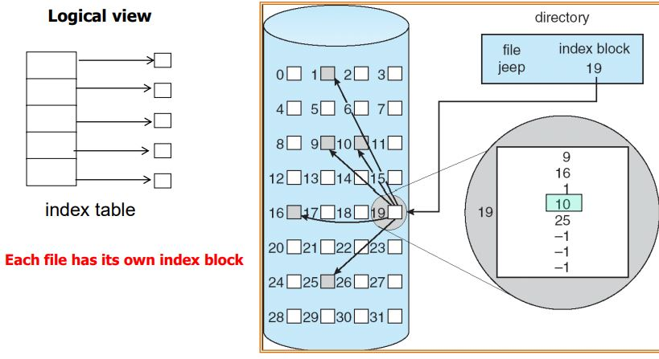

# File-System Structure
- Logical storage unit
    - Collection of related information
- File control block
    - 특정 file에 관련된 정보를 전달해주는 storage structure
- file system은 disk에 존재하며  disk operation은 block 단위로 수행된다.

# File system implementation
- Information on disk
- Information in memory
- Partitions
- Virtual file system

## Information on Disk
Disk는 다음에 정보들을 저장한다.

### 1. Boot control block
- system을 작동시키기 위한 OS 기본적인 정보를 disk에 정해진 위치에 저장함
- UNIX: It is called bootblock
- NTFS: partition boot secto

### 2. Volume(partition) control block
- file system에 대한 정보
- Volume(partition)
    - booting에 필요한 정보를 제외한 나머지 파일들을 Disk에 저장을 해야함
    - 그 Disk 단위
    - Windows 에서는 D:, E: ... 순차적으로 증가
- 해당하는 partition에 block의 수
- Free block Pointer
    - Free block: 사용하지 않은 공간 이는 따로 관리함
- FCB pointer
    - FCB: file과 관련된 정보들을 저장하는 자료구조
- UNIX는 superblock라 함
- NTFS는 master file table에 저장함

### 3. Directory structure for a file system
- UNIX에서는 file 이름과 그와 mapping 되는 inode number들을 저장한다.
- NTFS는 master file table에 포함함

### 4. Per-file FCB
- FCB는 file을 찾아가기 위한 정보, file과 관련된 추가 정보를 가진다.

## Information in memory
1. In-memory mount table
    - 현재 System에서 mount가 되어 file system으로 접근이 가능한 것들의 list
    - Kernel이 관리
    - Windows 는 D:, F:와 같이 표기함
    - Unix는 아무 directory에 mount가 가능
2. In-memory directory structure
    - 최근에 접속했던 Directory만 메모리에 넣어둔다.
3. System-wide open-file table
    - 전체 System 상에서 최근에 접속했던 FCB는 모두 메모리상에 올라가 있다.
4. Per-process open-file table
    - system-wide open file table에서 어떤 프로세스가 어떻게 접근하는지에 대한 정보의 pointer를 저장함
- 주의!: system-wide open table와 Per-process open table를 구분해야 함
    - system-wide open table
        - 현재 open이 되어있는 file의 FCB를 포함함
        - 전체 system에서 딱 한 개 존재
    - Per-process open table
        - system-wide open table의 FCB에 대한 Pointer를 가짐
        - 프로세스마다 따로 존재

### 만일 file이 open 되었다면
system-wide open table를 check한다.
- 다른 프로세스가 open했는가를 확인
    - 만일 있다면, per-process open-file table를 만듦
    - 만일 없다면, directory structure를 찾는다.
        - directory structure를 찾은 다음에 FCB를 system-wide open table에 넣는다.

### 만일 file이 read or written 된다면
1. per-process open-file table을 찾는다.
    - system-wide open file table에 link가 되어있으므로 offset같은 정보를 찾음
2. system-wide open-file table을 찾는다.
    - FCB를 찾아서 read, write를 수행

### 만일 file이 close 된다면
1. system-wide open file table에 open count를 확인한다.
    - 1일 경우 2를 수행
    - 그 이상일 경우 count를 줄임
2. per-process file table entry를 지움

### Memory에서 Property를 정리하면
- directory structures
- inode tables(Linux에는 있음)
- data
    - buffer cache에 저장되기도 함

## Partitions
- 독립된 file system 하나가 partition을 이룬다.
- 하나의 Partition에는 여러 개의 partition들이 있을 수 있다.
- 하나의 disk가 여러 partition으로 나누어 질 수 있다.
    - A boot partition 
    - Root partition
- 만일 생 그대로 disk를 사용하게 된다면
    - file system이 없다.
        - 즉, file system 을 구현해야함
    - UNIX에서는 Swap space를 raw partition으로 사용한다.
        - Swap space
            - Main memory를 가상적으로 extension함
            - virtual memory
## Virtual File System (VFS)
- VFS는 같은 system call interface에 대해서
    - 서로 다른 file system type에도 문제 없이 작동할 수 있도록 함
- 이 API를 VFS interface라 한다.
- Vnode
    - 메모리에서 사용할 수 있는 inode
    - unique 하게 사용가능 

### VFS architecture in Linux
- Inode object
    - Vnode
- File object
    - 프로세스에 의해 열려 있는 실제 file
- Superblock object
    - 전체 file system에 대한 정보를 처리하기 위한 supeblock
- Dentry object
    - directory 혹은 directory에 있는 file에 접근하기 위한 object
    - directory entry가 처음 momory에 read가 되면 VFS에 의해 dentry object를 만든다

## Directory Implementation
- file이 생성되고 삭제될 때 효율적으로 동작해야 함
- Linear list
    - file name에 따라 Linear 하게 만듦
    - 매우 간단한 프로그램
    - 하지만 파일이 여러개 일 경우 조작하거나 찾기 어려움
- Hash Table
    - Hash를 사용함
    - search 효율성 매우 올라감
    - 하지만 collision 발생 가능성 존재

### Allocation methods
- file은 disk block으로 이루어져 있다.
- disk에 할당하는 방법
    - Contiguous allocation
        - 연속된 공간으로 할당하게 된다면 fragment가 발생할 수 있다.
    - Linked allocation
        - 할당된 block 다음에 어딘가에 할당한 blcok을 연결한다.
        - 하지만 이는 포인터를 저장, search의 오버헤드 단점이 있다.
        - Windows에서 이 방식으로 사용
    - Indexed allocation
        - 파일의 index를 통해서 접근
        - Linux에서 이 방식으로 사용
        - 
