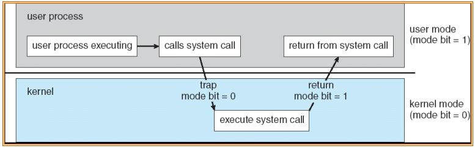
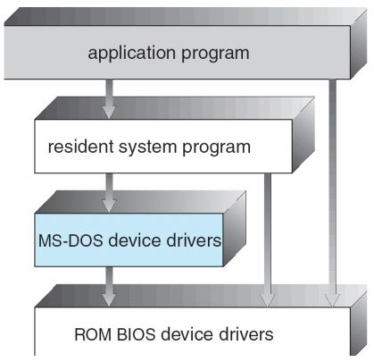
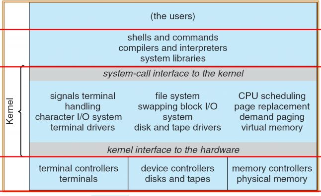
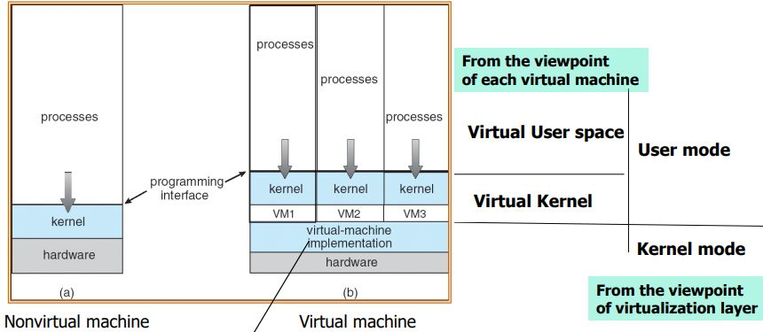

# Operating System Services
## For Users
- User interface
    - User가 컴퓨터를 조금 더 쉽게 사용할 수 있게 함
- Program execution
    - Loading and execution
- I/O operations 
- File-system manipulation 
- Communications
- Error detection

## For Efficiency
- Resource allocation
    - Many types of resources 
        - CPU cycles, main memory, file storage and I/O devices
    - And many jobs (processes) 
        - Process들이 컴퓨터 자원들을 가지기 위해 경쟁을 한다.
- Accounting
    - 지금 실행 중에 필요한 모든 정보들 중 남겨야 할 정보를 OS가 관리
    - 나머지 부분을 어딘가에 저장하고 기억해야 함 
- Protection
    - Resource에 대해 보호가 필요함
- Security 
    - 권한부여

## User Interface
- Interative
    - Command line interface (CLI)
        - User가 Command를 직접 입력할 수 있도록 한다.
        - 입력 받은 명령어에 대해 바로 실행한다.
        - shell과 같은 말이다.
        - 사용 방법
            1. 정해진 명령어들을 실행하는 코드를 내포한다.
            2. 실행 파일을 찾아 그 파일을 실행한다.
                - 이를 가장 많이 사용함
    - Graphical user interface (GUI)
        - 실행 환경이 Graphical하다.
        - Windows OS, UNIX or LINUX
- Non-Interactive
    - Batch interface
        - 명령어들을 파일로 모으고 그 파일들을 실행한다.

# System calls
- User 프로그램을 실행하다가 필요에 따라서 발생시킬 수 있는 Interrupt
- Software Interrupt이다.
- kernel mode로 바뀌는 순간
    1. Hardware Interrupt
    2. Trap: Software Interrupt
        1. Exception: Error
        2. **System call**
            - 즉, System call은 Trap의 일종이며 Software Interrupt이다.

## System call
- Application Program이 OS에 어떤 특정한 서비스가 필요할 때
    - 즉, HW가 제공해주는 Resource들을 사용하고자 할 때 이 때 사용하겠음을 OS에게 알린다.
- 하지만 이 사용은 User가 직접 사용하는 것이 아니다.
    - API를 통해서 Library 형태로 사용한다.
- 

## Design Principle
OS를 디자인할 때 Policy와 Mechanism을 분리해서 생각한다.
- Policy: 정책
    1. Application Program이 Computer System의 여러 Resource에 접근할 수 있도록 해야한다.
        - 하지만 모든 자원에 자유롭게 접근을 해서는 안된다.
        - 이를 위해 만들어진 것이 System call
    2. CPU 자원들을 여러 프로그램들이 나누어서 사용할 수 있도록 해야 한다.
        - 이 경우 시간 배분을 잘 해야한다.
        - 일정 시간이 지나면 CPU에게 Interrupt를 날린다.
        - 이를 위한 것이 Timer
- Mechanism: 정책을 실제로 구현한 것
    1. System call
    2. Timer

## API
커널이 받아들일 수 있는 System call을 Library 형태로 제공, 그 형태를 알면 User는 그 함수들을 사용해서 호출할 수 있도록 제공 하고 있음
- Win32 API
    - ex) CreateProcess() -> NTCreateProcess() in System call
- POSIX
    - LINUX, UNIX에서 사용
    - 확장성이 좋음
    - ex) malloc() -> sbrk() in System call

### Why use API
1. Ease of programming
    - System call 번호를 알아야 프로그래밍을 할 수 있다면 프로그래밍이 쉽지 않다.
    - 따라서, application programmer는 System call의 내부구조까지는 알 필요가 없다.
2. Portability
    - Common API를 통해 버전이 바뀌더라도 사용하던 함수이름은 그대로이다.
    - 따라서, 버전이 바뀌더라도 이전 코드를 전체 수정할 필요가 없다.

## System call interface
1. 각 System call은 번호가 할당되어 있다.
2. 이 번호에 따른 순서화된 테이블이 있다.
    - OS마다 정의가 되어 있음
3. System call이 호출이 되면 OS 커널이 SW interrupt를 통해 하던 일을 중단
    - kernel 모드로 변환 OS 커널로 돌아감
    - 그 후 몇 번 System call인지 확인한다.
    - 해당 index의 System call을 수행한다.
    - System call 순서
        1. Application Program이 System call 호출을 한다.
        2. Library에서 해당 call에 맞는 번호를 넘겨준다.
        3. 커널모드로 바뀌고 그 번호에 따라간 내용에는 메모리주소가 담겨있다.
            - 그 메모리 주소는 System call의 실제 서비스 루틴의 시작 주소를 가리킨다.
        4. 그 후 수행 내용을 다시 Application Program에 돌려준다.

### System call에서 Parameter 넘기기
- 레지스터를 통해서 파라미터를 넘긴다.
    - 가장 쉬운 방법
    - 하지만 사이즈의 제약으로 인해 만능이 아니다.
- 메모리에 파라미터를 넣어두고 그 메모리의 주소를 레지스터에 담는다.

## System Program
Library + System call Routine
- Kernel 뿐만 아니라 Kernel영역에 포함되지 않는 여러 OS 서비스 루틴들을 다 포함해서 User가 프로그램을 작성할 때 조금 더 좋은 환경을 제공하는 program
    - File manipulation 
    - Status information
    - File modification
    - Programming language support
    - Program loading and execution
    - Communications

## System call의 종류
- Process control
    - end, abort, create, terminate, wait event, etc. 
- File management
    - create, open, read, write, etc.
- Device management
    - read, write, get device attributes
- Information maintenance
    - get time, date, process id, etc. 
- Communications
    - create, delete communication connection
    - send or receive messages

## OS Design & Implementation
여기에는 정답은 없다.    
그렇다면, User와 System의 목표는?
- User goal
    - 사용하기 쉬움
    - 배우기 쉬움
    - 안전하고 빨라야 함
    - 신뢰할만 함
- System goal
    - 설계와 구현이 쉬움
    - 유지관리가 용이해야 함
    - 다른 시스템과 변환이 쉬움
    - 에러 없고 신뢰할만 함
    - 효율적임

일반적으로 Policy를 바꾸더라도 Mechanism은 크게 바꿀게 없게 Insensitive하게 만드는것이 더 좋다.
- Micro-kernel-based approach
    - Policy와 Mechanism을 거의 분리해둔 상태
- Monolothic kernel
    - 위와는 반대인 매우 밀접한 상태

# Operating System Structure
## Simple Structure
- Module이나 Layer로 구분 되어있는 것이 아니라 OS가 한 덩어리로 되어 있음
    - dual-mode와 H/W protection이 없다.
- Application Program들이 기본적인 I/O Routine 포함, 모든 HW Resource들을 직접 접근할 수 있음
- Example) MS-DOS, 전자레인지 etc

## Layered Approach
- 여러 단계를 나눈 형태
    - 가장 바닥의 Layer 0은 HW
    - 가장 높은 Layer N은 User Interface
- 전통적인 UNIX에서 사용
- 장점
    - 구현과 디버깅이 매우 간단해진다.
- 단점
    - 성능상의 Overhead가 커진다.
    - 하부 Layer가 잘못될 경우 상위 Layer에서 디버깅이 불가능

UNIX System 구조

## Microkernels
- Layerd Approach를 완벽히 적용한 형태
- Kernel의 가장 핵심 부분만 Layer을 남겨 두고 나머지는 그 위에서 동작한다.
- 장점
    - 관리가 용이함
    - 더 신뢰성 있음
- 단점
    - Overhead 가 커진다.

## Modules
- 각각의 Component들을 따로따로 만들어 둔 것을 Module이라 한다.
    - OS는 여러 개의 Module이 한번에 들어가 있는 상태
- 각 Module들은 필요할 때 넣고 필요없을 때는 뺀다.
- Unix, Solaris에서 사용
- Linux에서 module 넣고 빼기
    - insmod
        - 모듈 삽입
    - rmmod
        - 모듈 삭제
    - Linux = Layered approach + Modules

## Virtual Machine
- 옛날에는 하나의 컴퓨터에서는 하나의 OS만 설치했어야 했다.
    - 이를 통해 여러 OS로 관리가 가능함
- 각 프로세스가 자기 고유의 CPU나 메모리 등 System Resource들을 독립적으로 가지고있다고 "생각"하게 하는 것
    - virtual copy를 통해 서비스를 제공한다.
- 같은 HW를 공유하지만 서로다른 OS를 실행하고 있게끔 만듦
- 다만, 구현하기 어려움..

- Virtualization layer
    - virtual machines에 들어온 작업들을 실제 HW에 매핑 해주는 계층

### 여러 Virtual Machine
- VMware의 경우
    - Host OS를 설치하고 그 위에 Virtualization layer를 설치함

## OS Generation 기능
- System generation (SYSGEN)
    - OS 안에 있는 Module
    - 각각의 컴퓨터 Component에 대해
        - system을 누가 사용하고 있는가
        - HW가 잘 작동하고 있는가
        - 들을 계속해서 체크한다.
- SYSGEN program
    - 구체적인 HW System의 구성에 대한 정보를 얻는다.
        - 사용할 CPU가 무엇인가
        - 메모리는 얼마만큼 사용 가능한가
        - Device가 사용 가능한가
        - OS에서 어떤 option을 취해야 하는가
    - OS는 위 정보를 취합하여 적절한 파라미터들을 세팅한다.

# Various OS
## System Boot
- Booting
    - HW가 작동이 시작되면 OS는 Main memory에 적재가 되어야 한다.
    - 컴퓨터가 시작되면 kernel을 로딩한다. 
- Bootstrap loader
    - Booting을 해주는 코드
    - 아주 작은 코드가 커널을 가리키고 있다가 그것들을 Main Memory에 적재 후 시작한다.
    - One-step
        - CPU가 읽을 수 있는 비휘발성 메모리 ROM에 Kernel을 올릴 code를 저장한다.
            - 하지만 ROM은 속도 느리고 용량 작고 비쌈
    - Two-step
        - 아주 작은 코드만 올리고 Main memory에 kernel부터가 아니라
        - disk로부터 complex boot program을 먼저 올린다.
        - 그 후 kernel을 올린다.
    - PDF 이미지 참고

## Hybrid System
- Security나 User Approach 등을 감안해서 순수 OS Structure들의 필요한 기능을 가져와서 OS를 세운다.
- 요즘 나오는 OS는 Hybrid이다.
- Linux나 Solaris 같은 경우 kernel address space는 [monolothic](##OS-Design-&-Implementation)이고 Modular의 개념을 추가적으로 더했다.
- Windows의 경우 대부분 monolothic이지만 dlfqn subsystem에서만 micro-kernel의 기능을 부가적으로 사용한다.

# Operating-System Debugging
- OS는 Error정보를 포함한 log 파일을 생성한다.
- (User)Application이 오류나면 그때 생겼던 데이터들을 **core dump**라 한다.
    - 이를 메모리에 넣어두고 해당 오류를 확인할 수 있게 한다.
- (System)OS에서 오류나면 그때 생기는 데이터들을 **crash dump**라 하는 파일을 만든다.
- 예상치 못하게 성능이 안좋아졌다면 그것을 찾아서 개선시킬 필요가 있다.
    - trace listing
        - 내부적으로 어떤 일들을 수행했는지 log를 보고 판단
    - Profiling
        - 현재 실행 중에 어떤 일이 발생했는지 주기적으로 sampling을 한다.
        - 그것을 통해 통계를 내서 판단함

## Performance Tuning
80%의 시간은 20%의 코드를 실행하는데 걸린다
- top: 현재 프로세스 중에서 많은 시간을 가지고 있는 것들을 가리키고 추출함
    - Windows: windows task manager
    - Linux