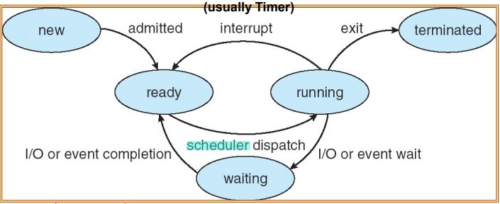
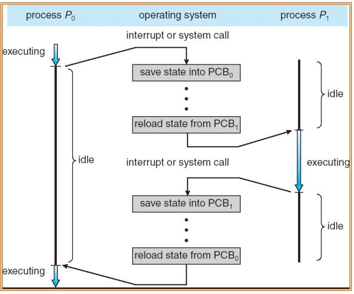
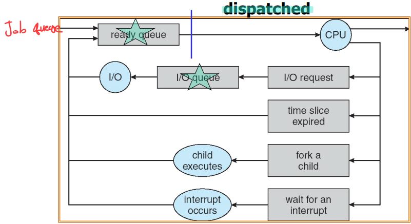
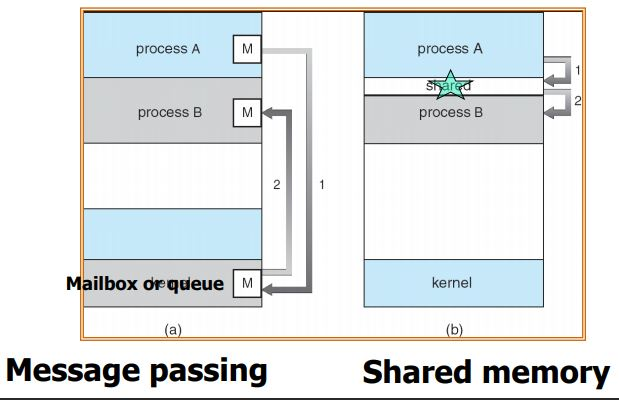

# Process Concept
Process - 실행 중인 프로그램    
job = task - User가 만든 Process와 내부적으로 돌아가는 서비스들

- 메모리에 Program을 올릴 때 다음 4가지로 메모리를 할당해 준다.
    - Stack
        - 함수 호출에 관련된 정보
        - Local 변수
    - Heap
        - 동적으로 공간이 할당될 때
    - Data
        - static 변수
        - global 변수
    - Text
        - Program
- Process는 실행하게 되면 순간마다 메모리 사용이 바뀐다.
    - 이를 저장할 필요가 있다.
    - [PCB](##PCB)(Process Control Block)
        - 운영체제가 현재 프로세스의 상태를 저장하고 관리
        - 메모리에 명시적으로 할당하지 않는다.
        - Program Counter
            - 현재 실행 중인 프로그램 코드의 주소가 담겨 있다.
            - CPU 안에 있는 레지스터
        - Processor Register
## Program 실행 과정
- 실행 준비 과정
    1. Disk에 있는 Program을 Memory에 올린다.
    2. 그리고 Stack과 Heap, Data 추가적인 메모리를 할당한다.
    3. OS가 관리하는 영역에 PCB의 데이터 구조를 만든다.

- 실행
    1. CPU의 할당을 받는다.
    2. Program의 처음 시작 코드부터 하나씩 CPU에서 명령어를 실행한다.
        - 실행 Process가 된다.
    3. 실행 중에는 Program Counter도 바뀐다.
    4. CPU의 register도 변화하면서 Process를 실행한다.

주의할 점
- 하나의 프로그램은 여러 프로세스가 될 수 있다.
- 즉, 같은 프로그램을 여러 사용자들이 수행할 수 있도록 고려해야 한다.

## Process state
- Program이 Process가 되는 시점?
    - User 혹은 다른 프로세스가 필요에 따라 프로세스를 실행하겠다고 결정한 순간
1. new
    - Process가 생성된 순간
2. running
    - Process에 있는 Program 코드가 하나씩 CPU에 가져와서 명령어들을 수행
3. wating
    - 어떤 이벤트의 발생을 기다린다.
    - ex) I/O 처리
4. ready
    - CPU가 할당되면 즉시 실행할 수 있는 단계
5. terminated
    - 할 일이 끝나고 더 이상 메모리에 남을 이유가 없는 상태
    - 메모리에 남겨두지 않고 쫓아내는 상태


- Scheduler
    - ready 상태의 프로세서들을 CPU에 올릴 순서를 메긴다.
- dispatch
    - 순서가 정해진 프로세서들을 CPU에 올린다.


## PCB
운영체제가 관리해주는 Data 구조    
프로세스들이 같은 Running 상태일 지라도 똑같은 Running상태가 아니다.
- 시간이 지나면서 내부적인 상태가 달라진다.
- 이와 관련된 정보를 저장하는 것이 PCB이다.
> 메모리에 들어가 있다.

### PCB 내용
- Process state
- Program counter
    - 이는 다음 실행할 주소들을 가져와서 미리 대기한다.
- CPU register
    - 연산에 필요한 레지스터
        - 명령어를 실행하면서 사용되는 레지스터
    - stack pointer
- CPU scheduling information
    - 프로세스의 순서에 대한 정보같은 것들
- Memory-management information
- Accounting information
- I/O status information


- P0 -> P1 -> P2
    - 위 과정을 Context switching이라 한다.
        - running 중인 프로세스를 중단하고 다른 프로세스로 넘어가는 과정

## Process scheduling
어떤 프로세스를 할당하고 실행할지 결정하는 것
- Process scheduling은 queue를 통해 관리한다.
- OS정책에 따라 우선순위도가 결정된다.
- 종류
    - Job queue
        - new와 terminated 상태 사이에 있는 모든 상태의 프로세스를 대상으로 만든 queue
    - Ready queue
        - CPU, 메모리 안에 들어가 있는 것들 중에서 즉시 실행할 준비가 되어있는 프로세스들
    - Device queue
        - 각각의 Device 별로 따로따로 대기 queue를 만듦 



# Scheduler
대부분의 프로세스들은  I/O-bound 혹은 CPU-bound로 프로세스의 우선순위가 결정된다.
- I/O-bound process
    - 프로세스를 I/O작업하는데 많은 시간을 소모
- CPU-bound process
    - 대부분의 시간을 CPU 사용에 소모
- 일반적으로 I/O-bound process가 CPU-bound process보다 우선순위가 높다.

## Long-term scheduler (job scheduler)
- 어떤 프로세스가 ready queue에 올라갈건지 정한다.
    - 메모리를 할당하는 방법
- 멀티프로그래밍의 정도 즉, 수행 중인 프로세스의 수를 제어한다.
    - 따라서, 시스템 안정성을 제어한다.
- 빈번하게 호출되지는 않는다.
- Time-sharing operating system에서는 Long term scheduler가 필요없다.
    - UNIX and Windows에 없다.

##  Short-term scheduler (CPU scheduler)
- 어떤 프로세스가 CPU에 할당되고 실행될지를 정한다.
    - CPU 자원을 할당하는 방법
- 빈번하게 호출된다.
- 이는 ready 상태의 process를 running 상태로 바꾼다.
- Short-term schedulers는 dispatcher로 알려져있다.

## Medium-term scheduler
- 더 이상 가능성이 없는 process를 Main memory에서 빼서 disk에 저장
    - 메모리 공간을 확보해준다.
- degree of Multi-Programming을 줄이는 역할을 한다.
- Process swapping scheduler이다.

## Multitasking in Mobile Systems
위 3가지의 스케줄러가 항상 모두 다 있는것은 아니다.    
예시로 Mobil System이 있다.
- IOS나 Android의 경우(초기버전) 하나의 프로세스만 run하고, 나머지는 중지된다.
- IOS의 경우
    - foreground process는 단 한가지이다.
        - User interface
    - backgrouind process는 여러개일 수 있다.
        - 하지만 ui적으로 보이지는 않음
        - 메모리에서 running 상태
- Android의 경우
    - 둘 다 여러개 일 수 있다.
    - 하지만 몇가지 제약이 있다.
        - backgrouind process는 task를 사용하기 위해서 별도의 request가 필요
            - 적은 메모리를 사용 또는 ui에 대한 서비스가 없다.

## Context Switch
- Context: 프로세스의 모든 상태
- CPU가 처리하고 있던 프로세스를 다른 프로세스로 바꾸는 행위
    - 현재 실행 중이던 프로세스의 마지막 상태를 어딘가에 저장 후 다른 프로세스로 변환
- Context Switch는 큰 Overhead를 가지고 있다.
    - system입장에서 이는 닥히 유용하지 않다.
    - 따라서, Overhead를 줄일 수 있는 mechanism을 제공
        -  SUN UltraSPARC
            - Multiple sets of registers
        - ARM
            - **Multiple store and load instructions**

# Operations on processes
- Process creation
- Process termination

## Process creation
- parent process가 child process를 만들어 낼 수 있다.
- 프로세스들을 만들다 보면 트리형태를 띈다.
- Scheduler는 첫번째 프로세스이다.
    - pid = 0
    - 이후 여러 서비스들이 생성된다.
- Issue
    - 부모가 Resource를 자식에게 어떻게 줄건가?
        1. 모든 자원을 공유
        2. 자식이 부모의 일부 영역만 사용
            - 일반적으로 사용함
        3. 일절 공유 안함
    - 실행될 때 부모 자식 프로세스 실행을 어떻게 할 것인가?
        1. 부모와 자식이 동시에 실행되게끔 할 것인가?
        2. 따로따로 실행되게 할 것인가?
    - Main memory에 공간을 부모와 자식간에 어떻게 분배할 것인가?
        1. 자식이 부모의 주소공간을 중복해서 가져감
        2. 아예 별도로 자식을 돌린다.
        - 위 두가지 모두 지원하는 경우가 일반적

### In UNIX or Linux
- fork system call
    - 이를 사용하면 부모 프로세스가 자식 프로세스를 생성하게 됨
- Resource sharing
    - 부모 자식이 file은 공유
    - CPU time or memory 는 공유하지 않음
- Execution 
    - Parent and children 동시에 실행할 수 있도록 함
- Address space
    - 복사하지만 별도의 주소공간을 사용
    - 처음에는 각 프로세스가 같은 데이터를 사용한다.
- Call once, return twice
    - fork는 부모에 의해 호출됨 하지만 return은 2번 발생
    - 자식 프로세스, 부모 프로세스 각각 return 함
- 과정
    1. fork를 통해 자식 프로세스가 부모 프로세스의 메모리 공간을 복사한다.
    2. 그 후 새 프로그램을 복사한 공간(text)에 적재한다.
        - 그렇게 함으로써 같은 작업을(= 부모와 같은 일) 반복해서 하지 않는다.
        - 그 명령어가 `exec`이다.
            - exec system call은 program을 로드하고 초기화 한다.
- Reaping child processes
    - 더 이상 자식 프로세스의 실행이 필요 없을 경우 부모 프로세스가 control을 다시 가져감
    - 이는 System call을 기다린다.
        - 자식 프로세스가 더 이상 실행할 필요가 없다고 알려주는 신호를 기다린다.
    - 끝났다는 신호를 제대로 받지 못해서 zombie process를 만들기도 한다.
        - zombie porcess
            - 자식 프로세스가 종료되었지만 부모 프로세스가 자식 프로세스의 종료 상태를 회수하지 않았을 경우
            - 자식 프로세스를 좀비 프로세스라고 한다.

## Process termination
- Process 안에서 마지막 실행문장을 수행했을 경우 끝이 난다.
- 정상 종료(exit)
    - 자식 프로세스가 끝날 때 만들었던 데이터들은 wait이라는 시스템 call을 통해서 부모 프로세스에게 전달한다.
    - 사용했던 Resource들은 OS가 회수를 한다.
- 부모 프로세스가 자식 프로세스를 중단시킬 수 있다. (abort)
    - 이유
        - 자식 프로세스가 할당된 resource 이상을 사용하려 할 때
        - 자식 프로세스를 만들어서 했던 작업들이 더 이상 필요하지 않을 때
        - 부모 프로세스가 중단될 때
            - 부모 프로세스가 중단될 때 자식 프로세스도 같이 중단
            - 또는 자식 프로세스는 남기는 경우(Orphan process)
                - Scheduler 프로세스를 제외하고 나머지 조상 노드 중에서 부모 프로세스로 만들어준다.

# Inter-process communication (IPC)
- Independent Process
    - 다른 프로세스의 실행과 상관없이 그냥 실행하면 됨
- Cooperating Process
    - 어떤 프로세스가 결과를 만들고 다른 프로세스에 전달
    - 또는 다른 프로세스가 만들 결과를 받아서 처리하기도 함
    - 장점
        - 정보 공유
        - 계산 속도 향상
            - Parallel processes
                - 여러 프로세스를 한번에 돌려 더 빠른 수행 결과를 낳음
        - Modularity
            - 모듈화
            - 관리가 용이
        - Convenience
            - User의 사용성 편의
## Type of IPC
- 프로세스간의 정보 공유를 직접적으로 할 수 없다.
    - 즉, Process A는 Process B 영역에 간섭이 불가하여 데이터를 전송할 수 없다.
    - OS가 보호해주기 때문
- User Process는 자신이 할당 받은 메모리 공간만 접근 가능
    - 다른 프로세스는 접근불가 하지만, 커널은 가능
- 따라서, 다음의 두 가지 방법을 통해 데이터 공유를 한다.




1. Message passing 
    1. Producer가 메모리 공간에 전송할 데이터를 저장
    2. Producer가 Kernel에 메모리 전송을 요청함
    3. Kernel은 저장된 데이터를 읽는다.
    4. Consumer가 읽을 수 있는 공간에 해당 데이터를 복사해준다.
2. Shared memory
    1. Producer와 Consumer가 Kernel에 shared memory 영역을 만들겠다고 요청
    2. Kernel은 둘 다 접근 가능한 shared memory 영역을 만듦
    3. Producer와 Consumer 공유 메모리로 데이터를 전송함

## Producer-Consumer problem
Producer-Consumer Issue: Producer-Consumer가 동기화가 되어있어야 한다.    
<br>

보낼 수 있는 데이터의 사이즈를 기준으로 구분하여 고려해야 한다.
- unbounded-buffer
    - 버퍼 사이즈가 실질적으로 제한이 없음
- bounded-buffer
    - 버퍼가 고정됨
    - 대부분 버퍼가 고정되어있으므로 이를 기준으로 문제점을 보자.

## Shared-memory
```c
#define BUFFER_SIZE 10
typedef struct {
. . .
} item;
item buffer[BUFFER_SIZE]; // A circular buffer
int in = 0; // Free position in the buffer
int out = 0; // The first full position in the buffer
```
동기화 문제 해결하기
- buffer를 circular queue로 만든다.
- Producer는 buffer가 FULL인지 check
    - out - in = 1일 경우 full
    - full이 아닐 경우 
        - Producing a data
- Consumer는 buffer가 empty인지 check
    - in = out일 경우 empty
        - Waiting Spin lock
- Producer code
    ```c
    while (true) {
        /* Produce an item */
        while (((in + 1) % BUFFER SIZE) == out); //do nothing -- no free buffers
        buffer[in] = item;
        in = (in + 1) % BUFFER SIZE;
    }
    ```
- Consumer code
```c
while (true) {
    while (in == out); // do nothing -- nothing to consume

    // remove an item from the buffer
    item = buffer[out];
    out = (out + 1) % BUFFER SIZE;
    return item;
}
```

## Message-passing
Producer와 Consumer가 각각 System call을 한다.     
- Producer: send(message)
- Consumer: receive(message)
- message는 변수이거나 그 변수를 사이즈 정해서 보낼 수 있다.

P와 Q가 공유를 하고싶을 때
- 그것들 사이에 communication link를 만든다.
- Implementation of communication link
    - Physical
        - 실제 메모리 영역을 이용해서 만들 수 있다.
        - 또는 HW bus를 이용해서 만들 수 있다.
    - Logical
        - logical properties

### Implementation issues
- communication link를 어떻게 만들 것인가?
- 두 개 이상의 프로세스를 연결할 수 있는가?
- Link의 Capacity가 data 한 개인가 여러개 인가
- 방향이 있는거 또는 방향이 없는거

### Establishing links
1. Direct communication
    - 누구에게 보내고 누구한테서 받을지를 명시한다.
    - 하나의 pair로 사용한다.
        - send (P, message) – send a message to process P
        - receive(Q, message) – receive a message from process 
    - 장점
        - 자동적으로 링크를 생성한다.
        - 링크가 생기면 bi-directional 하다.
    - 단점
        - 보낼 때 보내는 곳 또는 받을 때 받는 곳의 이름을 알아야 사용이 가능함
            - 하지만 프로그램 작성할 때 이름을 알기 힘들다.
2. Indirect communication
    - 누구에게 보내겠음을 명시하지 않고 mailbox를 사용하여 데이터를 담아둔다.
    - OS가 mailbox를 만듦(unique id를 가지고 있음)
        - 그 후 P가 mailbox에 데이터를 보냄
        - mailbox가 Q에 데이터를 보낸다.
    - 장점
        - mailbox를 만들어 여러 개의 프로세스가 공유하는 링크를 만듦
        - 여러 프로세스와 연결이 된다.
        - 하나 이상의 communication link를 사용할 수 있게 된다.
        - Link는 unidirectional or bi-directional하게 만들 수 있다.

### Indirect communication operations
과정을 보자.
1. mailbox를 생성한다.
2. mailbox를 통해 send and receive messages한다.
3. 사용이 끝나면 mailbox만 파괴하면 된다.
- 똑같이 send와 receive system call을 하는데 mailbox로 한다.
    - send(A, message) – send a message to mailbox A
    - receive(A, message) – receive a message from mailbox A


### Mailbox sharing issues
P1,P2,P3 가 공유하는 mailbox A가 있다. (P1은 전송 P2와 P3은 수신)    
P1이 메시지를 보내면 P2와 P3 중 누가 메시지를 받는가?

#### Sol
- Mailbox 링크를 두 개의 프로세스만 공유하도록 제어함
    - 제일 간단한 해결법
- Broadcasting
- Allow only one process at a time
    - Receive를 한 번 하고나면 다른 프로세스는 해당 데이터를 확인 불가하다.
- Sender가 Receiver를 선택한다.

### Mailbox synchronization
- Blocking
    - synchronous 동기화를 한다.
    - message 보내려고 할 때 
        - mailbox에 이전에 보냈던 데이터가 아직 남았을 경우
        - Blocking send
    - message 받으려고 할 때
        - mailbox에 데이터가 아무것도 없을 때
        - Blocking receive
- Non-blocking
    - asynchronous, 동기화를 하지 않는다.
        - 즉, 데이터 송수신 상관없이 자기 할 일 그대로 한다.
    - Non-blocking send
        - 데이터를 보낸 후 받았는지 신경 안 쓰고 그냥 데이터를 보내기만 한다.
    - Non-blocking receive
        - 데이터가 있으면 받아오지만 없으면 그냥 null값을 받아온다.

### Queue of messages attached to the link
1. Zero Capacity   
    - 수신자는 송신자의 데이터를 그대로 받아가기만 한다.
    - 수신자가 데이터가 오기를 기다리는 것이 아니라 송신자가 즉시 수신할 수 있는 수신자를 기다려야 한다.
    - buffering이 없다.
2. Bounded capacity
    - finite length of n messages Sender must wait if link full
    - 자동적으로 buffering
3. Unbounded capacity 
    - infinite length Sender never waits
    - 자동적으로 buffering

## IPC Comparison
- Message passing
    - 컴퓨터가 다양할 때 같은 방식으로 접근하므로 유용함 
    - 작은 데이터에 대해 유용
    - 프로그래밍이 더 쉽다.
    - Shared memory보다 보호성이 좋다.
- Shared memory
    - 빠름
        - System calls are required only to establish shared memory regions 
        - It can be done at memory speeds 
    - 다만 보호성이 조금 떨어진다.