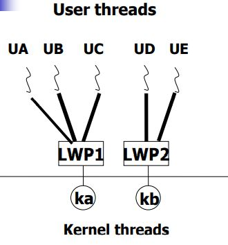

## Multithreaded Programming
> Thread가 왜 필요한가?     
> Thread가 어떤 역할을 하는가?    
> Thread가 사용되는 환경
 

# Thread의 동기
많은 프로그램들이 여러 task를 가지고 작업을 하지만 그것들 중에서 Process가 될 필요가 없는 것이 존재함 (그냥 여러개의 작업만 하면 되는 것들이 존재함)     
> ex) syncronization, web server     
- Web server의 경우
    - server가 여러 사용자들에게서 reqeust를 받으면,
    - server는 각각의 요구사항에 맞는 일을 수행하기 위해 Process를 만들어야 한다.
    - 하지만 같은 작업을 반복해서 하기 위해 그때마다 Process를 만드는 것은 비효율적이다.
        - Program Code, Resource 등 같은 내용을 쓸 수 있는데 이때 새 Process 생성은 너무 비효율적
    - 이는 resource-intensive, time-consuming
    - 따라서, multithreading mechanism가 요구됨

Thread: 실행하는 Context

- 변하지 않는 데이터를 Shared Resource 영역에 넣어둔다.
    - code
    - data
    - files
- 런타임 중에 계속 변하는 데이터 Dynamic한 데이터들을 한 개가 아닌 여러개로 두어 Multi-Thread로 만듦
    - register
    - stack
- 즉, 시간이 지나도 변하지 않는 데이터들만 공유를 한다.
- 종류
    - Single-threaded Process
        - Process에서 PC를 하나 받아서 실행하는 한 개의 실행 Context
        - PCB가 1개이다.
    - Multi-threaded Process
        - Sinlge thread가 여러개 존재함
        - Process 안에 실행 Context가 하나 이상인 경우
        - PCB가 Thread 개수만큼 있다.

## Multi-threaded Process 장점
- Responsiveness
    - Single-threaded일 경우 다른 작업이 들어왔을 때 이전 작업이 끝나고 들어온 작업을 수행할 수 있음
    - 하지만 Multi-threaded는 그 작업과 상관없이 그저 다른 Thread 위에서 작업을 수행하면 된다.
- Resource Sharing
    - 자원을 공유를 함으로써 메모리를 더 효율적으로 사용이 가능함
- Economy(성능 측면)
    - Process를 계속해서 새로 생성하는 것이 아니고 Thread를 생성하기 때문에
        - 훨씬 적은 메모리 공간만 할당하여 Overhead가 적다.
    - Context Switching에서도 Overhead가 더 적다.
- Utilization of MP (multi-processor) Architectures
    - 최근의 Issue이다.
    - Multi-Process 환경에서 프로그래밍을 하면 User Program이 Multi-Process를 사용할 수 있도록 작성되어야 한다.
        - 즉, Multi-Processor의 효과를 얻기 위해서는 Parallel Program으로 작성되어야 한다.
        - 하지만 이렇게 작성하는 것은 상당히 어렵다.
    - Thread model로 작성하면 Parallel Programming이 덜 어려워진다.
        - 즉, Multi-Process로 작성하는 것보다 Multi-Threaded로 작성하는 것이 더 쉽다.
            - IPC없이 작성 가능

## Fundamental Concepts
Process와 Thread의 관계
- Process는 여러 개의 Thread와 여러 Resource로 구분할 수 있다.
    - set of Thread
        - Process 안에서 Control이 바뀌는 Dynamic Object이다.
        - 이것이 하나일 수도, 여러 개 일 수 있다.
    - colletion of Resource
        - 파일, 코드 등 바뀌지 않는 내용들
        - 이 부분은 모두 공유를 한다.

## Multicore Programming
Types of Parallelism
- Data Parallelism
    - 처리해야 할 여러 데이터들이 똑같은 패턴을 가지고 있을 때
        - 여러 개의 코어로 나눈 후 같은 작업을 반복해서 하는 것
    - ex) SIMD(e.g. GPU)
- Task Parallelism
    - 여러 개의 multi core에게 서로 다른 데이터들을 약간 다르도록 연산을 함
    - ex) Web server
        - code는 하나뿐이나 Request에 따라 다른 Data로 다른 결과를 도출 함

### 왜 Multicore Programming이 어려울까
- Identifying task
    - task가 무엇인지 잘 이해해야 함
- Balance
    - task를 잘 분배해야 한다.
    - multi core의 현재 상태를 잘 알아야 분배를 잘 할 수 있다.
    - 가급적 많은 CPU가 쉬지 않고 일을 하게 한다.
- Data splitting
    - 데이터를 잘 나누어서 CPU에 작업을 시킨다.
- Data dependency
    - 데이터를 사용할 곳에서 제대로 사용할 수 있도록 프로그램을 짜야한다.
- Testing and debugging
    - 문제가 발생 했을 때 확인을 하고 디버깅을 하는 것이 어렵다.

이를 Process 기반으로 하여 프로그래밍을 하는 것은 매우 어렵다.    
따라서, Multi-Threading Model로 프로그래밍을 한다.

# Multi-Threading Model
- Kernel thread
    - 커널이 관리하는 쓰레드이다.
        - OS가 관리함
    - Kernel Thread는 Kernel 안에 구현되기 때문에 다른 프로세스와는 아무런 관련이 없다.
    - 커널 안에 쓰레드 1개
- User thread
    - User 영역에서 만들어지는 Thread
    - Kernel 위에서 만들어진다.
    - thread library에 의해 관리가 된다.
    - 생성될 때는 Kernel과 무관하게 만들어질 수 있다.

Thread가 만들어지면 System call에 의해 만들어진다.    
또한 Thread의 생성과 소멸 Kernel의 역할이 중요하다.    
하지만 Kernel Thread와 User Thread는 분리가 되어있다.    
이를 연결해주는 것이 Lightweight process(LWP)이다.
- Lightweight process(LWP)
    - 프로세스가 아닌 **Data Structure**이다.
    - Kernel thread와 연동이 되어 User Thread에서 필요한 여러 작업들을 관리
    - Kernel thread에 대한 정보를 추상화 하여 User가 사용할 수 있도록 한다.
    - Kernel Thread와 User Thread 사이에 Mapping을 해준다.
    - 각 LWP는 Kernel Thread와 붙어있다.
        - 만일 Kernel Thread가 block되면, 그와 Mapping되어 있는 LWP도 block됨
            - 그와 또 연결된 User Thread도 block
        - chain 역할을 한다.

## Kernel & LWP & User

ka, kb: Kernel Thread    
UA~UE: User Thread
- Kernel은 User Thread의 존재를 할지 못한다.
    - Kernel은 Kernel Thread만 관리할 뿐 User영역은 관리하지 않는다.
- 만일 ka가 block된다면, 이와 연결되어 있는 UA, UB, UC 또한 block된다.
    - 하지만 kb에 물려있는 UD, UE는 상관없이 잘 돌아간다.
- Kernel이 ka를 Scheduling 하면 ka에 물려있는 UA, UB, UC를 나누어서 작업을 한다.
    - 이를 LWP가 한다.
- 만일 UA가 I/O를 호출한다면,
    - ka가 Wating으로 들어간다.
    - 이 후 kb가 다음 일을 수행한다.
        - ka의 waiting이 끝나야 ka의 일을 수행한다.
- 프로세서는 User Thread의 존재를 알지 못한다.
    - 반드시 Kernel Thread 단위로 작업을 수행한다.

## Kernel Thread와 User Thread의 Mapping
- Many-to-One
    - user Thread 다수 kernel thread 한 개
    - 장점
        - 빠르고, overhead가 작다.
    - 단점
        - 한 개밖에 없는 그 Thread가 block된다면, 전체 Process가 blcok된다.
        - multi cpu가 있더라도 성능 향상이 되지 않는다.
- One-to-One
    - user Thread 하나 당 kernel thread 한 개
    - 장점
        - 다른 Thread가 block되더라도 전혀 상관없다.
        - User Thread 모두가 각각의 CPU에 할당이 가능하다.
    - 단점
        - User Thread 하나를 만들면 Kernel Thread도 하나 만들어야한다.
            - overhead가 크다.
    - Linux의 경우 One to One Model을 따른다.
        - Linux는 Thread와 Process를 구분하지 않는다.
        - 따라서, 프로세스 안에 Thread가 여러 개 있다면, 각 Thread 별로  Process Descriptor가 각각 생긴다.
- Many-to-Many
    - user Thread 다수 kernel thread 다수
    - User Thread 보다 작거나 같은 수만큼 Kernel Thread 생성
    - Many-to-one과 One-to-One의 Hybrid 이다.
    - 장점
        - User Thread를 만들더라도 Kernel Thread를 꼭 만들지는 않는다.
        - Multiprocessors에서 Parallel를 돌릴 수 있다.
        - 하나의 Thread가 Blocking이 되더라도 scheduler가 다른 Thread로 Mapping을 해준다.
- Two-level model
    - Many-to-many model + one-to-one model

# Thread libraries
Thread libraries: Thread를 만들어낼 수 있는 Library    
User가 사용할 수 있도록 API를 제공함     
 

Thread Library 제공방식
- 모두 User Space에서만 이용하도록 하는 방식
    - Library가 User의 요청에 의해 Thread를 만들 때 User Space에서만 일을 하여 Thread를 만듦
    - 보통 User Thread를 만들고 Kernel Thread와 무관하게 LWP에 부착할 때 구현
    - System call이 없다.
- Kernel-level에서 지원이 될 수 있도록 하는 방식
    - System call이 존재.
    - One-to-One일 경우 사용

## Three primary thread libraries
- POSIX Pthreads
    - UNIX에서 사용하는 Thread 모델
    - kernel- or user-level library를 제공
- Win32 threads / Linux
    - One-to-One Model
    - kernel-level library만 제공
- Java threads
    - host system이 무엇이냐에 따라 다르다.
    - 윈도우면 윈도우를 따름

# Threading issues
fork(): Process 만들기    
fork()를 할 때 메모리를 복사를 수행한다.     
하나의 Thread에서 fork()를 호출하게 되면 나머지 Thread들은 어떻게 되는가?
1. 모든 Thread를 복사
    - exec()를 호출하지 않는다.
2. 호출한 Thread만 복사
    - exec()를 명시적으로 호출을 한다.

위 두가지 모두 지원을 하되, 사용자가 선택을 해서 사용

## Thread cancellation
- cancel: thread가 정상적으로 끝나기 전에 종료가 됨
- Target Thread: cancel을 할 thread
- Cancel의 두 가지 방식
    - Asynchronous cancellation 
        - 중지 버튼을 누르면 즉시 중지함
    - Deferred cancellation
        - target thread가 아무때나 cancel을 하면 위험할 때
        - Safe Cancellation Points까지 Delay를 시키고 중지를 함

### Signal handling
- Signal
    - UNIX에서 필요에 따라 다른 Thread들에게 어떤 정보를 전달하는 Mechanism 
    - 특정 Process에게 Particular event가 발생했다고 알려주는 것
    - Signal은 번호가 있다.
        - Target Process의 번호가 할당이 됨
- Signal의 방법
    - Synchronous signal
        - CPU나 Memory와 동기화
        - Ex) Illegal memory access, divide by zero
    - Asynchronous signal 
        - 컴퓨터 내부와 동기화 없이 언제든지 신호를 보낼 수 있음
        - Ex) Ctrl + C
- Signal Handler
    - A default signal handler 
        - Kernel이 기본적으로 해주는 handler
        - ex) Timer
    - A user-defined signal handler
        - user가 작성하고 Kernel에 등록을 해주어야 한다.

### Signal Issue
signal에는 누구에게 보내줄 지에 대한 Process ID(다른 것일 수 있음)가 들어가게 된다.    
Multi-Thread인 경우 어떤 Thread에 적용이 되어야 하는가
- 알고 있다면 해당 Thread에 적용
- 해당 프로세스의 모든 Thread에 전달
- 전체 중 일부 Thread에만 전달
- Signal마다 어떤 Thread에 전달할건지 구체적으로 알려줌
- Example
    - Division by zero 1. 
    - `<control><c>` 2.
    - POSIX API
        - `pthread_kill (pthread_t tid, int signal)`
        - pthread id를 같이 알려줌

## Thread pools
- Motivation
    - 만일 무한정 Thread를 만들 수 있다면 System resource들을 Thread만드는데 다 사용한다.
- Thread pool
    - Kernel Thread의 수 제약을 둔다.
    - 그 수 내에서만 생성한다.
    - 뿐만 아니라 그 만한 수의 Thread를 미리 만들어 둔다.
        - wait상태에서 기다리고 있다가 사용 시기가 오면 하나씩 꺼내서 사용한다.
- 장점
    - Kernel Thread를 만들 필요가 없으므로 더 빨라진다.

## Thread-specific data
Thread를 새로 만들 때
- dynamic한 공간을 새로 만들어서 할당 받는 경우
- 원래 있는 것들을 공유하는 경우

Thread-specific data
- Thread별로 따로 사용할 수 있는 데이터 공간
- Thread 별로 따로 관리

## Scheduler activations
Many-to-Many and two-level models의 경우 Thread Library들 간에 정보 관리나 전달이 필요할 수 있다.
- Kernel Thread에 mapping 되어있는 User Thread 중 하나가 waiting을 한다면, 나머지 Thread도 멈춘다.
    - 이때 멈출 필요 없는 Thread들이 다른 Kernel Thread로 mapping될 필요가 있다.
- 특정 Kernel Thread에서만 계속해서 User Thread가 묶일 수 있다.
    - 다른 Kernel Thread에서도 balance하게 mapping을 해줄 필요가 있다.

이는 LWP의 수에 따라 효율적이게 돌릴 필요가 있다.
- CPU-bound application에서는 하나의 LWP만 있어도 충분하다.
    - 빠르게 처리가 되기 때문
- I/O가 많은 경우는 LWP가 많이 필요하다.
    - waiting 될 때 빠르게 다른 Kernel Thread와 mapping을 해줘야 함

### Upcall
- LWP가 block이 될 필요가 없는 Thread를 다른 LWP로 연결시켜 주어 running 가능한 상태로 만듦
    - Kernel thread 몰래 수행
- Upcall
    - LWP를 통해서 User Process에게 어떤 정보를 바꿀 수 있도록 하는 Mechanism
- upcall handler는 LWP 안에 있다.
- Upcall의 역할
    - User thread와 Kernel Thread 사이에 정보를 소통시켜줌
    - Kernel thread의 숫자를 적정한 숫자로 유지시키기 위함