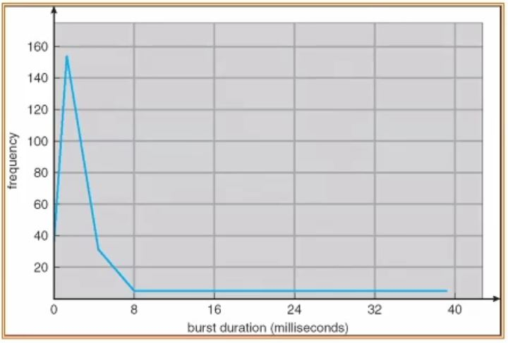
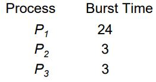
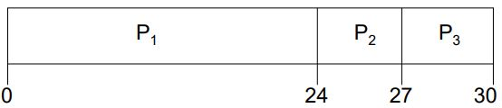
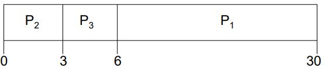
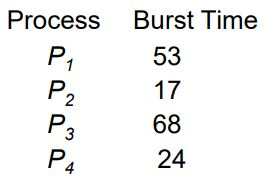
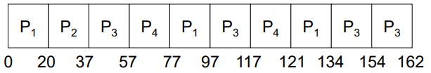

# Process scheduling

## Motivation of Scheduling
컴퓨터 시스템 내에서 프로세스가 여러 개 존재할지라도 실제로 실행되기 위해서는 CPU를 활용해야 실행이 된다.    
하지만 실행하고자 하는 프로세스에 비해 CPU의 수는 너무나도 제한적이다.

Solution: CPU가 1개, 프로세스가 여러 개 일때
- CPU Schedule
    - 시간을 적절히 나누어서 모든 프로세스가 CPU를 사용할 수 있도록 함

### 목표
CPU를 누가 언제 어떻게 쓸것인지 정해야 함    
어떤 알고리즘을 통해 우선순위를 정하고 CPU를 사용하게 함    
이때 사용하는 알고리즘이 Scheduling algorithm이다

# Concepts of Scheduling
Process의 성질
- 일반적으로 Process는 CPU를 사용해야 실행이 된다.
    - Program 안에 들어가 있는 SW들이 실제로 실행되는 순간이 CPU가 실질적인 일을 함
        - 이 순간을 CPU burst라 한다.
- CPU를 사용하다 특정 시점에 주변 장치의 자료를 받는다.
    - 파일의 형태로 읽거나 쓰거나 한다.
    - 파일은 TEXT일 수도 있으나 Network Interface, Device 등을 의미
        - Network Interface, Device 등을 File의 형태로 관리한다.
    - 이 동안에는 CPU에서 할 일이 없다.
        - 이 순간을 **I/O burst**라고 한다.
- 즉, CPU burst와 I/O burst를 번갈아가며 수행함
    - Process에 따라 CPU burst가 더 길거나 짧을 수 있다.
        - CPU-intensive
            - CPU burst가 더 길 경우
            - 이 Process가 많을 경우 CPU Scheduling을 더 길게 잡는 것이 더 효율적
        - I/O-intensive
            - CPU burst가 더 짧을 경우
            - 이 Process가 많을 경우 CPU Scheduling을 자주 바꾸는 것이 효율적

#### Histogram of CPU-burst Times

위 Histogram을 보면, 일반적으로 burst duration이 짧은 경우가 매우 많고, 반대로 긴 경우가 훨씬 드물다.

## CPU scheduler
- 어떤 프로세스가 CPU를 사용할 것인가를 골라주는 `Kernel의 프로그램 코드`
    - ready상태의 process들이 있을 때 그 중 하나만 골라 CPU 할당
- 언제 Process를 CPU에 올릴 것인가?(중요함)
    1. 현재 실행하고 있는 Process가 waiting 상태로 갈 때 
    2. 현재 실행하고 있는 Process가 ready 상태로 갈 때 
    3. waiting에서 ready 상태로 넘어갈 때
    4. 특정 Task가 끝났을 때

## Type of Scheduling
scheduler는 Kernel call이다.
- Nonpreemptive scheduling
    - 우선순위가 높은 프로스세가 들어올 때 이전 프로세스가 끝날 때까지 기다림
    - 할당된 CPU 시간을 기다려 줌
        - Time Slice로 시간이 할당됨
    - 프로세스가 특정 event가 발생하면 CPU를 놓아줌
        - e.g. I/O or Synchronization
    - Overhead가 줄어듦
        - 이전의 프로세스가 정상 종료가 되었기 때문
- Preemptive scheduling
    - 우선순위가 높은 프로스세가 들어올 때 이전 프로세스를 내쫓고 CPU를 차지함
    - block 상태에서 ready 상태로 되면 바꾼다.
        - block -> e.g. waiting
    - 또는 shared data access가 존재할 경우
    - Timer interrupt가 발생할 경우
    - 이 경우 Overhead가 존재함
        - 이전 프로세스가 하던 일을 중단해야하고 나중에 다시 이어서 해야 함

> 대부분의 UNIX 시스템은 context switch가 발생하기 전에 system call이 호출이 되서 실행하게 된다.: Non-preemptive kernel     
> Non-preemptive kernel은 real-time computing에 맞지 않다.

## Interrupt
Interrupt: HW의 외부 event를 알려주는 mechanism이다.   
CPU는 Interrupt가 발생하면 하던 일을 중단하고 즉시 Interrupt routine을 처리하게 된다.
- Example
    - Linux 2.6에서 Interrupt가 발생했을 때
        - Kernel은 하던 일을 중단하고 exception handler를 수행한다.
        - 하지만 Interrupt를 처리하고 있는 중에는 Interrupt가 또 들어오더라도 처리는 불가하다.

## Dispatcher
Dispatcher: 실제 다음 실행할 프로세스를 CPU에 할당시키고 여러가지 실행 준비를 함
- 실행 알고리즘을 Scheduler 실제 구현된 module을 Dispatcher라 한다.

- 하는 일은 Short-term Scheduler에 의해 선정된 프로세스에게 CPU의 control을 넘겨준다.
    - context switching
    - User mode로 전환
    - User program에 시작주소를 Program Counter를 통해 jump한다.
- Dispatch latency
    - 한 프로세스를 중단하고 다른 프로세스를 시작하는데 걸리는 시간
    - dispatch를 하는 것 자체도 overhead가 크다.

# Scheduling Criteria

다음의 기준으로 Scheduling이 좋은지 안좋은지 판단
- CPU utilization 
    - CPU를 가능한 한 바쁘게 일을 계속 시키는 것
    - 좋으면 좋을수록 좋음
- Throughput 
    - 주어진 시간 동안 프로세스들이 많이 끝나게 하는 것
    - 좋으면 좋을수록 좋음
- Turnaround time 
    - 실행 시작부터 프로세스가 된 후 그 프로세스가 종료될 때 까지의 시간
    - 짧을 수록 User 입장에서 좋아 보임
- Waiting time 
    - ready상태에서 기다리는 시간
- Response time
    - User에게 빠르게 결과물을 보여주는 시간

## Optimization Scheduling Criteria
- Maximize CPU utilization
- Maximize throughput
- Minimize turnaround time 
- Minimize waiting time 
- Minimize response time
- Average ? 
- Variance ?

# Scheduling Algorithms

## First-Come, First-Served (FCFS) Scheduling
- Ready queue에 먼저 들어온 프로세스에게 CPU를 할당함
- 장점
    - Ready queue를 관리하기가 쉬움
    - 비교적 공평함

### 비교

이 존재할 때 순서대로 P1, P2, P3을 실행할 경우와 최적의 조건을 사용해서 비교해보자.

- 그냥
    - 
    - 각 Wating time: P1 = 0; P2 = 24; P3 = 27
    - 평균 Wating time : (0 + 24 + 27)/3 = 17
- 최적화
    - 
    - 각 Wating time: P1 = 6; P2 = 0; P3 = 3
    - 평균 Wating time : (6 + 0 + 3)/3 = 3

훨씬 효율적임     
그냥 했을 경우를 **Convoy effect**라 한다.
- 긴 process 뒤에 짧은 process가 오는 경우
- 1개의 CPU-bound process가 있고, 많은 I/O-bound process가 있을 경우

## Shortest-Job-First (SJF) Scheduling
Convoy effect를 막기 위한 Scheduling 기법
- CPU burst가 짧은 process부터 먼저 처리하는 기법
- Two Schema
    - nonpreemptive
        - 일단 CPU 가 어떤 process에 할당이 되어 있으면 CPU burst가 끝날 때까지 기다려줌
    - preempiive
        - CPU burst가 진행 중에 더 짧은 프로세스가 들어온다면 선점을 허용한다.
        - 이는 Shortest-Remaining-Time-First (SRTF)
        - nonpreemptive보다 Average waiting time은 짧지만 Overhead가 더 크다.
            - Context switching이 더 많이 발생
- SJF는 최적이다.
    - 모든 Task에 대해 minimum average waiting time

### SJF의 CPU burst의 길이 계산
- 다음 CPU burst의 길이를 알아야 사용 가능함
    - 하지만 구체적인 길이는 알 수 없다.
- 일반적으로 같은 프로세스들은 같은 style 대로 프로그램을 실행 함
- 반복적으로 실행되는 경우 loop를 함
- 즉, 과거의 정보를 통해 미래를 예상할 수 있음
    - 이를 통해 CPU burst를 예상하고 계산을 함
- 과거의 History를 통해 어느정도 평균을 낸다.

이전 CPU burst의 길이를 바탕으로 지수 평균을 사용
- t_n
    - n번째 CPU burst의 실제 길이
- τ_(n+1)
    - 다음 발생할 CPU burst의 예상 값
- α, 0 ≤ α ≤ 1
    - 가중치
- Difne: `τ_(n+1) = αt_n + (1-α)τ_n`
- 극단값
    - α = 1
        - τ_(n+1) = t_n
        - 무조건 직전의 CPU burst만 보겠음을 의미
    - α = 0
        - τ_(n+1) = τ_n
        - 이전 History가 무엇이든지 상관안하고 초기 예상값 그대로 사용하겠음을 의미

## Priority scheduling
- 프로세스마다 차별을 두는 scheduling 방식
    - 어떤 프로세스는 더 자주 CPU에 할당
- 각 프로세스에다가 Priority Number을 할당해 준다.
    - Priority Number가 더 높은 프로세스에게 CPU를 더 자주 할당한다.
    - 일반적으로 숫자가 작을수록 우선순위 높음
- Preemptive와 Nonpreemptive로 구분하여 볼 수있음
- SJF는 Priority scheduling의 일종이다.
    - Priority scheduling에서 CPU burst time을 기준으로 삼음
- 문제점: Starvation(indefinite blocking)
    - Priority가 낮은 프로세스는 끝없이 ready상태로 대기하며 양보할 수 있다.
    - 그 프로세스는 시간이 지나도 CPU를 할당받을 확률이 낮아짐
    - waiting time이 무한정 길어질 수 있음
- Sol: Aging
    - 오랫동안 CPU를 못 받은 Process에게 우선순위를 점진적으로 높여준다.
- 대부분의 시스템이 Priority scheduling를 사용
- Priority 할당 방법
    - Static priority
        - 한번 번호를 할당하면 바뀌지 않는다.
    - Dynamic priority
        - 번호를 할당하더라도 추후 바뀔 수 있다.
        - ex_ Aging

## Round-robin scheduling
- 각각의 Process에게 CPU time의 작은 단위(time quantum)를 정해두고 그 할당된 시간만큼만 우선적으로 할당해 줌
- 그 할당된 시간이 끝나면 ready queue의 맨 뒤로 들어간다.
- n개의 process가 있는 ready queue에서 마지막 process의 최대 waiting time은 (n-1)q time이다.
    - q는 quantum time
    - 무한한 waiting time을 만들지 않는다.
- 만일 q가 길다면 FIFO(queue의 작동방식)을 따라 수행한다.
- 하지만 q가 짧다면 context switching이 자주 발생하여 overhead가 커진다.
- 일반적인 rule
    - 대부분의 CPU burst time보다는 time quantum을 조금 작게(80%) 한다.

SJF와 비교
- 
    - 다음과 같이 프로세스가 있고, q = 20일 때
    - 
    - 이와 같이 수행을한다.
- SJF보다 평균 turnaround time이 더 높다.
    - 하지만 response time이나 waiting time은 더 효율적일 수 있다.

## Multilevel Queue
Multilevel Queue: Ready queue를 여러 queue로 나누어서 관리하는 queue    
- queue마다 다른 알고리즘을 적용하기 위해서 만들어짐
- Example: foreground processes와 background processes를 따로 둠
    - foreground processes – RR
        - 당장 화면에 나오는 것, User가 반응하는 시간이 필요한 것
    - background processes – FCFS
        - CPU를 최대한 효과적으로 사용하는 것이 좋음
- 하지만 프로세스가 해당 알고리즘에 맞지 않고 다른 알고리즘에 적용할 필요가 있을 수 있다.
    - 이때, queue들 사이에서 교환이 필요함 즉 Scheduling이 필요
    - Example: Time slice
        - CPU의 시간을 일정분량 나누어서 각 queue에게 할당을 한다.
        - 위의 경우 background가 CPU 점유율이 낮으므로 20%를 보장해준다.
        - 나머지 80%를 foreground가 가져감

## Multilevel Feedback Queue
- Multilevel Queue를 만들어두고 프로세스들이 여러 Queue를 돌아다닐 수 있도록 한 것
- Multilevel Queue를 더 잘 관리하기 위해 만들어진 방법
- 다음의 파라미터들이 필요하다.
    - queue의 수
    - 각 queue의 scheduling algorithms
    - 어떤 경우에 process priority가 올라가는지, 내려가는지 결정하는 기준 방식
    - 실제로 queue를 옮겨갈 수 있는 mechanism
