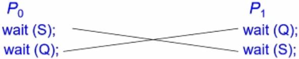
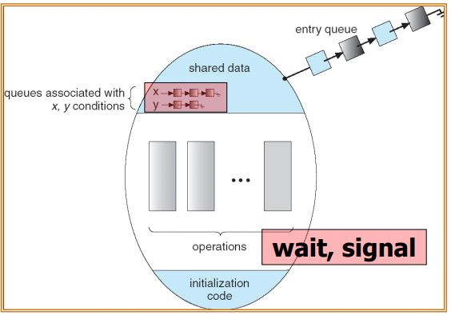

# Process synchronization
프로세스들은 독립적으로 따로 일을 한다고 가정하고 Ch5까지 진행해 왔다.    
하지만 실제로는 Process들이 서로간에 간섭, 상관있는 경우가 대다수이다.    
그들간에 Communication, Process synchronization을 이 Chapter에서 다룬다.

## 왜 Process synchronization가 필요한가
- 공유 자원에 데이터를 Update할 때 문제가 발생함
    - 공유 자원에 데이터를 읽어가기만 할 때는 문제가 발생하지 않지만
    - 어떤 프로세스가 공유 자원에 있는 데이터를 Update를 하면서 다른 프로세스들이 이 자원이 Update되고 있음을 모르면 문제가 된다.
        - 데이터 불일치(inconsistency)를 야기함
- Race condition
    - 공유자원에 동시에 접근하려고 하는 프로세스가 존재할 때를 일컫음
    - 여러 Process가 같은 data에 대해 동시에 작업을 하려고 할 때를 일컫음
        - 이 시기 중 적어도 하나 이상의 프로세스가 data를 변경하고자 할때를 말함

<br>

Example: Race condition을 발생시키는 C 예제를 보자.    
- Producer
    ```c
    while (true) {
        /* produce an item and put in nextProduced */
        while (count == BUFFER_SIZE)
            ; // do nothing
        buffer [in] = nextProduced;
        in = (in + 1) % BUFFER_SIZE;
        count++;
    }
    ```
    - buffer에 데이터를 계속해서 추가한다.
- Consumer
    ```c
    while (true) {
        while (count == 0)
            ; // do nothing
        nextConsumed = buffer[out];
        out = (out + 1) % BUFFER_SIZE;
        count--;
    }
    ```
    - buffer에 데이터를 계속해서 꺼내간다.
- count++/count-- 작업은 어셈블리 언어에서 3줄의 명령어로 실행된다.
    - 즉, atomic한 작업이 아니다.
    - 따라서, 이 count++/count--같은 작업을 atomic하게 만들어줄 필요가 있다.
- Atomic Operation으로 만들기
    - Atomic Operation으로 만드는데 운영체제 Kernel이 어떤식으로 작업을 하는지에 따라 차이가 날 수 있다.
        - Nonpreemptive kernel 
            - 구현하기 쉬움
            - Windows XP, Windows 2000
        - Preemptive kernel 
            - race conditions이 다양하게 발생할 수 있음
            - More suitable for real-time programming
            - Linux kernel 2.6

# The Critical-Section Problem
- The Critical-Section Problem: n개의 프로세스가 shared data에 접근하고자 할 때 생기는 문제
- critical section
    - shared data에 접근하는 code segment들을 일컫음
    - shared data에 실제로 접근하는 프로세스들
- shared data에 접근할 때 접근한다고 section 처음에 들어감을 표현해 줌
    ```c
    do{
        Entry section
        Critical section
        Exit section
        Remainder section
    } while(1);
    ```
    - Entry section를 앞에 붙임으로써 작업하는 것을 표현함
    - Exit section를 하면서 작업을 종료함
- 하지만 각 프로세스는 프로세스들 간에 공유하는 공간이 없다.
    - 따라서, 다른 프로세스들이 볼 수 있는 장치가 따로 필요하다.
    - 다음의 [solution](#solution)에서 확인

### The Critical-Section Problem을 해결하기 위해 지켜야 할 3가지 조건 
1. Mutual Exclusion
    - Pi라는 프로세스가 Critical section에서 실행중일 때 다른 어떤 프로세스들도 critical section을 수행하지 않는다.
2. Progress
    - Critical section에서 아무도 수행하고 있지 않을 때 Process가 Critical section에 진입하여 바로 일을 수행함
3. Bounded Waiting
    - 시간을 정해두고 일정 시간이 지난 후 이 Critical section에 들어가서 일을 해야 함
    - 조금은 기다릴 수 있으나 무한정 기다리는 것을 막아야 함
    - 들어가는 것을 보장함

## Solution
### Peterson’s Solution
Flag와 turn을 두어서 자신의 차례인지 판단하는 방식
- Pi Process
    ```c
    do {
        flag[i] = TRUE;
        turn = j;
        while ( flag[j] && turn == j); // 현재 j가 사용하고 있음

        critical section

        flag[i] = FALSE;
        remainder section
    } while (1);
    ```
- Pj Process
    ```c
    do {
        flag[j] = TRUE;
        turn = i;
        while ( flag[i] && turn == i); // 현재 i가 사용하고 있음

        critical section

        flag[j] = FALSE;
        remainder section
    } while (1);
    ```

- 3가지 조건 check
    1. Mutual Exclusion
        - flag[i]와 flag[j]가 True이더라도,
        - turn이 i이자 j일 수는 없다.
        - 따라서, 만족함
    2. Progress
        - flag[i]와 flag[j]가 True이면,
        - turn이 i를 수행 후 j로 변경되면 즉시 Pj가 실행된다.
        - 따라서, 만족함
    3. Bounded Waiting
        - 1번에 따라 이도 만족함

### Shared Data에 하나씩만 접근하게 함
- 이 때 Critical-Section Problem을 해결하기 위한 3가지 조건을 보장해줘야 한다.
- Binary semaphore
    - **mutex**라는 것을 Key로 사용하여 이 Key를 가지고 있는 Task만 Shared data에 접근할 수 있다.
    - 그 Key는 단 한 개만 존재
    - Mutex가 없는 Task들은 대기상태로 있는다.
    - 즉 1과 0의 값으로만 판단하는 방식
- Waiting array

# Synchronization Hardware
Synchronization는 Atomic Operation을 보장하기 위해 Synchronization Hardware를 필요로 한다.
- Peterson’s algorithm
    - 단점
        - Busy waiting
        - Implementation difficulty
    - 따라서 다른 구현 방식이 필요함
- Uniprocessors(단일 프로세서) – Interrupt를 막아버림
    - 공유 자원이 문제가 생기는 것은 Context Switching으로 프로세스가 바뀌면서 데이터를 변경하면서 발생한다.
        - 따라서, 이를 애초에 막아버림
    - 하지만 MultiProcessor에서는 의미가 없음
- 요즘은 HW적으로 Atomic Operation으로 끝낼 수 있도록 여러가지를 지원함
    1. 메모리를 읽으면서 업데이트를 한다.
        - 하나의 명령어에서 읽기와 쓰기를 수행함
        - 두 가지의 명령을 하나로 통합시킴
        - test memory word and set value
    2. 두 개의 데이터를 swap
        - swap contents of two memory words

### Solution to Critical-section Problem Using Locks
Critical-Section이 있다면 Lock(key)을 획득을 하여 접근할 수 있도록 함
```c
do { 
    acquire lock 
    critical section 
    release lock 
    remainder section 
} while (TRUE);
```

## TestAndSet
- SW적인 개념
    ```java
    boolean TestAndSet (boolean *target)
    {
        boolean rv = *target;
        *target = TRUE;
        return rv:
    }
    ```
    - 실제로 구현되어있다는 뜻이 아님
    - 위 코드 설명은 다음과 같다
        - target의 값을 읽어서 Return을 해주면서
        - 동시에 target의 값을 TRUE로 변환해준다.
    - 이를 Atomic Operation으로 HW가 구현되어 있어야 함
- 사용 예제
    ```c
    do {
        while (TestAndSet(&lock)) ;
        critical section
        lock = FALSE;
        remainder section
    } while(1);
    ```
- 만일 TestAndSet()이 Atomic하지 않는다면?
    - 위 코드처럼 Atomic하지 않는다면, `boolean rv = *target;`에서 다른 프로세스가 read할 수 있다.
    - 문제 발생
- Compare it with Peterson’s solution
    - 알고리즘 자체적으로는 유사한 형태를 띈다.
    - 다만 TestAndSet이 Atomic함으로써 동시에 read되는 상황을 막는다.

## Swap
- Algorithm
    ```c++
    while (true) {
        key = TRUE;
        while ( key == TRUE)
            Swap (&lock, &key);
        // critical section
        lock = FALSE;
        // remainder section 
    }
    ```
    - 먼저 key를 TRUE로 초기화 해줄 필요가 있다.
    - 그리고 LOCK의 값과 key의 값을 계속해서 swap을 수행한다.
    - LOCK이 False가 되었을 때, key와 swap되면서 while문에서의 block이 뚫린다.

## TestAndSet & Swap Problem
- Proverty 1, 2는 만족할 수 있다.
- 하지만, Proverty 3는 만족하지 못 할 수 있다.
    - 프로세스가 3개 이상일 때, 모든 프로세스가 한 번씩 사용할 수 있는 장치가 마련되어 있지 않음
- 이를 위한 해결법
    - 

## Mutex Locks
- OS 디자이너는 프로그래머가 사용하기 쉽도록 메커니즘을 만들어야 한다.
- 가장 간단한 방법이 Mutex Locks
    - critical section에 접근하면 acquire()을 통해 lock을 검
    - 해당 작업이 끝나면 acquire()를 통해 풀어줌
- acquire & acquire을 Atomic하게 만들어주어야 함
- 하지만 busy waiting을 피할 수 없음
    - busy waiting을 통해 lock이 되는 것을 spinlock라 한다.

### acquire() and release()
- acquire() 
    ```c++
    acquire(){
        while (!available) 
        ; /* busy wait */ 
        available = false;; 
    } 
    ```
- release()
    ```c++
    release() { 
        available = true; 
    } 
    ```
- 사용
    ```c++
    do { 
        acquire lock
        critical section
        release lock 
        remainder section 
    }
    ```
# Semaphores
- Semaphore S: 정수 변수
    - 초기값은 1로 초기화 된다.
- Semaphore 메커니즘에 접근하기 위해서는
    - wait() and signal()을 이용하여 접근한다. 
        - 두 개의 함수 모두 Atomic하게 구현되어 있음
    - 초창기에 P() and V()로 사용했음
- wait and signal
    - wait()
        ```c++
        wait (S) { 
            while S <= 0
            ; // no-op
            S--;
        }
        ```
    - signal()
        ```c++
        signal (S) { 
            S++;
        }
        ```
    - Atomic Operation이다!
- 하지만 while S<= 0에서
    - spinlock이 걸려 busy time의 단점을 유발한다.
    - 이는 CPU의 자원낭비를 초래
    - 다른 solution이 필요

## Semaphore without busy waiting
- wait()함수가 사용되면 해당 프로세스는 waiting queue에 들어가면서 작업을 쉰다.
- Queue는 다음의 두가지 Data를 가지고 있다.
    - Value (of type integer)
    - pointer to next record in the list
- 이를 위해 두가지 Operation이 필요하다.
    - block
        - wait queue에 데이터를 보관
    - wakeup
        - wait queue에 데이터를 꺼내옴
- Semaphore
    ```c++
    typedef struct {
        int value;
        struct process *list
    } semaphore;
    ```
- wait and signal
    - wait()
        ```c++
        wait (semaphore *S) 
            S->value--;
                if (S->value < 0) { 
                add this process to S->list;
                block(); 
            }
        } 
        ```
    - signal()
        ```c++
        signal (semaphore *S) 
            S->value++;
                if (S->value <= 0) { 
                remove a process p from S->list;
                wakeup(P); 
        }
        }
        ```
- 이 방식은 while문이 없어서 busy waiting이 발생하지 않는다.
    - CPU time을 낭비하지 않음

## Deadlock and Starvation
Semaphore가 비록 busy waiting이 없다하더라도 Deadlock이 발생할 수 있다.
- Deadlock
    - 
    - 위 이미지와 같이 두 개이상의 공유 자원을 사용하려고 할 때
        - 두 프로세스가 서로의 자원을 가져가려고 할 때 발생
    - 두 프로세스가 다음 자원을 필요로 해서 각각 Block을 걸고 다음 자원을 서로 기다리는 상황에서는
        - 더 이상의 프로세스 진행이 되지 않는다.
- Starvation
    - 프로세스가 어디선가 정체되어서 semaphore queue로부터 벗어나지 못하는 상태
    - Ch8에서 다시 봄

## Issue in Semaphore
- Problem
    - 위 Deadlock and Starvation을 발생하지 않도록 구현하기가 매우 어려움
    - 또한, 이것을 작성해서 제대로 작동한다는 것을 제대로 보이기가 어려움
    - signal이 누군가가 풀어주기 전까지 전체 시스템이 진행 안될 수 있어
        - 시스템에 큰 영향을 끼침
- 위 문제로 인해 나온 Monitor
    - Monitors
        - synchronization을 제공하는 mechanism을 일종의 자료구조 즉, A high-level abstraction으로 제공
            - 이로 인해 더 쉽게 개발할 수 있도록 함

# Monitor
모니터 안에서는 공유자원을 쓰는 한 번에 한 개의 Process만 공유자원을 사용하도록 함
- 일종의 Data type이다.
    - shared data
    - shared data와 관련된 Operation
- wait이나 signal 등 공유자원을 제어하는 Operation과 공유자원들을 하나로 캡슐화한다.
    - 사용자는 그 캡슐화된 내용만 사용할 수 있도록 하고 다른 Operation에는 접근할 수 없도록 막는다. 
        - 내부 상세한 Operation은 모두 접근할 수 없도록 함
    - 여기에서 제공된 Operation만 외부에서 호출해서 사용할 수 있도록 함
- 외부 공개된 Operation만 가지고 접근을 함
- 외부에서 접근하려고 하는 프로세스들 중 접근을 못하는 경우는
    - entry queue로 대기상태로 만들어 둔다.
- 단점
    - User가 필요한 것만 가져다 쓰는 것이 아니므로 Overhead가 크다.
    - 굉장히 특이한 synchronization을 맞추기가 어렵다.
- Monitor는 Condition variables을 반드시 정의가 되어있어야 한다.

## Condition variables
공유자원을 접근하기 위한 보호장치의 조건을 집어 넣는 것
- x.wait ()
    - access 해보고 접근 가능한지 확인해 봄
    - 접근 불가하면 block
- x.signal ()
    - block된 것을 releas
- Condition variables은 한 개가 아니라 여러 개도 가능하다.
    - 다만 이 경우 복잡해 질 수 있음
- Monitor + condition variables
    - 

### Condition Variables Choices
- 만일 Process P가 signal을 Invoke 했을 때, Process Q가 wait에 suspension 있으면 어떤 일이 발생할까?
    - 일단 Q, P는 동시에 실행될 수는 없다.
    - 만일 Q가 resumed된다면, P는 wait상태로 간다.
- 두 가지 Option이 있다.
    - Signal and wait
        - P는 Q가 Monitor를 빠져나갈 때까지 혹은, 다른 condition을 체크를 해서 기다리는 동안 P가 계속 기다림
        - 즉, 먼저 기다린 프로세스를 먼저 값을 가져가도록 함
    - Signal and continue
        - 반대로 Q가 P를 기다림
- 이는 구현해주는 Language에 따라 Option이 달라진다.
    - ex) java, c#, etc..


## Monitor Implementation Using Semaphores
Monitor는 실제적으로 Semaphores를 이용해서 구현이 되어있다.
- Variables
    ```c++
    semaphore mutex; // (initially = 1) 공유자원
    semaphore next; // (initially = 0) 대기상태
    int next_count = 0;
    ```
- procedure F를 구현
    ```c++
    wait(mutex);
        …
        body of F;
        …
    if (next_count > 0)
        signal(next);
    else 
        signal(mutex);
    ```

### Monitor Implementation – Condition Variables
- Condition Variables x에 대해
    ```c++
    semaphore x_sem; // (initially = 0)
    int x_count = 0;
    ```
- Operation x.wait
    ```c++
    x_count++;
    if (next_count > 0)
        signal(next); // next: waiting queue
    else
        signal(mutex);
    wait(x_sem);
    x_count--;
    ```
    - next_count가 1 이상이라는 것은
        - 먼저 기다리고 있는 것이 존재함
        - 따라서, 먼저 기다리고 있던 값을 실행해주고
        - 그렇지 않을 경우 현재 값을 실행함
        - 실행 후 x_count를 감소시킴
- Operation x.signal
    ```c++
    if (x_count > 0) {
        next_count++;
        signal(x_sem);
        wait(next);
        next_count--;
    }
    ```
    - next_count를 증가시키고 기다림을 알림

## Resuming Processes within a Monitor
- 프로세스들은 기본적으로 먼저 들어왔던 것이 먼저 공유자원을 사용함(FCFS)
    - 하지만 FCFS는 반드시 좋은 것은 아니다.
    - 우선순위가 다른 것또한 먼저 들어온 것만 수행하게됨
- 위 문제를 위해 conditional-wait를 사용하여 waitng 시간을 달리 할 수 있다.
    - x.wait(c)
        - c는 우선순위 숫자

## A Monitor to Allocate Single Resource
```c++
monitor ResourceAllocator
{ 
boolean busy; 
condition x; 
void acquire(int time) { 
if (busy) 
x.wait(time); 
busy = TRUE; 
} 
void release() { 
busy = FALSE; 
x.signal(); 
} 
initialization code() {
busy = FALSE; 
}
}
```