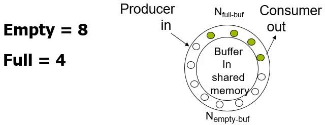
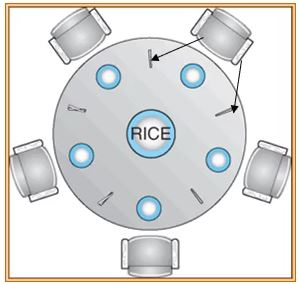

# Classic Problems of Synchronization
## Bounded buffer problem
- size가 정해져있는 Data 연결 통로
    - array처럼 data를 저장해서 사용
    - Round Queue 모양
- 
    - Producer가 data를 채워 넣음
    - Consumer가 data를 읽어 감
    - N: Buffer Size
- 3가지의 공유 변수
    - Binary
        - Semaphore mutex
            - buffer에 data를 채워넣고자 할 때 buffer에 접근이 가능한지 체크해주는 공유 변수
                - 하나씩만 접근 가능(Binary Semaphore)
            - 초기값 1
    - Counting: Producer와 Consumer 양쪽에서 관리하는 공유변수
        - Semaphore full
            - 가득찼는지 체크해줌
            - 초기값 0
            - Producer는 full을 증가시킴
            - Consumer는 full을 감소시킴
        - Semaphore empty
            - 비어있는지 체크해줌
            - 초기값 N
            - Producer는 empty을 감소시킴
            - Consumer는 empty을 증가시킴
### Producer in Bounded buffer problem
code
```c++
while(true){
    // produce an item
    wait(empty);
    wait(mutex);
        // add the item to the buffer
    signal(mutex);
    signal(full);
}
```
- `wait(empty);`
    - Data를 넣어주게 되면 empty라는 "공유자원"은 감소시켜야 한다.
    - 따라서, empty를 변경하기 위해 wait을 하고 감소시킨다.
- `wait(mutex);`
    - mutex에 접근하고 mutex를 획득한 후 buffer에 접근하여 Data 삽입한다.
- `signal(mutex);`
    - mutex를 사용했으므로 release를 한다.
- `signal(full);`
    - full을 증가시킨다.

### Consumer in Bounded buffer problem
code
```c++
while(true){
    wait(full);
    wait(mutex);
        // remove an item from buffer
    signal(mutex);
    signal(empty);
        // consume the removed item
}
```

## Readers-Writers Problem
- Write를 할 수 있는 Process를 따로 정해두고 나머지는 Read만 한다.
    - 이때 Write를 하는 Process를 Writer라 하고 Writer는 Read와 Write 두 기능을 모두 할 수 있다.
    - 나머지는 Reader라 하는데, 무조건 Read만 할 수 있다.
- Issue
    - 동시에 reader들이 read를 하고자 할 때 처리 방식
    - 동시에 writer와 reader들이 shared data에 접근하고자 할 때 처리 방식
    - etc..
- 여기서는 단 하나의 writer만 접근을 하고 reader들은 동시에 read를 처리하는 방식으로 Modeling되어 있음
- Shared Data
    - Semaphore
        - Semaphore rw_mutex
            - Write를 수행 중일 때 read를 하면 안되기 때문에 필수 조건임
        - Semaphore mutex
            - read_count의 공유 자원을 점령하기 위한 mutex
    - Integer read_count
        - Data를 Update 하고자 할 때 현재 Reading 하고 있는 여러 Data가 존재할 경우 Read Data들을 관리를 해야 한다.
        - 현재 Shared Data를 읽고 있는 Reader들의 수
### Writer in Readers-Writers Problem
code
```c++
do{
    wait(rw_mutex);
     ...
    // writing is performed
     ...
    signal(rw_mutex);
}while(true);
```
- rw_mutex를 획득했을 때 Update를 한다.

### Reader in Readers-Writers Problem
```c++
do{
    wait(mutex);
    read_count++;
    if(read_count == 1)
        wait(rw_mutex);
    signal(mutex)
     ...
    // reading is performed
     ...
    wait(mutex);
    read_count--;
    if(read_count == 0)
        signal(rw_mutex);
    signal(mutex);
}while(true);
```
- `wait(mutex)`
    - read_count를 증가시키기 위해 mutex를 잡는다.
- `if(read_count == 1) wait(rw_mutex);`
    - 현재 아무도 읽고 있지 않을 때만 rw_mutex를 얻을 수 있음
    - 즉, 첫번째로 들어오는 Process만 rw_mutex를 얻는다는 의미인데,
        - 이후로 들어오는 Reader들은 rw_mutex 없이 reading이 가능하다.
        - 이는 Writing이 진행되고 있지 않은 상태에서는 모두가 동시에 Read가 가능함을 의미함
- `signal(mutex)~wait(mutex)`
- `if(read_count == 0) signal(rw_mutex);`
    - 모든 Reader들이 read작업을 마쳤을 때
        - rw_mutex를 놓아준다.
    - 이후 Writer가 Update 작업을 수행할 수 있음

### Readers-Writers Problem Variations
- First variation
    - Reader가 하나라도 Read를 수행하고 있다면 다른 Reader들은 기다림 없이 바로 Read를 수행한다.
- Second variation
    - Writer가 Ready가 되면 기다리지 않고 바로 Write를 수행
    - Write가 진행되고 있는 중간에만 Reading을 막는다.
- etc..

## Dining-Philosophers Problem
- 
    - 여기서 젓가락 하나가 shared data가 된다.
- shared data
    - Bowl of rice(data set)
    - Semaphore chopstic[5]
        - 초기값 1
- Philosophers
    ```c++
    while(ture){
        wait(chopstick[i]);
        wait(chopstick[i+1] % 5);
        // eat
        signal(chopstick[i]);
        signal(chopstick[i+1] % 5);
        // think
    }
    ```
    - 즉 젓가락 두 개를 모두 획득을 해야 작업을 수행할 수 있다.
- 문제점: deadlock
    - 5개의 Philosophers가 각자의 i번째 chopstick을 점령하고 있다면
    - 그 다음의 i+1의 chopstick을 얻지 못하고 무한정 기다린다.
- Solution
    - 만약 5개의 자리가 있으면, 5개 full로 채우지 못하게 하여 적어도 하나는 비워둔다.
    - `wait(chopstick[i]);`과 `wait(chopstick[i+1] % 5);`를 Atomic하게 만든다.
    - 각각의 Philosophers가 다르게 처리를 한다.
        - Example
            - Odd Philosophers
                - Left -> Right
            - Even Philosophers
                - Right -> Left

### Dining-Philosophers Problem with **Monitor**
Dining-Philosophers Problem의 solution 중 하나 Monitor를 이용한 해결책
code
<!-- 강의자료 올려주시면 코드 복붙 -->
- 알고리즘
    ```c
    monitor DP {
        enum { THINKING; HUNGRY, EATING) state [5] ;
        condition self [5];

        void pickup (int i) { 
            state[i] = HUNGRY;
        test(i);
        if (state[i] != EATING) self [i].wait;
        }

        void putdown (int i) { 
            state[i] = THINKING;
                // test left and right neighbors
            test((i + 4) % 5);
            test((i + 1) % 5);
        }

        void test (int i) { 
            if ( (state[(i + 4) % 5] != EATING) &&
                (state[i] == HUNGRY) &&
                (state[(i + 1) % 5] != EATING) ) { 
                    state[i] = EATING ;
                        self[i].signal () ;
            }
        }

        initialization_code() { 
            for (int i = 0; i < 5; i++)
                state[i] = THINKING;
        }
    }
    ```
- 사용 예시
    ```c
    dp.pickup (i)
    EAT
    dp.putdown (i)
    ```

# Synchronization Examples
## Windows Synchronization
- Windows는 uniprocessor system에서 interrupt를 mask시키면 context switching이 발생하지 않는다.
    - critical section에 한 Process만 접근하게 된다.
- MultiProcessor system에서는 [spinlock](./Chapter6.md/#mutex-locks)을 사용한다.
    - spinlock을 하고 있는 thread들은 선점을 못하도록 한다.
- user level에서 사용할 수 있는 dispatcher object들을 제공한다.
    - mutexex, semaphores, events, 과 같은 것들을 object 형태로 제공해서 user가 사용할 수 있도록 함

## Linux Synchronization
- 2.6v 이전까지는 interrupt를 disable 방식으로 처리했다.
- 하지만 그 이후부터는 선점형 커널을 사용한다.
- 제공 기능
    - Semaphres
    - atomic integers
    - spinlocks
    - reader-writer versions of both
- single-cpu system에서는 kernel 선점을 disable시키거나 enable시키는 방법으로 spinlock을 사용하기도 한다.

## Pthreads Synchronization
- Pthreads API
    - c처럼 Language에서 쉽게 사용할 수 있도록 OS independent하게 사용할 수 있는 쓰레드기반 Synchronization
- 제공 기능
    - mutex locks
    - condition variable

# Alternative Approaches
- user가 더 손쉽게 사용할 수 있는 다른 형태의 접근방법

## Transactional Memory
- read-write operation을 atomic하게 수행되도록 하는 Mechanism
## OpenMP
- Multiprocessor 환경에서 Programming 할 때 여러 Synchronization Mechanism을 제공해준다.
- Multi-Thread기반 Programming을 할 수 있는 API를 제공
- 기본적으로 parallel programming을 지원함
- 공유하는 data에 대해서 critical section으로 보호할것인지 결정하는 것을 선택이 가능함
    - `#pragma`를 이용해서 가능함
        ```c
        void update(int value){
            #pragma omp critical
            {
                count += value
            }
        }
        ```
        - 이렇게 선언을 하면 critical section으로 보호가 된다.
- 코딩하기에는 편하지만 성능상의 Overhead는 존재함
- 많이 사용함

<br>

# 5/11 출석 과제
- Odd Philosophers
    - Left -> Right
- Even Philosophers
    - Right -> Left
```c++
while(ture){
    wait(chopstick[i]); //pickup mine
    
    if(i%2 == 1) // Odd
       wait(chopstick[i+1] % 5); //pickup right chopstick
    else // Even
        wait(chopstick[i+4] % 5); //pickup left chopstick

    // eat

    signal(chopstick[i]); //putdown mine

    if(i%2 == 1) // Odd
        signal(chopstick[i+1] % 5); //putdown right chopstick
    else
        signal(chopstick[i+4] % 5); //putdown left chopstick

    // think
}
```