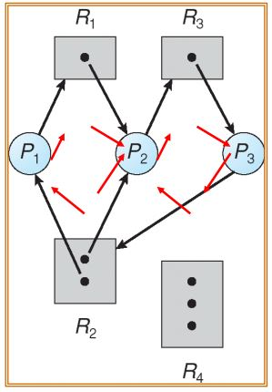
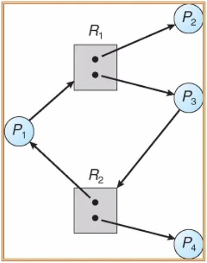

# The Deadlock Problem
- Deadlock
    - process set이 block상태가 되는 것
    - 어떤 프로세스가 다른 공유자원을 사용하기 위해서 기다리고, 또 다른 프로세스가 그 결과물을 기다리는 일련의 과정으로 인해 진행이 안되는 것
    - 상대방의 자원을 기다리는 상태
- disk 자원이든 semaphre 같이 모든 공유자원에 대해서 발생함

## Solve Problem
- Deadlock 회피
    - Deadlock이 발생할 수 있는 상황에서 미리 해당 프로세스를 다른 곳으로 옮겨 둠
- Deadlock 감지
    - Deadlock detection을 할 수 있는 방법은 2가지 이다.
- Deadlock 해결
    - Kill the process
        - 프로세스를 죽이고 새로 시작함
    - Deadlock recovery
        - Preempt the resource and rollback
        - process를 이전 상태로 되돌린다.
            - 컴퓨터 backup가 rollback 옵션이다.
- Deadlock 예방

따라서, 다음의 4가지 카테고리 위주로 접근
1. Deadlock detection
2. Deadlock avoidance
3. Deadlock recovery
4. Deadlock prevention

# System model
deadlock이 생기기 위해서는 꼭 공유 자원과 그것을 이용하는 프로세스가 존재해야한다.
- Resource type (Ri라 하자)
    - Physical resource
        - CPU cycles, memory space, I/O device
    - Logical resource
        - Files, semaphere
- Ri와 Wi의 임시 정의
    - Ri: resource type
    - Wi: Ri의 개수
- Process는 자원을 다음의 순서에 맞춰 이용한다.
    1. Request
    2. Use
    3. Release
    - Request와 Release는 semaphore나 system call을 이용한다.
## Deadlock 조건
다음의 4가지 조건을 모두 만족해야 한다.
- Mutual exclusion
    - 한 번에 하나의 프로세스만 공유 자원에 접근이 가능할 때
- Hold and wait
    - 한 프로세스가 적어도 하나의 자원을 holding하고 있고 다른 프로세스들은 해당 자원을 기다리고 있을 때
- No preemption
    - 선점이 안될 때
- Circular wait
    - 프로세스들 P0~Pn이 서로 P0가 P1을, P1이 P2를, ... 돌아서 Pn이 P0를 기다리는 상태
    - Deadlock의 Hold와 wait 상태를 graph로 그리면 Circular가 생성된다.

## Resource Allocation Graph
- Vertex
    - P = {P1, P2, ... , Pn}
        - 시스템에서 모든 프로세스들로 구성된 집합
    - R = {R1, R2, ... , Rm}
        - 시스템에서 모든 자원들로 구성된 집합
- Edge
    - request edge
        - directed edge Pi → Rj
    - assignment edge
        - directed edge Rj → Pi
- 그래프가 cycle이 생성된다면 Deadlock이 발생될 조건이 만족됨
    - 무조건 생긴다는 의미가 아님
- 그래프가
    - cycle이 없을 경우
        - **No deadlock**
    - cycle이 존재할 겨우
        - 각 자원이 하나의 instance만 존재할 경우
            - Deadlock
            - Cycle은 deadlock에 대해 **필요 충분 조건**이다.
        - 각 자원이 여러 instance를 가질 경우
            - Deadlock 발생 가능성이 존재
            - Cycle은 deadlock에 대해 **필요 조건**이다.
- 따라서, Cycle은 Deadlock Detection에 적합하지 않음
### Cycle graph with a deadlock
Deadlock이 생기는 Cycle

- P2 → R3 → P3 → R2 → P2
    - Cycle을 생성했다.
    - P3 또는 P2가 서로간 Release를 하지 않는다.

### Cycle graph with a no deadlock
Deadlock이 없는 Cycle

- R2 → P1 → R1 → P3 → R2
    - Cycle을 생성했다.
    - P4가 일정시간 지난 후 자원을 Release를 하므로 P3에 할당 및 Release
        - 연쇄 작용으로 Cycle 소실

# Methods for Handling Deadlocks
Deadlock 관리 방법
- System이 절대로 deadlock에 들어가지 않도록 하는 방법
- Deadlock에 들어가고 그것을 Detect 한 후 Recover하는 방법

## Deadlock Prevention
Deadlock 4가지 조건 중 하나의 조건을 만족시키지 않도록 하는 것
- 각 경우에 따라 이를 적용시키기 어려울 때가 있음
- 부작용이 존재할 수 있음
- 4가지 조건에 따라 보면 다음과 같다.

### 1. Mutual Exclusion
- sharable resource를 없도록 만든다.
- 사실상 불가

### 2. Hold and Wait
- 한 프로세스가 자원을 Request할 때 다른 리소스들을 hold 하지 않도록 보장하는 것
- 즉, 하나의 프로세스는 hold 상태에서 wait을 할 수 없음
    - 필요한 자원을 모두 hold 하고 그 후 시작을 할 수 있음
- 이를 통해 "Hold and Wait"를 사전에 막음
- 단점
    - resource utilization이 떨어짐
        - 프로세스는 여러 Resource들을 잡고 난 후에 진행할 수 있음
    - Starvation
        - 특정 프로세스가 사용하고자 하는 모든 Resoure들이 holding된 상태가 아니어야 실행 가능함

### 3. No Preemption
공유 자원에 대해 Preemption을 허용하는 것
- A 프로세스가 사용하던 공유자원을 B 프로세스가 선점해서 가져감
- 단점
    - Overhead가 너무 크다.
        - A가 사용하던 내용에 대해서 탈취되면서 이전 내용(공유 자원을 쓰지 않은 상태)으로 되돌려야 함
    
### 4. Circular Wait
- Cycle을 애초에 막는다.
- Cycle이 발생했는지 알기 위해서 모든 Resource와 각각의 Process에 대해서 번호를 할당한다.
- 순번이 순차적으로 높은 값에 대해 할당하도록 한다.
    - 재귀적으로 돌아가는 것을 막음으로 Cycle을 방지
- 단점
    - 모든 User Application이 이 순번을 지켜야 한다.
        - 매우 쉽지 않은 작업

## Deadlock Avoidance
Deadlock을 피할 수 있는 방법
- 사전 가정
    - 시스템이 현재 사용 가능한 추가적인 priori information 가지고 있고 그런 정보를 가지고 앞으로 사용할 자원에 대해서 사용 허가를 차별화해서 관리하는 것
        - 추가적인 정보
            - 어떤 프로세스가 자원을 얼마나 사용했는지
            - 앞으로 얼마나 자원을 더 사용해야 하는지, 
- 매우 간단하고 유용한 모델이다.
- 각 porcess들은 수행하면서 필요할 maximum number of resources를 선언한다.
- Resource를 요청할 때마다 System이 다음의 정보를 가지고 자원 할당을 결정한다.
    - the number of available resource
    - the number of allocated resources
    - the maximum demands of the processe
- Avoidance는 애초에 deadlock의 발생 가능성을 막는다.
    - safe 상태를 유지한다.
- state 분류
    - unsafe state
        - deadlock의 발생 가능성이 존재하는 상태
        - Deadlock Prevention으로 막는다.
    - safe state
### Safe State
- Resource Allocation과 관련된 상태
- Process가 사용 가능한 Resource를 Request할 때 시스템이 safe 상태인지 판단한다.
    - 판단 기준 - 사전 가정의 추가적인 정보를 판단 기준으로 삼는다.
    - 시스템이 safe 함을 결정하는 것은 다음과 같다.
        - P1~Pn까지 모든 프로세스들이 현재 진행하고 있는 프로세스 Pi에 대해 다음의 조건을 만족할 때
        - 현재 사용 가능한 자원과 모든 Pj(j < i)들이 잡고 있는 Resource들을 다 제공해줄 수 있어야 함
- Safe state 정리
    - Pi가 필요로하는 Resoure가 당장 필요로하지 않다면
        - Pi는 Pj가 끝날 때까지 기다릴 수 있어야 한다.
    - Pj가 끝났다면
        - Pi는 필요로하는 자원을 할당 받고 실행하며 할당된 자원을 돌려주고 끝낼 수 있다.
    - Pi가 끝난다면 위 작업을 반복하여 Pi+1가 할당받고 실행한다.
- Example
    - Table
        - Pi, maximum needs, current needs
        - P0, 10, 5
        - P1, 4, 2
        - P2, 9, 2
    - 12개를 사용 가능
    1. t0 시점에 사용 가능한 자원은 3이다.
        - 그렇다면, P1을 먼저 할당해주면 P1이 먼저 실행을 끝내고 자원을 반환한다.
    2. t1 시점에 사용 가능한 자원은 5이다.
        - P0을 할당하면 사용 중인 자원은 12로 safe 상태이다.
        - P0을 할당해주고 자원을 반환 해준다.
    3. t2 시점에 사용 가능한 자원은 12이다.
        - P2를 할당해주고 끝낸다.
    - 위와 같이 Safe state를 위해 프로세스를 스케쥴링 하는 것이 **Deadlock Avoidance** 이다.
- Reource type의 instance가 하나 뿐이라면
    - resource-allocation graph를 사용해서 해결한다.
- Reource type의 instance가 여러개라면
    - the banker’s algorithm를 사용해서 해결한다.

### Banker’s algorithm
- Multiple instance
- 4개의 Resource Count 정보를 저장하고 이용한다.
    - Available
        - 각 Resoure마다 사용 가능한 instance가 몇 개가 있는지를 저장하는 vector
    - Max
        - 각 Prcoess 별로 Resource들이 몇 개가 필요한지를 저장하는 n * m의 matrix
    - Allocation
        - 실행되는 i개의 Process들에 대해서 j개의 Resource를 할당한 정보를 저장하는 n * m의 matrix
    - Need
        - 각각의 process들이 앞으로 몇 개가 더 필요한 가에 대한 정보를 저장하는 n * m의 matrix
        - Need [i,j] = Max[i,j] – Allocation [i,j]
- 현재 Available한 Resource들로 끝낼 수 있는 Process 먼저 할당 해주고 끝나도록 해주는 작업
- Safe한 상태를 계속 유지해준다.
- 하지만 무작정 Avoidance가 좋은 것은 아니다.
    - 하나의 Process를 위해 다른 Process가 멈춰있기 때문에 Overhead가 매우 크다.
    - 따라서, deadlock이 된 상태만 해결하는 상황도 있다.

## Deadlock Detection
- Single instance
    - Resource-Allocation Graph를 그렸을 때 Cycle이 존재할 경우 Deadlock이라 판단
- Multiple instance
    - banker’s algorithm과 유사한 알고리즘를 이용해서 Detection한다.
    - 차이점
        -  Request(Need) 사용
            - 앞선 [banker’s algorithm](#banker’s-algorithm)에서 Need 정보를 Request로 사용한다.
        - In deadlock avoidance
            - Detection 아님
            - Need = Max – Allocation
        - In deadlock detection
            - Request = Max – Allocation

## Recovery
- Deadlock의 발생을 누군가에게 알리고 알아서 Deadlock을 처리할 수 있도록 함
    - ex) p_id를 알려주고 그 Process를 kill
- System이 Deadlock으로부터 자동적으로 Reover
- Deadlock을 해결할 수 있는 2가지 방법
    1. Process termination
        - Deadlock 걸린 모든 Process를 중단시킨다.
        - Deadlock 상태의 Cycle에서 하나의 Process부터 하나씩 중단시키면서 Deadlock을 해제시킴
            - 이 경우 어떤 프로세스를 죽일 때 고려해야할 사항이 있다.
                - 프로세스의 우선순위
                - 프로세스의 점유할, 점유한 자원의 양
                - 기타
    2. Checkpoint & rollback
        - 복구할 수 있는 시점을 어딘가에 저장해두고 문제가 발생하면 그 시점으로 돌아간다.
        - Rollback - safe state의 시점으로 돌아가거나 프로세스를 다시 시작함