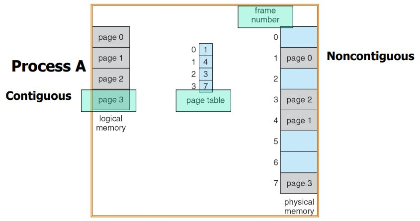
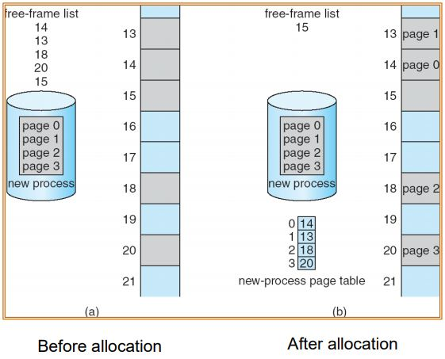
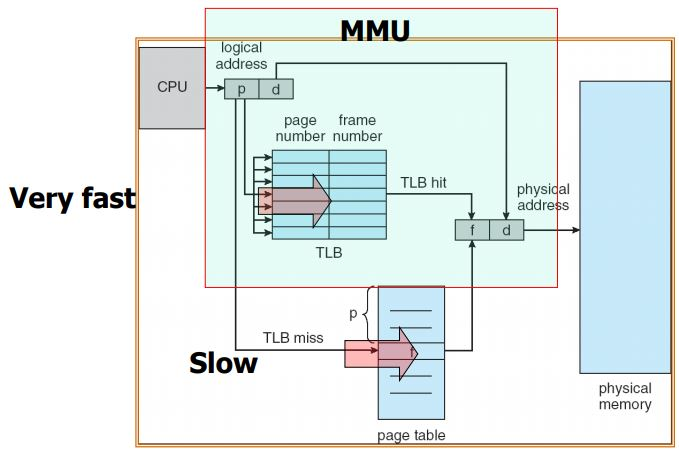
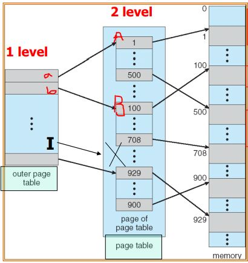
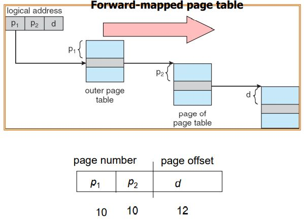
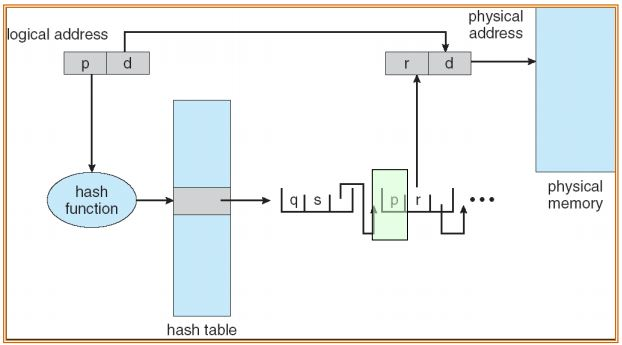
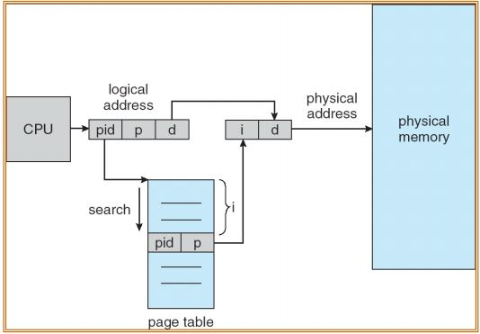
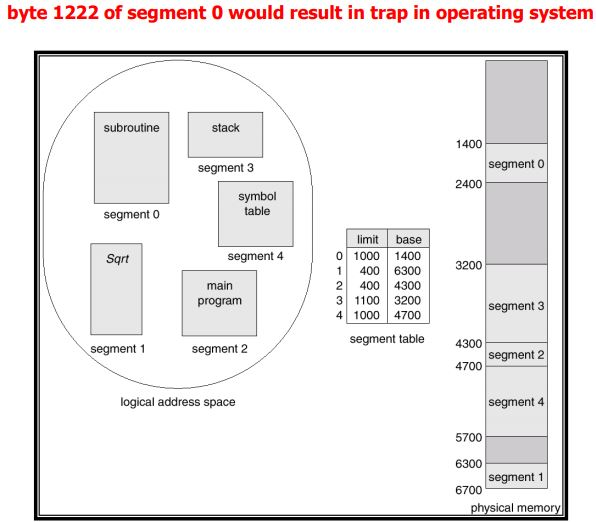
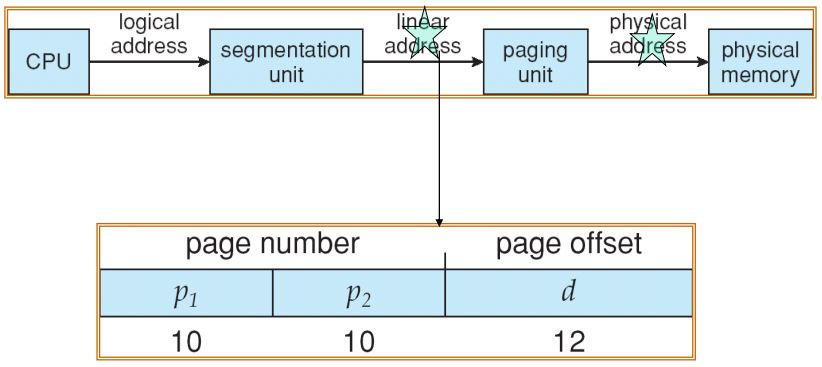
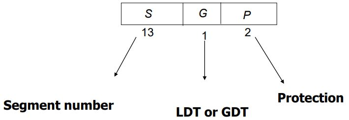

# Memory Management Strategies
- Virtual Address Space
    - 프로그램이 실행에 필요한 메모리 공간
    - Disk 공간에 일부를 Virtual Address Space를 잡아둔다.
- Physical Address Space
    - 실제 CPU가 읽을 수 있는 메모리
    - Virtual Sapace보다 공간이 더 작다.
- Swapping
    - VA 데이터와 PA 데이터를 교환 과정
    - 하지만 실제로 메모리 주소값이 다르기 때문에 OS가 그것을 관리해주어야 함
        - 해당 작업이 Address Translation이다.
- Address Translation
    - CPU가 만들어낸 가상 주소를 Physical Address로 바꾸는 작업
    - OS가 만든 Table을 통해서 바꾸는 작업을 함
- Memory Mapping Table
    - 가상 주소와 실제 주소의 연관관계를 저장해놓은 테이블
    - Page의 단위로 저장되어 있다.
- Page
    - Physical Memory와 Disk의 Virtual Memory를 교환하는 단위

# Background

## Memory Protection
- Memory Protection
    - 자신의 할당된 공간을 제외하고 나머지 공간에 접근하려고 할 때 막는 것
- base와 limit register의 쌍이 logical address(virtual address) 공간에 정의되어 있다.    
    - user mode에서 memory access할 때마다 base와 limit의 값과 비교를 한다.
    - 벗어나려고 한다면 segmentation fault를 발생시킨다.
- Kernel에 의해 base와 limit register가 갱신된다.

## Address binding
- Program은 binary 형태의 실행 가능한 형식으로 disk에 저장되어 있다.
- Address binding
    - 프로그램을 실행시켜 메모리에 올릴 때 실제 Physical memory 주소를 결정하는 것
- binding 과정
    -  Symbolic address -> relocatable address -> absolute address 
        - Symbolic address
            - code 상태
            - 변수를 선언할 경우 해당 변수가 코드로 남아있음
        - relocatable address
            - 실행 가능한 상태
            - Compiler가 만들어 준다.
            - 변수가 메모리의 시작주소로부터 얼마나 떨어져있는가를 정해준다.
        - absolute address 
            - 실제 Physical memory의 절대주소
            - 변수가 메모리 상의 실제 주소를 정해준다.
- binding 시기
    - Compile time
        - relocatable address가 만들어짐
        - Physical 주소가 정해진 상태로 나옴
        - 시작 주소가 바뀐다면 Compile를 다시 해야한다.
        - Compile time에 Physical 주소가 결정되는 경우가 있다.
            - OS의 boot loader의 경우 시작주소를 0번지로 확정지어야 한다.
            - 컴퓨터 시작할 때 0번지를 찍고 boot loader를 시작함
            - 이런 경우에 메모리 주소가 달라질 경우 compile을 다시 해야한다.
    - Load time
        - Main memory에 실제로 올리는 과정
        - relocatable code가 실제 메모리에 올라갈 때 상대주소가 결정됨
        - 이때 절대주소와 상대주소 모두 결정됨
    - Execution time
        - 프로그램 실행 중 해당 코드가 맞닿았을 때 메모리 주소가 결정됨
        - e.g.) dynamic memory allocation
        - Memmory Management Unit(MMU)
            - Hardware이다.
            - Address Table 관리하는 기능을 수행함
## Logical address
- virtual address
    - System 혹은 OS 입장에서 가상 메모리 공간
- logical address
    - 각 User Applicaion의 가상 메모리 공간
- physical address
    - 실제 메모리 주소
- compile-time and load-time address-binding이 다 끝나게 된다면
    - Logical and physical addresses이 같다고 볼 수 있다.
    - 현재 시스템에서는 사용하지 않음
### Memory mapping table
- CPU가 생성하는 Virtual Address를 Physical Address로 변환시켜주는 Table
1. 만일 VA가 0일 때 PA가 500을 가리킨다고 하자.
2. 프로세스가 죽거나 쫓겨난 후 다시 올라갈 때 Address가 바뀔 수 있다.
3. 바뀐 Address가 600일 경우 Table의 PA 부분에 500값을 600으로 바꿔준다.
4. CPU는 굳이 Address를 재설정할 필요없이 그대로 0번지를 사용하여 가리킬 수 있다.
### Memory Management Unit (MMU)
- Memory mapping table을 통한 Address Translation은 자주 일어나며 이 작업은 매우 빠른속도로 진행되어야 한다.
- 따라서, MMU는 Address Translation를 위한 HW Unit이다.
    - CPU 내에 존재
    - virtual 주소를 physical주소로 변환시킨다.
- 가장 간단한 방법
    - relocation register를 삽입한다.
    - CPU에서 Memory로 보내기 전에 한번에 변환이 가능함
    - 기본값을 register에 넣어두고 CPU에서 Memory로 보낼 때 logical address를 기본 값을 더해서 변환시킨다.

## Dynamic loading, linking, shared library
- 해당 루틴이 실제로 호출될 때 메모리에 적재하는 경우도 있다.
- 메모리의 효율성 때문에 사용함
- main memory에 똑같은 데이터가 다 올라가는 것을 막음
    - 예로 cout과 같이 자주 쓰는 명령어는 라이브러리에 넣고 한번만 메모리에 올림
- 자주 사용하지 않고 사이즈도 매우 큰 루틴을 관리하는데 매우 유용함

- Dynamic loading
    - 호출했을 때 Dynamic하게 메모리에 적재
- Dynamic linking
    - 프로그램이 실행될 때 링크됨
    - stub를 이용해서 linking 시점을 표시함
        - stub: dll 파일이 어디에 있는가를 저장한 code
    - 다음에 유용함
        - Shared libraries
            - e.g. cout
        - library가 update될 때

# Contiguous Allocation
- Main Memory는 일반적으로 두 부분으로 나눌 수 있다.
    - OS가 쓰는 영역
        - interrupt vector가 가장 아래에 들어가며 그 다음에 코드가 적재됨
    - User Process가 쓰는 영역
        - OS 위에 적재됨
        - 다른 process 영역에 접근하지 못하도록 mapping과 protection이 필요
            - Relocation registers과 Limit register를 사용함
                - 이때 Relocation registers가 base register가 된다.
- 여러 프로세스를 할당하다보면 Hole이 생김
- Hole
    - 사용 가능한 memory block
    - 사이즈가 다양하고 흩어져 있다.

## Dynamic storage allocation
- First-fit
    - 첫번째 hole이 프로세스가 들어갈 만큼 넉넉한 공간임
    - OS 기준으로 Overhead가 가장 적음
- Best-fit
    - 프로세스를 할당할 수 있는 hole 중 가장 작은 hole에 할당
- Worst-fit
    - 프로세스를 할당할 수 있는 hole 중 가장 큰 hole에 할당
- First-fit와 Best-fit가 Worst-fit보다 공간 활용에 대해서 더 낫다.

## Fragmentation
- Fragmentation
    - 메모리를 계속 할당해줌에 따라서 여러 Hole들이 생성된다.
    - 그 조각난 것들을 Fragmentation라 한다.
- 분류
    - External Fragmentation
        - total memory space에는 남아있으나 연속되게 남아있지 않음
    - Internal Fragmentation
        - Hole에 공간이 되어 프로세스를 할당을 했는데 Hole이 더 커서 그만큼의 남는 공간
        - 사용하기 어려운 공간
- Internel Fragmentation는 어쩔 수 없으나 External Fragmentation은 관리가 안된 것이다.
    - 이를 해결하기 위해 "compaction"를 이용해서 줄인다.
    - compaction: Hole들을 한쪽으로 모으는 작업
        - 제약조건
            - 프로세스가 running 하는 중간에 메모리 주소를 바꿀 수 있어야 한다.
        - 비용이 매우 많이 드는 작업이다.
# Paging
- compaction이 오버헤드가 매우 커서 탄생한 기법
- 비연속적이어도 된다.
- physical memory를 **frame**이라 불리는 고정된 사이즈의 블럭으로 나눈다.
- logical memory를 **page**라 불리는 같은 사이즈의 블럭으로 나눈다.
    - 각 단위는 2의 지수승으로 한다.
- 이젠 hole이 아니라 n개의 page을 관리한다.
- 하지만 이 기법은 하나의 프로세스가 연속된 공간에 할당되는 것이 아니다.
    - 하나의 프로세스가 나누어져서 메모리에 분산되어 있다.
    - 이를 위해 page table을 만들어서 메모리 주소를 관리한다.
- no external fragmentation
- page table
    - logical address를 Physical address로 translate 수행
    - 
- Logical Address에서 Page table을 거쳐 Physical Address를 가는 이 Paging 과정이 매우 빨라야 한다.
    - 따라서, HW를 추가해서 가속을 해야 한다.
    - HW에 Table을 만든다.
- context switch time이 증가한다.
## basic method
- Page numper (p)
    -  Page Table의 Index로 사용되며, 각 Page별 Physical Memory에서 시작 주소를 포함하고 있다.
- Page offset (d)
    - Base Address와 합쳐져서 Physical Memory Address로 변환된다.
- Logical Address 공간이 2^m이고 page 사이즈가 2^n일 때
    - page offset은 하위 n bit이며
    - page number은 상위 m-n bit이다.
- Address translation
    - 
    1. d는 그대로 이동
    2. p는 page table을 통해 f 로 변환
    3. f+d를 통해 Physical address로 변환
    - page table entry는 CPU가 빨리 접근할 수 있는 공간에 있어야 한다.
- External fragmentation
    - NO
- Internal fragmentation
    - Yes
    - Internal fragmentation를 줄이기 위해서
        - page 사이즈를 작게 하면 줄일 수 있다.
            - 하지만 이 경우 page table이 커지면서 overhead가 커진다.
    - 요즘은 page size를 늘리는 추세

## Managing free frames

- free-frame table을 만들어서 관리
- Frame table
    - 어떤 frame이 어떤 프로세스가 allocation 또는 deallocation의 정보를 가짐
- copy of page table
    - 각 process마다 자신의 page table을 가지는데 커널이 관리를 해야함
    - 모든 logical address는 실제 physical address에 mapping이 되어야 한다.

## Hardware support for paging
- Register
    - Page table은 OS가 관리하기 위해 main memory에 존재해야 한다.
    - PTBR (Page-table base register)
        - page table을 가리키는 register
    - PTLR (Page-table length register)
        - page table의 사이즈를 저장하는 register
    - 이 경우 memory에 두 번 접근하는 오버헤드가 있음
        - Data/instruction
- TLB
    - page table -> physical address 과정을 가속시킴
    - 빠른 속도로 buffer를 찾아서 값을 반환한다.
    - translation look-aside buffers (TLBs)
    - HW로 만들어짐
    - 일종의 cahce
    - 
        1. CPU가 Logical Address를 만들어 낸다.
        2. TLB와 page table 모두에 p 값을 보낸다.
        3. TLB에서 p에 해당하는 값이 존재할 경우 그대로 f로 보낸다.
        4. TLB에 p에 해당하는 값이 존재하지 않을 경우
            - page table에 f 값을 반환하고 TLB를 Update를 한다.
    - TLB는 MMU에 존재함
- TLB 분석
    - Associative Lookup = z time unit
    - memory cycle time이 1 microsecond라고 가정하자.
    - Hit ratio = a
        - TLB에서 page number를 찾는데 걸리는 시간의 비율
    - Effective Access Time (EAT)
        - EAT = (1 + z) a + (2 + z)(1 – a)
            - = 2 + z – a
        - 즉, Hit ratio가 높아야 한다.

## Memory protection
- 각 frame마다 Memory protection bit가 존재
- page table에 Valid-invalid bit가 붙어 있다.
    - Valid
        - Physical address가 들어와 있는 상태
    - Invalid
        - 초기화 상태 또는 의미없는 값이 들어가 있는 상태
## Shared code
- 여러 프로세스가 공유하는 경우
- 코드 하나만 main memory에 적재됨

## Private code and data
- 각 프로세스가 각자의 코드와 데이터를 가지고 존재함

## Structure of the Page Table
- 프로세스마다 Address Space가 매우 커진다.
    - 만일 32 bit address를 사용한다면
        - page table entry 2^20가 필요
        - page table가 4MB를 가지게 된다.
    - 따라서, page table size를 줄이는 것이 매우 중요
## Hierarchical Paging
- page table을 여러 단계로 나누어서 Hierarchical하게 관리함
- logical address space를 multiple page tables로 나누어 관리
    - 한 번에 관리해야 하는 메모리 사이즈를 줄임
### Two-level page table

- 2 단계로 나누어서 관리를 한다.
    1. a가 memory에 적재가 되려고 한다면 A의 page table만 있으면 된다.
        - 그 이외의 table은 메모리에 적재가 되지 않아도 됨
    2. b가 memory에 적재가 되려고 한다면 B의 page table만 있으면 된다.
    - 필요한 부분만 올림
- 메모리 효율성이 매우 좋아짐
- 단점
    - 하지만 메모리 Access가 많아짐
    - overhead 발생
- 
## Hashed Page Tables

- Hash function을 통해서 즉시 physical memory 주소로 변환한다.
- 중복 값이 나오는 경우 element의 chain으로 달아둔다.
## Inverted Page Tables

- HW기준으로 page를 나눈다.
    - Physical memory가 제공되는 size에 따라서 frame 숫자가 결정이 됨
    - Inverted entry는 frame number와 같음
        - 사이즈가 커질 염려 없음
- 시스템 전체에 page table이 하나만 있으면 된다.

- Why?
    - Page table size is too big
        - Usually each process has an associated page table
        - One entry for each virtual address
    - Solution
        - One page table system-wide
        - One entry for each real page frame
- Concrete method
    - table entry =(process ID, page #)
    - table index = frame #
- Shortcomings
    - need to search entire table to find process ID
    - Physcial memory 값이 매우 커짐
    - 하나의 entry를 찾기 위해서 시스템 전체를 찾아야 함

# Segmentation
- 시스템을 구성할 때 Memory-management 할 때는 실제로 process에서 해당되는 영역이 어디인가를 감안하는 것이 유리함
- 프로그램은 segments의 총합으로 본다.
    - segments
        - logical unit이다.
        - 논리적인 단위 즉, 기능별 묶음
            - main program, procedure, function, method, object, local variables, global variables, common block, stack, symbol table, Arrays
- Segmentation
    - process가 필요로하는 메모리 공간을 logical unit단위로 잘라서 별도의 메모리 공간에 할당을 하는 작업
- paging vs Segmentation
    - paging은 HW적으로 정해진 사이즈로 나눔
- Segmentation
    - Process 입장에서 segment 단위로 연속된 공간에 할당을 하느 것을 목표
    - Logical address는 segment를 기반으로 Physical address로 변환한다.
- 문제점
    - segment 별로 사용하게 된다면 다시 메모리 할당에 대한 문제가 발생함
        - External Fragmentation이 발생
## Segment table
- Logical address는 2가지 요소가 필요하다
    - segment-number, offset
    - 이를 관리하는 것이 Segment table이다.
- Segment table
    - base와 limit으로 관리
    - Segment table 구성요소
        - base
            - segment 시작 주소
        - limit
            - segment의 길이
            - paging에서는 각 frame이 고정된 길이이기 때문에 각각의 길이가 필요없었으나 segment는 길이가 다를 수 있음
    - STBR(Segment-table base register)
        - Segment table의 시작 주소를 가리키는 레지스터
    - STLR(Segment-table length register)
        - 프로그램의 Segment의 수를 저장하는 레지스터
## Protection
- segment별로 segment table에서 privileges를 넣을 수 있다.
    - paging에서는 각 frame이 어떤 기능을 하는지 몰라서 권한을 넣을 수 없었으나 segment는 logical하게 나누었으므로 각 권한을 구분해서 넣을 수 있다.
    - 각 권한은 read/write/execute
- segment에 적절한 값이 있는지 segment table에 판단하는 bit가 있다.
    - validation bit = 0 -> illegal segment
- segment 단위로 Protection bit가 있다.
    - 해당 segment가 어떤 접근에 대해서 접근 허용 정보를 제공

## Trap
    - addressing error
    - 찾고자 하는 주소가 limit보다 클 경우 발생한다.
    - Example
        - 
        1. segment 0의 1222번지를 찾고자 할 때
        2. table에서 0의 limit 1000과 비교한다.
        3. 1222 > 1000 이므로 trap 발생

# Swapping
- 메모리가 가득 찬 상태에서 메모리 할당이 필요한 프로세스가 있다면
    - 기존에 메모리에 있던 프로세스를 내쫓고 필요한 프로세스가 들어가야 한다.
- 기존 메모리에 있던 프로세스는 실행이 되었던 프로세스이다.
    - CPU가 필요하지 않은 메모리를 내쫗되, 진행했던 내용을 Backing storage에 저장한다.
- Backing store
    - Disk이다.
    - 여기에 저장되는 프로세스들은 Disk에 저장된 다른 프로그램과 다르다.
        - memory image를 그대로 저장한다.
    - memory처럼 관리가 가능해야 함
- Swapping
    - Roll out, roll in
    - main memory에 내용을 내보내고, 새로운 프로세스 영역을 만들어서 새로운 작업을 할 수 있도록 하는 작업
    - 매우 느린 작업이다.
    - transfer time
        - swapping을 수행하는 걸리는 시간이다.
    - Overhead가 매우 큰 작업

# Example
In Linux with Intel CPU 기준에서 다음을 살펴보자
## Linux
- segmentation과 paging을 다 한다.
    - 특히 paging은 paging된 segmentation을 사용한다.
        1. CPU는 logical address를 생성
            - segment id, offset
        2. 각 segment를 paging을 이용함
            - 이 중간에 생성된 주소를 linear addresses라 한다.
- PAE (Page Address Extension) 기능이 있다.

## IA-32 segmentation
- Pentium architecture라고 함
- segment 공간은 4GB까지 지원함
- 각 프로세스당 sement의 최대 수는 16KB이다.
    - first partition
        - 해당되는 process만 접근 가능
        - LDT (local descriptor table)
    - second partition
        - 여러 process가 share가 가능한 영역
        - GDT (global descriptor table)
- Logical address
    - Selector (16 bit)+ Offset

## HardWare & Selector
- 6개의 segment register가 들어감
- 6개의 8byte microprogram register 들어감
    - LDT or GDT인지를 결정하는 것이 들어감
- 그 중 16bit 는 selector로 사용됨
    - 

## IA-32 paging
- page size는 4KB or 4MB 둘 중 하나로 함
    - 4KB 일 경우 Single paging
    - 4MB 일 경우 Two-level paging