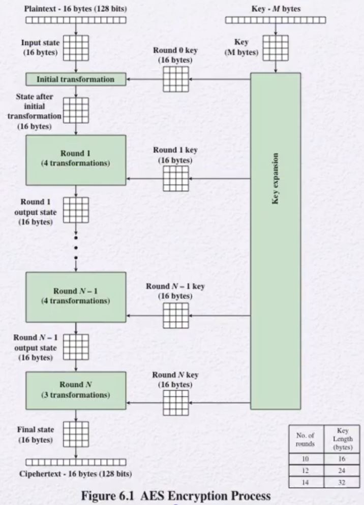
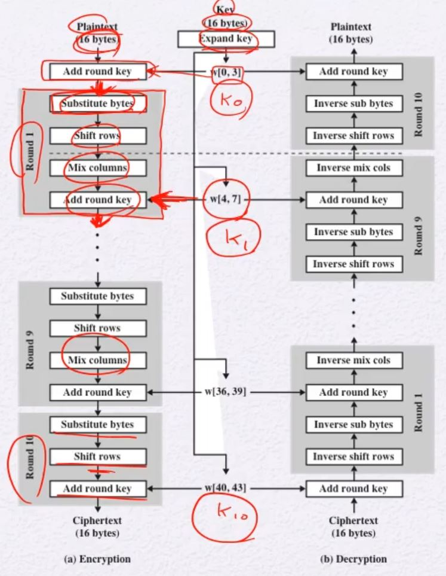
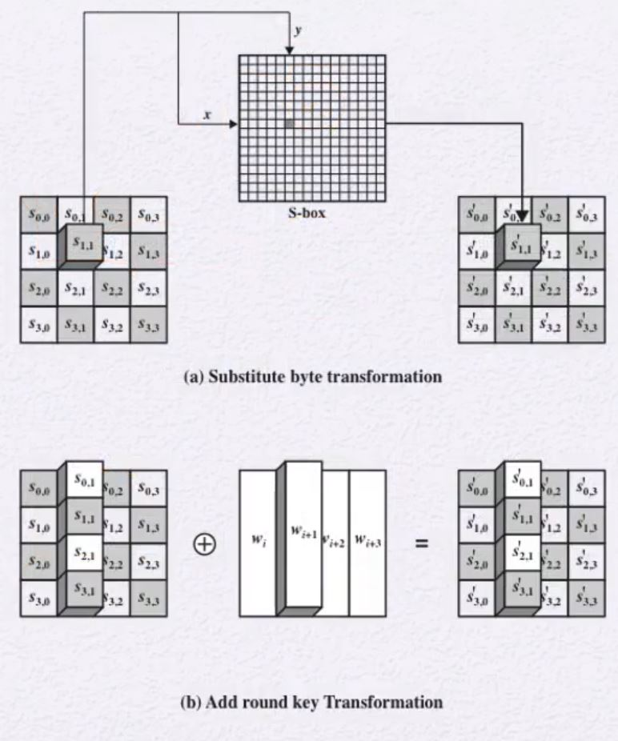

# AES
- Advanced Encryption Standard(AES)
- 2001년에 NIST에서 표준화함
- GF(2^8)를 사용
    - 8bit byte단위
    - Irreducible polynomial: 규악!
        - (x^8 + x^4 + x^3 + x + 1)
    - 나눗셈은 역원을 이용함
        - a /b = a (b^(-1))

## General Structure
- State(자료구조)
    - 4x4 byte단위의 사각형 배열
- key & Round
    - 128 & 10
    - 192 & 12
    - 256 & 14
- SPN 구조를 사용
    - Substitution-permutation network
    - Round: 4가지 형태의 함수
        - Permutation: ShiftRows
        - Substitution: SubBytes / MixColumns / AddRoundKey
## AES Encryption Process

1. Input으로 Plaintext 16bytes씩 받는다.
2. 이 16 bytes를 각 4bytes 씩 나눈다.
3. 각 줄을 4열로 세운다.
    - 이를 통해  4x4 byte단위의 사각형 배열을 생성함
4. Key 또한 1~3번 과정을 거치면서 State구조를 만든다.
5. 생성된 Key와 Plaintext를 XOR연산 수행한다.
    - 이를 Initial transformation이라 한다.
6. 이를 통해 성성된 state를 가지고 각 Round를 수행한다.
    - 각 Round에 필요한 Key는 [Key Expansion](#key-expansion)을 통해 생성한다.

## Detailed Structure
128bit임을 가정한다.
- 전체 데이터 블록들을 하나의 4x4 byte배열로 보고 각 round마다 substitutions and permutation을 이용하여 업데이트를 수행함
- Input으로 주어지는 key가 Round가 10이므로 11개의 key가 필요
    - 따라서, 4 x 11 word
    - w[0] ~ w[43]
- 각 Round마다 들어있는 함수
    - Substitute bytes(sub byte)
        - byte단위로 치환함
        - 이처럼 update를 해주는 table을 S-box라 한다.
    - ShiftRows
        - 행을 Rotation을 수행함
    - MixColumns
        - GF(28)를 이용하여 열을 섞는다.
    - AddRoundKey
        - XOR연산 수행
- 암호는 처음 과 끝이 AddRoundKey이다.
- 각 Stage는 역연산이 가능하다.
- decryption algorithm은 암호화 과정과 다르다.
    - 암호 과정의 역연산들을 수행함

## 각 함수별 수행 과정
### 1. AES SubBytes

S-box를 통해 문자 치환을 수행한다.
