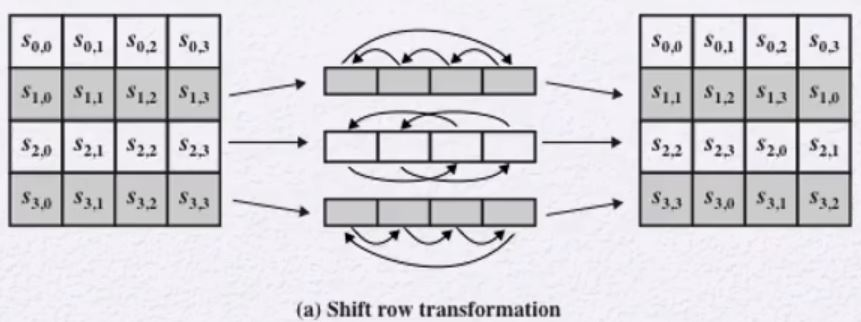
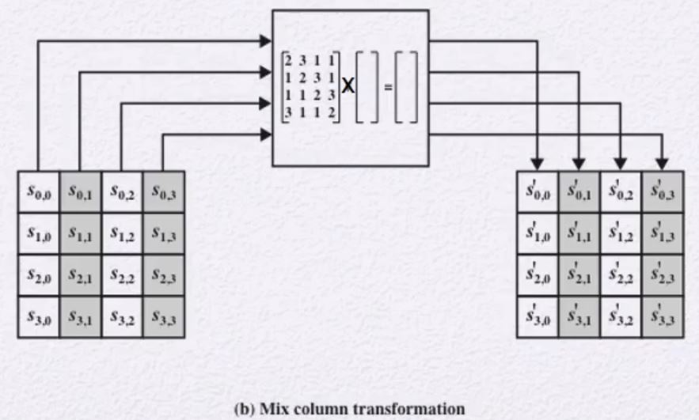
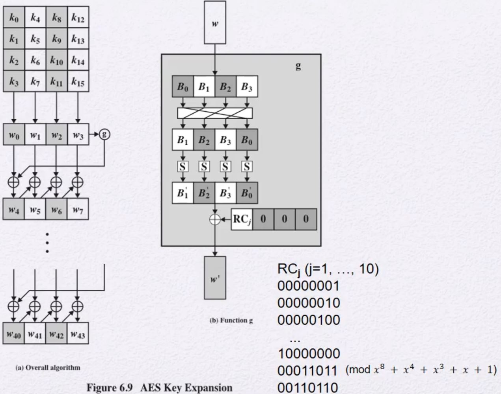
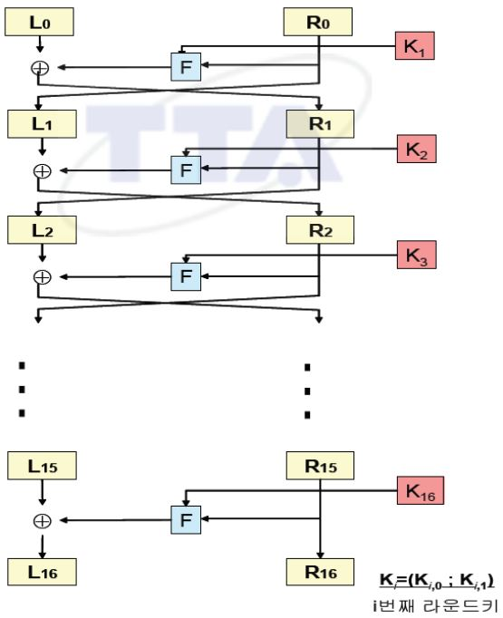
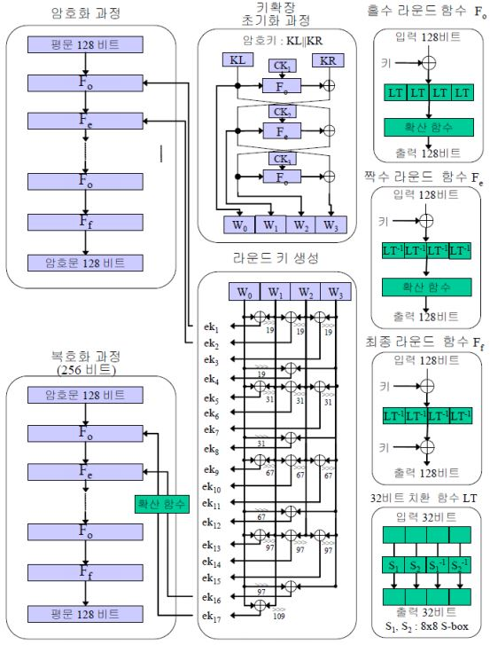
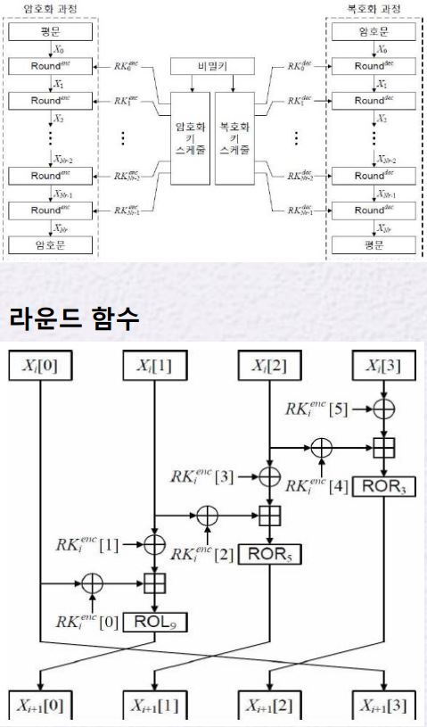

# AES
- Advanced Encryption Standard(AES)
- 2001년에 NIST에서 표준화함
- GF(2^8)를 사용
    - 8bit byte단위
    - Irreducible polynomial: 규악!
        - (x^8 + x^4 + x^3 + x + 1)
    - 나눗셈은 역원을 이용함
        - a /b = a (b^(-1))

## General Structure
- State(자료구조)
    - 4x4 byte단위의 사각형 배열
- key & Round
    - 128 & 10
    - 192 & 12
    - 256 & 14
- SPN 구조를 사용
    - Substitution-permutation network
    - Round: 4가지 형태의 함수
        - Permutation: ShiftRows
        - Substitution: SubBytes / MixColumns / AddRoundKey
## AES Encryption Process

1. Input으로 Plaintext 16bytes씩 받는다.
2. 이 16 bytes를 각 4bytes 씩 나눈다.
3. 각 줄을 4열로 세운다.
    - 이를 통해  4x4 byte단위의 사각형 배열을 생성함
4. Key 또한 1~3번 과정을 거치면서 State구조를 만든다.
5. 생성된 Key와 Plaintext를 XOR연산 수행한다.
    - 이를 Initial transformation이라 한다.
6. 이를 통해 성성된 state를 가지고 각 Round를 수행한다.
    - 각 Round에 필요한 Key는 [Key Expansion](#aes-key-expansion)을 통해 생성한다.

## Detailed Structure
128bit임을 가정한다.
- 전체 데이터 블록들을 하나의 4x4 byte배열로 보고 각 round마다 substitutions and permutation을 이용하여 업데이트를 수행함
- Input으로 주어지는 key가 Round가 10이므로 11개의 key가 필요
    - 따라서, 4 x 11 word
    - w[0] ~ w[43]
- 각 Round마다 들어있는 함수
    - Substitute bytes(sub byte)
        - byte단위로 치환함
        - 이처럼 update를 해주는 table을 S-box라 한다.
    - ShiftRows
        - 행을 Rotation을 수행함
    - MixColumns
        - GF(28)를 이용하여 열을 섞는다.
    - AddRoundKey
        - XOR연산 수행
- 암호는 처음 과 끝이 AddRoundKey이다.
- 각 Stage는 역연산이 가능하다.
- decryption algorithm은 암호화 과정과 다르다.
    - 암호 과정의 역연산들을 수행함

## 각 함수별 수행 과정
### 1. AES SubBytes

S-box를 통해 문자 치환을 수행한다.

- S-box 생성과정
1. Plaintext의 문자 하나(A)와 GF(2^8)의 역원(Z)을 스칼라 곱을 한다.
2. 그 후 생성된 값과 Key(C)를 XOR연산을 수행한다.
3. 생성된 값이 Plaintext의 대체 문자(Y)이다.
- Y = AZ XOR C

#### 왜 S-Box를 사용하는가
- 지금까지 알려진 암호학 공격에 대해 방어하기 위해 설계됨
- input과 output의 상관관계를 알아내기 힘들게 하기 위함
- 선형식은 취약하므로 비선형식으로 만들기 위함

### 2. Shift Rows

1. 4 x 4 행렬에서 첫 번째 행은 그대로 가져간다.
2. 두 번째 행은 왼쪽으로 한 칸씩 이동한다.
3. 세 번째 행은 왼쪽으로 두 칸씩 이동한다.
4. 네 번째 행은 왼쪽으로 세 칸씩 이동한다.
    - 즉 오른쪽으로 한칸 이동
#### 왜 Shift rows를 수행할까
- 모든 문자에 대해서 여러 부분에 영향을 미치기 위해서
- 입력과 출력사이에 관계가 복잡하게 만들기 위해서
- 한 컬럼에 있는 4개의 byte들이 다른 4개의 컬럼에 영향을 주기 위해서

### 3. Mix Columns

1. 4 x 4 행렬에서 하나의 열을 4 x 4 KEY와 스칼라 곱을 하여 하나의 열을 생성한다.
2. 그 과정을 4번하여 4열을 만들어 암호화한다.

#### 왜 Mix Columns를 수행할까
- shift rows와 이유 동일
- 더 확실히 전체에 영향을 주기 위함

### 4. Add Round Key
- 128 bit State를 128 bit Round Key와 XOR연산을 수행한다.
- word단위로 xor연산을 수행한다고 할 수 있다.
- 단순하다.
    - 하지만 Round Expansion에서 매우 복잡함

## AES Key Expansion
- Key는 첫 번째 4개의 word들로 copy된다.
    - 이는 처음에 바로 사용한다.
    - Round 0 Key

### 과정

- 처음 Key 128bit를 4x4 행렬로 정렬한다.
- 열 단위로 (word) 끊어서 본다.
1. 첫 word w0는 위에서 받아온 g함수의 결과값고 윗 단계에서의 w'0와 xor연산을 한다.
    - g 함수는 윗 단계의 w'3을 통과시켜 나온 결과 값이다.
    - [g 함수의 과정은 다음](#g-function)에서 설명
2. 두 번째 word w1는 1번에서의 w0와 윗 단계에서의 w'1과 xor연산을 수행한다.
3. 세번째와 네번째또한 2번과정을 수행한다.
4. 1~3과정을 Round 수 만큼 수행한다.

### G functiton
32bit 를 받아오면 4개로 byte단위로 자른다.
1. 각 단위를 왼쪽으로 1칸씩 shift 수행한다.
2. 각각의 byte에 대해 S-Box를 통과시킨다.
3. 그 후 마지막으로 정해져 있는 상수값과 XOR연산을 수행한다.
    - 정해져 있는 상수값에서 첫 byte를 제외한 3 byte는 0으로 고정
    - 첫 byte는 Round마다 다른 값을 가짐
        - 1 ~ 8 Round는 최하위비트 1부터 시작해서 왼쪽으로 한 칸씩 shift수행
        - 9 Round 이후부터는 GF(2^8)로 생각하여
            - (x^8 + x^4 + x^3 + x + 1)을 MOD 수행한다.
            - 즉 9 ROUND는 1000 0000에서 MOD (x^8 + x^4 + x^3 + x + 1)을 수행하여
                - 0001 1011이 된다.

#### Key Expansion은 왜 복잡하게 했는가?
- expansion key algorithm이 알려진 암호학 공격에 대비해서 만들어짐
- Round에 의존하는 Round 상수를 사용함으로써 규칙성을 제거함
- 궁극적인 목표
    - 암호키의 일부를 안다고 하더라도 다른 Round key를 알아내지 못하도록 함
    - 일반적인 CPU에서 매우 빠른 연산이다.
    - 암호키의 Diffusion이 round key에 적용이 된다.
        - Diffusion: 한 비트의 변화가 여러 비트에 영향을 줌
    - 충분히 비선형성을 띄게 함

## 구현에 있어 AES의 장점
- 8bit 프로세서에서 매우 효율적으로 동작이 가능함
- XOR, Shfit, SubByte, MixColumn 등 byte 단위 간단한 동작으로 구성됨
- 32bit 프로세서에서
    - table lookup 4번과 XOR 4번으로 한 round가 끝나게 가능함
    - 메모리만 충분하다면 4kb에서 한 번에 계산이 가능함
## Intel AES New Instruction
- AES만을 수행하는 명령어가 생김
- AES NI라고 함

# 암호 모듈 검증 제도
- 국가정보원 암호 모듈 검증 제도
    - KCMVP (Korea Cryptographic Module Validation Program)
    - 국가나 공공기관 정보통신망에서 비밀로 분류되지 않은 중요 정보 보호에 사용되는 암호 모듈의 안정성과 구현 적합성을 검증하는 제도

## 검증 대상 알고리즘
- 블럭암호: ARIA, SEED, LEA, HIGHT
    - 운영모드
        - 기밀성: ECB, CBC, CFB, OFB, CTR
        - 기밀성/인증
- 해시함수
    - SHA-2 (224, 256, 384, 512), SHA-3, LSH
- 메시지인증
    - 해시기반 HMAC, 블록암호기반 CMAC, GMAC
- 난수발생기
    - 해시기반 Hash_DRBG, HMAC_DRBG, 블록암호기반 CTR_DRBG
- 공개키암호
    - RSAES (2048, 3072)
- 전자서명
    - RSA-PSS (2048, 3072), KCDSA, EC-KCDSA, ECDSA
- 키설정
    - DH, ECDH
- 키유도
    - KBKDF (HMAC, CMAC), PBKDF (HMAC)

## 한국 표준 블럭 암호
- SEED (1998)
    - **TTA**S.KO-12.0004 / IETF RFC 4269
    - DES와 유사한 구조 (Feistel Network)
    - 128-bit block, 128-bit key, 16 rounds
    - 
- ARIA (2004)
    - IETF RFC 5794
    - AES와 유사한 구조 (Substitution-Permutation Network)
    - 128 bit block, 12/14/16 rounds for 128/192/256 bit key
    - SPN
    - 
- LEA (2014)
    - **TTA**K.KO-12.0223
    - <u>경량 블록 암호, 32-bit ARX 구조</u> (S-box 없음)
        - Add, Rotate, XOR
    - 128 bit block, 24/28/32 rounds for 128/192/256 bit key
    - 