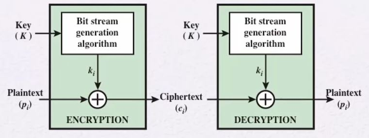
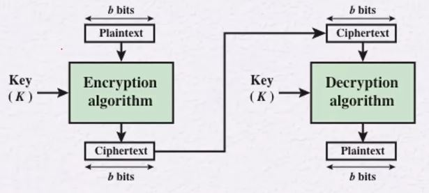
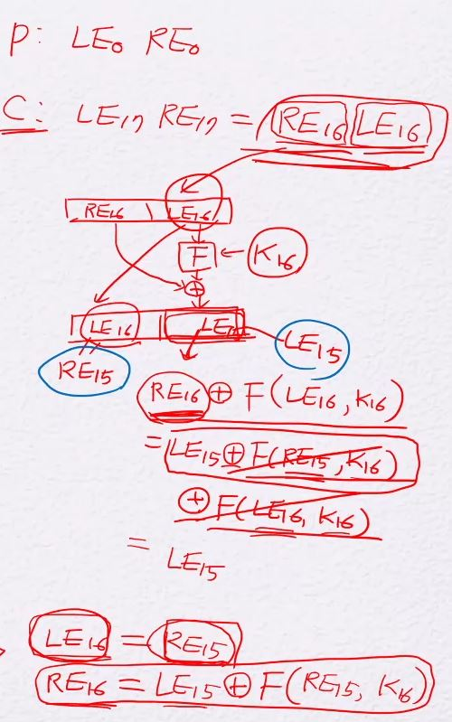

## 분류
Classification Symmetric Encryption
- Stream Ciphers
- Block Ciphers
    - Feistel Ciphers(설계원칙)
        - Feistel Ciphers를 꼭 알아야 함
        - The Data Encryption Standard (DES)
            - Feistel Ciphers를 이용하여 만든 암호
            - DES의 자세한 구조까지 알 필요 없음
        - DES 뿐만 아니라 다른 암호에서도 많이 쓰인다. 

# Classification Symmetric Encryption
## Stream Cipher

1. 아주 짧은 키를 가지고 bit stream generation algrotihm을 돌려 plain text 길이만큼의 비트를 생성한다.
    - 이는 Deterministic algorihm이다.
    - 따라서, 규칙이 존재한다.
2. 그 후 Vernam Cipher처럼 비트 단위로 xor 연산을 수행한다.
3. 이를 통해 One-time pad 효과를 발휘시킨다. 

### Attribute
- Symmetric encryption이다.
    - 두 유저간에 공통된 키를 사용한다.
- 데이터를 비트 단위 또는 바이트 단위로 암호화 한다.
    - ex) [Vernam](Classical_Encryption_Techniques.md/##Vernam-Cipher)
- One-time pad를 희망, 하지만 이상적인 상황이다.
- 실질적인 해결책이 **Stream Cipher**
    -  bit-stream generator에서 생성된 키 stream이 규칙이 있고, 이 규칙은 공격자에게 숨겨져야 한다.
    - Sender, Receiver 모두 같은 키(seed value)를 생성해서 사용해야 함

## Block Cipher

1. 아주 짧은 키가 주어진다.
2. 임의의 사이즈로 plaintext를 단위별로 나눈다.
    - 그 하나를 block이라 한다.
3. 그 key와 plaintext의 block을 Encrytion Algorithm을 돌려 block 사이즈의 암호문을 생성한다.
4. 전체 plaintext를 모두 암호화 할 때까지 3번을 수행한다.
- Decrytion은 Decrytion Algorithm을 돌려 복호화 한다.

### Attribute
- Symmetric encryption이다.
    - 두 유저간에 공통된 키를 사용한다.
- 한 글자씩 암호화하는 것보다 두 글자, 세 글자 이상으로 암호화하는 것이 더 안전하다 라는 생각에서 만들어짐
    - 이를 통해 64 bit, or 128 bit 단위로 암호화를 주로 함
        - 64 bit - DES
        - 128 bit - AES

# Feistel Cipher
- Block Cipher의 한 종류이며, 하나의 알고리즘이다.
    - DES가 이 알고리즘으로 만들어진 암호 기술이다.

- 오른쪽 그림은 DES의 1개의 round를 보여준다.
- 암호방식의 설계가 암호학적으로 다른 암호방식보다 강하도록 두 개 이상의 기본 cipher가 연속적으로 수행되는 방식을 이야기한다.
- 특히 치환(Substitution)과 순열(Permutation)을 번갈아 수행하는 방식의 사용을 제안한다.
- 길이가 2w비트인 plaintext block을 w의 길이로 L, R로 2등분하여 n번 반복 처리를 거치는 방식이다.

## Encryption of Feistel Cipher
1. 처음 들어온 plaintext를 64bit 단위로 나눈다.
2. 각 블럭을 64bit Key와 Encryption 알고리즘을 통해 암호문을 만든다.
    - Encryption 알고리즘
    1. 하나의 block 64bit를 32bit로 두 Block으로 나눈다.
    2. 하위 블럭은 상위 블럭 위치로 '**그대로**' 이동한다.
    3. 상위 블럭이 하위 블럭으로 가면서 [**F함수**](###F함수)를 통해 만들어진 Key와 XOR연산이 수행된다.
        - Key 생성
            - 입력받은 64bit Key는 **48bit Key 총 16개**로 만들어진다.
            - 각각 K1, K2, ... , K16 까지 생성 후 각 Round마다 K1, K2 ... K16이 쓰인다.
        - 만들어진 48bit Key를 [F함수](###F함수) 통과 시켜 32bit로 변환 후 상위 블럭과 XOR연산 수행
    4. 1~3의 과정이 하나의 'Round'이다.
        - 이를 총 16번을 수행한다.

### F함수
그냥 이해만 하자
1. Expansion/[Permutation](Classical_Encryption_Techniques.md/##Permutation)
    - 하위 32bit block을 48 bit로 확장하고 Permutation을 수행한다.
2. 위에서 만들어진 48bit와 Ki를 XOR연산을 수행한다.
3. Substitution/choice
    - 이 48bit 블럭을 다시 Substitution을 수행하고 32bit로 만든다.
4. Permutation
    - Permutation을 수행 후 32bit 블럭으로 반환

## Decryption of Feistel Cipher
1. 첫 번째 방법
    1. 위 그림에서 만들어진 암호문 LE16 RE16
    2. LE16을 RE15위치로 올린다.
    3. LE16과 K16을 F함수를 통과시키고 32bit 값을 얻는다.
        - LE15와 F함수 값을 XOR연산 했기 때문에 F함수 값을 얻고 XOR 연산을 하면, LE 16값을 얻을 수 있다.
        - 암호화할 때 RE15는 그대로 LE16으로 내렸기 때문에 그 값을 그대로 사용한다.
            - K16과 LE16을 F함수로 투과시켜 F함수 값 32bit를 얻는다.
    4. 이 32bit와 RE16을 XOR연산 수행 후 LE15위치로 올린다.
    5. 이 과정을 0번째 까지 수행한다.
2. 두 번째 방법
    - Encryption 알고리즘에 암호문을 한번 더 적용한다.
        - Plaintext를 얻을 수 있다.
    - 이때 주의할 점은 K16, K15, ... , K1의 순서대로 알고리즘을 적용한다.

### 두 번째 방법 증명

- 이 과정을 16번 수행하면 결국 LE0 RE0를 얻을 수 있다.

## Data Encryption Standard(DES)
- 1977년에 National Bureau of Standards에서 표준화가 됨
    - 현재 NIST
- 2001년에 AES로 새로 표준화
- Data Encryption Algorithm(DEA)
    - 원래 DEA였으며, 이를 표준화 한게 DES
    - 56bit 키를 이용해서 64bit block을 암호화
        - 64bit key 중 앞 7bit는 Paritivity이다.
        - 따라서, 7*8 = 56 bit

## Strength of DES
- DES
    - 56-bit keys: 2^56 ≈ 7.2 × 1016
    - 초당 10^9개의 decryptions할 수 있는 기계
        - 평균: 1.125 years
        - 최악: 2.25 years
- Permutation cipher
    - 26! ≈ 4 × 10^26
    - 초당 10^9개의 decryptions할 수 있는 기계
        - 평균: 6.3 billion years
    - 하지만, 통계를 통해 공격하기 때문에 약함
- AES-128
    - 128-bit keys: 2^128 ≈ 3.4 × 1038
        - DES보다 두배 늘어났다고 시간이 2배 늘어난 것은 아니다.
    - 초당 10^9개의 decryptions할 수 있는 기계
        - 평균: 5.3 × 1021 years
    