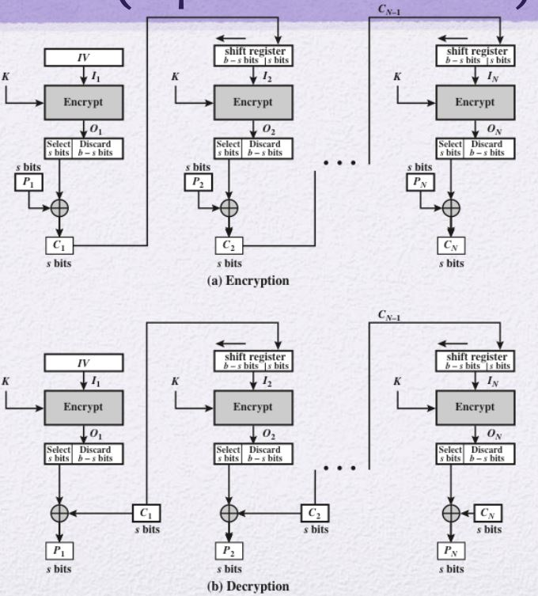

# Multiple Encryption & Triple Encryption DES
## Multiple Encryption
Double DES
- DES는 키가 짧아서 깨짐
- 이를 보완하기 위해 키의 수를 늘림
    - 2개의 키를 이용하여 DES 알고리즘을 2번 적용
    - Double DES
        - 𝐶 = 𝐸(𝐾2, 𝐸 (𝐾1, 𝑃) )
        - 𝑃 = 𝐷(𝐾1,𝐷 (𝐾2, 𝐶) )
- 
- Plaintext -> X -> Cyphertext
- 기대하는 경우의 수는 2^56 * 2^56 = 2^112
- 하지만 Plaintext와 Cyphertext의 Pair가 존재할 때
    - Plaintext에서 X를 만들고
    - Cyphertext에서 X를 복호화 하여
    - 2^56 + 2^56의 경우의 수로 공격이 가능하다.
    - 𝑋 = 𝐸 (𝐾1, 𝑃) = 𝐷(𝐾2, 𝐶)
- 이를 위해 3번 암호화 하는 과정 고안
## Triple Encryption
Triple DES
- 3개의 Encryption을 돌림
- 실제 경우의 수는 2^112를 제공함
- 키 길이는 168bit를 필요로 함
- 
    - DES는 Decryption과 Encryption 결과가 동일함
    - 따라서, Decryption을 Encryption으로 사용해도 무방함
        - 왜 Decryption을 하는가?
            - Backward Compatibility(하위 호환성)

# Modes of Operation
응용에 따른 알고리즘들을 새로 만들기보다 기존 알고리즘들을 살짝 추가하거나 변형해서 응용에 맞는 알고리즘을 생성하는것을 추구
- Block Cipher에 적용되는 알고리즘

## 1. ECB (Electronic CodeBook) Mode

- 같은 입력 Block에 대해 같은 출력 Block을 생성한다.
- 이는 Permutation Cipher 공격에 쓰인 통계적 공격에 취약하다.

## 2. CBC (Cipher Block Chaining) Mode

- IV: Initial Vector
    - 첫 XOR수행하기 위해 넣어주는 값
- Error Propagation: CBC Mode는 오류가 전파되는 특성이 있다.
    - 만일 한 비트가 오류가 난다면 다음 암호화에 이전 Plaintext의 암호문을 사용하기 때문에
    - 결과값이 완전히 달라질 수 있다.
    - 또한 Encryption과정에서도 전체 암호문에서도 영향을 미칠 수 있다.
    - 이는 암호화 측면(기밀성)에는 좋은점은 아니다.
        - 하지만 무결성 측면에서는 좋은 효과를 볼 수 있다.

### CBC Mode의 Error Propagation를 통한 Message Auth. Code(MAC/MIC)
암호화 하지 않은 Plaintext를 누구나 볼 수 있도록 원본 그대로를 전송한다.
- 전송자는 Plaintext 끝에 마지막 Ciphertext를 붙인다.
    - 이를 MAC이라고도 하며, TAG라고도 한다.
- 수신자는 수신받은 text를 끝단을 분리한다.
    - 앞 Plaintext부분을 Encryption과정을 통해 Ciphertext 끝단을 얻는다.
    - 이후 수신받은 Ciphertext와 수신자가 만든 Ciphertext와 비교한다.
- 변조 공격이 들어왔을 경우 비교할 때 완전 다른 Ciphertext가 될 것이다.
    - Q. 공격자가 Ciphertext도 같이 수정하면 되지 않는가?
        - Ciphertext는 Key를 통해 만들어지는데, 공격자는 이 Key를 모르는 상태이므로 Ciphertext는 수정이 불가능하다.
- 이 방식을 통해 다음 두 가지를 확인할 수 있다.
    - Confidentiality 무결성
    - Authenticity 인증

## 3. CFB (Cipher FeedBack) Mode
Block Cipher를 이용해서 Stream Cipher를 흉내낸 것

- Decryption과정은 Encryption 과정과 동일하다.
    - 이 부분이 Stream Cipher과 유사함
    - 즉, 다른 Decryption없이 Encryption만으로 복호화 가능
- 이는 Stream Cipher라고 할 수는 없다.
    - Stream Cipher는 Key만을 가지고 Plaintext길이의 Key를 생성할 수 있었다.
    - 하지만 이는 Plaintext가 존재해야만 암호화가 가능하다.
        - 즉, 다음번 Plaintext가 가용할 때까지 기다려야 한다.
    - 이렇게 기다려야하는 번거로움 때문에 기다리지 않고 바로 생성할 수 있도록 한다.
        - Encrypt의 결과물을 feedback준다.
        - 이것이 OFB Mode이다.
- Error Propagation 존재

## 4. OFB (Output FeedBack) Mode

- Nonce: IV와 똑같은 것
- 기다림이 없다.
    - Preprocessing
- 하지만 병렬처리는 불가능하다.
    - Plaintext를 기다리진 않더라도 Encryption 결과물은 기다려야 하기 때문이다.
- Error Propagation이 없다.
    - Plaintext를 이용하지 않기 때문

## 5. CTR (Counter) Mode

- CFB와 OFB의 병렬처리 문제를 해결하기 위함
    - 즉, Feedback을 없앰
- 대신 Counter 값을 Feedaback으로 사용함
    - Counter는 몇 부터 시작하든지 상관없으나 그 후부터 하나씩 증가시켜서 사용함
- 병렬처리가 가능함
- Random Access가 가능하다.

# Comparison Modes of Operation
## Comparison of Feedback Characteristic
ECB는 FeedBack이 없음    
나머지만 비교

## Comparison with Table

# EXAMPLE
## IEEE 802.11(WPA2/3)
- AES-CCMP
    - CTR with CBC-MAC protocol
        - CTR Mode로 Encryption하여 기밀성 제공
        - CBC Mode로 MAC을 제공하면서 무결성과 인증을 제공
    - AES Block cipher를 사용하되,
    - 인증, 무결성, 기밀성 제공하기 위해 CCMP를 사용

## TLS v1.3(IETF RFC 8446)
- Transport Layere Security
    - TCP/UDP
- 전자 서명은 RSA로 구현