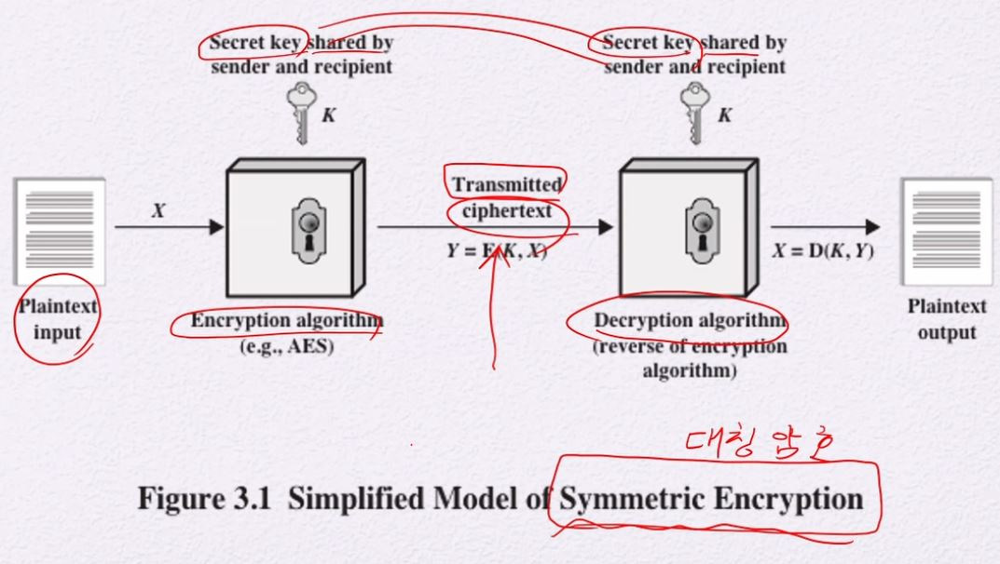
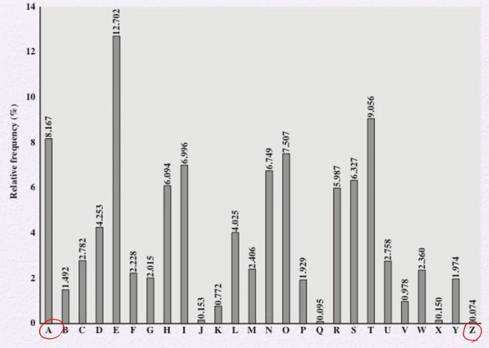
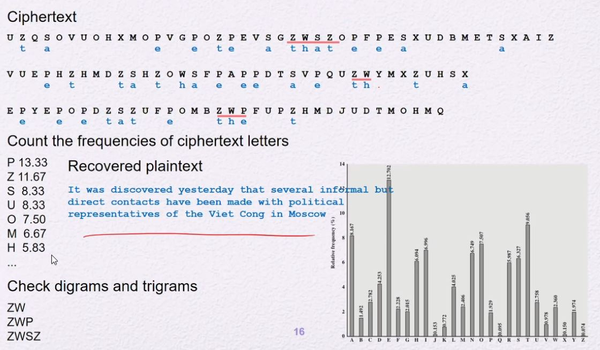
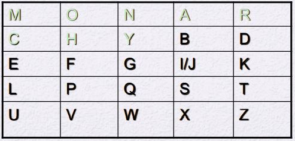
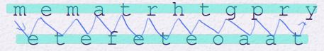
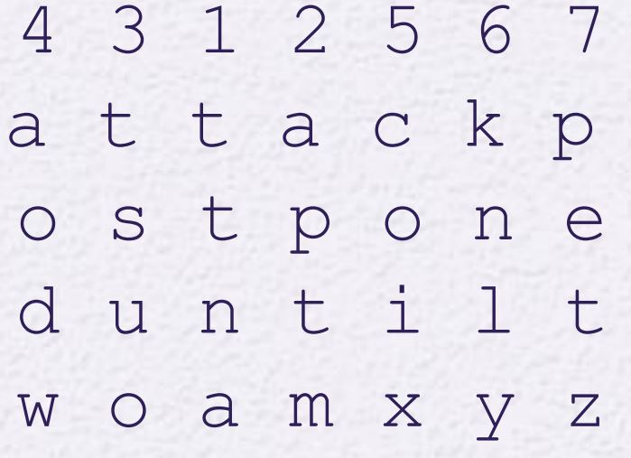

# 고전 암호화 기술
## 정의
- Plaintext: 평문
    - 암호화 되기 전 일반 문장
- Ciphertext: 암호문
    - 암호화된 문장
- Enciphering/encryption: 암호화
    - 평문에서 암호문으로 변환하는 과정
    - 목적: Confidentiality 기밀성
- Decripthering/decryption: 비화/복호화
    - 암호문에서 평문으로 되돌리는 과정
- Cryptography: 암호학
    - 암호화와 복호화를 연구하는 학문
    - Cryptanalysis와는 반대의 개념
        - Cryptography는 숨기는 개념이다.
- Cryptographic system/cipher
    - 암호화의 특정 알고리즘
        - ex) RSA, AES, DES etc..
- Cryptanalysis: 암호 분석
    - 공격자가 하는 일
    - Cryptography와는 반대의 개념
        - Cryptanalysis는 해석하는 개념이다.
- Cryptology: 암호학
    - Cryptography와 Cryptanalysis를 통칭해서 연구하는 학문

## Symmetric Cipher Model(대칭 암호)

1. 평문에서 특정 키와 암호 알고리즘으로 암호문으로 변환됨.
2. 암호문은 공개된 장소로 전송됨
    - 동시에 키는 **안전한 채널**로 전송이 됨
    - 이때, 공격자도 이 암호문을 볼 수 있으나 해석하지 않는 한 읽을 수 없음
3. 암호문을 받은 사람은 암호화에 쓰인 키와 알고리즘에서 평문으로 해독함
- 암호화와 해독에 쓰이는 키가 똑같으므로 대칭적 모습을 띔
    - 따라서, 이를 Symmetric Cipher(대칭 암호)라 한다.

### Symmetric Cipher의 조건
- 암호 알고리즘이 매우 강력해야 한다.
- 키의 전송에서 안정성(안전한 채널)을 보장받아야 한다.
    - 그 키를 안전하게 유지해야 함
- cf) 대칭암호는 관용적으로 쓰인 암호이다.
    - conventional encryption(관용 암호)

## Substitution Technique(치환 암호)
- plaintext의 글자들이 다른 글자 또는 기호 또는 숫자들로 변경되는 것
    - 글자를 다른 글자로 대체
- 또는, bits 시퀀스 단위로 plaintext의 bit 패턴들을 ciphertext의 bit 패턴으로 바꾼다.

 

# Substitution Technique
## Caesar Cipher
- 분류
    - <u>Monoalphabetic Cipher</u>
- 가장 간단하며 동시에 가장 오래된 치환 암호
    - Julius Caesar가 만듦
- 각 문자들을 알파벳 순서를 바꾼 테이블로 바꿈
    1. 알파벳 순서를 임의의 숫자 n만큼 왼쪽으로 밀어서 재정렬 테이블을 생성
        - n = 3이면, A의 위치는 D가 차지한다.
    2. plaintext의 각 문자들을 위 테이블 토대로 문자를 치환한다.
    - 수식으로 표현하면 다음과 같음
        - Encryption: C = E(k , p ) = (p + k ) mod 26
        - Decryption: C = E(k , p ) = (p - k ) mod 26
- Example
    - plain: meet me after the toga party
    - cipher: PHHW PH DIWHU WKH WRJD SDUWB

## Permutation
- 분류
    - <u>Monoalphabetic Cipher</u>
- Caesar Cipher와 비슷하다.
- 하지만 알파벳 순서 테이블을 바꾼 테이블은 무작위로 정렬된다.
    - 따라서, A~Z까지 무작위로 재정렬 함으로써 26!의 경우의 수가 생성됨
- 하지만 이 알고리즘도 안전하지 않음
    - MonoalphabetiC substitution cipher의 특성 때문이다.
        - 같은 문자는 항상 같은 문자로 대응함
        - 빈도수의 차이로 인하여 분석이 가능함
        - 
    - 한 글자 뿐만 아니라 그 이상의 문자 조합도 빈도수로 구분이 가능
        - th, the 같은 조합

### Attack to Permutation

### Countermeasures for Attack of Monoalphabetic Ciphers
1. 한번에 평문의 다수의 문자를 암호화
    - 문맥에 따라 대응 위치가 변경됨
2. 하나의 문자에 대한 멀티 대체문을 제공함
    - 이를 Polyaphabetic이라 함

## Playfair cipher
- 분류
    - <u>Polyalphabetic Cipher</u>
- 가장 잘 알려진 multiple-letter encryption cipher
- 5 x 5의 테이블을 key로 이용할 것
- 2글자씩(digram) 글자를 바꾼다.
- 역사
    - 1854년에 Wheatstone이라는 사람이 만들었으나 Playfair가 열심히 홍보해서 이름이 붙음
    - 세계 2차 대전에서 사용함(미군, 기타 연합군)

### How to encrypt using Playfair cipher
1. 5 x 5 matrix 만들기
    1. 키워드가 될 단어를 제공한다.
    2. 키워드의 각 문자들을 5 x 5 테이블에 위에서부터 하나씩 채워나간다.
        - 이때 중복 문자는 쓰지 않는다.
    3. 키워드의 문자들을 제외한 나머지 알파벳을 '알파벳 순서대로' 그 뒤에 이어서 쓴다.
        - 이때 I와 J는 같다고 한다.
    - Example: Keyword `MONARCHY`
        - 
2. 평문을 두 글자씩 묶는다.
    - 같은 글자가 매핑 될 때는 임의의 다른 문자를 그 사이에 삽입한다.
        - balloon의 경우
            - ba / lx / lo / on으로 매핑을 한다.
            - 이때 x는 임의의 문자로 최대한 빈도수가 적은 문자로 하는 것이 좋다.
3. 다음의 규칙에 따라 매핑된 글자들을 테이블을 참고해서 바꾼다.
    - 두 글자가 같은 행에 존재할 때
        - 바꿀려는 문자의 오른쪽에 있는 문자로 대체
        - ex) ar의 경우 'a'의 오른쪽인 r, 'r'의 오른쪽인 m으로 대체하여 RM으로 바꾼다.
    - 두 글자가 같은 열에 존재할 때
        - 바꿀려는 문자의 아래에 있는 문자로 대체
        - ex) mu의 경우 'm'의 아래인 c, 'u'의 아래인 m으로 대체하여 CM으로 바꾼다.
    - 두 글자가 다른 행, 열에 존재할 때(= 대각선상에 존재할 때)
        1. 각 문자의 위치를 기준으로 사각형을 그린다.
        2. 그 후 행을 기준으로 각 문자의 반대편 문자를 고른다.
        3. 그 문자가 대체될 문자이다.
        - ex) hs의 경우 3 x 3의 사각형이 생성됨
            - 행을 기준으로 h의 반대는 B, s의 반대는 P이다.
            - 따라서, hs는 BP가 된다.

## Vigenère Cipher
- 분류
    - <u>Polyalphabetic Cipher</u>
- 가장 잘 알려지고 가장 간단한 polyalphabetic substitution ciphers 중 하나

### How to encrypt using Vigenère Cipher
1. keyword가 될 단어를 제공한다.
    - 해당 단어의 길이를 n이라 하자.
    - ex) "deceptive"라 하자. 이는 길이가 9이다.
2. 평문 n글자를 keyword랑 매칭한다.
    - ex) 문장 "we are discovered save yourself"를 보자.
        - wearedisc 총 9글자를 deceptive와 매칭된다.
3. 알파벳 배열 인덱스 순서로 평문의 글자를 이동시킨다.
    - ex) wearedisc에서 w는 d와 매칭되고, d는 알파벳 배열 인덱스가 3이다.
        - 따라서, w는 3만큼 움직인 Z로 치환된다.
        - 이 과정을 "wearedisc" 모두 수행한다.
4. 위 과정 수행 후 남은 글자들을 2번 과정을 수행한다.
    - 남은 글자가 없을 때 까지 수행함

### Vulnerability of Vigenère Cipher
- Kasiski attack(Babbage attack)으로 뚫림
    1. 키워드의 길이를 알아냄
    2. 그 후 실제 plaintext를 복원
- cycle 발견하기
    - 암호문을 보고 우연히 cycle을 발견할 수 있음
        - 같은 연속된 글자가 나올 확률은 0에 가까움
        - 하지만 나올 경우 그 상대적 길이를 통해 keyword의 길이를 예측할 수 있음
    - 임의의 길이 n을 설정해두고 암호문을 끊어서 읽음
        - 끊은 단위마다 keyword의 shifting이 일어났음
            - 그리고 이를 통계를 낼 경우 영어 통계적 특성이 드러나게 된다.
            - 키워드의 길이와 n과 일치하지 않는다면,
                - 영어의 통계와 다른 분포도를 보여주지만
            - 만일 키워드의 길이와 n과 일치한다면,
                - 영어의 통계와 비슷한 분포도를 보여준다.

## Vigenère Autokey System
- 분류
    - <u>Polyalphabetic Cipher</u>
- Vigenère Cipher를 보완하기 위해 만들어진 시스템

### How to encrypt using Vigenère Autokey System
1. keyword가 될 단어를 제공한다.
    - 해당 단어의 길이를 n이라 하자.
    - ex) "deceptive"라 하자. 이는 길이가 9이다.
2. 평문 n글자를 keyword랑 매칭한다.
    - ex) 문장 "we are discovered save yourself"를 보자.
        - wearedisc 총 9글자를 deceptive와 매칭된다.
3. 알파벳 배열 인덱스 순서로 평문의 글자를 이동시킨다.
    - ex) wearedisc에서 w는 d와 매칭되고, d는 알파벳 배열 인덱스가 3이다.
        - 따라서, w는 3만큼 움직인 Z로 치환된다.
        - 이 과정을 "wearedisc" 모두 수행한다.
- >여기까지는 Vigenère Cipher와 동일하다.
4. 위 과정 수행 후 변환시킨 n개의 plaintext 글자를 새로운 keyword로 사용하고 2번부터 다시 수행한다.
    - 남은 글자가 없을 때 까지 수행함
    - ex) 위 과정 후 "wearedisc"를 변환에 수행하였으므로, 새로운 keyword로 "wearedisc"를 사용한다.

### Vulnerability of Vigenère Autokey System
- 어쨌든 영어 문장이기 때문에
    - 충분한 양의 긴 문장은 통계 분석이 가능하다.

## Vernam Cipher
- 분류
    - <u>Polyalphabetic Cipher</u>
- plaintext를 임의의 코드로 bit로 변환시키고 bit 단위로 암호화를 적용한다.

### How to enrypt using Vernam Cipher
1. 임의의 규칙으로 plaintext의 각 문자들을 bit로 변환시킨다.
2. Key stream generator로 만들어진 bit key k와 변환된 plaintext의 bit p를 exclusive-OR 연산을 수행한다.
    - 해독도 exclusive-OR 연산을 수행해서 복호화 함

### One-Time Pad
- 육군 통신 장교인 Joseph Mauborgne가 처음 제안함
- 규칙
    - 암호화할 plaintext와 같은 길이의 random key를 사용
    - 한 번 사용한 키는 다시 사용하지 않는다.
    - 새로운 메시지는 그 길이의 새로운 키를 생성해야한다.
- 이는 unbreakable

#### Difficulties
- 같은 길이의 랜덤 키를 만들어서 그 랜덤 키를 안전한 경로를 통해 receiver에게 전달해야 함
    - 같은 길이의 랜덤 키를 그 안전한 경로를 통해 굳이 제공할 필요가 없음
    - 실용적이지 않다.
- 따라서, 다음의 경우에만 사용함
    - 보낼 데이터가 많지 않은 경우
    - 매우 높은 안정성

## Rotor Machines
- 타자기 자판을 치면 톱니 구조에 따라서 대체 문자를 출력해줌

### Rotor Machines

### Rotor

### Rotor를 폈을 때 구조

- 위 그림에서 해당 위치에 전극에 따라서 키가 눌러졌을때 3번째 톱니를 지난 값이 출력이 된다.
    - A의 경우 fast rotor 에서 24와 연결됨
    - fast rotor 24out은 medium rotor 24와 연결되고, 24와 연결됨
    - medium rotor 24out은 slow rotor 18와 연결되고, 18과 연결됨
    - 따라서, B가 출력됨
- 그리고 1회 눌려졌을 때마다 fast rotor가 회전함
- fast rotor가 26회 회전하였을 때 medium,
- medium rotor가 26회 회전하였을 때 slow rotor가 회전함
- 이런 방식으로 회마다 출력이 바뀜
- 따라서, **바퀴의 형태만 숨기면** 튼튼한 보안이 된다.

# Transposition cipher
- 전치 암호
    - 글자를 변환시키는 것이 아닌, 순서를 바꿈
## Rail Fence Cipher
- 깊이 depth를 key로 사용한다.
- 가장 간단한 방법

### How to encrypt using Rail Fence Cipher
1. key가 될 depth n을 제공
    - ex) depth 2라고 가정하자.
2. plaintext를 행이 아닌 열의 순으로 작성
    - ex) "meet me after the toga party"를 다음과 같이 정렬한다.
        - 
3. 그 후 다시 행으로 새롭게 작성한 문장이 암호문이다.
    - ex) "meet me after the toga party"를 암호화하면
        - "MEMATRHTGPRYETEFETEOAAT"이다.

## Row Transposition Cipher
- 더 복잡한 전치 암호이다.
- 메시지를 행으로 쓰고 열로 읽는다.
- 이러한 방식을 Multiple "rounds"를 수행해서 더 안전하게 만든다.

### How to encrypt using Row Transposition Cipher
1. key가 될 1부터 n까지의 배열을 제공
    - ex) 4 3 1 2 5 6 7 이라 하자.
2. 메시지를 n 글자에 맞추어 행으로 적는다.
    - 빈 공간은 의미없는 문자로 채워 넣는다.
    - ex) 문장이 "attack postponed until two am"일 때
        - 
3. 그리고 배열 숫자에 맞게 열로 읽어 내려간다.
    - ex) 1번은 ttna, 2번은 aptm, 3번은 tsuo ...
4. 이를 조합하면 암호문이다.
    - ex) TTNA APTM TSUO AODW COIX KNLY PETZ

# Steganography <-> Encription
스테가노그래피는 암호화가 아니다.
- 내용을 숨기는 것
    - 특정 키를 이용하여 문장을 바꾸는 것이 아니라
    - 원본 내용 그대로 알게 모르게 데이터를 숨기고 전송함
- Steganography 기술들
    - Character marking
    - Invisible ink
    - Pin punctures
    - Typewriter correction ribbon
- Steganography 장점
    - 메시지가 존재함에도 메시지 전송을 숨긴다.
        - 일반 메시지로 착각하게끔하여 진짜 메시지를 숨김
    - 즉, traffic analisys를 회피하게 됨 
- Steganography 단점
    - 내용을 숨기기 위한 부가가치 즉 오버헤드가 크다.
    - 또한 내용을 숨기는 규칙 system이 발각되면 바로 깨진다.