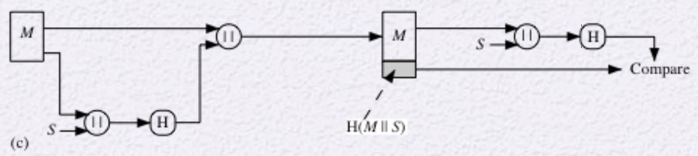
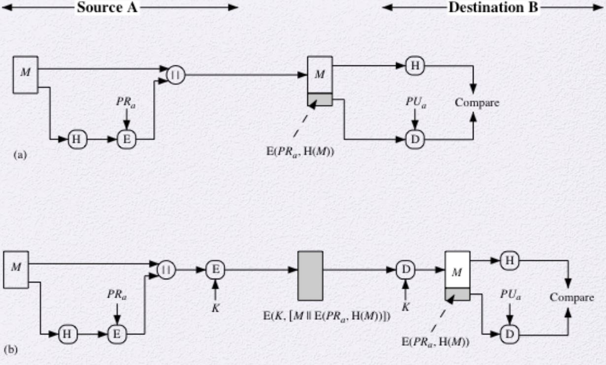

# Cryptographic Hash Functions
- hash function H
    - 길이가 변할 수 있는 input M을 받고 정해진 길이의 hash값을 출력한다.
    - Data를 압축
- h = H(M)
- data integrity의 용도로 사용한다.
- 암호학적으로 사용되는 hash function는 다음 2가지를 만족해야 한다.
    - the one-way property
        - M을 주면 h 출력은 쉬우나 h를 주면 M을 역연산은 어려워야 한다.
    - the collision-free property
        - 두 data object들이 같은 hash value를 생산하게 하는 그 pair를 찾기 어려워야 한다.

# Application of Hash Functions

## Message Authentication Code (MAC)
- keyed hash function 이라고도 한다.
- key를 가지고 hash function을 돌린다.
    - 이때 key는 서로가 이미 공유한 private한 key이다.
- Input
    - secret key, data block
- output
    - key가 관여된 hash value
    - MAC
- 만일 integrity가 목적이면
    - message에 key를 넣고 hash function을 돌린다.
    - 그 hash value를 message에 붙여서 전송한다.
    - 수신자는 공유된 key를 message에 넣고 hash function에 돌려 hash value를 얻는다.
    - 수신받은 값과 hash value를 비교
- 공격자는 secret key가 없으므로 MAC값을 변조할 수 없다.
### Simple Hash Function for MAC

- 송신자
1. message M에 key S를 붙이고 Hash Function을 돌린다.
2. 그 결과 값을 M과 붙인다.
- 수신자
1. 받은 내용 중 M에 가지고 있는 S를 붙이고 Hash Function을 돌린다.
2. 그 결과 값을 받은 내용의 hash value와 비교한다.

 

- 이를 통해서 Authentication와 Integrity를 보장함

## Digital Signature
- MAC에서의 역할과 비슷함
- 보내는 사람의 자신의 private key를 이용하여 message hash value에다가  encrypt를 한다.
- 받는 사람은 송신자의 public key를 통해서 그 사람인 것을 인증받는다.
    - Authentication
    - Integrity
- 공격자는 사실상 message를 변조하는 것이 매우 까다롭다.
- nonrepudiation 등과 같은 더 많은 기능을 제공함

### Simple Principle of Digital Signature
- RSA의 M이 대용량일 때, hash function을 통해 값을 축소시킨다.
    - 서명만 제대로 확인을 하면 되기 때문에 hash value만을 비교한다.
- 그 hash value를 Encrypt하여 송신함

- 만일 M도 같이 암호화를 해서 보낸다면,
    - Hybrid algorithm을 이용하여 key를 encrypt한다.

## Password Protection
- 사용자를 등록을 할 때 password 저장은 그대로 저장을 하는 것이 아니다.
    - hash function을 돌려 그 결과값을 저장한다.
- 이를 통해서 서버가 뚫리더라도 password는 안전하다.
- 하지만 아직 완벽히 안전하지는 않다.
    - 공격자가 hash value들을 알게 되었을 때
        - 통계적인 password를 hash function을 돌려 그 값과 비교를한다.
        - 그 값을 통해 password를 구함
    - Dictionary Attack에 약함
        - M과 hash value들을 미리 Dictionary 형태로 구현해둔다.
        - 그 값을 가지고 공격을 한다.
        - offline Dictionary Attack이라고도 한다.
- Dictionary Attack을 예방
    - salt를 사용
    - 그냥 password를 hash function에 넣는 것이 아니라 salt라는 값을 붙여서 h를 구한다.
    - 이는 서버가 뚫리기 전까지는 salt를 알 수 없으므로 뚫린 후에 공격 가능함

## system integrity: intrusion and virus detection
- File을 input으로 해서 hash value를 만들고 그 값을 저장한다.
- File이 변조됨을 확인하기 위해 저장된 h와 생성한 h를 비교
- 이는 위의 이유와 동일하게 위험하므로 key를 이용해서 더 안전하게 한다.

## PRF / PRNG
[참고](./Random_Bit_Generation_and_Stream_Ciphers.md/#pseudorandom-mumbers)

# Requirements and security
## Requirements of hash function
- Preimage
    - h = H(x)일 때 x를 h의 Preimage 라고 한다.
    - 원래 H는 many-to-one mapping이다.
        - 따라서, Preimage 값을 찾아내기 어려워야 한다.
- Collision
    - x ≠ y, H(x) = H(y) 일 때, Collision이라 한다.
    - 이 상황의 발생을 드물게 나오게 해야 함

## Two Simple Hash Functions
- two simple insecure hash functions
    - input을 n bit block단위로 자른다.
    - 각각의 block을 반복해서 n-bit hash function을 돌린다.
    - 2가지
        - Bit-by-bit exclusive-OR (XOR) of every block
            - parity bit 이용하는 것과 유사
        - Perform a one-bit circular shift on the hash value after each block is processed
            - 더 randomize한 효과를 주지만 안전하지 않음
    - hash의 2가지 조건을 둘다 만족하지 못한다.
        - the one-way property
        - the collision-free property
- 두 가지 공격 방법
    - Brute-Force Attack
        - 무작위로 input에 값을 대입해서 collision을 발생시키는 것
    - Cryptanalysis
        - hash 알고리즘의 취약점을 찾는다.

## Collision Resistant Attacks
- Brute-Force Attack공격은 생각보다 쉽게 뚫을 수 있다.
- birthday paradox
    - 같은 반 학생들 중 생일 겹치는 학생이 있을 확률
        - 23명만 돼도 같은 생일 1/2이상임
    - hash 함수는 이 역설과 같이 collision이 발생하기 쉬움
- Collision Resistant Attacks
    - hash 함수가 짧은 output을 주게 되면 Collision Resistant Attacks에 매우 취약해진다.
    - m bit를 출력하는 hash function에 대해서
    - 공격자는 **2^(m/2)**의 변조 데이터들을 hash value 쌍을 구한다.
    - 그리고 피해자에게 정상 데이터를 받고 그 데이터와 같은 hash value의 변조 데이터를 이용해서 인증을 모방한다.

## Secure Hash Algorithms (SHA)
- SHA는 NIST에서 표준화 됨
- MD4(160 bit) hash function을 만들었으나 깨짐
- SHA-1, SHA-2는 깨지면서 SHA-3를 고안함

### SHA-3
- 2012에 표준화가 됨
- Keccak algorithm에 기반하여 만들어짐
- 자세한건 설명 X