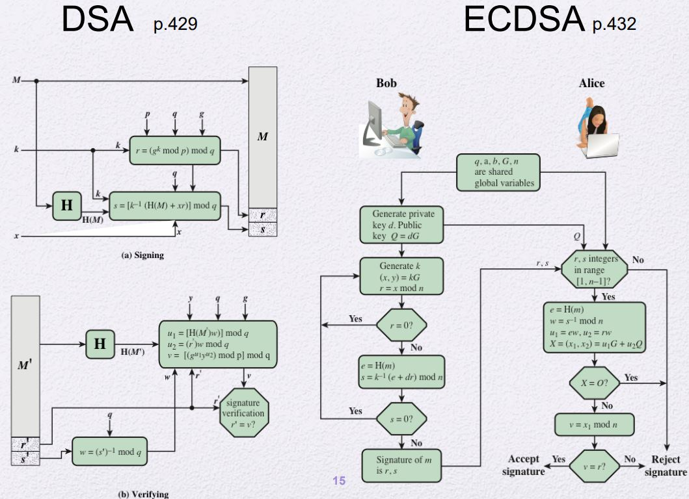

# Digital Signature
## Properties and Requirementes
- Properties
    - 누가 언제 보냈는지 인증 (Authentication)
    - 언제 내용을 보냈는지 확인 (Integrity)
    - 제 3자가 해결할 수 있는지 (nonrepudiation)
- Requirementes
    - 보낸 사람이 부인할 수 없어야 하며, 개인 키가 없을 시 위조를 부가능해야 함
    - 서명의 생성과 확인이 쉬워야 함
    - 개인 키가 없다면 서명을 생성하는게 어려워야 함
        - 이미 Digital Signature 존재할 때 이를 이용하여 새로운 Digital Signature를 생성하는 것이 어려워야 함
        - 메세지가 있을 때 Digital Signature를 만들어내는 것도 어려워야 함
## Review: DLP and Cyclic Group
[참고](./Number_Theory.md/#discrete-logarithms,-modulo-p)
- 𝑦 = 𝛼^𝑥 𝑚𝑜𝑑 p 에 대해서 cyclic group을 형성한다.
- p-1의 약수 q에 대해서 subgroups를 형성할 수 있다.
    - genterator를 제외한 값들은 p-1의 약수 만큼의 cyclic size를 가진다.
- 위 성질을 이용하여 다음의 식을 도출할 수 있다.
    - 𝛼^𝑥 ≡ 𝛼^(𝑥 𝑚𝑜𝑑 𝑞) 𝑚𝑜𝑑 p
    - Example
        - 8^8 mod 19 = 8^2 mod 19
- 왜 subgroups를 사용해야 하는가?(복잡도를 보았을 때)
    - 곱셈의 수가 지수 x의 bit 길이에 대체로 비례함
    - 각 곱셈은 (bitlen(p))^2에 비례한다.
    - 같은 안전성에 대해서 더 빠른 연산을 제공하기 위해
        - p는 매우 크게, q는 적당한 크기를 선택
    - 추가적으로 q는 소수여야 한다.
### DLP 해결 알고리즘
- DLP 해결 알고리즘은 매우 다양히 존재한다.
- 크게 다음과 같이 나눌 수 있다.
    - General Number Field Sieve (GNFS)
        - mod p로 구성되는 prime field에 대수적인 성질을 이용한다.
        - 이를 해결하는 알고리즘 복잡도는 p의 bit길이에 비례한다.
    - Pollard rho
        - hash 충돌 찾는 것과 유사한 공격방식
            - 생일 역설을 이용한 공격방식
        - DLP와 ECDLP)(타원곡선)에 적용하는 일반적인 알고리즘
        - 복잡도는 지수 x의 후보들 수에 비례한다.
# Schnorr Identification
- 일종의 Zero knowledge proof(ZKP)이다.
- challenge-response 기반 user authentication이다.
    - challenge-response?
        - Client가 server에 로그인할 때 pw를 보낸 상황에서
            - server가 Client에게 challenge를 던진다.
            - Client는 pw를 가지고 challenge를 하여 그 값을 server에 전달한다.
            - server는 그 값을 받고 자신이 가지고 있는 pw와 비교를 하며 인증한다.
- DLP문제를 기반으로 한다.

## Schnorr Identification의 안전성
- Client가 Server에 지속적으로 자신의 개인키를 가지고 Data를 인증을 하게 되면
    - 그 데이터들이 쌓여 private key를 풀 수 있지 않을까?
    - 사실상 불가능함
- 위는 사실상 public key를 가지고만 private key를 찾는 DLP문제이다.
- 하지만 공격자가 중간에 Alice인척 값을 보낼 수 있다.
    - 위 이미지에서 공격자가 Bob의 r을 알고 Alice의 y를 안다면 Bob의 연산을 통해서 γ를 구할 수 있다.
    - 이를 먼저 Bob에게 보내면서 Alice인척 할 수 있음
    - 따라서, r을 최대한 random하게 만들어야 함
## Schnorr signature
- Schnorr identification는 interactive한 proof protocol이다.
- **Fiat-Shamir heuristic**를 통해서 간단히 Schnorr Identification를 Schnorr signature로 변환이 가능하다.
- Schnorr Identification와 달리 r을 Bob이 보내지 않는다.
    - Interact하지 않음
    - r은 Alice가 임의로 만듦
        - Hash function에 M과 γ를 붙여서 넣고 γ를 Bob에게 보냄
        - 이는 r을 random하게 만드는 효과가 있음
    - 그 후 y를 전송함
    - 이를 통해서 M에 대해 (γ, y)의 쌍을 가진다.
- Schnorr signature는 조금 다른 방식이다.
    - (γ, y)의 쌍이 아닌 (r, y)의 상을 지님
    - 계산 과정이 위와 반대
        1. computes 𝛾′ = 𝛼^𝑦*𝑣^𝑟 (𝑚𝑜𝑑 𝑝)
        2. verifies 𝑟 = 𝐻(𝑀||𝛾′)
# DSA to ECDSA

# RSA-PSS
- 같은 메시지를 Hash function에 넣더라도 randomize하게 나오게 함

- padding: 상수
- salt값이 바뀌면서 randomize함

