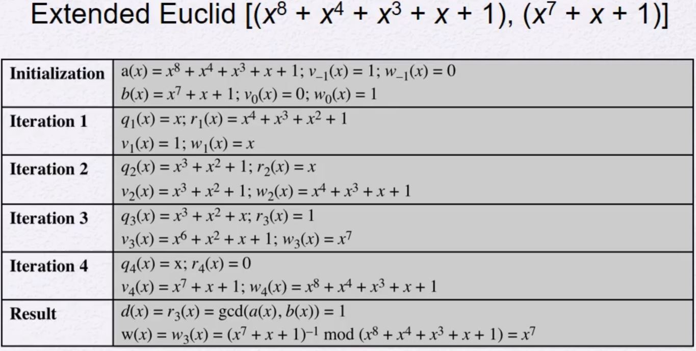

# Groups
두 가지(집합과 연산)에 대한 순서쌍    
어떤 집합에 대해서 연산을 연계를 시킨 것     
즉, 집합과 연산을 같이 정의해야 한다.     
연산을 그 집합에서 수행을 했을 때 다음의 조건들을 만족해야 Groups이다.

## Groups 조건
set G 안에 원소 a, b, (c)는 다음의 조건을 만족해야 Group이라 할 수 있다.
- Closure: 닫혀 있음
    - G에 있는 원소 a, b는 어떤 연산  a • b를 수행 했을 때
    - 그 값 또한 G에 속해야 한다.
- Associative: 결합 법칙
    - G에 있는 원소 a, b, c에 대해
    - a • (b • c) = (a • b) • c 이어야 한다.
- Identity element: 항등원의 존재
    - G에 있는 모든 a에 대해
    -  a • e = e • a = a를 만족시키는 항등원 e가 존재한다.
        - Additive Group
            - e = 0
        - Multiplicative Group
            - e = 1
- Inverse element: 역원
    - G에 있는 어떤 a에 대해
    - a • a^(-1) = a^(-1) • a = e를 만족시키는 역원 a^(-1)가 존재한다.
        - Additive Group
            - -a
        - Multiplicative Group
            - a^(-1)
## Group의 기호와 다양한 Group
수학적 기호와 매우 유사함
- Exponentiation: 지수승
    - 어떤 연산에 대해 반복적인 작업을 수행할 때 지수승으로 쓴다.
    - a^n = a • a • a ... • a
- 지수승이 0일 경우
    - a^0 = e로 정의한다.
        - 덧셈일 경우
            - 0*a = 0
        - 곱셈일 경우
            - a^0 = 1
- G안에 a의 역원이 a^(-1)일 때
    - a^(-n) = (a^(-1))^n
        - 덧셈일 경우
            - -na = n(a^(-1))
        - 곱셈일 경우
            - a^(-n) = (a^(-1))^n

### Abelian Group
교환 법칙이 성립할 경우 Abelian Group이라 한다.
- Commutative: 교환 법칙
    - G에 있는 모든 원소 a, b에 대해
    - a • b = b • a를 만족시킨다.

### Cyclic Group
어떤 특정 원소 a가 a^k 형태로 그 그룹 안에 있는 모든 원소들을 만들 수 있을 때 Cyclic Group이라 한다.
- 이때 a가 G를 generate했다고 한다.
- a는 G의 generator이다.
- Cyclic Group은 항상 Abelian Group이다.
    - Cyclic Group ⊂ Abelian Group

# Fields
어떤 집합과 두 가지의 연산으로 정의한다.    
그 두 연산은 덧셈과 곱셈이다.    

## Fields 조건
- 모든 원소의 덧셈과 뺄셈에 대해 [Group의 조건](##Groups-조건)을 모두 만족하고, 교환 법칙이 성립해야 한다.
    - 즉, 모든 원소의 덧셈과 뺄셈에 대해 [abelian group](##Abelian-Group)이 될 때 Fields가 된다.
- zero divisor가 없어야 한다.
    - F안에 있는 원소 a, b가 ab = 0 일 때, a = 0 또는 b = 0 이어야 한다.
- 덧셈과 곱셈 사이의 분배법칙이 성립해야 한다.
- 정리하면
    - 집합 내에서 addition, subtraction, multiplication, and division이 잘 정의되어 있어야 한다.
    - 덧셈과 곱셈이 잘 정의가 되어 있어야 한다.
        - a * b
            - a / b -> a * b^(-1)
        - a + b
            - a - b -> a + (-b)
- Example
    - rational numbers, the real numbers, and the complex numbers.
- Not Example
    - Integer
        - 3일 경우 덧셈의 역원이 존재하지만, 곱셈의 경우 역원은 실수이므로 Integer 밖으로 벗어난다.

## Finite Field(Galois Field)
무한히 많은 원소를 가지는 필드도 있지만, 유한한 원소를 가지는 필드도 존재함.    
이를 Finite Field(Galois Field)라 한다.    
- 이때 원소의 개수는 항상 소수의 지수승 만큼 가지고 있는다.
    - p^n개의 원소가 존재
    - GF(p^n)
    - ex) GF(15)
        - 15 = 3 * 5이므로 존재하지 않는다.
- n이 1일 경우 Prime Filed라 한다.
    - GF(p)
    - public key암호에서 많이 사용
- p가 2일 경우 Binary Field라 한다.
    - GF(2^n)
    - AES에서 사용

# Polynomial f(x)
GF(2^8)과 같은 데이터를 다루기 위해 다항식을 사용한다.     
- Ordinary Polynomial arithmetic
- Polynomial arithmetic performd by modulo p
- Polynomial arithmetic performd by modulo m(x)

## Polynomial Division
다항식: f(x) = q(x)g(x) + r(x)
- r(x) = f(x) mod g(x)
- 만일 r(x) = 0 일 경우
    - g(x)는 f(x)를 나눈다.
        - g(x)|f(x)
    - g(x)는 f(x)의 factor(인자)이다.
        - 또는 g(x)는 f(x)의 약수이다.

### Irreducible Polynomial
- Field에서 다항식 f(x)가 차수가 더 낮은 다항식의 곱으로 표현되지 않을 때,
    - Irreducible Polynomial라고 한다.
    - ex) x^2 + x + 1
- prime polynomial이라고도 한다.

## Polynomial GCD
Polynomial c(x)가 a(x)와 b(x)에 대해 최대 공약수가 되기 위해서는 다음의 조건을 만족해야 한다.
- c(x)는 a(x)와 b(x)를 모두 나눌 수 있어야 한다.
- c(x)는 a(x)와 b(x)의 공약수들 중 가장 높은 차수여야 한다.

GCD[a(x),b(x)]는 유클리드 알고리즘으로 해결할 수 있다.

### Extended Euclidean Algorithm

## Polynomial Arithmetic over GF(2)
- 2의 배수들을 계수로 가지는 항들은 소멸된다.
- 특징
    - Addition과 Substraction은 같다.
        - 즉, 덧셈과 뺄셈의 결과는 동일하다.
    - Addition은 XOR연산과 동일하다.
- 표기: 2진법
    - 다항식을 2진법으로 표기한다.
    - 따라서, 2진법으로 표기된 값을 편의상 숫자로 변환하지만, 해당 숫자를 그대로 받아들이면 안된다.
    - Example
        - GF(2^3)에서
            - 6은 110이므로
            - x^2 + x 를 의미한다.
### Computational Considerations
- 덧셈과 곱셈은 XOR와 Shift로 쉽게 구현이 가능하다.
    - Modulo Reduction은 차수가 넘어가는 항들을
        - 더 차수가 낮은 항들로 대체하는 방식으로 가능하기 때문이다.
    - 덧셈: XOR
    - 곱셈: Shfit and XOR
- 구하는 순서는 다음과 같다.
    1. p의 최고 차항에 대한 Fact를 구한다.
    2. x부터 p의 최고 차항 직전까지 한 칸씩 shift와 xor연산을 통해 각 차수에 대한 값을 구한다.
        - xor은 p의 최고 차항을 벗어났을 때 수행한다.
    3. 우리가 구하고자 하는 각 항들의 합(XOR)을 구한다.
- Example
    - (𝑥^2 + 1) × (𝑥^2 + 𝑥 + 1) 𝑚𝑜𝑑 (𝑥^3 + 𝑥 + 1)
    - -> 101 * 111 𝑚𝑜𝑑 (𝑥^3 + 𝑥 + 1)
    - Fact: x^3 𝑚𝑜𝑑 (𝑥^3 + 𝑥 + 1) = x + 1 -> 011
    1. 101 * 010 (101 shift)=> 1 010 = 1000 + 010 = 011 xor 010 = 001
    2. 101 * 100 => 010
        - 1번에서 101 * 010에 x를 한번 더 곱한 경우이므로
        - 구한 값 001에 x를 한번더 곱하면 101 * 100의 값 010을 구할 수 있다.
    3. 따라서, 101 * 111 = 101 * [001 + 010 + 100]
        - = 101 xor 001 xor 010 = 110
        - x^2 + x가 된다.
