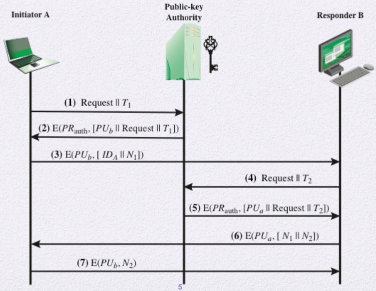
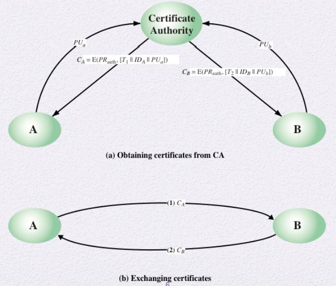
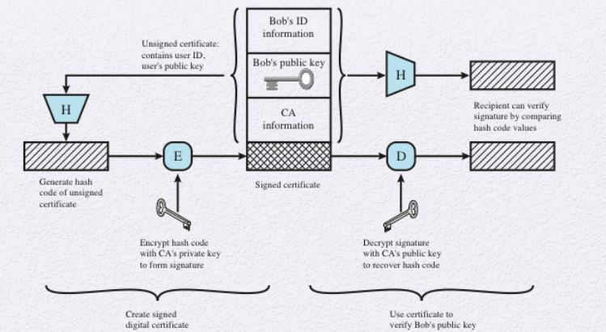
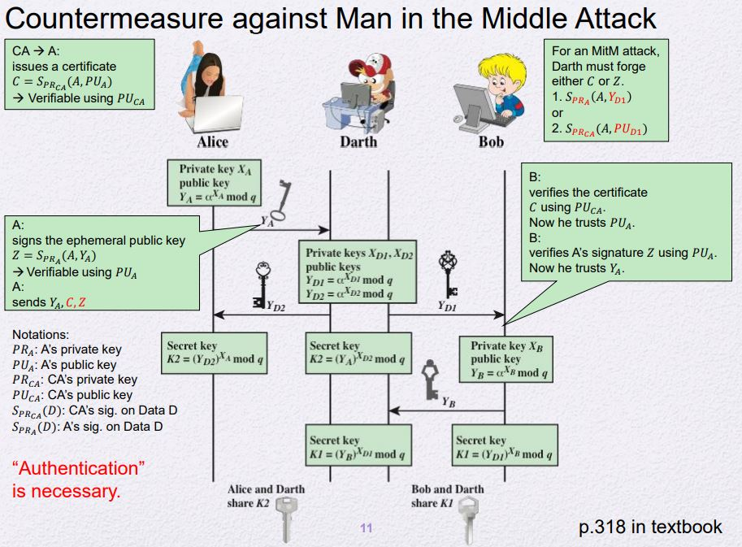

# Distribution of public keys
- 공개키를 나눠주는 과정 중 Man in the Middle Attack이 들어올 수 있다.
    - 내용을 수정하지는 않지만 Authentication의 문제가 발생함
- 이를 보장하는 제도가 필요함
## Public announcement of public keys
Public key를 분배하는 3가지 경우를 보자
## 1. 그저 아무에게나 뿌림
- MitM Attack에 취약
## 2. 누구나 이용가능한 Directory에 공개 키를 넣고 공유
- Directory가 안전성이 완벽히 보장이 되지 않는다면
    - A와 B의 Auth를 보장이 불가함
## 3. 공개 키 기관을 이용 (Public key authority)

1. 신뢰할 수 있는 공개 키 기관에 각자의 공개 키를 담아둔다.
2. A가 B에게 메시지를 보낼 때 기관에 요청을 하면 기관이 인증을 한(Private key) B의 공개키를 받는다.
3. A는 그 값을 가지고 암호화를 하여 B에게 전달한다.
4. B 또한 같은 방식으로 기관에서 A의 공개키를 받고 A에 대한 인증을 한다.
- 단점
    - 기관이 온라인으로 A와 B의 통신을 연결해주어야 한다.
        - 매우 오버헤드가 큼
## 4. Public-key certificates

- 현재 국가에서 제공하는 주민등록번호와 같은 제도
1. A와 B가 각각 기관에 공개 키를 발급받고 자신의 것임을 해당 제도로부터 인증을 받는다.
2. 실제 교환할 땐 인증받은 값을 교환한다.
- 기관이 온라인으로 실시간 교환에 참여할 필요가 없다.
# X.509 Certificates
- Public-key certificates의 표준이다.
- public-key cryptography와 digital signatures를 기반으로 함
- 
- X.509 표준에서 인증서 Format, 관리, 취소, 분배 등의 일을 한다.
## Countermeasure against Man in the Middle Attack

- Alice
    - 중간에서 공격을 하기 위해서는 결국 Alice의 private key를 알거나 공공기관의 private key를 알아야 공격이 가능함
- Bob
    - Alice와 유사
## Obtaining a Certificate
- 인증서가 가지는 성질
    - CA의 public key를 알고 있는 누구나 상대방의 public key를 확인이 가능함
    - CA 이외에는 Certificate를 변경하거나 만들 수 없다.
- 따라서, 편하게 아무 Directory에 두어도 큰 걱정할 필요가 없다.
    - CA의 공개 키가 있을 경우...!
- 
# Public-key infrastructure