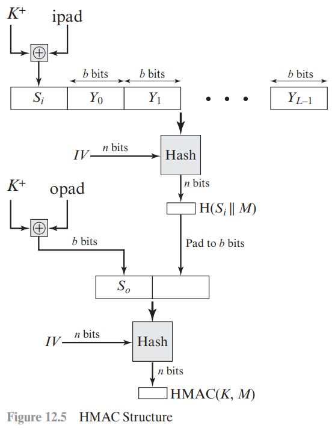
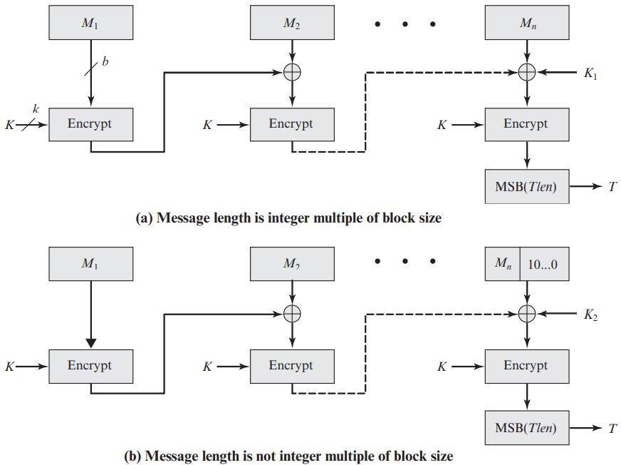
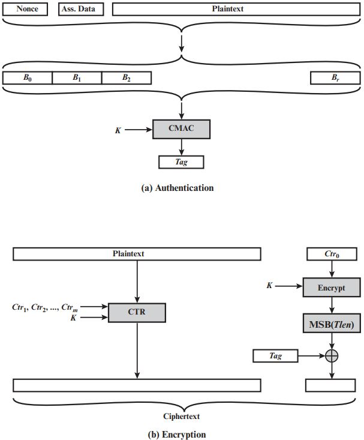
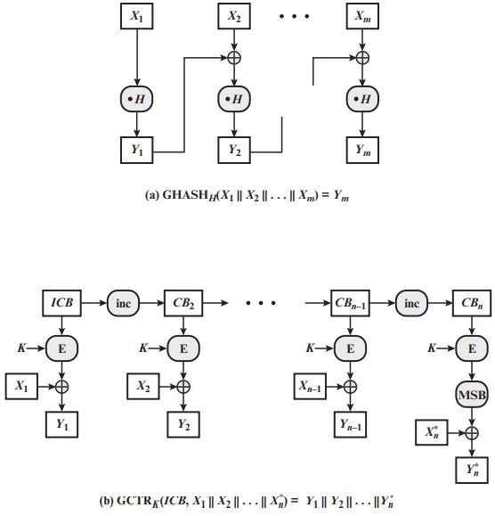
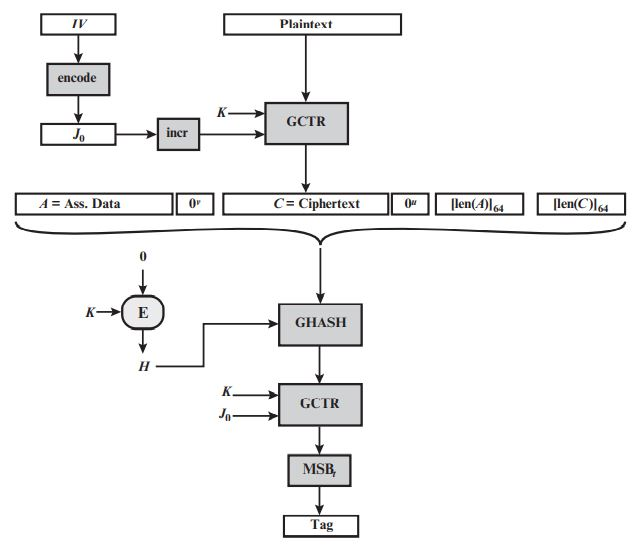

# Message Authentication Codes
- 모든 변조 또는 신원가장 등에 대해서 막기 위해 MAC를 사용한다.
- MAC은 Authentication와 Integrity를 동시에 제공한다.
- MAC은 메세지와 key를 입력으로 받고 고정된 길이의 값을 제공한다.(keyed hash)
    - 메세지를 암호하면 encrypt, 고정된 길이는 MAC
- MAC 사용
    1. 그냥 일반 공개되는 메세지에 MAC을 적용해서 인증의 기능으로 사용
    2. 1번 과정에 결과물 값을 암호화하여 전달하면서 기밀성 추가 기능
    3. Plaintext를 Encrypt 하고 MAC을 적용하면서 기밀성과 인증을 보장
## HMAC
- Hash 기반으로 MAC을 구현
    - cryptographic hash function로 부터 MAC 구현
- HMAC는 IP protocol 계층에서 사용된다.

### HMAC Structure

- 정의  
    - b: num of bits in a block
    - K^+: key padded with zeros on the left
    - ipad: 0x36 repeated
    - opad: 0x5C repeated
- 과정
    1. Key K를 모자란 bit수를 padding을 채워서 b 만큼 추가한 key K^+를 만든다.
    2. b/8을 수행한 결과 ipad와 K^+를 XOR연산 수행한다.
        - 그 값을 Si라 하자.
    3. Message를 b bit만큼 쪼개서 Yi를 만든다.
    4. 그렇게 만든 Y와 Si를 붙인 값을 IV와 함께 Hash 함수에 넣고 그 n bit의 value H를 얻는다.
    5. b/8을 수행한 결과 opad와 K^+를 XOR연산 수행한다
        - 그 값을 So라 하자.
    6. H와 So를 붙인 값을 IV와 함께 Hash 함수에 넣고 n bit의 결과 값 HMAC(K, M)을 얻는다.

## CMAC
- Cipher-based MAC
- DAA라는 알고리즘을 기반으로 CMAC를 만든다.
    - Data Auth Algorithm(DAA)
        - CBC 구조와 유사하며 결과 값을 DAC라 한다.
- DAA의 문제점
    - MAC(K, X) = T의 결과값을 가질 때
    - MAX(X || (X xor T)) = T를 만들 수 있다.
    - 이를 위해 CMAC이 나옴
- CMAC
    - 또다른 Key K2를 하나 더 사용해서 XOR을 마지막에 한번 더 수행한다.
### CMAC Structure

- 정의
    - L = E(K, 0b)
    - K1 = L * x
    - K2 = L * x2 = (L *#* x) * x
    - K1과 K2의 곱셈 연산은 GF(2^b) 상에서 이루어진다.
- 구분
    - K1을 사용
        - M이 블럭 사이즈만큼 딱 나누어 떨어지면 마지막 xor연산에서 K1을 사용한다.
    - k2를 사용
        - M이 블럭 사이즈만큼 나누어 떨어지지 않을 때 마지막 xor연산에서 K2을 사용한다.
        - M에 10....0의 padding을 붙여서 사용한다.

# Authenticated Encryption
- confidentiality and authenticity를 동시에 지키기 위함
- Approaches:
    1. Hashing followed by encryption
    2. Authentication followed by encryption
    3. Encryption followed by authentication
    4. Independently encrypt and authenticate
- 하지만 위 모두 안전성에 문제가 존재함
## CCM (Counter with CBC-MAC)
- IEEE 802.11 WiFi에 사용됨
- CBC-MAC을 사용하는 것이 아니라 CMAC을 사용한다.
- 위 접근법 중 4번을 한다.
    - Encrypt와 authenticate를 따로 함
    - 즉, encrypt와 MAC을 따로 함
- CCM에 입력될 값들은 3가지로 구분되어진다.
    - authenticate와 encrypt를 같이하는 Data
        - 일반 plaintext block이다.
    - encrypt 없이 authenticate만 연관된 Data
        - 예를 들어 protocol header 같이 내용을 숨길 필요는 없지만 조작하면 안되는 Data
    - nonce N과 연관된 Data
        - nonce: 계속 변하는 수
        - replay attack을 막기 위해 nonce라는 값을 넣어서 값을 변화시키는데 이와 관련된 Data
### Encryption & Authentication

## GCM (Galois Counter Mode)
- CCM은 성능상의 문제가 존재
    - 병렬화가 안된다.
- GCM은 CCM의 병렬화 문제를 해결함
- Encryption은 CTR mode를 사용한다.
- 그 Ciphertext에 key material를 이용하여 authenticator tag를 생성한다.
    - GF(2^128) 상에서 연산함
- 다음 두 가지의 함수를 사용
    - GHASH
        - keyed hash function(MAC)
    - GCTR
        - CTR mode를 약간 변형한 mode
        - operation을 한 번 수행할 때마다 1증가

### GHASH & GCTR

- GHASH
    - H = E(K, 0^128)
    - H를 가지고 GF(2^128) 상에서 X와 곱하며 각 단계의 결과값을 다음 단계의 block과 XOR연산을 하는 과정을 반복한다.
    - (X_1 * Hm) ⊕ (X_2*# H^(m-1)) ⊕ ... ⊕ (X_(m-1) * H^2) ⊕ (X^m * H)
- GCTR
    - 카운터 모드와 동일하나 마지막 단계가 조금 다름
    - 마지막 블록 사이즈가 counter block보다 조금 작을 경우 CB의 최상위 비트부터 사이즈를 자른다.
### Encryption & Authentication

- GCTR -> GHASH -> GCTR 과정을 거친다.
1. GCTR에 Plaintext와 key, J0를 넣는다.
    - J0는 IV의 Encode된 값으로 GCTR에서 Counter 역할을 한다.
2. 그 결과값과 나머지를 GHASH에 넣는다.
    - 나머지의 Data는 다음과 같다.
        - Authentication만 필요한 data
        - Padding 값
        - Authentication만 필요한 data의 길이
        - 1번과정에서의 ciphertext의 길이
3. 그 결과값을 GCTR에 한번 더 돌린다.
4. 그 값을 필요한 만큼 MSB에서부터 자른다.
    - 이를 Tag로 사용한다.
