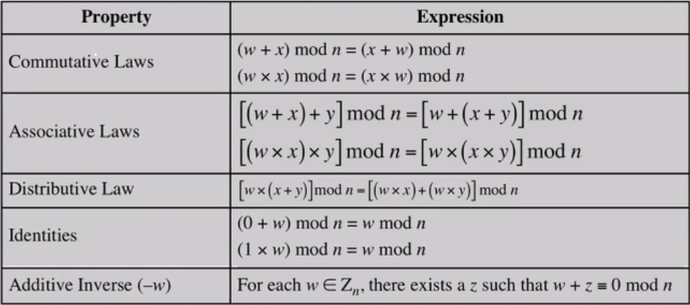
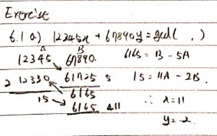
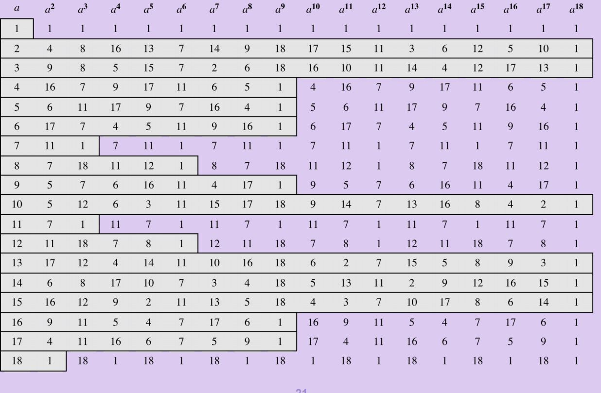
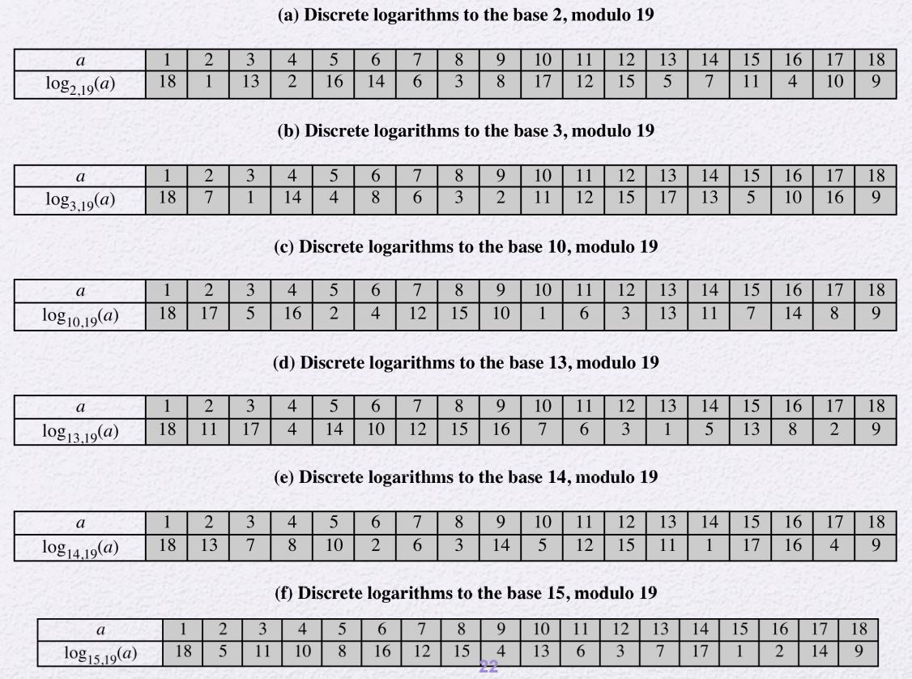

# Divisibility
- 나누기의 정의
    - 정수 a, b, m에 대하여 a = mb를 만족할 때, 0이 아닌 b는 a를 나눈다.
    - 나눴을 때, 나머지가 없을 경우 b는 a를 나눈다고 한다.
- Notation: b | a
- b | a라면, b는 a의 약수이다.

## Properties of Divisibility
- a|1
    - a = ±1
- a|b and b|a
    - a = ±b
- 0이 아닌 b는 항상 0을 나눈다.
- a|b and b|c
    - a|c
- a|g and b|h
    - b|(mg + nh)

## Division Algorithm
- a = qn + r(양의 정수 n, 음이 아닌 정수 a) 0 ≤ r < n
- q = [a / n]


# Euclidean Algorithm (유클리드 알고리즘)
두 정수의 최대 공약수 구하는 알고리즘     
- notation: gcd(a, b)

## Modular Arithmetic
- a mod n
    - n을 모듈러라고 한다.
- 어떤 정수 a에 대해
    - a = qn + r(양의 정수 n, 음이 아닌 정수 a) 0 ≤ r < n
    - q = [a / n]
    - a = [a / n]*n + (a mod n)
- 합동 모듈러 n
    - (a mod n) = (b mod n)
        - 두 정수 a, b는 모듈러 n에 대하여 합동이다.
    - notation: a ≡ b (mod n)
    - a ≡ 0 (mod n)
        - n | a이다.
- 모듈러 연산
    - [(a mod n) + (b mod n)] mod n = (a + b) mod n
    - [(a mod n) - (b mod n)] mod n = (a - b) mod n
    - [(a mod n) * (b mod n)] mod n = (a * b) mod n



## Properties of Congruences
1. `a ≡ b (mod n)` 는 `n | (a - b)` 와 필요 충분 조건이다.
2. `a ≡ b (mod n)`와 `b ≡ a (mod n)`는 같다.
3. `a ≡ b (mod n)`와 `b ≡ c (mod n)`는 `a ≡ c (mod n)`이다.

---

## Extended Euclidean Algorithm
- 항등원
    - 어떤 원소에다가 항등원이라는 요소를 더하더라도 어떤 원소가 다시 돌아옴.
- 역원
    - 항등원을 구하기
    - ex1) 0은 모든 덧셈의 항등원이다.
        - 모듈러 8에 대하여 6과 2로 역원 0을 구한다.
    - ex2) 1은 모든 곱셈의 항등원이다.
        - 모듈러 8에 대하여 3과 3으로 역원 1을 구한다.

**두 수가 서로소인 경우만! 역원이 존재한다.**



두 페어를 찾고, 음수일 경우 양수로 변환해줌(앞의 값을 더해줌.)

### 시험 문제 유의
-> 곱셈의 역원을 계산하시오.

# Prime Numbers
- 1과 자기자신만 나눌 수 있는 숫자
- 다른 수들의 곱으로 표현이 불가능한 숫자
- 소인수분해를 통해 표현할 수 있는 유일한 숫자

## 페르마의 소정리
- p가 소수이고, a가 p로 나누어 지지 않는 양의 정수일 때, (gcd(a,p) = 1)
    - a^(p-1) ≡ 1 (mod p)
- Alternate form
    - a^(p) ≡ a (mod p)

## Euler totient function ∮(n)
- ∮(n)
    - n보다 작은 수 중에서 n과 서로소인 수의 개수
    - public key Crypresystem에서 많이 사용됨
        - ex) RSA, etc...
- n이 소수라면
    - ∮(n) = n-1
- n = p*q (p, q는 소수)
    - ∮(n) = (p-1)(q-1)
- a와 n이 서로소일 때,
    - a(∮(n)) ≡ 1 (mod n)
    - Alternate form
        - a(∮(n)+1) ≡ a (mod n)


## Primality test
소수인지 아닌지 확인하는 방법

- Trial division
    - 어떤 수 n이 있을 때, 2부터 (n-1)/2까지의 수를 나누어본다.
    - 나누어질 경우 소수가 아님
    - 시간이 매우 오래걸림
- Fermat test
    - p가 소수고 gcd(a, p) = 1 이라면, a^(p-1) ≡ 1 (mod p)이다.
    - 위 명제는 옳은 명제이기 때문에 대우가 성립한다.
    -  gcd(a, p) = 1를 만족하는 a에 대해 a^(p-1) ≡ 1 (mod p)를 만족하지 않는다면, p는 소수가 아니다.
- Miller-Rabin test
    - n이 너무 클 때, 이 방식을 이용한다.
    - 내부적으로 2가지를 수행한다.
        - Fermat test
        - NSR (nontrivial square root) test
            - 만일 p가 홀수인 소수라면, x^2 mod p = 1의 해는 x=1,p-1 두가지만 존재한다.
            - 대우를 통해 구한다.
            - x^2 mod p = 1의 해가 2가지가 아니라면, p는 소수가 아니다.
- Detrministic Algorithm
    - 무조건 Prime인지 알려준다.
    - 하지만 시간이 오래걸림 (trial drivision 보단 빠름)
- Hybrid
    - ex) trial drivision + Miller-Rabin Algorithm
        - 작은 수를 trial drivision를 통해 구하고
        - 해당 수를 가지고 배수를 하면서 후보를 제외시킨다.
        - 남은 후보를 가지고 Miller-Rabin Algorithm를 수행한다.
## Miller-Rabin Algorithm
다른 내용 참고    
여기서는 홀수인 경우만 확인한다.    
(짝수는 2 하나뿐이므로 할 필요가 없다.)

pseudo code
```py
Miller-Rabin(n, s) // n이 소수인지 판별한다.
for j = 1 to s
    a = random positive integer < n
    if Test(a, n) = True
        then, return Composite.
End for
return Prime
```

Subrotine Test
```py
Test(a, n)
t and u 는 t ≥ 1 이고, u는 홀수, 그리고 n - 1 = 2^(t)*u를 만족한다고 하자. # n-1은 항상 짝수이다.
x_0 = a^u mod n.
for i = 1 to t
    x_i = x^2_(i-1) mod n
    if x_i = 1 and x_(i-1) ≠ 1 and x_(i-1) ≠ n - 1 # NSR test
        then, return True
End for
if x_t ≠ 1 # Fermat test
    then, return True

return False
```

오류 확률은 2^-s보다 작다.    
한번 돌렸을 때, 오류가 일어날 확률은 1/2보다 작다.    
이를 s번 반복하면, 2^-s이므로 오류확률은 2^-s보다 작다.

### Randomized Algorithm
랜덤 알고리즘은 유명한게 2가지가 있다.
- Monte Carlo Algorithm
    - 수행시간은 정해져 있다.
    - 한정된 시간에 돌렸을 때, 답이 나올것인지는 확률적이다.
        - 확률적으로 틀릴 수 있다.
        - 위 알고리즘이 그런 경우.
- Las Vegas Algorithm
    - 답은 명확히 알려준다.
    - 하지만, 시간이 얼마나 걸리지는 모른다.

## SSL
- SSL: Secure Socket Layer
- TLS: Transport Layer Security
    - 후속 버전
    - transport: OSI 계층 중간
        - 흐름을 제어하거나 신뢰성을 확보함
        - TCP, UDP
        - 이 계층에서 보호를 하겠음을 의미
    - https://
        - http 프로토콜을 이용해서 transport 계층에서 보호받으며 이용하겠음을 의미

<br>

## Powers of Integer, Modulo P
Powers of Integer, Modulo 19


정수를 제곱하고, prime Number로 modulo 연산을 수행하면 Cycle이 생긴다.
- Cycle의 주기는 modulo 연산을 수행했을 때 결과가 1일때 까지이다.
- 1부터 P-1까지의 모든 수가 나오는 Integer를 Generator라고 한다.
    - 위의 경우 2, 10, 13, 14, 15, 16이 Generator이다.
- Cycle의 주기의 개수는 꼭 P-1의 약수들 중 하나의 개수를 가진다.
    - 위의 경우 18, 9, 2, 3, 6의 개수대로 나왔다.

## Discrete Logarithms, Modulo P
Discrete Logarithms, Modulo 19


Powers of Integer, Modulo P와는 반대로    
int^x mod p = a 일때, x를 구하는 것이다.    
표기는 다음과 같다.
log_(int, p)(a) = x

## Integer Factorization
RSA 공격키 암호    
어떤 수 A를 주고 Factor를 구해야한다.    
1000비트만 되어도 약 10년이 걸린다.