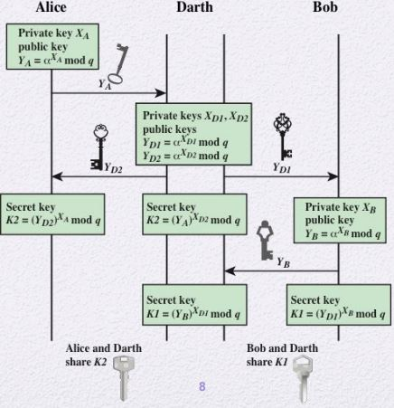
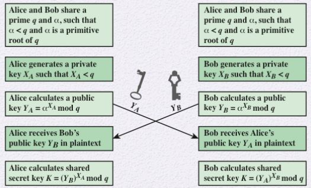
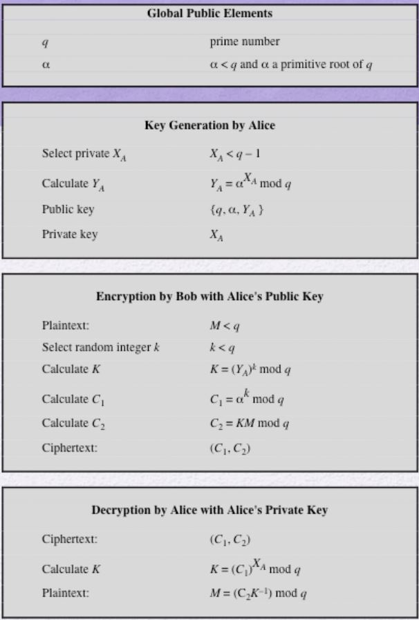
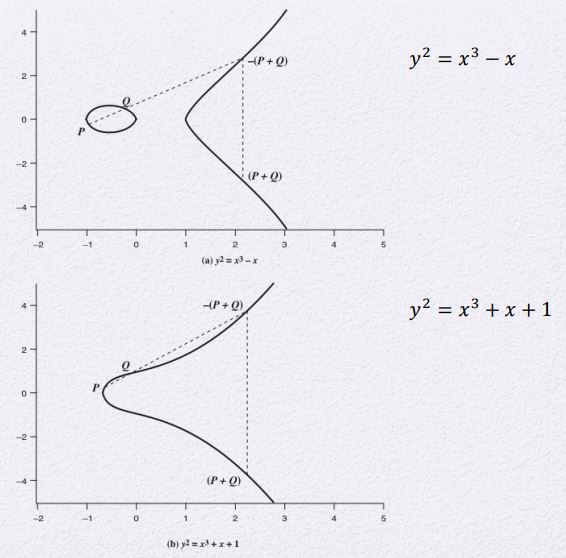
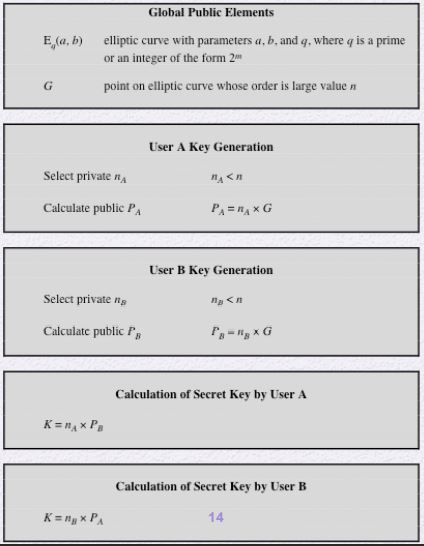

# Review
## Applications for Public-Key Cryptosystems
[Link](./Public_Key_Cryptography_and_RSA.md/#applications-for-public-key-cryptosystems)

## Discrete algorithm
[Link](./Number_Theory.md/#discrete-logarithms,-modulo-p)

# Diffie-Hellman Key Exchange
- 처음 제안된 Public-key 알고리즘
- RSA처럼 Encryption 하는 것이 아니라 key를 교환하는 방식
- 여러 프로토콜에서 사용됨
    - ex) TLS
- **Discrete algorithm**을 기반
- [Diffie-Hellman problem](#Diffie-Hellman-problem)
- 세션용 임시 키
- RSA vs Diffie-Hellman
    - RSA
        - Session들간에 연관관계가 유지되면서 한번 뚫리면 모두 뚫리는 단점이 있음
    - Diffie-Hellman
        - 하나가 뚫려도 모두가 뚫리지는 않음
        - Forward Secrecy
- Man in the Middle Attack(MitM Attack): 중간자 어택
    - 
    - Darth라는 공격자가 Alice와 Bob 사이에 끼어서 데이터를 확인하는 공격
        - Darth는 Alice와 정상적인 key 교환을 하며, Bob과도 정상적인 key 교환을 한다.
        - Darth는 서로 정상적인 암호문을 받고 분석하여 서로에게 전달해 준다.
    - Authentication / Integrity 문제 발생
## Diffie-Hellman 동작 방식

1. Alice와 Bob은 다음을 공유한다.
    - 소수 q
    - a < q인 q의 primitive root(generator) a
2. Alice와 Bob은 각각 q보다 작은 임의의 수 X_A와 X_B를 선택한다.
    - 이는 각각의 Private key이다.
3. Alice와 Bob은 Y = a^X mod q를 만족하는 Y_A, Y_B를 구한다.
    - 이는 Public key이다.
4. Alice와 Bob은 각각 공유하는 Secret key를 계산한다.
    - Alice
        - K = Y_B^X_A mod q
    - Bob
        - K = Y_A^X_B mod q
    - 이때 계산된 zK는 서로 같은 값을 가진다.
- 둘 중 하나의 Private key가 알려지면 두 명의 Private key가 알려진다.
    - 하지만, Public key에서 Private key를 구하는 과정은 Discrete 계산이므로 매우 어렵다.
- 만일 Alice가 X_A를 잘못생성할 경우 공격이 가능하다.
    - X_A가 잘못 계산되어서 유한한 공간상에 후보의 경우의 수가 적어지게 된다.
    - 이를 이용하여 Discrete 문제를 해결하는 것이 아니라 후보 중 X_A를 추측해서 Y_A를 구한다.
    - 시간값을 이용하여 계산된 seed값을 이용하는 난수생성기를 이용하면 안된다.
        - 이를 이용하여 후보를 더 한정지을 수 있음
### Diffie-Hellman Problem
- 각각의 Private key를 알아내는 것만이 공격자가 공격을 하는 유일한 수단이 아니다.
- 공개된 정보 a, q, Y_A, Y_B로 부터
    - K를 알아내는 문제

# ElGamal Encryption
- **Discrete algorithm**을 기반
- Diffie-Hellman Key Exchange에 One Time Pad을 추가한 개념

## ElGamal Encryption 동작 방식

- 모든 사람이 Global Public Elements를 공유함
    - 소수 q
    - a < q인 q의 primitive root(generator) a
- Alice의 Key 쌍 생성
    - Diffie-Hellman과 같이 X_A와 Y_A를 생성함
        - 다만 임시적인 세션키가 아닌 지속적인 사용을 함
- Bob이 Alice의 Public Key를 가지고 암호화를 함
    - Bob이 가져야하는 정보
        - Plaintext
            - q보다 작은 Plaintext M
        - k
            - q보다 작은 랜덤한 정수 k
        - K
            - K = (Y_A)^k mod q
    - Ciphertext는 (C1, C2)의 쌍으로 구성됨
        - C1
            - C1 = a^k mod q
        - C2
            - C2 = KM mod q
            - C2과정은 Diffie-Hellman의 과정과 유사함
- Alice가 (C1, C2)을 복호화함
    - K 계산
        - K = (C1)^X_A mod q
        - K의 역원을 K'이라 하자
    - 구한 K를 가지고 M계산
        - M = (C2K') mod q

# Elliptic curve cryptography
- RSA key의 길이는 Security와 비례하다
    - 이를 대안으로 Elliptic curve cryptography가 고안됨
- 같은 key길이에 대해 앞의 암호 알고리즘 보다 훨씬 안전하다.
- ECC 상에서 Addition이 finite field 상의 Modular 연산처럼 표현함
    - 다중 덧셈(= scalar multiplication, point multiplication)이 modular exponentiation과 비슷함
    - Q = kP에 대해서
        - k와 P가 있다면, Q를 계산하기 쉽다.
        - 하지만, Q와 P를 가지고 k를 구하긴 어렵다.
            - elliptic curve discrete logarithm problem (ECDLP): k를 구하는 문제
- 일반적으로 key 길이가 짧으면 연산도 짧음
    - 따라서, 비슷한 안전성에 key 길이가 더 짧은 ECC가 더 효율적
## 타원 개념 이해

- 두 점에 대한 덧셈 (P + Q)
    - 두 점을 이은 직선이 또 다른 점에서 만날 때의 지점을 S라 하자.
    - 자신의 축에 대해서 대칭이동을 시킨 그 지점을 P + Q라고 정의한다.
- 임의의 점 P에 대해서
    - 점 P에 대해 접선을 긋고 만나는 점에 대해서 대칭이동한 점은 2P이다.
    - 그리고 P와 2P를 더하면 만나는 점은 3P가 된다.
    - 이런식으로 무수히 더하다보면 어느 시점에서 자신의 점 P로 돌아온다.
        - 이 점들이 Cyclic Group이 된다.

## ECDH (Elliptic Curve Diffie-Hellman) Key Exchange 동작 방식

- Global Public Elements
    - Eq(a, b)
        - modulus q에 대한 타원 곡선 식
    - G
        - Generator point(=primitive point)
            - 어디서부터 시작할지의 시작점
- Key Generation
    - n
        - order
            - Generator부터 시작해서 다시 돌아오는 총 Cycle의 크기
    1. n보다 작은 key k를 선택
    2. 임시 Public key P를 계산
        - P = k * G
- Seceret key 공유
    - 두 사용자가 각각 k_a, k_b를 선택하고 P_a, P_b를 계산해서 공개하면
    - K = k_a * P_b = k_b * P_a
