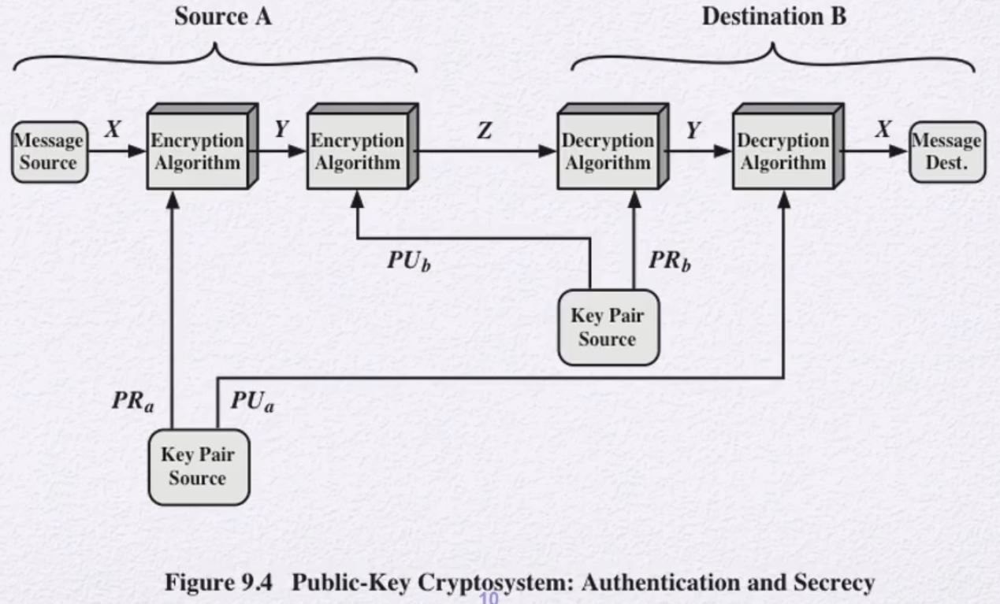
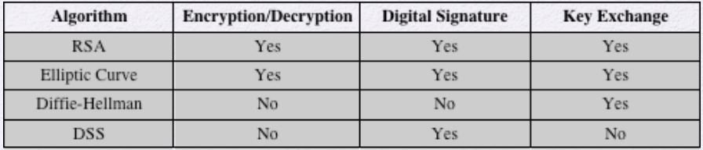
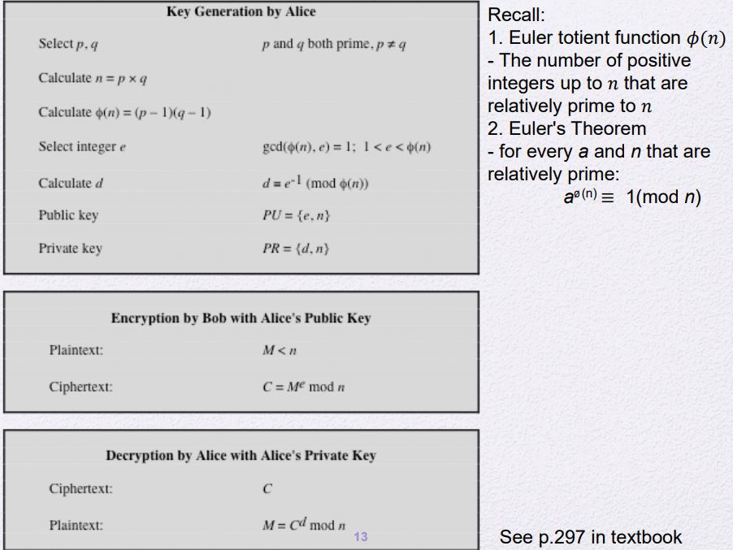
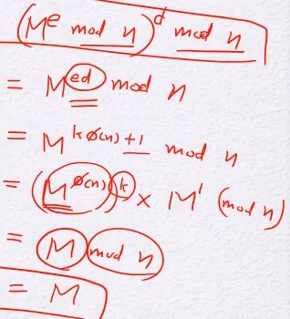
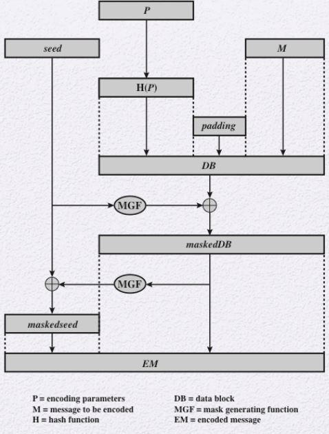

# Review Of Symmetric key cryptosystems
[Link](./Classical_Encryption_Techniques.md/#symmetric-cipher-model)

<br>

# Public-key cryptosystems
## Public-key가 필요한 원인
대칭암호에서 해결되지 않는 문제
- Key distribution
    - Key를 안전하게 보내는 방법 없이 안전한 소통을 할 수 없다.
- Digital sinature(nonrepudiation)
    - Key가 수신자와 송신자 단 두명만이 가지고 있다.
    - 따라서, 송신자가 만일 보내지 않았다고 하면 이를 증명할 방법이 없다.

해당 문제를 Diffie and Martin Hellman이 이 문제에 대한 아이디어를 처음으로 냄

## Public-key 용어 및 사용
### 용어
- Plaintext
- Encryption Algorithm
- key pair
    - Public key
        - Plaintext를 Encryption하여 Ciphertext로 만들 때 사용하는 Key
    - Private key
        - Ciphertext를 Decryption하여 Plaintext로 만들 때 사용하는 key 
- Ciphertext
- Decryption Algorithm

### 사용
1. A 수신자는 Private key, Public key pair를 가지고 있다.
    - Private key는 자신이 가지고 있으며
    - Public key는 공개되어 모두가 볼 수 있다.
2. B 송신자는 공개된 A의 Public key를 가지고 Plaintext를 암호화 한다.
3. 그리고 공개된 Channal에 Ciphertext를 A에게 전송한다.
4. A는 암호문을 Private key를 가지고 해독한다.
    - 이를 통해 Plaintext를 얻을 수 있다.
- Public key를 가지고 암호화 한 암호문은 Public key로는 복호화가 불가능하다.
    - Private key와 Public key는 하나의 쌍으로 Public key로 암호화 된 것은 Private key로 복호화 가능하다.
- 기능
    - Key distribution 문제 해결
        - Key를 전달할 때 안전하게 전달해주어야 하는 문제를 애초에 만들지를 않음
        - 공개를 하고 Private key를 각자가 가지고 있으므로 Key 전달 문제 해소
    - Digital sinature 문제 해결
        - A 수신자는 자신의 Plaintext를 Private key로 Encryption 과정을 함으로써 인증 도장을 찍을 수 있다.
            - Encryption 과정을 Generation이라 하며,
            - Decryption 과정을 Verification이라 한다.
        - A 만이 가지고 있는 Private key이기 때문에 A만이 할 수 있는 작업이다.
        - Plaintext + Signature

## Conventional and Public-Key Encryption 비교
### Conventional Encryption
기존 암호화 동작 과정
- 같은 알고리즘과 **같은 key**를 가지고 수신자와 송신자 모두가 그것들을 알고 있어야 한다.
- 안전성 측면
    - key는 안전하게 유지가 되어야 한다.
    - 암호문을 key 없이 복호화를 할 수 없어야 한다.
    - 알고리즘과 일부의 암호문-평문 pair을 알고 있더라도
        - key를 알 수는 없어야 한다.
### Public-Key Encryption
- Encryption Algorithm과 Decryption Algorithm에 사용되는 key가 각각 다르다.
    - key pair가 존재하며 각각의 key는 각 Algorithm에 사용됨
- 안전성 측면
    - Key pair 중 하나만 안전하게 유지되는 Private key이면 된다.
        - 다른 key는 공개
    - Private key만 안전하다면, 암호문을 복호화하는것이 불가능해야 한다.
    - 알고리즘과 일부의 암호문-평문 pair과 Public key를 알고 있더라도
        - Private key는 알 수 없어야 한다.

## Public-Key Cryptosystems

- 위 과정을 통해 기밀성을 지키면서 인증을 동시에 진행할 수 있다.
1. A가 자신의 Private key를 가지고 Encryption 과정을 수행한다.
    - 이를 통해 Authentication을 보장함
2. A가 B의 Public key를 가지고 Encryption 과정을 수행한다.
    - 이를 통해 Confidentiality을 보장함
3. B가 자신의 Private key를 가지고 Decryption 과정을 수행한다.
    - 복호화를 수행한다.
4. B가 A의 Public key를 가지고 Decryption 과정을 수행한다.
    - B는 A가 보냈음을 확인한다.

## Applications for Public-Key Cryptosystems
- Public-Key의 기능
    -  Encryption/Decryption
    -  Digital Signature
    -  Key exchange
        - Public-Key를 사용한다고 하더라도 Symmetric key cryptosystems를 사용안하지는 않는다.
        - Public-Key는 암호화 복호화 과정이 매우 느림
            - 따라서, 암호화는 Symmetric 암호화를 수행하고 key를 Public-key 이용한다.
- 응용
    - 
    
## Public-Key의 요구조건
- 실용성
    - Key pair를 만드는 작업이 쉬워야 한다.
    - Public key를 가지고 암호화하는 과정과 Private key를 가지고 복호화하는 과정이 쉬워야 한다.
- 안전성
    - Private key만 안전하다면, 암호문을 복호화하는것이 불가능해야 한다.
    - 알고리즘과 일부의 암호문-평문 pair과 Public key를 알고 있더라도
        - Private key는 알 수 없어야 한다.

# RSA Algorithm
Rivest-Shamir-Adleman (RSA) Algorithm
- Plaintext를 숫자로 보고 계산을 함
- 임의의 n에 대해서 0~n-1사이의 정수들을 Plaintext라고 생각하여 암호화한다.
    - 현재 n을 최소 2048bit, 권장 3072bit 이다.
- 지수연산 표현식을 사용한다.
- Plaintext는 n보다 작은 숫자 상태에서 연산이 된다.
- Encryption과 Decryption 과정이 매우 간단함
    - C = M^e mod n
    - M = C^d mod n = (M^e)^d mod n = M^ed mod n
- n의 값은 모두가 아는 값이다.
- e는 Public-Key의 값, d는 Private-key의 값이다.
- PU={e,n}, PR={d,n}

## RSA Algorithm의 요구조건
- 모든 M < n에 대해서
    - M^ed mod n를 만족해야 한다.
    - 암호화, 복호화 계산이 쉬워야 한다.
- e와 n이 주어졌을 때, d를 알아내는 것은 매우 어려워야 한다.

## RSA 과정

### Key Generation
1. 소수인 두 정수 p, q를 고른다.
2. n = p*q인 n을 구한다.
3. ∮(n) = (p-1)(q-1)을 계산한다.
    - [Euler totient function](./Number_Theory.md/#prime-numbers)
4. 다음의 조건을 만족하는 임의의 정수 e를 선택한다.
    - gcd(∮(n), e) = 1
    - 1 < e <∮(n)
5. mod ∮(n)에 대해서 e의 곱셈의 역원 d를 구한다.
    - [Extended Euclidean Algorithm](./Number_Theory.md/#extended-euclidean-algorithm)
6. 이렇게 PU와 PR을 구할 수 있다.
    - PU={e,n}
    - PR={d,n}

### Encryption
- Plaintext는 n보다 작은 M이다.
- C(Ciphertext) = M^e mod n
### Decryption
- M(Plaintext) = C^d mod n

### Prove the Decryption


## Hybrid Encryption
- 긴 메시지를 암호화하기에는 block 단위로 나누어서 암호화를 진행해야하고 시간이 너무 오래걸린다.
- 따라서, Hybrid Encryption를 한다.
    - 이는 암호화 하고자하는 Data를 CTR이나 기타 알고리즘으로 암호화를 진행하고
    - 사용한 Key를 RSA로 암호화하는 과정이다.
    - Key encapsulation
        - Key를 암호화함
    - Data encryption
        - 실제 Data를 암호화

## Binary Exponentiation Algorithm
- (= Square and Multiply Algorithm)
- 큰 지수승에 대한 modular연산을 더 빠르게 처리할 수 있는 알고리즘이다.
- a^b mod n에 대한 Pseudo code
    ```py
    c = 0
    f = 1
    for i = k downto 0
        do c = 2 * c
            f = f*f mod n
        if bi = 1
            then c = c+1
                f = f*a mod n
    return f
    ```
    - bi
        - b를 2진수로 변환했을 때 bit 값이다.
        - 0번자리부터 읽은것이 아니라 가장 왼쪽부터 읽어서 오른쪽으로 간다.

## Efficient Operation
### Using the Public Key
- 위 Binary Exponentiation Algorithm를 사용하더라도 RSA 알고리즘은 여전히 느리다.
    - n은 최소 2048 이상의 bit를 사용하기 때문에 n이 너무나도 큼
- 따라서, 고정된 적당히 작은 n을 사용함
    - 일반적으로 65537(2^16 + 1)을 사용함
    - 자주 사용되는 공개 키의 e는 3과 17이다.

## Using the Private Key
- Chinese Remainder Theorem을 사용하면 약 4배정도 더 빨라질 수 있다.

# Attack against RSA
- Brute force (Exhaustive search)
    - 너무 광범위함
- Mathematical attacks
    - n의 factor을 찾으려고 함
- Chosen ciphertext attack
    - RSA의 구조적 특성을 이용한 공격
- Implementation attacks
    - RSA의 구현상의 취약점 찾기

## Factoring Problem
- 주로 사용하는 공격
    - n을 두 개의 소수로 Factoring을 하게 된다면 이 알고리즘은 깨지게 된다.
        - ∮(n) = (p-1)(q-1)을 계산하여 e를 구할 수 있게 되고, d 또한 값을 계산이 가능함
- 거의 사용하지 못하는 공격 - 사실상 거의 불가능
    - 두 소수 p, q를 먼저 찾지 않고 바로 ∮(n)을 구할 수 있다면 또한 RSA 알고리즘이 깨진다.
    - d를 바로 구하는 방법

## Chosen Ciphertext Attack(CCA)
- 선택 암호문 공격
    1. 공격자가 암호문 여러개를 마음대로 선택을 한다.
    2. Private key를 알고 있는 사람한테 암호문을 복호화를 요청
    3. 그 결과를 Plaintext로 돌려 받는다.
    4. 복호화를 요청하지 않은 암호문 중 단 하나라도 Plaintext로 만든다면 공격에 성공한 것
- Encryption과 Decryption 과정의 취약점을 찾는다.
- 이 공격을 막기 위해 optimal asymmetric encryption padding (OAEP)을 개발함
    - RSA-OAEP 사용

### OAEP
<!--여기서부터!!1시간 44분-->

- 그냥 RSA를 하는 것이 아니라 Message를 Encoding을 해서 그 Encoding된 Message EM을 암호화를 하는 방식
- Encoding
    1. M(Message)와 Padding과 Hash function 결과값을 결합한 DB(Data Block)생성
        - Padding: 구조를 최대한 맞추기 어렵도록 하기 위함
            - Hash값과 특정 상수값인 Padding을 넣음으로써 의도적인 조작을 어렵게 만들기 위해 구조적으로 넣은 임의의 값
            - 공개
        - H(P)
            - 공개
            - Encoding parameter를 Hash function에 넣고 나온 결과 값
            - 길이가 정해져 있지 않은 값을 받아서 길이가 정해진 결과 값을 만들어내는 압축 함수
                - Ch11에서 다시 볼 예정
        - Key나 추가 정보를 사용하는 단계가 아님
    2. seed를 MGF1에 돌려서 나온 결과 값과 DB를 XOR 연산을 수행해서 maskedDB를 얻는다.
        - seed
            - 매번 새로 생성하는 random 값
        - MGF(Mask Generating Function)
            - 일종의 Hash function
    3. maskedDB를 MGF2(!= MGF1)에 돌린 결과 값과 seed를 XOR연산을 수행해서 maskedseed를 얻는다.
    4. maskedseed + maskedDB 를 통해 EM(Encoding Message)를 얻는다.
- Decoding
    1. Parsing을 해서 maskedseed와 maskedDB를 나눈다.
    2. maskedDB를 MGF2에 넣어 돌린 결과 값과 maskedseed를 XOR연산을 수행해서 seed를 얻는다.
    3. seed를 MGF1에 넣은 결과값과 maskedDB를 XOR연산을 수행해서 DB를 얻는다.
    4. Parsing을 해서 Message를 얻는다.
- Encoding parameter를 Hash function에 넣은 결과값을 왜 DB에 붙이는가??
    - 송신자가 처음 계산해서 붙인 결과값과 수신자가 받고나서 Parameter를 Hash function 돌린 결과값을 비교한다.
    - 그 결과값이 다르다면 공격자가 데이터 조작을 했음을 의미함
    - MAC과 비슷한 느낌
- 왜 Random seed 값이 들어가는가?
    - 같은 Plaintext에 대해 다른 Encoding Message를 얻기 위함
- OAEP의 기대 효과
    - Randomize 효과
    - Ciphertext에 특정 구조를 정해줌
    - Chosen Plaintext Attack, Known Plaintext Attack, Chosen Ciphertext Attack 등의 공격을 막아줌

## Implementation attacks
- 암호 알고리즘이 얼마나 수학적으로 완벽한가, 구조상으로 얼마나 견고한가와는 관계 없이 
- 알고리즘을 수행하는 기계자체를 공격하는 방식
### Side Channel Attacks
- 알고리즘이 수행되면 기계에서 부수적인 정보를 나오게 되는데 이를 이용한 공격
- attack technique
    - Timing attack
        - Private key에 관련된 연산을 누군가 수행할 때 rivate key에 따라 연산 시간이 달라질 수 있음을 이용한 공격
        - Example
            - d가 100000000와 111111111일 때
            - 실제적으로 도는 알고리즘의 연산 횟수는 달라진다.
    - Power analysis attack
        - 전력 소모의 패턴을 분석함

    - Electromagnetic analysis attack
        - 전자기파를 이용한 공격
    - Cache
        - Cloud 환경에서 많이 사용되는 공격
        - 모든 사용자가 Cashe는 공유하고 있기 때문에 이를 관찰하면서 분석함
- sol
    - 알고리즘을 비트가 1, 0에 따라 크게 달라지지 않도록 만듦
        - [이 알고리즘을 수정](#binary-exponentiation-algorithm)
            ```py
            c = 0
            f = 1
            for i = k downto 0
                X[0] = f*f mod n
                X[1] = X[0]*a mod n
                f = X[bi]
            return f
            ```
        - 하지만 이는 0에 대해서 쓸데없는 연산이 추가되므로 시간상으로 Overhead가 발생함
        - d연산에 대해 통계적 공격에 대해서는 막을 수 없다.
    - 위 단점에 대한 방어 기술
        - Randomization and blinding

## Fault-Based Attack
연산이 수행되는 과정에 의도적으로 에러를 발생시키도록 유도함
- 먼저 정상적인 연산을 수행하도록 피해자에게 시키고
- 피해자에게 Fault를 발생시키도록 유도함
- 정상결과와 잘못된 결과를 비교해서 추가적인 정보를 얻음
- 앞 공격보다 훨씬 어려움

# Public-Key Encryption에 대한 오해
- Public-Key Encryption은 Symmetric Encryption보다 더 안전하다?
    - 이는 케바케
- Public-Key Encryption은 Symmetric Encryption을 완전히 대체할 수 있다?
    - 성능적인 측면에서 Symmetric Encryption가 더 효율적임
    - 따라서, Hybrid 형태로 많이 사용함
- Public-Key Encryption를 사용하면 Key 분배와 사용에 있어 문제가 될게 없다?
    - 상대적으로 Symmetric Encryption보다 key 공유가 조금 더 낫다라는 의미
    - 근본적인 해결책이 아니다.
    - Example
        - 공개 키를 분배할 때 인증이 보증되어야 한다.
        - 이로 인해 공개 키 인증서가 만들어짐
        - 우리나라의 공인인증서
