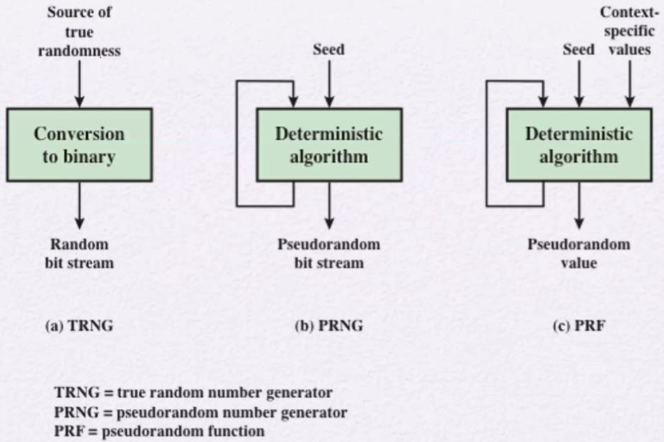
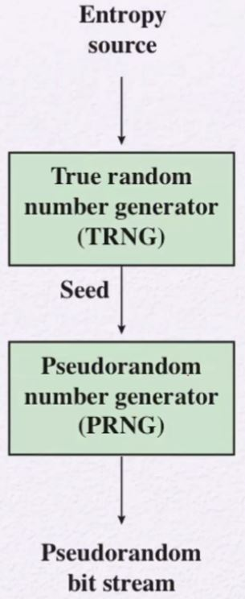
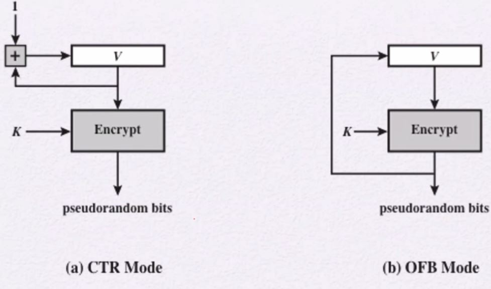
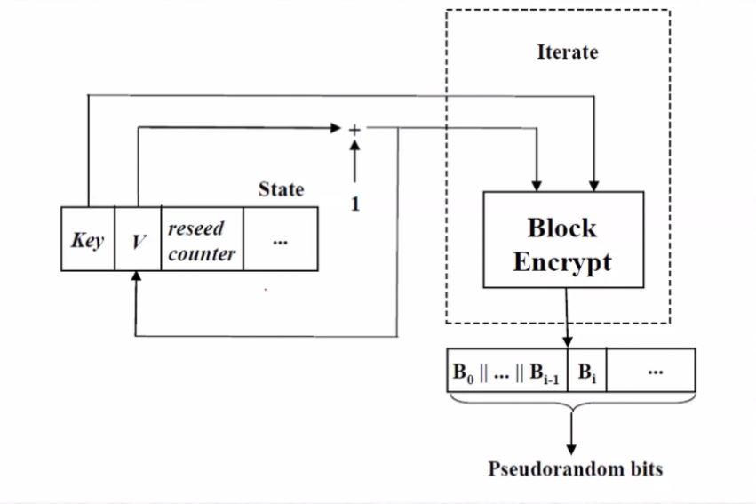
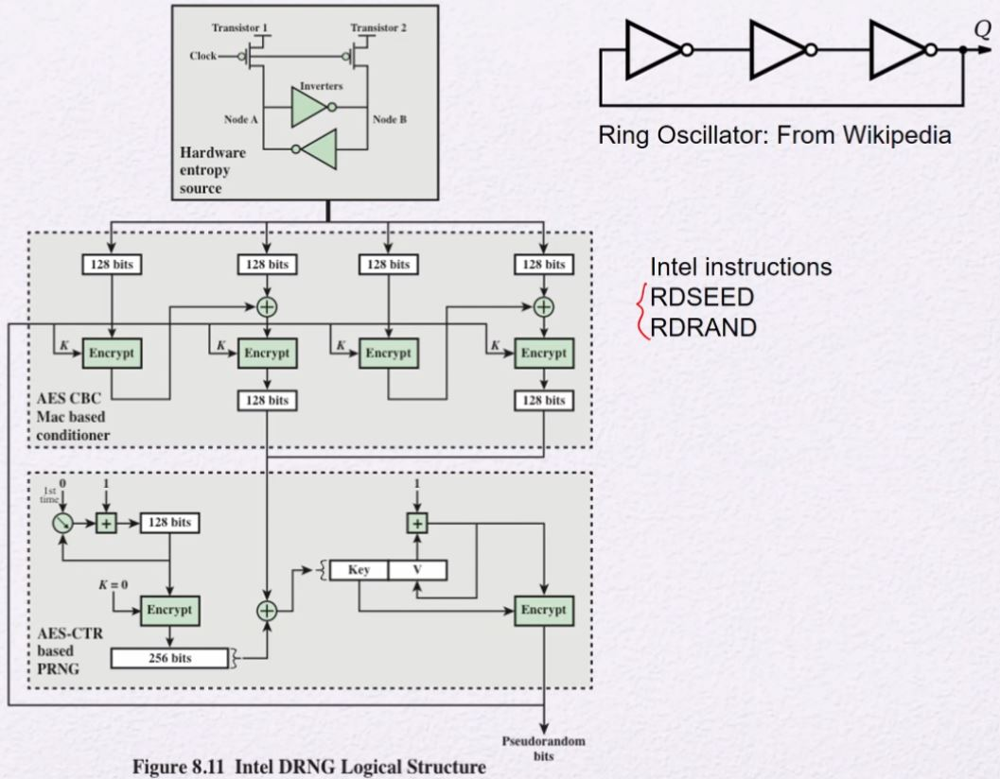

# Random Numbers
- 암호나 network 보안 알고리즘과 프로토콜에서 난수들을 사용한다.
    - Key distribution
    - Session key generation
    - Generation of a bit stream for symmetric stream encryption
    - Generation of keys for the RSA public-key encryption algorithm
- 난수가 가져야할 성질 2가지
    - 불규칙성(Randomness)
        - 균등분포
            - 1과 0이 나오는 빈도가 동일해야 한다.
        - 독립성
            - 앞에서 어떤 숫자가 나오더라도 그 다음 숫자는 연관성이 없어야 한다.
    - 예측불가성(Unpredictability)
        - Forward unpredictability
            - 의사난수 중 일부를 알더라도 나머지 앞의 값들을 알 수 없다.
        - Backward unpredictability
            - 의사난수 중 일부를 알더라도 뒤의 seed 값들을 알 수 없다.

## Pseudorandom Numbers
- deterministic한 algorithms이다.
    - 즉, 진짜 random이 아니다.
- 충분히 잘 설계가 된다면, sequences 결과는 충분히 randomness 테스트를 통과한다.

- 일반적으로 TRNG를 가지고 seed로 사용하여 PRNG나 PRF에 넣는다.
## True Random Number Generator (TRNG)
- effectively random
- 컴퓨터의 물리적인 환경요소로부터 야기되는 entropy source를 가지고 만든다.
    - keystroke의 timing patterns, disk electrical activity, mouse 움직임, system clock 등을 이용한 결과값
    - 이 소스를 binary output으로 변환함
- bias를 없애기 위해 추가적인 처리가 필요할 수 있음

## Pseudorandom Number Generator (PRNG)
- seed라고 불리는 고정된 값을 input으로 넣는다.
    - 일반적으로 TRNG를 이용해서 seed를 얻음
- deterministic algorithm을 이용한 sequence 결과값을 생성함
- 즉, 공격자가 seed값과 algorithm을 알면 bit stream을 구현할 수 있다.
- Pseudorandom function(PRF)
    - 정해진 길이의 output을 낸다.

### PRNG Requirements
- 알고리즘을 알고 있더라도 seed값을 모르면 sequence 결과값을 도출할 수 없어야 함
- 다음의 요소를 구현해야 함
    - Randomness
    - Unpredictability
    - Characteristics of the seed
        - seed는 충분한 길이를 가지고 안전하게 보존이 되어야 한다.

- NIST에서 규정한 Random number 15 test
    - Frequency test
        - 1과 0의 개수를 판별
        - 그 비율을 NIST에서 기준을 잡음
    - Runs test
        - 0과 1이 각각 연속해서 얼마나 나오는지를 판별
        - 연달아 나오는 비트를 몇 개까지 허용하는지를 기준을 잡음
    - Maurer’s universal statistical test
        - sequence가 잘 압축이 되는가를 판별
        - 무손실 압축(zip)을 했을 때 압축이 잘되면 난수가 아님
        - 난수일수록 압축이 잘 되지 않음
            - EX) 11111111은 21245918보다 더 잘 외워짐

### Seed Requirements
- seed는 secure해야함
- seed는 무조건 불규칙한 난수여야 한다.
- 일반적으로 TRNG로 만들어낸다.

### Algorithm Design
- 존재하는 cryptographic algorithms을 이용
    - 일반적인 방법
        - Symmetric block ciphers
        - Asymmetric ciphers
        - Hash functions and message authentication codes
- 난수생성만을 위한 algorithm (Purpose-built algorithms)
    - Linear Congruential Generator
    - NIST SP 800-90A
        - PRNG
        - 2012 -> 2015 타원곡선 알고리즘이 빠짐
    - NIST SP 800-90B
        - TRNG

#### Linear Congruential Generator
- 하지만 안전하지 않음
    - 공격자가 생성된 난수값을 보고 3가지 파라미터를 도출할 수 있음
    - Unpredictable을 만족하지 못함
- 3가지 파라미터
    - m the modulus
        - m > 0
    - a the multiplier
        - 0 < a < m
    - c the increment
        - 0 ≤ c < m
- 식
    - X_0
        - 0과 m사이의 시작 값,
    - X_(n+1) = (aX_n + c) mod m

# Pseudorandom number generation using a block cipher
## PRNG Using Block Cipher Modes of Operation
Two approaches
- CTR mode
- OFB mode

### NIST CTR_DRBG
- Counter mode-deterministic random bit generator
- NIST SP 800-90A rev.1에 포함되어 있음
- Intel processor chips에서 사용되어지고 있음
- entropy source가 있다고 가정을 함
- 기존에 있는 block cipher 알고리즘을 사용해서 난수 생성

# Stream Cipher
## Stream Cipher Design Considerations
- encryption sequence은 큰 period를 가져야 한다.
    - counter는 언젠가는 다시 돌아오는 성질을 가진다.
    - 그 돌아오는 범위가 매우 커야 한다.
- keystream은 true random number stream을 흉내내야 한다.
- key 길이는 적어도 128bit여야 한다.
- 같은 key 길이를 쓰는 암호라면 같은 길이의 block 암호에서 비슷한 안전성을 보장하는 것이 좋다.

## RC4
- RSA 보안에 대한 stream 암호
- key size가 가변적
    - byte 단위
- 8에서 16 machine operations(clock)이면 연산이 된다.
    - 또한 소프트웨어적으로 매우 빠르게 동작이 된다.
    - 소스코드도 간단
- Secure Sockets Layer/Transport Layer Security (SSL/TLS) standards에 사용
    - Web browsers and servers와 소통하는 공간
- 하지만 깨짐, 현재 금지됨

## Other stream ciphers
- ChaCha20 (RFC 7539) in TLS 1.3 (RFC 8446)
- Salsa20
    - ARX operation
        - (32-bit addition, bitwise addition (XOR) and rotation)
    - 128 or 256 bit keys
    - 이를 이용해서 ChaCha variant in 2008 만듦

## TRNG and Entropy Sources
- RFC 4086
    - 다음의 소스들을 가지고 entropy를 만들어 냄
    - Sound/Video
        - noise 이용
    - Disk drives
        - disk 돌아가면서 생기는 저항들 이용
    - Ring Oscillator
        - 연속적인 inverter에 순환을 하게끔 하고, 불규칙한 주기를 이용하여 난수 생성
    - etc..

## Conditioning
- 1또는 0이 연속적으로 나오는 것을 처리한다.
- bias들을 후처리하는 작업을 일컫는다.
- hash function or a symmetric block cipher을 이용함

## Intel Digital Random Number Generator
- intel 내장된 난수 생성기이다.

- RDRAND
    - 표준을 따르는 PRNG반환 함수
- RDSEED
    - Non-deterministic한 random bit 반환 함수