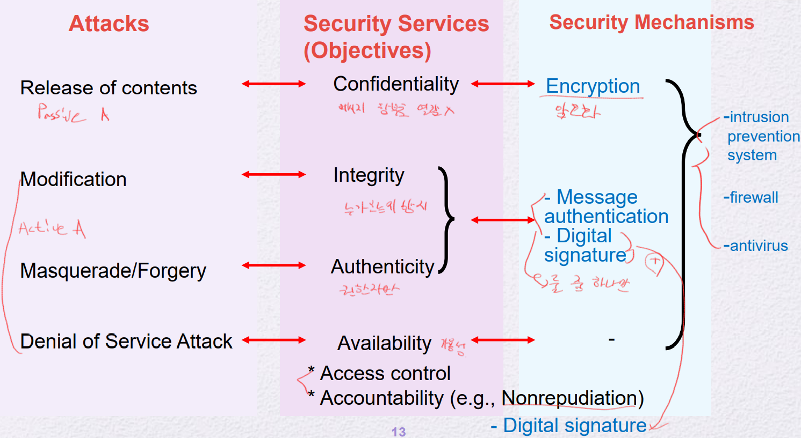
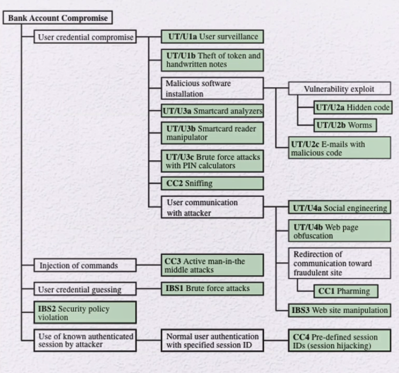

# Computer Security
NIST에서 정의한 컴퓨터 보안이란?    
정보 시스템 자원의 Integrity, Availability, Confidentiality(CIA)의 실용적인 목표를 달성하기위해 정보 시스템을 보호하는 것    
> 정보 시스템 자원은 다음을 포함한다.    
> HW, SW, firmware, information/data, telecommunications

## Computer Security Objetives

1. Confidentiality: 기밀성
    - Data confidentiality
        - 권한이 없는 사용자에게 정보가 공개 되어서는 안된다.
    - Privacy
        - 개인 정보들이 어떤 목적으로 사용되어지고, 언제까지 사용되고, 누구에게 공유가 되고, 또는 필요한 경우에 개인이 정보를 요청하여 사용할 수 있고, 개인이 원할 때 공유를 풀 수 있고, 삭제도 할 수 있는 그런 정보에 대한 제어권이 정보의 주인인 개인이 가진다.
        - 이를 법으로 제정: 개인 정보 보호법
2. Integrity: 무결성
    - Data Integrity
        - 정보나 프로그램들이 미리 명시된, 그리고 허가가 되어진 상태여야만 변경이 가능하다.
    - System Integrity
        - System이 원래 의도된 기능을 옳지 않은 영향없이 원래대로 작동을 해야함
        - 의도되어진 것이든, 실수에 의해서든 변형된 상태가 되어서는 안된다.
3. Availaility: 가용성
    - 어떤 시스템이 바로 응답을 줘야 하며, 허용된 사용자에 대해서 서비스가 거부해서는 안된다.

4. Accountability: 책임소재
    - 어떤 사고, 문제가 발생 했을 때 책임소재를 확인할 수 있어야 한다.
5. Authenticity: 진정성
    - 고대하던 데이터가 제대로된 데이터임을 확인

## Computer Security Challenges
컴퓨터 보안을 위해 취해야할 작업에 있어 어려운 점    
- 보안 특성에 대한 잠재적 공격을 고려해야 한다.
- 지속적인 모니터링이 필요하다.
- 보안 사고가 일어날 때 까지 보안 투자에 정당화할 수 있어야 한다.
    - P(공격이 성공할 확률), M(공격받았을 때 피해 금액), I(보안 투자)
    - P * M: 공격에 대한 피해 기대값
    - P * M < I : 투자 하는게 더 손해이다.
- 보안 기능이 더 강해지면 사용자 입장에서 매우 불편해진다.

## OSI Security Achitecture
- Security attack
- Security mechanism
    - security attack으로부터 감지, 방어, 복구를 설계하는 프로세스
- Security service
    - security mechanism을 하나 이상 사용하여 Security attack을 방지하는 서비스를 제공

 

# Threats and Attacks
Threat(원인), Attack(결과)
## Security Attack
passive attack과 active attack이 존재

### Passive Attack
해당 시스템에 상태 자체에는 영향을 미치지 않음    
그저 보기만 함   
- 데이터 sniffing

 

passive attack의 두 가지 유형
- Release of message contents
    - 해커가 메시지를 보는것
    - sol) 메시지 암호화
- Traffic analsys
    - 메시지를 암호화 하더라도 송신 내역에 대해서는 손 쓸 수 없다.
    - 해커가 해당 Traffic을 보고 분석
    - sol) Tor Browser(라우팅 패턴을 숨김)

### Active Attack
- 데이터를 낚아채서 변조 후 송신
- 데이터를 막음
- 데이터가 보낸것이 없지만 해커가 수신자에게 데이터 송신

 

active attack의 세 가지 유형 + 한 가지
- Masquerade: 누군가를 가장해서 송신
    - 일반적으로 추가적인 공격을 포함하게 된다.
    - ex) forgery(위조)
- Modification of messages: 메시지를 변형하여 송신
- Denial of service: 메시지 수신을 막음
- +Replay: 기존 정상적인 패킷을 공격자가 저장하고 다른 시점에 다시 보냄

# Data Security Purpose
## Data Confidentiality
전송된 데이터의 보호    
Traffic flow의 보호    
> Traffic flow: source, destination, frequence, length etc..

## Data Integrity
메시지 전체에 대한 스트림, 단 하나의 메시지, 또는 메시지 안에 일부 필드에 대한 무결성일 수 있다.
- Connection-Oriented: 세션을 계속 유지를 한다.
    - ex) TCP
    - 중간에 데이터를 삽입, 중복, 순서가 바뀜, 변조, 재송신 모두 Integrity 위배
- Connectionless
    - ex) UDP
    - 메시지 자체가 변조가 되었는가

## Availability Service
denial-of-service를 막아주는 servcie

## Authenticity
- Peer entity Authentication
- Data origin Authentication

## Nonrepudiation
부인 방지, 부인 봉쇄    
메시지가 보내졌을 때, 수신자가 송신자가 보냈음을 증명할 수 있어야 함

메시지가 수신되었을 때, 송신자가 수신자가 받았음을 증명할 수 있어야 함

## Access Control
어떤 시스템이나 프로그램에 대해서 접근을 제한을 가하고 제어를 함

## Core Concepts

# Fundamenta Security Design Principles
- Economy of mechanism
    - 메커니즘의 경제성    
    - 똑같은 목표를 달성할 수 있다면, 복잡한 것보다 단순한 것이 더 낫다.    
        - 테스트할 때 단순한 것이 테스트하기가 더 쉬움
        - 복잡한 설계일 때 공격자가 공격해올 곳이 더 많아질 수 있음
            - 설계할 때 몰랐던 취약점 발견

- <u>★Fail-safe defaults(중요)</u>
    - Access Control할 때 Exclusion보다 Permission 기반으로 하는 것이 좋다.    
    - 블랙리스트보다 화이트리스트 방식이 더 좋다.    

- Complete meditation
    - 모든 access는 access control mechanism에 대해서 항상 다시 체크가 되어야 한다.    
    - 캐시로부터 남아 있는 데이터에 의존해서는 안된다.    
- 이는 resource가 많이 이용되는 단점이 있음

-  Open design
    - 오픈 설계로 이루어져야 한다.    
    - 적은 수의 사람들이 만든 보안 구조는 취약점이 만들어질 수 밖에 없다.    
    - 따라서, 오픈 설계로 전문가들이 검증된 설계를 이용한다.    
    - 즉, 오픈 설계로 하되 키만 숨긴다.    

- Separation of Priviilege
    - 권한 분할
    - 권한을 세분화 시켜 나눠서 부여한다.

- Least privilege
    - 쓸데없이 필요한 권한은 주지 않는다.
    - 필요 이상의 권한은 주지 않는다.
    - Role-base access control(RBAC)

- Least common
    - 다른 유저들간에 공통된 기능을 최소화 한다.
    - 공유가 많아지면 사건이 발생했을 때 책임자가 애매함

- Psychological acceptability

- Isolation
    - 여러 개의 자원을 분리해서 사용
    - Public accss과 Critical access를 분리한다.

- Encapsulation
    - 바깥 사용자들에 대해서는 필요한 인터페이스만 제공할 뿐, 안에 내용을 공개하지 않는다.

- Modularity
    - 부분 설계 후 조립해서 사용한다.

- Layering
    - 여러 개의 보안 수단을 사용한다.

- Least astonishment
    - 가능하면 직관적이게 설계한다.

# Attack Surfaces
공격으로 타고 들어갈 수 있는 잠재적인 대상    
Ex
- 기능적 측면
    - 열려있는 포트
    - firewall 내부에서 사용 가능한 서비스
    - email 첨부파일, office document 등
    - SQL Injection
- 피싱
    - social engineering attack
    - 매수 등

## Attack Surfaces Categories
- Network attack surface
- Software attack surface
- Human attack surface

## Attack Tree

 
