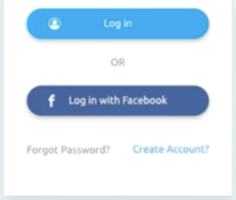

이전 내용에 이어서 버튼을 생성하고 텍스트를 생성한 후 배치를 맞추고 마무리한다.




버튼의 디자인을 보니 양 끝이 둥글고 색상이 있으며, 아이콘과 텍스트가 있다.

<br>

## 먼저 디자인을 만들어주자.

ProjectName > app > src > main > res > drawable 에 Selector를 만들고 버튼에 디자인을 입힐 것이다.

각 버튼에 따른 xml 파일을 생성한다. 먼저 Log in버튼의 디자인을 꾸며보자.

btn_blue.xml 파일을 만들고 selector 를 생성한다.    
`<selector xmlns:android="http://schemas.android.com/apk/res/android">`
<br>

버튼은 3가지의 상태가 있다.
1. 누른 상태
2. 누르기 전 대기 상태
3. 사용 불가 상태

이 3가지에 맞추어 각각 만들어준다.    
selector내에 item 요소를 추가하여 디자인을 만든다.
1. 누른 상태
    ```html
    <item android:state_pressed="true">
        <shape android:shape="rectangle">
            <corners android:radius="100dp"/>
            <solid android:color="@color/colorYellow"/>
        </shape>
    </item>
    ```
    - 누른 상태는 item 특성에서 state_pressed를 true 상태로 해준다.
2. 누르기 전 대기 상태
    ```html
    <item>
        <shape android:shape="rectangle">
            <corners android:radius="100dp"/>
            <solid android:color="@color/colorBlue"/>
        </shape>
    </item>
    ```
    - 대기 상태는 이 item 요소에 특별히 따로 무엇을 해 줄 필요가 없다.
3. 사용 불가 상태
    ```html
    <item android:state_enabled="false">
        <shape android:shape="rectangle">
            <corners android:radius="100dp"/>
            <solid android:color="@color/colorGray"/>
        </shape>
    </item>
    ```
    - 사용 불가 상태를 의미하므로, state_enabled를 false를 넣어준다.

item 요소 상태를 통해 각 상태별로 디자인을 바꿀 수 있다.    
그 item요소 내 shape는 item의 모양을 의미한다.    
- **shape**에 먼저 직사각형 형태인 rectangle로 정해준다.
- **radius는** 둥근 정도를 의미하는데 목표 이미지의 양끝이 둥그므로 우리도 둥글게 만들어준다.
- 다음으로 **color**를 설정해주는데 Log in 버튼의 색상은 #00b2ed 이다.
    - 바로 색상을 삽입할 수 있다.    
    `<solid android:color="#00b2ed"/>`
    - 하지만 색상의 구분을 위해 색상에 이름을 지어주고 사용하자.
    - ProjectName > app > src > main > res > values > color.xml에서 색상에 대한 이름과 색상 코드를 지정해주면 된다.

따라서, 이 btn_blue.xml파일을 정리하면 다음과 같다.
```html
<?xml version="1.0" encoding="utf-8"?>
<selector xmlns:android="http://schemas.android.com/apk/res/android">
    <item android:state_pressed="true">
        <shape android:shape="rectangle">
            <corners android:radius="100dp"/>
            <solid android:color="@color/colorYellow"/>
        </shape>
    </item>
    <item>
        <shape android:shape="rectangle">
            <corners android:radius="100dp"/>
            <solid android:color="@color/colorBlue"/>
        </shape>
    </item>
    <item android:state_enabled="false">
        <shape android:shape="rectangle">
            <corners android:radius="100dp"/>
            <solid android:color="@color/colorGray"/>
        </shape>
    </item>
</selector>
```
다음은 좀 더 어두운 버튼의 디자인을 하는데, 위와 동일하다.   
위 xml파일을 복사하여 이름을 btn_darkblue로 지정하여 btn_darkblue.xml파일을 만든다.    
그 후 색상코드(#3a5994)만 변경해주고 끝낸다.

<br>

---

<br>
위 디자인을 가지고 버튼을 만들어보자.     

버튼은 Button을 통해 생성할 수 있다.
```html
<Button
    android:layout_width="match_parent"
    android:layout_height="50dp"
    android:clickable="true"
    android:background="@drawable/btn_blue"
    android:layout_marginBottom="20dp"
    android:layout_marginLeft="20dp"
    android:layout_marginRight="20dp"
    android:text="Log in"
    android:textColor="#ffffff"/>
<Button
    android:layout_width="match_parent"
    android:layout_height="50dp"
    android:clickable="true"
    android:background="@drawable/btn_darkblue"
    android:layout_marginBottom="20dp"
    android:layout_marginLeft="20dp"
    android:layout_marginRight="20dp"
    android:text="Login with Facebook"
    android:textColor="#ffffff"/>
```
여기서 주목해야할 것은 clickable이다. 이를 통하여 버튼의 누르는 상태의 제어를 할 수 있다.

버튼 사이에 Or이라는 텍스트가 있는데, 이 또한 `<TextView>`를 통하여 생성하면 된다.
<br>

---
<br>

마지막으로 가로 정렬 텍스트이다.     
지금까지는 모든 요소들은 orientation:vertical에 다라 수직적으로 내려왔다.      
하지만 마지막 요소는 수직 정렬이 아닌 수평 정렬이다.
마지막 요소들은 Layout으로 감싸주는데, 간편하게 작업하기 위해 LinearLayout으로 한다.

```html
<LinearLayout
    android:layout_width="match_parent"
    android:layout_height="wrap_content"
    android:orientation="horizontal"
    >
    <TextView
        android:layout_width="wrap_content"
        android:layout_height="wrap_content"
        android:gravity="center"
        android:textSize="24sp"
        android:text="Find Password"/>
    <TextView
        android:layout_width="wrap_content"
        android:layout_height="wrap_content"
        android:gravity="center"
        android:textSize="24sp"
        android:textColor="@android:color/holo_blue_dark"
        android:text="Sign Up"/>
</LinearLayout>
```

이렇게만 하니 각 텍스트가 정렬이 되지 않고 한 곳으로 붙어서 생성이 된다.     
정렬할 필요성이 있다. weightSum을 이용하여 정리하자.

### weightSum
layout에 weightSum특성을 주는데, 비율을 정해준다.    
예로 10을 설정하면 이 layout은 10등분을 한다.     
그 후 각 요소들은 wegiht을 통해 그 비율을 가져간다.
위 textview에 각각 5씩 주면, 각 텍스트는 전체 layout에서 각각 반반의 비율을 가져간다.

이를 이용하여 그려보자
```html
<LinearLayout
    android:layout_width="match_parent"
    android:layout_height="wrap_content"
    android:orientation="horizontal"
    android:weightSum="10"
    >
    <TextView
        android:layout_width="wrap_content"
        android:layout_height="wrap_content"
        android:gravity="center"
        android:layout_weight="3"
        android:textSize="24sp"
        android:text="Find Password"/>
    <TextView
        android:layout_width="wrap_content"
        android:layout_height="wrap_content"
        android:layout_weight="7"
        android:gravity="center"
        android:textSize="24sp"
        android:textColor="@android:color/holo_blue_dark"
        android:text="Sign Up"/>
</LinearLayout>
```

여기까지 전체적인 UI작업이 끝났다.    
조금씩 수정해 나갈 필요가 있는데, 다음 내용에서 작업하도록 한다.

<br>

---

<br>

## 전체 코드 및 이미지
```html
<!--activity_login.xml-->
<?xml version="1.0" encoding="utf-8"?>
<LinearLayout xmlns:android="http://schemas.android.com/apk/res/android"
    android:layout_width="match_parent"
    android:layout_height="match_parent"
    android:orientation="vertical">
    <TextView
        android:layout_width="match_parent"
        android:layout_height="wrap_content"
        android:text="LOGIN"
        android:textColor="@android:color/holo_blue_dark"
        android:textSize="30sp"
        android:gravity="center"
        android:layout_margin="20dp"
        />
    <ImageView
        android:layout_width="match_parent"
        android:layout_height="wrap_content"
        android:background="@null"
        android:src="@drawable/icon_present"
        android:gravity="center"
        android:layout_marginBottom="20dp"
        />

    <EditText
        android:layout_width="match_parent"
        android:layout_height="50dp"
        android:layout_marginRight="12dp"
        android:layout_marginLeft="12dp"
        android:layout_marginBottom="20dp"
        android:hint="Email"/>
    <EditText
        android:layout_width="match_parent"
        android:layout_height="50dp"
        android:layout_marginRight="12dp"
        android:layout_marginLeft="12dp"
        android:layout_marginBottom="20dp"
        android:hint="Password"/>
    <Button
        android:layout_width="match_parent"
        android:layout_height="50dp"
        android:clickable="true"
        android:background="@drawable/btn_blue"
        android:layout_marginBottom="20dp"
        android:layout_marginLeft="20dp"
        android:layout_marginRight="20dp"
        android:text="Log in"
        android:textColor="#ffffff"/>
    <TextView
        android:layout_width="match_parent"
        android:layout_height="wrap_content"
        android:text="Or"
        android:textSize="24sp"
        android:gravity="center"
        android:layout_marginBottom="20dp"
        />
    <Button
        android:layout_width="match_parent"
        android:layout_height="50dp"
        android:clickable="true"
        android:background="@drawable/btn_darkblue"
        android:layout_marginBottom="20dp"
        android:layout_marginLeft="20dp"
        android:layout_marginRight="20dp"
        android:text="Login with Facebook"
        android:textColor="#ffffff"/>
    <LinearLayout
        android:layout_width="match_parent"
        android:layout_height="wrap_content"
        android:orientation="horizontal"
        android:weightSum="10"
        >
        <TextView
            android:layout_width="wrap_content"
            android:layout_height="wrap_content"
            android:gravity="center"
            android:layout_weight="3"
            android:textSize="24sp"
            android:text="Find Password"/>
        <TextView
            android:layout_width="wrap_content"
            android:layout_height="wrap_content"
            android:layout_weight="7"
            android:gravity="center"
            android:textSize="24sp"
            android:textColor="@android:color/holo_blue_dark"
            android:text="Sign Up"/>
    </LinearLayout>
</LinearLayout>
```
